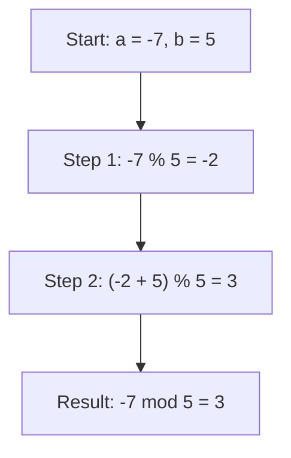

# 🔢 Rust 숫자 기본 연산 총정리

## 0) 한눈에 보는 연산자
| 분류 | 연산자 | 설명 |
|---|---|---|
| 산술 | `+  -  *  /  %` | 더하기, 빼기, 곱하기, 나누기, 나머지 |
| 복합대입 | `+=  -=  *=  /=  %=` | 위 연산 + 대입 |
| 비교 | `==  !=  <  <=  >  >=` | 비교 결과는 `bool` |
| 비트(정수) | `&  \|  ^  <<  >>  &=  \|=  ^=  <<=  >>=` | AND/OR/XOR/시프트 |

> 우선순위: `* / %` 가 `+ -` 보다 먼저 계산됩니다. 필요 시 `()`로 명시하세요.

---

## 1) 기본 예제 (정수/실수 섞어 보기)

```rust
fn main() {
    // 더하기
    let add = 3 + 8;                // i32 기본

    // 빼기
    let sub = 26.5 - 2.1;           // f64 기본

    // 곱하기
    let mul = 7 * 20;               // i32

    // 나누기
    let quotient_f = 12.0 / 3.0;    // 4.0 (실수 나눗셈)
    let quotient = 12.0 / 3.14;     // 3.821...

    // 정수 나눗셈은 0쪽으로 절삭(truncate)
    let truncated = 7 / 5;          // 1 (i32 / i32)

    // 나머지
    let remainder = 46 % 5;         // 1

    println!("add={add}, sub={sub}, mul={mul}");
    println!("quotient_f={quotient_f}, quotient={quotient}");
    println!("truncated={truncated}, remainder={remainder}");
}
```

## 2) 정수 vs 실수 나눗셈
```rust 
fn main() {
    let a = 7 / 5;       // 1 (정수 나눗셈: 절삭)
    let b = 7.0 / 5.0;   // 1.4 (실수)
    println!("{a}, {b}");
}
```

정수/정수는 항상 정수로, 소수점 이하는 버려집니다(0 쪽으로 절삭).

실수를 얻고 싶다면 피연산자 중 하나 이상을 실수로 둠.
예: 7 as f64 / 5.0 또는 7.0 / 5.0

### 3) 0으로 나누기
```rust
fn main() {
    // 정수: 런타임 panic!
    // let _bad = 1 / 0;

    // 실수: IEEE-754
    let inf = 1.0 / 0.0;    // +inf
    let neg_inf = -1.0 / 0.0; // -inf
    let nan = 0.0 / 0.0;    // NaN

    println!("{}, {}, {}", inf.is_infinite(), neg_inf.is_infinite(), nan.is_nan());
}
```

- 정수 나눗셈에서 0 → panic
- 실수 나눗셈에서 0 → inf, -inf, NaN 등 정의된 값

### 4) 나머지(%)와 음수, 유클리드 나눗셈

Rust의 %는 remainder(나머지) 연산이며, 부호는 왼쪽 피연산자를 따릅니다.
```rust
fn main() {
    let a =  7 % 5;   // 2
    let b = -7 % 5;   // -2  (부호는 왼쪽 피연산자, 즉 -7)
    println!("{a}, {b}");

    // 항상 0..b-1 범위의 "양의" 나머지가 필요하면 rem_euclid 사용
    let e1 =  7i32.rem_euclid(5);   // 2
    let e2 = -7i32.rem_euclid(5);   // 3  (항상 0..4)
    println!("{e1}, {e2}");
}
```

짝궁 메서드인 div_euclid/rem_euclid로 항상 양의 나머지를 얻을 수 있습니다.

### 5) 오버플로(Overflow)와 안전한 대안들

디버그 빌드: 오버플로 시 panic
릴리스 빌드: 2의 보수 래핑(wrap-around)로 동작
원하는 정책을 명시적 메서드로 고르는 게 안전합니다.

```rust
fn main() {
    let max = i8::MAX; // 127

    // 1) checked_*: None 반환
    assert_eq!(max.checked_add(1), None);

    // 2) saturating_*: 상한/하한에서 포화
    assert_eq!(max.saturating_add(1), i8::MAX);

    // 3) wrapping_*: 2의 보수로 감김
    assert_eq!(max.wrapping_add(1), i8::MIN); // 127 + 1 -> -128

    // 4) overflowing_*: (값, 오버플로 여부)
    assert_eq!(max.overflowing_add(1), (i8::MIN, true));
}
```
### 6) 거듭제곱·절댓값·최솟값·최댓값·클램프
```rust
fn main() {
    // 정수 거듭제곱
    let p_i = 2i32.pow(10);      // 1024
    // 실수 거듭제곱
    let p_f = 2.0_f64.powi(10);  // 1024.0
    let p_ff = 9.0_f64.powf(0.5); // 3.0 (제곱근)

    let v = -42;
    println!("abs = {}", v.abs());
    println!("min = {}", 3.min(10));
    println!("max = {}", 3.max(10));
    println!("clamp = {}", 123.clamp(0, 100)); // → 100
}
```

### 7) 복합 대입과 우선순위
```rust
fn main() {
    let mut x = 10;
    x += 3;    // 13
    x *= 2;    // 26
    x %= 7;    // 5
    println!("{x}");

    // 우선순위 예시: *, /, % 가 +, - 보다 먼저
    let a = 1 + 2 * 3;      // 7
    let b = (1 + 2) * 3;    // 9
    println!("{a}, {b}");
}
```

### 8) 타입·리터럴·캐스팅 팁

기본 타입 추론: 정수 i32, 실수 f64
접미사로 타입 지정: 42u8, 42i64, 2.5f32
가독성용 구분자: 1_000_000, 0b1010_1100
형 변환: as는 단순 캐스팅(잘림 가능). 안전한 변환은 TryFrom/TryInto를 고려.
```rust
fn main() {
    let a: u8 = 255;
    let b = a as i16;        // 255로 안전 (확장)
    let c = 300u16 as u8;    // 44로 잘림 (주의)

    use std::convert::TryFrom;
    let ok: u8 = u8::try_from(200).unwrap();        // 안전
    let err = u8::try_from(300).err().unwrap();     // 변환 실패 잡기
    println!("{b}, {ok}, {:?}", err);
}
```

### 9) 한 파일에 핵심 데모 묶기
```rust
fn main() {
    // 1) 기본
    let add = 3 + 8;
    let sub = 26.5 - 2.1;
    let mul = 7 * 20;
    let qf = 12.0 / 3.14;
    let ti = 7 / 5;
    let r = 46 % 5;

    // 2) 정수/실수 나눗셈
    let int_div = 7 / 5;
    let float_div = 7.0 / 5.0;

    // 3) 나머지 & 유클리드
    let rem_neg = -7 % 5;
    let rem_euclid = (-7).rem_euclid(5);

    // 4) 오버플로 제어
    let wrap = i8::MAX.wrapping_add(1);
    let sat  = i8::MAX.saturating_add(1);
    let chk  = i8::MAX.checked_add(1).is_none();

    // 5) 수학 도우미
    let pow_i = 2i32.pow(10);
    let pow_f = 9.0f64.powf(0.5);
    let clamped = 123.clamp(0, 100);

    println!("add={add}, sub={sub}, mul={mul}, qf={qf}");
    println!("ti={ti}, int_div={int_div}, float_div={float_div}");
    println!("r={r}, rem_neg={rem_neg}, rem_euclid={rem_euclid}");
    println!("wrap={wrap}, sat={sat}, checked_overflow?={chk}");
    println!("pow_i={pow_i}, pow_f={pow_f}, clamp={clamped}");
}
```


## Wrapping 연산 결과 비교 (i8 vs u8)

| 타입  | 최대값 (`MAX`) | 연산                     | 결과값  | 설명                         |
|-------|----------------|--------------------------|---------|------------------------------|
| i8    | 127            | `i8::MAX.wrapping_add(1)`| -128    | 127 + 1 → 128 → 범위 초과 → 2의 보수 해석 결과 -128 |
| u8    | 255            | `u8::MAX.wrapping_add(1)`| 0       | 255 + 1 → 256 → 256 mod 256 = 0 |

---


## 🔍 코드 분석
```rust
let e2 = -7i32.rem_euclid(5);  // 결과: 3
```

- -7을 5로 나눈 유클리드 나머지를 계산
- rem_euclid()는 항상 결과가 0..(divisor-1) 범위에 있도록 보장

## ⚙️ 일반 나머지 `%` vs 유클리드 나머지 `rem_euclid()`

| 연산 방식       | 표현식               | 결과 | 설명                                      |
|----------------|----------------------|-------|-------------------------------------------|
| 일반 나머지 `%` | `-7 % 5`             | `-2`  | 음수 결과 가능. 방향은 피제수(`-7`) 기준 |
| 유클리드 나머지 | `-7.rem_euclid(5)`   | `3`   | 항상 양수 결과. 결과는 `0..(divisor-1)` 범위 |

## 🔧 왜 3이 되는가?
유클리드 나머지의 정의는 다음과 같음:  
**공식:**
```
  a mod b = ((a % b) + b) % b
```

**예시:**
```
  -7 mod 5 = ((-7 % 5) + 5) % 5  
       = (-2 + 5) % 5  
       = 3
```




## ✅ rem_euclid의 특징
- 항상 양수 결과를 반환
- 수학적 모듈로 연산에 적합
- 반복 구조나 배열 인덱스 계산에 유용

### 💡 실용 예시
```rust
let index = (-7).rem_euclid(5); // 배열 인덱스처럼 0~4 범위로 보정
```
- ➡️ 음수 인덱스를 양수로 변환할 때 매우 유용합니다.

---


