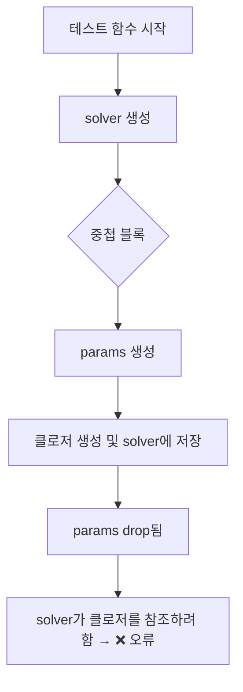
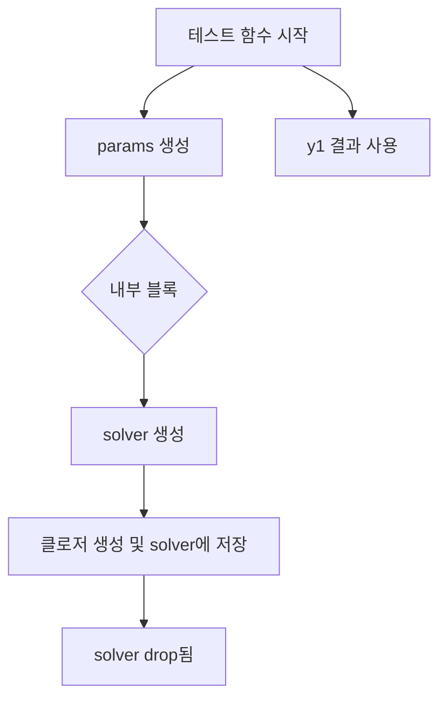

# 라이프타임 시스템 우회하기

이 코드는 Rust의 라이프타임 시스템을 우회해서 'static 참조를 만드는 방식이에요.  
아래에 줄별로 의미를 자세히 설명:

## 코드
```rust
let params = Box::new(Params { k: 1.5 });
let k = params.k;

// Box::leak → &'static mut Params
let static_params: &'static mut Params = Box::leak(params);
let ok = solver.rk45_with_user(f_ud, t0, &y0, t1, &mut y1, static_params, None, None, None);

```

## 🔍 코드 의미 해설
### 1️⃣ let params = Box::new(Params { k: 1.5 });
- Params 구조체를 힙에 할당
- params는 Box<Params> 타입 → 힙에 저장된 Params를 가리킴
- 이걸 사용하는 이유는 스택에 있는 값은 'static 라이프타임을 가질 수 없기 때문

### 2️⃣ let k = params.k;
- params.k 값을 복사해서 k에 저장
- 이건 테스트 결과 검증용으로 쓰이기 때문에 params의 소유권과 무관

### 3️⃣ let static_params: &'static mut Params = Box::leak(params);
- 핵심 줄입니다!
- Box::leak(...)은 Box<T>를 해제하지 않고 'static 참조로 변환
- 즉, params는 이제 'static 라이프타임을 가진 &'static mut Params로 사용 가능
- 이건 테스트나 단일 실행 환경에서만 안전합니다. 메모리 누수가 발생할 수 있기 때문

### 4️⃣ let ok = solver.rk45_with_user(..., static_params, ...)
- rk45_with_user()는 내부 클로저에서 user를 참조하기 때문에 'a 라이프타임이 필요
- static_params는 'static이므로 'a 요구를 만족시킴
- 따라서 컴파일러가 라이프타임 오류를 발생시키지 않음


## 📌 왜 이렇게 해야 하나?
Rust는 클로저가 참조를 캡처할 때, 그 참조가 클로저가 살아 있는 동안 유효해야 한다고 강하게 요구합니다.  
Box::leak()은 이 요구를 만족시키기 위한 편법적이지만 안전한 방법입니다—단, 메모리 해제가 되지 않으므로 테스트나 짧은 실행에서만 사용.


### ✅ 정리: 라이프타임과 Box 활용 요약

| 코드 또는 개념               | 설명 또는 목적                          |
|-----------------------------|----------------------------------------|
| `Box::new(...)`             | 힙에 값을 저장 (스택보다 오래 유지 가능) |
| `Box::leak(...)`            | `'static` 참조로 변환 (메모리 해제 안 됨) |
| `rk45_with_user(..., user)` | `user`는 `'a` 라이프타임을 만족해야 함     |
| `'static`                   | `'a` 라이프타임 요구를 안전하게 만족시킴   |


---

## 실전 해결 방법
### 🔧 방법 1: OdeSolver<'a>를 호출자 라이프타임으로 생

```rust

fn run_solver<'a>(user: &'a mut Params) {
    let mut solver = OdeSolver::new(1); // Solver도 'a 라이프타임을 가짐

    let f_ud = |_: f64, y: &[f64], dy: &mut [f64], _n: usize, user: &mut Params| {
        dy[0] = -user.k * y[0];
    };
    let t0 = 0.0;
    let t1 = 0.75;
    let y0 = [1.0];
    let mut y1 = Vec::new();
    let ok = solver.rk45_with_user(f_ud, t0, &y0, t1, &mut y1, user, None, None, None);
    assert!(ok);
}
```

### 🔧 방법 2: rk45_with_user()를 호출자 스코프에서 직접 사용
```rust
#[test]
fn rk45_with_user_param() {
    #[derive(Clone)]
    struct Params { k: f64 }

    let mut params = Params { k: 1.5 };
    let k = params.k;

    let mut solver = OdeSolver::new(1);

    let f_ud = |_: f64, y: &[f64], dy: &mut [f64], _n: usize, user: &mut Params| {
        dy[0] = -user.k * y[0];
    };

    let t0 = 0.0;
    let t1 = 0.75;
    let y0 = [1.0];
    let mut y1 = Vec::new();

    // 여기서 params는 테스트 함수 전체 라이프타임을 가짐
    let ok = solver.rk45_with_user(f_ud, t0, &y0, t1, &mut y1, &mut params, None, None, None);
    assert!(ok);

    let expected = (-k * t1).exp();
    assert!(rel_err(y1[0], expected) < 1e-7);
}
```          

- 이 방식은 라이프타임을 'static으로 만들 필요 없이 자연스럽게 해결됩니다
- 단, OdeSolver 구조체가 'a 라이프타임을 받아야 하며, rk45_with_user()도 'a를 유지해야 함

### 📌 핵심 요약: 라이프타임과 클로저 캡처 전략
| 기술 또는 방식         | 목적 또는 효과                                  | 실전 사용 가능성 | 메모리 안전성 | 라이프타임 오류 회피 |
|------------------------|--------------------------------------------------|------------------|----------------|----------------------|
| `Box::leak(...)`       | 힙에 저장된 값을 `'static` 참조로 변환            | ❌ 테스트 전용     | ❌ 누수 발생     | ✅ 회피 가능           |
| 호출자 스코프에서 참조 | 클로저가 참조할 값을 충분히 오래 유지             | ✅ 추천           | ✅ 안전함       | ✅ 회피 가능           |
| 구조적 라이프타임 연결 | `OdeSolver<'a>`와 `user: &'a mut T`를 함께 설계   | ✅ 추천           | ✅ 안전함       | ✅ 회피 가능           |
| `'static` 강제 요구    | 모든 참조가 `'static`이어야 함 → 유연성 저하       | ❌ 제한적 사용     | ✅ 안전함       | ✅ 회피 가능           |

---

# 🔍 호출자 스코프란?
Rust에서 "호출자 스코프"는 어떤 함수가 호출되는 바깥 코드의 라이프타임과 변수 범위를 말합니다.  
예를 들어:
```rust
fn main() {
    let mut user = Params { k: 1.5 }; // ← 호출자 스코프에서 선언됨
    let mut solver = OdeSolver::new(1);

    solver.rk45_with_user(f_ud, t0, &y0, t1, &mut y1, &mut user, None, None, None);
}
```
- 여기서 user는 main() 함수의 스코프에 속해 있고
- rk45_with_user()는 user를 참조하는 클로저를 내부에 저장하므로
- OdeSolver<'a>와 user: &'a mut T가 같은 라이프타임 'a를 공유해야 안전해요

## ✅ 왜 호출자 스코프에서 써야 안전한가?
Rust는 클로저가 참조를 캡처할 때, 그 참조가 클로저가 살아 있는 동안 유효해야 한다고 강하게 요구.  
그래서:
- user가 너무 짧은 스코프에 있으면 → ❌ 라이프타임 오류
- user가 rk45_with_user()를 호출하는 바깥 스코프에 충분히 오래 살아야 → ✅ 안전

## 📌 핵심 요약: 라이프타임 `'a`와 호출 구조
| 개념 또는 요소       | 설명 또는 연결 관계                     |
|----------------------|----------------------------------------|
| `rk45_with_user()`   | 클로저 내부에서 `user`를 참조함         |
| `'a` 라이프타임      | `OdeSolver`와 `user`가 공유해야 하는 라이프타임 |
| `user`               | `&'a mut T` 타입으로 클로저에 넘겨짐     |
| `OdeSolver<'a>`      | 클로저를 저장하므로 `'a` 라이프타임 필요 |

## 🧩 문제 발생 코드 (라이프타임 오류 발생)
```rust
#[test]
fn rk45_with_user_param() {
    let mut solver = OdeSolver::new(1);
    let mut params = Params { k: 1.5 }; // ← 호출자 스코프에서 선언
    let f_ud = |_, y: &[f64], dy: &mut [f64], _, user: &mut Params| {
        dy[0] = -user.k * y[0];
    };
    // ❌ 라이프타임 오류 발생
    solver.rk45_with_user(f_ud, t0, &y0, t1, &mut y1, &mut params, None, None, None);
}
```

### ❌ 왜 오류가 나는가?
- rk45_with_user()는 클로저를 OdeSolver 내부에 저장 (Box<dyn FnMut + 'a>)
- params는 테스트 함수 스코프에 선언되어 'a를 만족하지 못함
- Rust는 `클로저`가 `params`를 `너무 오래 참조할 수 있다고 판단` → 오류

## ✅ 해결된 구조 (호출자 스코프와 라이프타임 연결)
```rust
fn run_solver<'a>(solver: &'a mut OdeSolver<'a>, user: &'a mut Params) {
    let f_ud = |_, y: &[f64], dy: &mut [f64], _, user: &mut Params| {
        dy[0] = -user.k * y[0];
    };

    solver.rk45_with_user(f_ud, t0, &y0, t1, &mut y1, user, None, None, None);
}

#[test]
fn rk45_with_user_param() {
    let mut solver = OdeSolver::new(1);
    let mut params = Params { k: 1.5 };

    // ✅ 호출자 스코프에서 solver와 params가 동일한 라이프타임을 공유
    run_solver(&mut solver, &mut params);
}
```

## ✅ 왜 오류가 해결되는가?
- solver와 params가 같은 스코프에서 선언됨
- run_solver()는 `'a` 라이프타임을 명시적으로 연결
- OdeSolver<'a>와 user: &'a mut Params가 동일한 라이프타임을 공유
- 클로저가 user를 안전하게 참조할 수 있음 → ✅ 컴파일 성공

📌 핵심 차이 요약
| 코드 구조            | `params` 위치       | `OdeSolver` 라이프타임 | 결과           |
|----------------------|---------------------|------------------------|----------------|
| 테스트 함수 내부 호출 | 테스트 함수 스코프  | 클로저가 더 오래 살아야 함 | ❌ 라이프타임 오류 |
| 호출자 스코프 연결    | 동일한 외부 스코프  | 라이프타임 `'a`로 명시 연결 | ✅ 컴파일 성공     |
---

# 스코프 선언 위치 주의

## ✅ 정상 동작하는 코드
```rust
#[test]
fn rk45_with_user_param() {
    let mut params = Params { k: 1.5 };
    let mut solver = OdeSolver::new(1);

    let f_ud = |_, y, dy, _, user: &mut Params| {
        dy[0] = -user.k * y[0];
    };
    solver.rk45_with_user(f_ud, t0, &y0, t1, &mut y1, &mut params, None, None, None);
}
```

🔍 이 코드는 왜 되는가?
- params와 solver가 같은 스코프에서 선언됨
- rk45_with_user()는 'a 라이프타임을 요구하지만, Rust는 이 경우 `'a` 를 `테스트 함수 전체 스코프` 로 추론함
- 클로저가 params를 캡처해도, params가 충분히 오래 살아 있으므로 안전함

## ❌ 문제가 생기는 코드 (라이프타임 오류 발생)
```rust
#[test]
fn rk45_with_user_param() {
    let mut solver = OdeSolver::new(1);

    let ok = {
        let mut params = Params { k: 1.5 }; // 👈 내부 블록에서 선언됨
        let f_ud = |_, y, dy, _, user: &mut Params| {
            dy[0] = -user.k * y[0];
        };

        solver.rk45_with_user(f_ud, t0, &y0, t1, &mut y1, &mut params, None, None, None)
    };
}
```

❌ 왜 오류가 나는가?
- params가 중첩 블록 안에서 선언됨
- 클로저는 params를 캡처해서 OdeSolver 내부에 저장하려고 함
- Rust는 params가 블록 끝에서 drop되므로 'a 라이프타임을 만족하지 못한다고 판단
- 결과적으로 borrowed value does not live long enough 오류 발생

## 📌 핵심 차이 요약: 라이프타임 오류 발생 vs 정상 동작
| 항목         | 정상 코드                          | 오류 발생 코드                        | 설명 요약                             |
|--------------|------------------------------------|----------------------------------------|----------------------------------------|
| `params` 위치 | 테스트 함수 전체 스코프             | 중첩 블록 또는 짧은 스코프             | `'a` 라이프타임을 충분히 만족하려면 스코프가 길어야 함 |
| `solver` 위치 | `params`와 같은 스코프              | `params`보다 더 오래 살아야 함          | 클로저가 `params`를 캡처하므로 `solver`와 라이프타임 공유 필요 |
| 라이프타임 `'a` | `params`와 `solver`가 함께 `'a` 공유 | `params`가 `'a`보다 짧음 → 오류 발생     | `'a`는 클로저 저장을 위해 길게 추론됨 |

## ✅ 해결 방법 요약
- params는 solver와 같은 스코프에서 선언해야 함
- 클로저가 캡처하는 참조는 'a 라이프타임을 만족해야 하므로, 스코프가 충분히 길어야 함

## ✨ 예시로 다시 정리
```rust
// ✅ 안전: 같은 스코프
let mut params = Params { k: 1.5 };
{
    let mut solver = OdeSolver::new(1);
    solver.rk45_with_user(..., &mut params, ...);
}

// ❌ 오류: 스코프가 다름
let mut solver = OdeSolver::new(1);
{
    let mut params = Params { k: 1.5 };
    solver.rk45_with_user(..., &mut params, ...); // ❌ params가 너무 빨리 drop됨
}
```

---

# 코딩 주의 사항

라이프타임은 Rust의 가장 강력한 안전장치지만, 이렇게 스코프가 살짝만 어긋나도 오류가 나기 때문에  
눈에 잘 띄는 구조로 짜는 습관이 정말 중요.  

## ✅ 핵심 아이디어
params를 바깥 스코프에서 선언하고,  
solver와 클로저를 짧은 내부 스코프에서 생성·사용한 뒤,  
결과만 바깥으로 꺼내오면 라이프타임 충돌이 발생할 일이 없습니다.  


## 🔧 구조 예시
```rust
#[derive(Clone)]
struct Params { k: f64 }

#[test]
fn rk45_safe_scope() {
    let mut params = Params { k: 1.5 }; // 👈 바깥 스코프에서 선언
    let mut y1 = Vec::new();
    {
        let mut solver = OdeSolver::new(1); // 👈 내부 스코프에서 solver 생성

        let f_ud = |_: f64, y: &[f64], dy: &mut [f64], _: usize, user: &mut Params| {
            dy[0] = -user.k * y[0];
        };

        let t0 = 0.0;
        let t1 = 0.75;
        let y0 = [1.0];

        let ok = solver.rk45_with_user(f_ud, t0, &y0, t1, &mut y1, &mut params, None, None, None);
        assert!(ok);
    }

    // 여기서 y1은 solver가 drop된 이후에도 안전하게 사용 가능
    let expected = (-params.k * 0.75).exp();
    assert!(rel_err(y1[0], expected) < 1e-7);
}
```
## 📌 왜 이 구조가 안전한가?
| 요소     | 라이프타임 또는 관계 설명                  |
|----------|--------------------------------------------|
| `params` | `'a` 라이프타임을 가짐 (바깥 스코프에 존재) |
| `solver` | 클로저를 저장하지만 `'a`와 동일한 스코프에서 생성됨 |
| 클로저   | `params`를 캡처하지만 `solver`와 함께 drop됨 |
| `y1`     | 결과만 바깥으로 꺼내므로 참조 충돌 없음       |

이 구조는 Rust의 라이프타임 시스템을 자연스럽게 만족시키는 방식이라 실전에서도 매우 추천.

## 🔍 문제 발생 구조 vs 안전한 구조
### ❌ 문제 발생 구조
```rust
#[test]
fn test() {
    let mut solver = OdeSolver::new(1); // solver 먼저 생성됨

    {
        let mut params = Params { k: 1.5 }; // params는 내부 블록에 있음

        let f_ud = |_, y, dy, _, user: &mut Params| {
            dy[0] = -user.k * y[0];
        };

        // ❌ 오류: solver가 클로저를 저장하려고 하는데, params는 블록 끝에서 drop됨
        solver.rk45_with_user(f_ud, t0, &y0, t1, &mut y1, &mut params, None, None, None);
    }

    // params는 여기서 이미 사라짐
}
```

- solver는 클로저를 저장하면서 'a 라이프타임을 요구
- params는 내부 블록에 있어서 'a를 만족하지 못함
- Rust는 "클로저가 params를 너무 오래 참조할 수 있다"고 판단 → 오류 발생

### ✅ 안전한 구조
```rust
#[test]
fn test() {
    let mut params = Params { k: 1.5 }; // 👈 바깥 스코프에서 선언
    let mut y1 = Vec::new();

    {
        let mut solver = OdeSolver::new(1); // 👈 내부 스코프에서 solver 생성

        let f_ud = |_, y, dy, _, user: &mut Params| {
            dy[0] = -user.k * y[0];
        };

        // ✅ params는 solver보다 오래 살아 있으므로 안전
        solver.rk45_with_user(f_ud, t0, &y0, t1, &mut y1, &mut params, None, None, None);
    }

    // y1은 안전하게 사용 가능
}
```

- params는 테스트 함수 전체 스코프에 있어서 'a를 만족
- solver는 클로저를 저장하지만, params가 충분히 오래 살아 있음
- Rust는 "이 참조는 안전하다"고 판단 → 컴파일 성공

---

params와 solver의 라이프타임 관계를 시각적으로 연결한 표입니다.  
특히 'a 라이프타임이 어떻게 추론되고, 왜 오류가 발생하거나 안전한지를 보여주는 구조예요:
### 📌 핵심 연결 요약

| 요소     | 라이프타임 관계 설명                  | 안전 여부 | 설명 요약                           |
|----------|----------------------------------------|-----------|--------------------------------------|
| `params` | `'a`보다 짧으면 오류 발생               | ❌ 또는 ✅ | `'a`를 만족해야 클로저에서 참조 가능   |
| `solver` | 클로저를 저장하므로 `'a` 라이프타임 요구 | ✅        | `'a`는 `solver`가 살아 있는 동안 유지됨 |
| 클로저   | `'a` 동안 `params`를 참조함              | ✅ 또는 ❌ | `params`가 `'a`보다 짧으면 오류 발생   |


## 🔍 시각적 구조 예시
```
// ✅ 안전한 구조
let mut params = Params { k: 1.5 }; // ────────────────┐
{                                     //               │
    let mut solver = OdeSolver::new(); // ────────┐    │
    solver.rk45_with_user(..., &mut params); //   │    │
}                                     //  ────────┘    │
                                      //               │
                                   // params 살아 있음 ┘
```

```
// ❌ 오류 구조
{
    let mut solver = OdeSolver::new(); // ────────┐
    {
        let mut params = Params { k: 1.5 }; // ────┐
        solver.rk45_with_user(..., &mut params);// │
    } // params drop됨                          // │
} // solver 살아 있음 → 클로저가 params 참조하려 함 → ❌

```

이 구조는 라이프타임 오류가 발생하는 경우와 안전한 경우를 비교해서 보여줍니다.

### ❌ 오류 발생 구조 (params가 너무 짧은 스코프에 있음)


### ✅ 안전한 구조 (params가 바깥 스코프에 있음)

