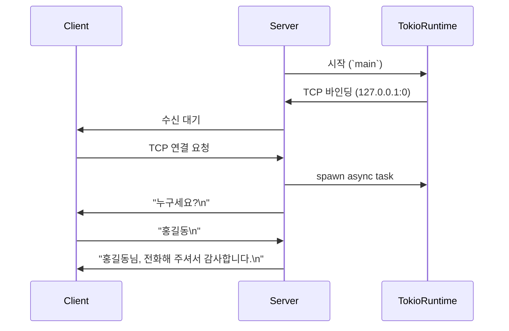

# Tokio Task

## 실전 코드
```rust
use tokio::io::{self, AsyncReadExt, AsyncWriteExt};
use tokio::net::TcpListener;

#[tokio::main]
async fn main() -> io::Result<()> {
    let listener = TcpListener::bind("127.0.0.1:0").await?;
    println!("포트 {}에서 수신 대기", listener.local_addr()?.port());

    loop {
        let (mut socket, addr) = listener.accept().await?;

        println!("{addr:?}에서 연결");

        tokio::spawn(async move {
            socket.write_all(b"누구세요?\n").await.expect("소켓 오류");

            let mut buf = vec![0; 1024];
            let name_size = socket.read(&mut buf).await.expect("소켓 오류");
            let name = std::str::from_utf8(&buf[..name_size]).unwrap().trim();
            let reply = format!("{name}님, 전화해 주셔서 감사합니다.\n");
            socket.write_all(reply.as_bytes()).await.expect("소켓 오류");
        });
    }
}

```

이 코드는 Tokio 기반의 비동기 TCP 서버로, 클라이언트가 접속하면 "누구세요?"라고 묻고,  
응답을 받아 "감사합니다"라고 답하는 구조.  
아래에 단계별 설명과 함께 정리.

## 🧩 단계별 흐름 설명
### 1. #[tokio::main]
- Tokio 런타임을 자동으로 생성하고 main()을 비동기로 실행
```rust
async fn main() -> io::Result<()> {
```

### 2. TcpListener::bind("127.0.0.1:0").await?
- OS가 자동으로 포트를 할당 (0은 임의 포트 요청)
- listener.local_addr()?.port()로 실제 포트 출력

### 3. loop { listener.accept().await? }
- 클라이언트가 접속할 때까지 비동기적으로 대기
```rust
loop {

```
- 접속이 오면 (socket, addr) 반환
```rust
    let (mut socket, addr) = listener.accept().await?;
```

### 4. tokio::spawn(async move { ... })
- 클라이언트마다 새로운 비동기 태스크 생성
```rust
tokio::spawn(async move {
            socket.write_all(b"누구세요?\n").await.expect("소켓 오류");
```
- 병렬로 여러 클라이언트를 처리 가능

### 5. 클라이언트 처리 흐름
```rust
socket.write_all(b"누구세요?\n").await;
```

- 클라이언트에게 질문 전송
```rust
let name_size = socket.read(&mut buf).await;
```

- 클라이언트 응답 수신
```rust
let name = std::str::from_utf8(&buf[..name_size]).unwrap().trim();
```

- UTF-8 문자열로 변환하고 공백 제거
```rust
let reply = format!("{name}님, 전화해 주셔서 감사합니다.\n");
socket.write_all(reply.as_bytes()).await;
```

- 감사 메시지 전송

## 🧠 구조 요약
- Tokio 런타임이 비동기 흐름을 관리
- TCP 서버가 클라이언트 접속을 수신
- 각 클라이언트는 독립적인 태스크로 처리
- 비동기 입출력으로 효율적인 네트워크 처리

## 📊 시퀀스 다이어그램



