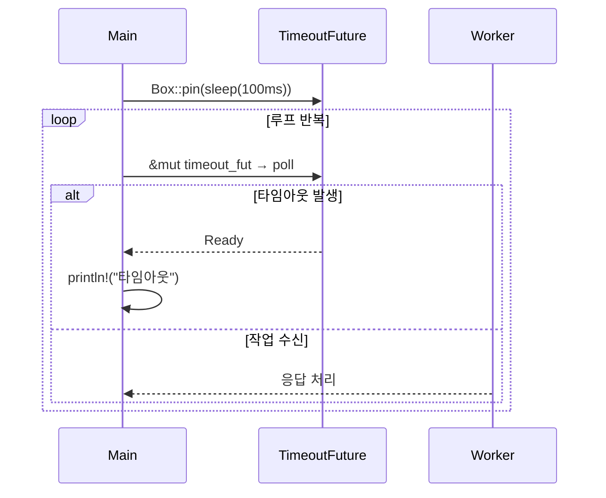

# Pin
이번 주제는 Rust 비동기에서의 핵심 개념인 Pin입니다.  
특히 Future가 **자기참조(self-referential)** 구조를 가질 수 있기 때문에  
메모리 위치가 고정되어야만 안전하게 poll할 수 있다는 원리를 이해하는 게 핵심입니다.

## ✅ 핵심 원리 요약
| 개념 요소           | 설명                                                                 |
|--------------------|----------------------------------------------------------------------|
| Future 내부 구조    | async fn은 상태 머신으로 변환됨 → 내부에 지역 변수와 참조가 포함됨         |
| 이동(Move)의 위험   | Future가 이동되면 내부 참조가 무효화됨 → UB 가능성                         |
| Pin의 역할          | 메모리 위치를 고정시켜 이동을 방지함 → poll은 Pin<&mut Self>로만 가능       |
| Box::pin 사용 이유  | 힙에 Future를 고정하고 &mut로 


## 📌 Pin이 왜 필요한가?
Rust는 기본적으로 **값을 자유롭게 이동(move)** 시킬 수 있음.  
하지만 어떤 타입은 자기 자신을 참조하거나, 메모리 위치가 바뀌면 안 되는 구조를 가질 수 있음:
```rust
struct SelfRef {
    data: String,
    ptr: *const String,
}
```

이 구조는 data를 가리키는 포인터를 내부에 가지고 있음.  
그런데 이 값이 `move` 되면 data의 메모리 주소가 바뀌고, ptr은 `dangling pointer` 가 되어버림.  
Rust는 이런 걸 컴파일 타임에 막을 수 없기 때문에, Pin이라는 개념을 도입함.


## 🧠 Pin의 핵심 개념
- Pin<T>는 T를 고정된 메모리 위치에 **핀** 으로 박아둔 것처럼 만들어서, 이동 불가능하게 만듦
- Pin<&mut T> 또는 Pin<Box<T>> 형태로 사용
- Unpin 트레잇을 구현한 타입은 이동 가능 → Pin이 필요 없음
- Unpin을 구현하지 않은 타입은 Pin을 통해 이동 금지를 보장해야 함

## 🧪 실제 사용 예: async/await
비동기 함수는 내부적으로 자기 참조 구조를 만들 수 있음. 예를 들어:
```rust
async fn example() {
    // 내부적으로 Future가 자기 자신을 참조할 수 있음
}
```

이런 경우 Rust는 Future를 `Pin<Box<dyn Future>>` 로 감싸서 메모리 위치가 고정되도록 강제함.  
그래야 안전하게 실행할 수 있음.

## 🔍 Pin을 사용하는 코드 예시
```rust
use std::pin::Pin;
use std::future::Future;

fn poll_future(fut: Pin<&mut dyn Future<Output = ()>>) {
    // 안전하게 Future를 실행할 수 있음
}
```

- `Pin<&mut dyn Future>`는 Future가 이동되지 않도록 보장
- poll() 같은 함수는 반드시 Pin을 요구함

## 🧩 Unpin이란?
- 대부분의 타입은 Unpin을 자동으로 구현함 → 자유롭게 이동 가능
- 자기 참조 구조를 가진 타입은 Unpin을 구현하지 않음 → Pin이 필요함
- Unpin은 **이 타입은 안전하게 이동할 수 있다** 는 표시
  
## ✅ 요약: Rust의 `Pin`과 `Unpin`

| 개념     | 설명                                                                 |
|----------|----------------------------------------------------------------------|
| `Pin<T>` | T의 메모리 위치를 고정시켜 이동을 방지함. 자기 참조 구조나 async에서 사용됨. |
| `Unpin`  | 타입이 안전하게 이동 가능함을 나타내는 트레잇. 대부분의 타입은 자동 구현됨. |
| 사용처   | Future, Stream, 자기 참조 구조체, 비동기 안전성 확보 등                  |
| 목적     | 메모리 안전성과 동작 안정성을 컴파일 타임에 보장                         |


## 🔚 결론
Pin은 Rust의 메모리 안전성 철학을 비동기와 자기 참조 구조까지 확장하기 위한 도구.  
이걸 통해 Rust는 C/C++에서도 어려운 문제를 안전하게 해결할 수 있음.


## 실전 예제
아래는 Pin을 사용하는 실전 예제 전체 코드.  
async와 Pin이 실제로 어떻게 연결되는지 보여주는 간단한 구조로, Future를 직접 구현하고 Pin을 통해 안전하게 실행하는 예제.

### 📦 예제: Pin을 사용한 커스텀 Future 실행
```rust
use std::pin::Pin;
use std::task::{Context, Poll};
use std::future::Future;
use std::time::Duration;
use std::thread;
use std::sync::{Arc, Mutex};
use std::task::Waker;

// 커스텀 Future 구조체
struct MyFuture {
    shared_state: Arc<Mutex<bool>>,
}
```
```rust
impl Future for MyFuture {
    type Output = &'static str;
    fn poll(self: Pin<&mut Self>, cx: &mut Context<'_>) -> Poll<Self::Output> {
        let mut state = self.shared_state.lock().unwrap();
        if *state {
            Poll::Ready("완료!")
        } else {
            println!("아직 준비 안 됨, waker 저장");
            let waker = cx.waker().clone();
            let shared = self.shared_state.clone();
            thread::spawn(move || {
                thread::sleep(Duration::from_secs(2));
                let mut state = shared.lock().unwrap();
                *state = true;
                waker.wake();
            });
            Poll::Pending
        }
    }
}
```
```rust
fn main() {
    use futures::executor::block_on;

    let shared_state = Arc::new(Mutex::new(false));
    let future = MyFuture { shared_state };

    // Pin으로 Future를 고정
    let pinned_future = Box::pin(future);

    // 실행
    let result = block_on(pinned_future);
    println!("결과: {}", result);
}

```

## 🔍 핵심 포인트
- MyFuture는 Future 트레잇을 직접 구현함
- poll() 메서드는 Pin<&mut Self>를 받음 → 이동 금지 보장
- block_on()은 futures 크레이트의 실행기
- Pin<Box<T>>를 통해 Future를 안전하게 고정하고 실행

## 🧠 왜 Pin이 필요한가?
- poll()은 Future 내부 상태를 참조하거나 수정할 수 있음
- Future가 자기 자신을 참조하거나, 내부에서 비동기 흐름을 만들 경우 이동되면 위험함
- Pin은 그런 Future를 고정된 위치에서 안전하게 실행할 수 있도록 보장해줌

---

# 샘플 코드 분석

## 샘플 코드
```rust
use tokio::sync::{mpsc, oneshot};
use tokio::task::spawn;
use tokio::time::{sleep, Duration};

// 작업 항목. 이 경우 지정된 시간 동안 절전 모드이고
// `respond_on` 채널의 메시지로 응답합니다.
#[derive(Debug)]
struct Work {
    input: u32,
    respond_on: oneshot::Sender<u32>,
}

// 큐에서 작업을 수신 대기하고 실행하는 worker입니다.
async fn worker(mut work_queue: mpsc::Receiver<Work>) {
    let mut iterations = 0;
    loop {
        tokio::select! {
            Some(work) = work_queue.recv() => {
                sleep(Duration::from_millis(10)).await; // 작업하는 척합니다.
                work.respond_on
                    .send(work.input * 1000)
                    .expect("응답을 보내지 못했습니다.");
                iterations += 1;
            }
            // TODO: 100밀리초마다 반복 횟수를 보고합니다.
        }
    }
}

// 작업을 요청하고 작업이 완료되기를 기다리는 요청자입니다.
async fn do_work(work_queue: &mpsc::Sender<Work>, input: u32) -> u32 {
    let (tx, rx) = oneshot::channel();
    work_queue
        .send(Work { input, respond_on: tx })
        .await
        .expect("작업 큐에서 전송하지 못했습니다.");
    rx.await.expect("응답 대기 실패")
}

#[tokio::main]
async fn main() {
    let (tx, rx) = mpsc::channel(10);
    spawn(worker(rx));
    for i in 0..100 {
        let resp = do_work(&tx, i).await;
        println!("반복 작업 결과 {i}: {resp}");
    }
}
```

## 🔍 코드 절차적 설명
### 1. 문제 상황: sleep()을 select! 안에 직접 넣음
```rust
tokio::select! {
    _ = sleep(Duration::from_millis(100)) => println!("타임아웃"),
}
```
- sleep()은 Future를 반환
- select!는 내부적으로 move 시멘틱을 요구
- sleep()은 자기참조 구조일 수 있음 → 이동되면 불안정

### 2. 해결 시도: loop 외부에 Future를 만들고 재사용
```rust
let mut timeout_fut = sleep(Duration::from_millis(100));
loop {
    tokio::select! {
        _ = timeout_fut => println!("타임아웃"),
    }
}
```
- 컴파일러 오류 발생: timeout_fut는 이동될 수 있음
- 해결하려면 Pin으로 고정해야 함

### 3. 해결 방법: Box::pin으로 고정
```rust
let mut timeout_fut = Box::pin(sleep(Duration::from_millis(100)));
loop {
    tokio::select! {
        _ = &mut timeout_fut => println!("타임아웃"),
    }
}
```

- Box::pin은 Future를 힙에 고정
- &mut로 접근하면 Pin<&mut T>로 변환됨 → poll 가능
- select!는 내부적으로 poll을 호출하므로 Pin이 필수

### 4. 추가 개선: 타임아웃 후 Future 재생성
``` rust
loop {
    let mut timeout_fut = Box::pin(sleep(Duration::from_millis(100)));
    tokio::select! {
        _ = &mut timeout_fut => println!("타임아웃"),
        // 다른 작업 ...
    }
}
```

- sleep()은 융합된(fused) Future가 아니므로
→ 완료되면 다시 poll하면 Ready만 반환됨
- 그래서 매번 새로 생성해야 정상 동작

## 📊 절차도: Pin을 사용한 select! 흐름


---

- Rust의 Future는 자기참조 구조를 가질 수 있기 때문에, 메모리 위치가 바뀌면 내부 참조가 무효화된다.
- poll은 반드시 Pin<&mut Self>로 호출해야 하고, Box::pin을 통해 Future를 힙에 고정하고 안전하게 poll하는 구조가 필요하다.
- 결국은 ‘이동을 막아야 안전하다’는 원칙이 Rust의 async 시스템 전체에 적용된다.”

---

# 좀 더 쉬운 실무 예제

## 🧩 실무 패턴: 비동기 작업에서 Pin 사용하기
### 📌 시나리오: 비동기 작업을 Box::pin으로 고정해 안전하게 실행
Rust의 Future는 자기 참조를 포함할 수 있으므로, 메모리 이동이 위험합니다.  
이를 방지하기 위해 `Pin<Box<dyn Future>>` 를 사용합니다.

### ✅ 1단계: 비동기 함수 정의
```rust
async fn fetch_data() -> String {
    // 네트워크 요청 또는 I/O 작업
    "data".to_string()
}
```

### ✅ 2단계: Future를 Pin으로 고정
```rust
use std::pin::Pin;

fn main() {
    let future = fetch_data(); // 반환 타입: impl Future<Output = String>
    let pinned = Box::pin(future); // 타입: Pin<Box<dyn Future<Output = String>>>
}
```
- Box::pin은 heap에 Future를 저장하고 이동 불가능하게 고정함
- Pin<Box<...>>은 Unpin이 아닌 타입도 안전하게 사용할 수 있게 해줌

### ✅ 3단계: 실행기(executor)에서 실행
```rust
use futures::executor::block_on;

fn main() {
    let future = fetch_data();
    let pinned = Box::pin(future);
    let result = block_on(pinned); // 안전하게 실행
    println!("결과: {}", result);
}
```

## 🔍 왜 Pin이 필요한가?
- Future 내부에 자기 참조가 있을 수 있음
- Rust는 기본적으로 값이 이동할 수 있으므로, 자기 참조가 깨질 위험이 있음
- Pin은 해당 값이 절대 이동하지 않음을 보장함

## 🧠 Unpin은 언제 필요한가?
- 대부분의 타입은 자동으로 Unpin을 구현함
- Unpin이면 Pin<T>로 감싸도 이동 가능
- !Unpin 타입은 Pin으로 감싸야만 안전하게 사용할 수 있음

## 🧪 실무 적용 요약

| 상황 또는 목적               | 추천 사용 방식                     |
|-----------------------------|------------------------------------|
| 비동기 Future 실행           | `Pin<Box<dyn Future>>`            |
| 자기 참조 구조체 고정         | `Pin<&mut Self>`, `Box::pin`      |
| 안전하게 이동 가능한 타입     | `Unpin`                           |
| 이동 금지 타입 명시           | `PhantomPinned`                   |

---

## 🧠 왜 "이동"이 문제인가?
Rust는 기본적으로 **값을 자유롭게 이동(move)** 시킵니다. 예를 들어:
```rust
let a = String::from("hello");
let b = a; // a는 b로 이동됨
```
- 이건 안전하지만, 자기 참조(self-referential) 구조에서는 문제가 됩니다.

## 🧨 문제 예시: 자기 참조 구조체
```rust
use std::ptr::NonNull;

struct SelfRef {
    data: String,
    ptr: NonNull<String>,
}
```

이 구조체는 data를 가리키는 포인터 ptr을 내부에 가지고 있음.  
그런데 이 구조체를 이동시키면 data의 주소가 바뀌고, ptr은 잘못된 주소를 가리키게 됩니다  
→ undefined behavior 발생!

## 🔒 해결책: Pin으로 고정
```rust
use std::pin::Pin;
use std::marker::PhantomPinned;

struct SafeSelfRef {
    data: String,
    ptr: Option<NonNull<String>>,
    _pin: PhantomPinned,
}
```
- 이 구조체는 PhantomPinned를 통해 Unpin을 막고, Box::pin()으로 고정해야만 사용할 수 있습니다:

```rust
let mut s = Box::pin(SafeSelfRef {
    data: String::from("hello"),
    ptr: None,
    _pin: PhantomPinned,
});
```
- 이제 s는 이동 불가능하고, 내부 포인터가 안전하게 유지됩니다.

## 🧪 실무에서 Pin이 필요한 대표 사례

| 상황                         | 위험 요소                          | Pin으로 해결되는 문제               |
|------------------------------|-------------------------------------|-------------------------------------|
| async/await Future           | 내부 상태가 자기 참조일 수 있음     | Future가 이동되면 참조 깨짐 방지     |
| Stream, Generator            | yield 중 내부 버퍼 참조 유지 필요   | 중단점에서 이동되면 참조 깨짐 방지   |
| 자기 참조 구조체             | 필드 간 포인터가 내부를 가리킴      | 구조체 이동 시 dangling pointer 방지 |
| 상태 머신 구현              | 상태 간 참조 또는 내부 버퍼 사용    | 상태 전환 중 메모리 이동 방지        |


## 📌 요약
- Rust는 기본적으로 값을 자유롭게 이동시킴
- 자기 참조 구조에서는 이동이 참조 깨짐을 유발
- Pin은 이동을 금지해 이런 위험을 방지
- Unpin이 아닌 타입은 반드시 Pin으로 고정해야 안전


## 🔍 왜 모든 곳에서 발생할 수 있는가?
Rust는 기본적으로 값을 자유롭게 이동시킵니다. 그런데 어떤 타입은 내부적으로 자기 자신을 참조하거나,  
주소가 고정되어야만 안전하게 동작하는 경우가 있음.  
이런 타입이 이동되면 내부 참조가 깨져서 undefined behavior가 발생할 수 있습니다.

## 🧪 Future 외에도 Pin이 필요한 대표 사례

| 상황                         | 위험 요소                          | Pin으로 해결되는 문제               |
|------------------------------|-------------------------------------|-------------------------------------|
| 자기 참조 구조체             | 필드 간 포인터가 내부를 가리킴      | 구조체 이동 시 참조 깨짐 방지        |
| Stream, Generator            | yield 중 내부 버퍼 참조 유지 필요   | 중단점에서 이동되면 참조 깨짐 방지   |
| 상태 머신 구현              | 상태 간 참조 또는 내부 버퍼 사용    | 상태 전환 중 메모리 이동 방지        |
| 이벤트 핸들러 등록 구조      | 콜백이 자기 자신을 참조함           | 콜백 실행 중 구조체 이동 방지         |
| GUI 위젯 트리               | 부모-자식 간 참조가 얽혀 있음       | 트리 구조 이동 시 참조 깨짐 방지      |
| 커스텀 Drop 구현             | Drop 중 자기 참조 필드 접근         | Drop 중 이동 방지로 안전한 정리 가능  |


## 📌 핵심 요약
- Pin은 자기 참조를 안전하게 유지하기 위한 도구
- Unpin이 아닌 타입은 절대 이동되면 안 됨
- Future는 그 중 하나일 뿐, 모든 Rust 구조에서 발생 가능

---

# data 이동에 대하여

Box::pin(...)을 사용함으로써 SafeSelfRef 구조체 전체가 힙에 고정되고,  
그 이후에는 이동(move)되지 않도록 보장됩니다.  
따라서 data 필드도 절대 다른 메모리 위치로 이동하지 않습니다.  

## 🔒 왜 data가 이동되지 않는가?
```rust
let mut s = Box::pin(SafeSelfRef {
    data: String::from("hello"),
    ptr: None,
    _pin: PhantomPinned,
});
```

- Box::pin(...)은 SafeSelfRef를 힙에 배치하고, 그 포인터를 Pin<Box<...>>로 감쌉니다
- SafeSelfRef는 PhantomPinned를 포함하므로 Unpin이 자동 구현되지 않음
- 따라서 s는 Pin<Box<SafeSelfRef>> 타입이 되고, 이동이 금지됨
- data는 구조체의 필드이므로, 구조체가 이동되지 않으면 data도 절대 이동되지 않음

## 📌 핵심 요약

| 구성 요소       | 이동 여부     | 고정 방식 또는 특징               |
|----------------|---------------|----------------------------------|
| `SafeSelfRef`  | ❌ 이동 불가   | `Box::pin` + `PhantomPinned`    |
| `data`         | ❌ 이동 불가   | 구조체가 고정되므로 함께 고정됨  |
| `ptr`          | ✅ 변경 가능   | `Option<NonNull<String>>`로 설정 가능 |

- 이렇게 하면 ptr이 data를 안전하게 가리킬 수 있고, 구조체가 절대 이동되지 않으므로 dangling pointer 위험이 사라집니다.

---


  
