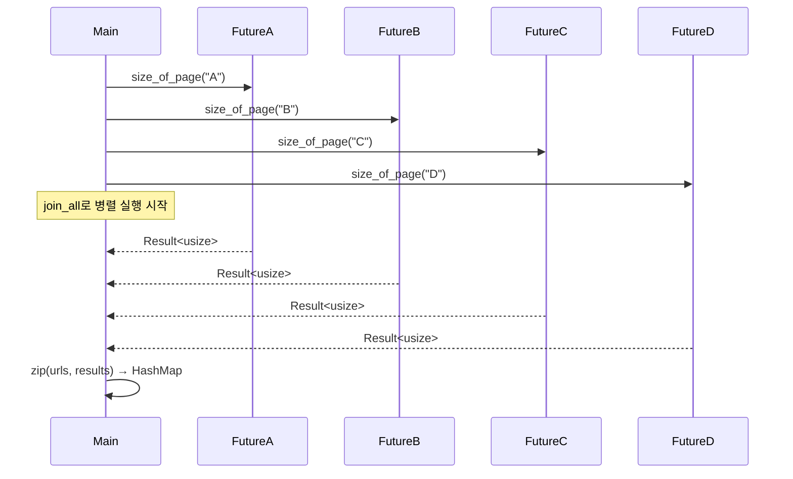

# Join

## 실전 소스

```rust
use anyhow::Result;
use futures::future;
use reqwest;
use std::collections::HashMap;

async fn size_of_page(url: &str) -> Result<usize> {
    let resp = reqwest::get(url).await?;
    Ok(resp.text().await?.len())
}

#[tokio::main]
async fn main() {
    let urls: [&str; 4] = [
        "https://google.com",
        "https://httpbin.org/ip",
        "https://play.rust-lang.org/",
        "BAD_URL",
    ];
    let futures_iter = urls.into_iter().map(size_of_page);
    let results = future::join_all(futures_iter).await;
    let page_sizes_dict: HashMap<&str, Result<usize>> =
        urls.into_iter().zip(results.into_iter()).collect();
    println!("{:?}", page_sizes_dict);

```

Rust의 비동기 병렬 처리에서 핵심인 join_all을 정확하게 이해 필요.  
이건 JavaScript의 Promise.all, Python의 asyncio.gather와 구조적으로 동일한 역할을 합니다.  
아래에 개념 설명 → 단계별 흐름으로 정리.  

## 🧩 join_all이란?
- 여러 개의 Future를 동시에 실행하고
- 모두 완료될 때까지 기다린 후,
- 각 결과를 **컬렉션(Vec)** 으로 반환하는 연산
```rust
let results = future::join_all(futures_iter).await;
```

- futures_iter는 여러 Future들의 iterator
- join_all은 이들을 병렬로 실행
- .await는 모든 Future가 끝날 때까지 기다림

## 🔍 단계별 흐름 설명
### 1. size_of_page(url: &str) -> Result<usize>
- 각 URL에 대해 GET 요청을 보내고
- 응답 본문의 길이를 반환하는 비동기 함수

### 2. urls.into_iter().map(size_of_page)
- size_of_page를 각 URL에 적용 → Future들의 iterator 생성

### 3. future::join_all(futures_iter).await
- 모든 Future를 병렬로 실행
- 모두 끝날 때까지 기다림
- 결과는 Vec<Result<usize>> 형태로 반환

### 4. urls.zip(results).collect()
- URL과 결과를 묶어서 HashMap<&str, Result<usize>>로 변환

### ✅ 핵심 흐름 요약
```rust
urls = ["A", "B", "C", "D"]
futures = [size_of_page(A), size_of_page(B), ...]
results = join_all(futures).await
dict = zip(urls, results)
```

→ 병렬로 요청하고,
→ 모두 끝나면 결과를 매핑해서 출력

📊 시퀀스 다이어그램



