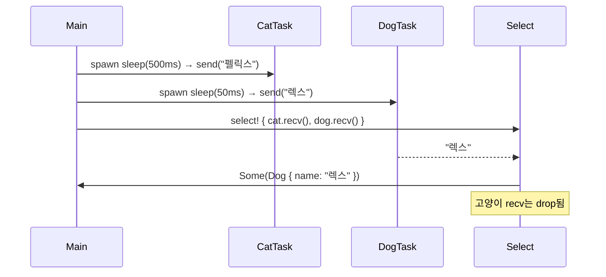

# Select
이제 Rust 비동기 처리의 마지막 핵심 퍼즐인 select!에 대한 이해.  
JavaScript의 Promise.race, Python의 asyncio.wait(..., FIRST_COMPLETED)와 구조적으로 동일한 역할을 합니다. 
아래에 개념 설명 → 단계별 흐름 → 절차도까지 정리

## 🧩 tokio::select!이란?
- 여러 Future 중 가장 먼저 완료되는 하나만 실행하고
- 나머지는 **취소(drop)** 됨
- 비동기 조건 분기를 위한 구조적 매크로
```rust
tokio::select! {
    result1 = future1 => { ... },
    result2 = future2 => { ... },
}
```

- future1, future2가 동시에 실행되며
- 먼저 완료된 쪽만 실행되고
- 나머지는 자동으로 drop됨

## ✅ 핵심 비교
| 연산 방식   | 설명                                                  |
|-------------|-------------------------------------------------------|
| join_all    | 모든 Future가 완료될 때까지 기다린 후 결과를 모음     |
| select!     | 가장 먼저 완료된 하나의 Future만 실행하고 나머지는 취소 |


## 샘플 코드
```rust
use tokio::sync::mpsc::{self, Receiver};
use tokio::time::{sleep, Duration};

#[derive(Debug, PartialEq)]
enum Animal {
    Cat { name: String },
    Dog { name: String },
}

async fn first_animal_to_finish_race(
    mut cat_rcv: Receiver<String>,
    mut dog_rcv: Receiver<String>,
) -> Option<Animal> {
    tokio::select! {
        cat_name = cat_rcv.recv() => Some(Animal::Cat { name: cat_name? }),
        dog_name = dog_rcv.recv() => Some(Animal::Dog { name: dog_name? })
    }
}

#[tokio::main]
async fn main() {
    let (cat_sender, cat_receiver) = mpsc::channel(32);
    let (dog_sender, dog_receiver) = mpsc::channel(32);
    tokio::spawn(async move {
        sleep(Duration::from_millis(500)).await;
        cat_sender.send(String::from("펠릭스")).await.expect("고양이를 보내지 못했습니다.");
    });
    tokio::spawn(async move {
        sleep(Duration::from_millis(50)).await;
        dog_sender.send(String::from("렉스")).await.expect("개를 보내지 못했습니다.");
    });

    let winner = first_animal_to_finish_race(cat_receiver, dog_receiver)
        .await
        .expect("우승자를 수신하지 못했습니다.");

    println!("우승자: {winner:?}");
}

```

## 🔍 샘플 코드 단계별 해설
### 1. enum Animal
```rust
enum Animal {
    Cat { name: String },
    Dog { name: String },
}
```

- 결과를 담을 열거형 → 고양이 또는 개

### 2. first_animal_to_finish_race(...)
```rust
tokio::select! {
    cat_name = cat_rcv.recv() => Some(Animal::Cat { name: cat_name? }),
    dog_name = dog_rcv.recv() => Some(Animal::Dog { name: dog_name? })
}
```

- cat_rcv.recv()와 dog_rcv.recv()를 동시에 기다림
- 먼저 도착한 메시지를 받아서 Animal로 변환
- 나머지 Future는 자동으로 drop됨

### 3. main()에서 두 동물 출발
```rust
tokio::spawn(async move {
    sleep(Duration::from_millis(500)).await;
    cat_sender.send("펠릭스").await;
});
tokio::spawn(async move {
    sleep(Duration::from_millis(50)).await;
    dog_sender.send("렉스").await;
});
```

- 고양이는 500ms 후 출발
- 개는 50ms 후 출발 → 먼저 도착

### 4. 결과 출력
```rust
let winner = first_animal_to_finish_race(...).await;
println!("우승자: {winner:?}");
``

- select!에서 먼저 도착한 렉스가 우승자로 출력됨

## 📊 절차도



