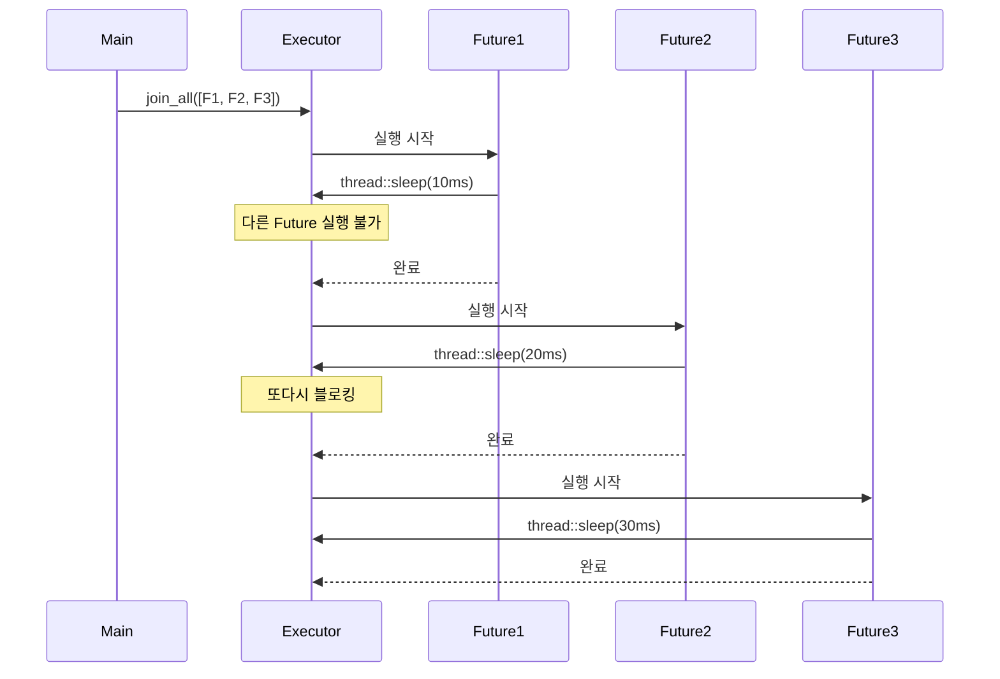

# executor

이제 비동기 런타임의 핵심인 **“실행자(executor)를 블록시킨다”** 는 개념을 정확하게 이해.  
아래에 개념 설명 → 코드 단계별 해설 → 절차도까지 구조적으로 정리.  

## 🧩 실행자(executor)를 블록시킨다는 의미
Rust의 비동기 런타임(executor)은 **비동기 작업(Future)** 들을 스케줄링해서  
IO 중심의 병렬 처리를 효율적으로 수행합니다.  
하지만…  
### ❌ 문제가 되는 상황
```rust
std::thread::sleep(...)
```

- 이건 동기적 CPU 블로킹 작업
- 실행자가 이 작업을 수행하는 동안 다른 Future를 실행하지 못함
- 결과적으로 비동기 병렬성이 무너짐
### ✅ 해결 방법
```rust
tokio::time::sleep(...).await
```

- 이건 비동기 sleep → executor가 다른 작업을 계속 실행 가능
- CPU를 점유하지 않고 스케줄링만 대기

## 실전 코드
```rust
use futures::future::join_all;
use std::time::Instant;

async fn sleep_ms(start: &Instant, id: u64, duration_ms: u64) {
    std::thread::sleep(std::time::Duration::from_millis(duration_ms));
    println!(
        "future {id}은(는) {duration_ms}밀리초 동안 절전 모드였고 {}밀리초 후에 완료됨",
        start.elapsed().as_millis()
    );
}

#[tokio::main(flavor = "current_thread")]
async fn main() {
    let start = Instant::now();
    let sleep_futures = (1..=10).map(|t| sleep_ms(&start, t, t * 10));
    join_all(sleep_futures).await;
}
```


## 🔍 코드 단계별 해설
```rust
#[tokio::main(flavor = "current_thread")]
```
- 싱글스레드 tokio 런타임 생성
- 병렬성이 제한적 → 블로킹이 더 치명적

### 1. sleep_ms(...)
```rust
async fn sleep_ms(...) {
    std::thread::sleep(...); // ❌ CPU 블로킹
    println!(...);
}
```

- async fn이지만 내부는 동기적 블로킹
- executor가 이 작업을 수행하는 동안 다른 Future를 실행 못함

### 2. main()
```rust
let sleep_futures = (1..=10).map(|t| sleep_ms(...));
join_all(sleep_futures).await;
```

- sleep_ms를 10개 생성 → Future 리스트
- join_all로 병렬 실행 시도
- 하지만 내부가 thread::sleep이므로
→ 실제로는 순차적으로 실행됨

## 📊 절차도


## ✅ 핵심 요약
| 항목                | 설명                                                  |
|---------------------|-------------------------------------------------------|
| std::thread::sleep  | ❌ 동기 블로킹 → 실행자(executor)가 멈춤               |
| tokio::time::sleep  | ✅ 비동기 대기 → 실행자는 다른 작업 계속 실행 가능      |
| join_all            | ✅ 여러 Future를 병렬 실행하고 모두 완료될 때까지 대기  |


## 🧩 핵심 원리: 실행자 블로킹의 영향
### ✅ 싱글 스레드 런타임 (flavor = "current_thread")
- 하나의 스레드에서 모든 Future를 스케줄링
- std::thread::sleep 같은 동기 블로킹 작업이 들어오면 → 그 스레드가 멈추고,  
    → 다른 Future들도 실행되지 못함
### ✅ 멀티 스레드 런타임 (flavor = "multi_thread")
- 여러 워커 스레드가 병렬로 Future를 스케줄링
- 한 스레드가 블로킹되더라도  
    → 다른 스레드에서 병렬 작업은 계속됨
- 하지만 블로킹이 많아지면 전체 성능 저하

## 🔍 예시로 보면
```rust
#[tokio::main(flavor = "current_thread")]
```

- 이 설정에서는 std::thread::sleep이 들어가면  
    → 그 순간 모든 병렬 Future가 멈춤
```rust
#[tokio::main] // 기본은 multi_thread
```

- 이 설정에서는 일부 병렬성은 유지되지만  
    → 블로킹이 많으면 스레드 고갈로 병목 발생

## ✅ 실무 전략
| 상황                         | 해결 방법                                      |
|------------------------------|------------------------------------------------|
| 동기 블로킹 작업이 필요한 경우 | `tokio::task::spawn_blocking`으로 격리 실행     |
| sleep, IO, DB 등 비동기 작업   | `tokio::time::sleep`, `tokio::fs`, `sqlx` 등 비동기 API 사용 |


##  구조도: multi-thread 런타임에서 블로킹 분산
```mermaid
flowchart LR
    subgraph Executor[Tokio Multi-thread Executor]
        A1[Worker Thread 1]
        A2[Worker Thread 2]
        A3[Worker Thread 3]
    end

    A1 --> B1[Future A (블로킹)]
    A2 --> B2[Future B (Running)]
    A3 --> B3[Future C (Running)]
```

- Future A가 블로킹되더라도  
    → Future B, Future C는 다른 스레드에서 계속 실행됨


