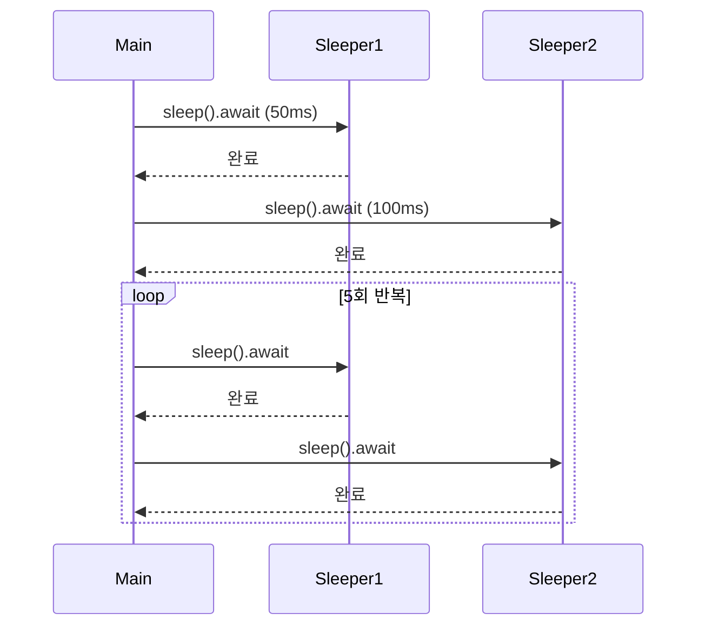

# 비동기 트레잇
이제 Rust 비동기 트레잇의 구조와 실무 활용을 정확하게 이해 필요.  
아래에 개념 설명 → 코드 단계별 분석 → 절차도까지 체계적으로 정리.  

## 🧩 비동기 트레잇이란?
### ✅ 기본 개념
- Rust에서 async fn은 내부적으로 -> impl Future<Output = T>로 변환됨
- 트레잇에 async fn을 쓰려면 RPIT (Return Position Impl Trait) 지원이 필요함
- Rust 1.75부터 기본적으로 지원되지만, 여전히 제약이 존재

### ❗️ 제약 사항
| 항목                          | 설명                                                                 |
|-------------------------------|----------------------------------------------------------------------|
| RPIT lifetime 캡처            | `async fn`은 `-> impl Future`로 변환되며, 모든 in-scope lifetime을 캡처함 → 일부 borrow 패턴 불가 |
| dyn Trait 호환 불가           | `async fn`이 있는 트레잇은 `dyn Trait`으로 사용할 수 없음 → 런타임 다형성 불가                    |
| 해결책: async_trait 매크로    | `async_trait` 매크로를 사용하면 `BoxFuture`로 감싸서 dyn Trait 사용 가능 (단, 약간의 오버헤드 있음) |

## 코드 분석
```rust
use async_trait::async_trait;
use std::time::Instant;
use tokio::time::{sleep, Duration};

#[async_trait]
trait Sleeper {
    async fn sleep(&self);
}

struct FixedSleeper {
    sleep_ms: u64,
}

#[async_trait]
impl Sleeper for FixedSleeper {
    async fn sleep(&self) {
        sleep(Duration::from_millis(self.sleep_ms)).await;
    }
}

async fn run_all_sleepers_multiple_times(
    sleepers: Vec<Box<dyn Sleeper>>,
    n_times: usize,
) {
    for _ in 0..n_times {
        println!("모든 수면자를 실행");
        for sleeper in &sleepers {
            let start = Instant::now();
            sleeper.sleep().await;
            println!("{}밀리초 동안 절전 모드", start.elapsed().as_millis());
        }
    }
}

#[tokio::main]
async fn main() {
    let sleepers: Vec<Box<dyn Sleeper>> = vec![
        Box::new(FixedSleeper { sleep_ms: 50 }),
        Box::new(FixedSleeper { sleep_ms: 100 }),
    ];
    run_all_sleepers_multiple_times(sleepers, 5).await;
}
```


## ✅ 코드 단계별 분석
### 1. 트레잇 정의
```rust
#[async_trait]
trait Sleeper {
    async fn sleep(&self);
}
```

- async fn을 트레잇에 정의 → async_trait 매크로가 내부적으로 BoxFuture로 변환

### 2. 트레잇 구현
```rust
#[async_trait]
impl Sleeper for FixedSleeper {
    async fn sleep(&self) {
        sleep(Duration::from_millis(self.sleep_ms)).await;
    }
}
```

- FixedSleeper는 sleep_ms만큼 비동기 sleep
- tokio::time::sleep은 비동기 대기 → executor 병렬성 유지

### 3. 실행 함수
```rust
async fn run_all_sleepers_multiple_times(...)
```

- Vec<Box<dyn Sleeper>> → 다형성(dyn Trait)으로 여러 구현을 처리
- sleep()을 await → 각 sleeper가 순차적으로 sleep

### 4. main()
```rust
#[tokio::main]
async fn main() {
    let sleepers = vec![...];
    run_all_sleepers_multiple_times(sleepers, 5).await;
}
```

- FixedSleeper 두 개 생성
- 각각 50ms, 100ms sleep → 5회 반복

## 📊 절차도

---

# async_trait

async_trait 매크로는 Rust의 기존 트레잇 시스템이 비동기와 호환되지 않아서 생긴 구조적 회피 수단입니다.

## 🧩 왜 async_trait이 필요했는가?
### ✅ 기존 트레잇 시스템의 한계

Rust에서 async fn은 내부적으로 다음처럼 변환됩니다:
```rust
async fn foo() → impl Future<Output = T>
```

이건 RPIT (Return Position Impl Trait) 구조인데,
트레잇에서는 이걸 직접 표현하기가 어려웠습니다.  
특히:
- 트레잇 메서드에 impl Trait을 쓰면 모든 lifetime을 캡처함
- dyn Trait으로 사용할 수 없음 → 다형성 불가
- async fn을 트레잇에 직접 쓰면 컴파일러가 추론 불가능한 타입이 생김

### ❗️ 회피 수단: async_trait 매크로
- async_trait은 async fn을 동기 메서드로 변환한 뒤, 내부에서 BoxFuture로 감싸서 비동기처럼 동작하게 만듦
- 이 방식은 **런타임 다형성(dyn Trait)**을 가능하게 함
- 결국은 “비동기 트레잇을 dyn으로 쓰고 싶다”는 요구를 구조적으로 해결하기 위한 회피 수단

## 🔍 구조적으로 보면
| 문제 구조              | 회피 전략 구조                          |
|------------------------|------------------------------------------|
| async fn in trait      | `async_trait` 매크로로 감싸서 해결       |
| dyn Trait 불가능       | `Box<dyn Trait>` + `BoxFuture`로 해결     |
| impl Future 추론 불가  | `Pin<Box<dyn Future + Send>>`로 고정 타입 |

- Future를 반환하는 트레잇을 직접 만들려고 할 때, 기존 Rust 트레잇 시스템으로는 그걸 표현할 수 없었기 때문에 async_trait 매크로가 등장.


## 🧩 구조적으로 보면
### ✅ 이미 Future가 씌어진 트레잇은 문제 없음
예를 들어 Stream, Future, AsyncRead, AsyncWrite 같은 트레잇은 비동기 동작을 위해 설계된 트레잇이고,  
그 메서드들은 poll(...)처럼 명시적으로 Future를 반환합니다.
```rust
trait Future {
    fn poll(self: Pin<&mut Self>, cx: &mut Context<'_>) -> Poll<Self::Output>;
}
```
- 이건 비동기 동작을 수동으로 구현하는 방식이라
→ 트레잇 시스템과 잘 맞음

### ❌ 사용자가 async fn을 트레잇에 직접 쓰려고 하면
```rust
trait MyTrait {
    async fn do_something(&self); // ❌
}
```

- 이건 내부적으로 -> impl Future<Output = T>로 변환됨
- Rust의 트레잇 시스템은 impl Trait을 반환하는 메서드를 직접 표현하거나 dyn으로 사용할 수 없음
- 특히 dyn MyTrait으로 쓰려면 고정된 반환 타입이 필요한데  
    → impl Future는 고정되지 않은 컴파일러 추론 타입

### ✅ 그래서 등장한 게 async_trait
- async_trait 매크로는 async fn을 동기 메서드 + BoxFuture로 변환해서  
    → 트레잇 시스템과 호환되도록 만들어줌

``` rust    
#[async_trait]
trait MyTrait {
    async fn do_something(&self);
}
```

→ 내부적으로는:
```rust
fn do_something(&self) -> Pin<Box<dyn Future<Output = T> + Send>>;
```

---


