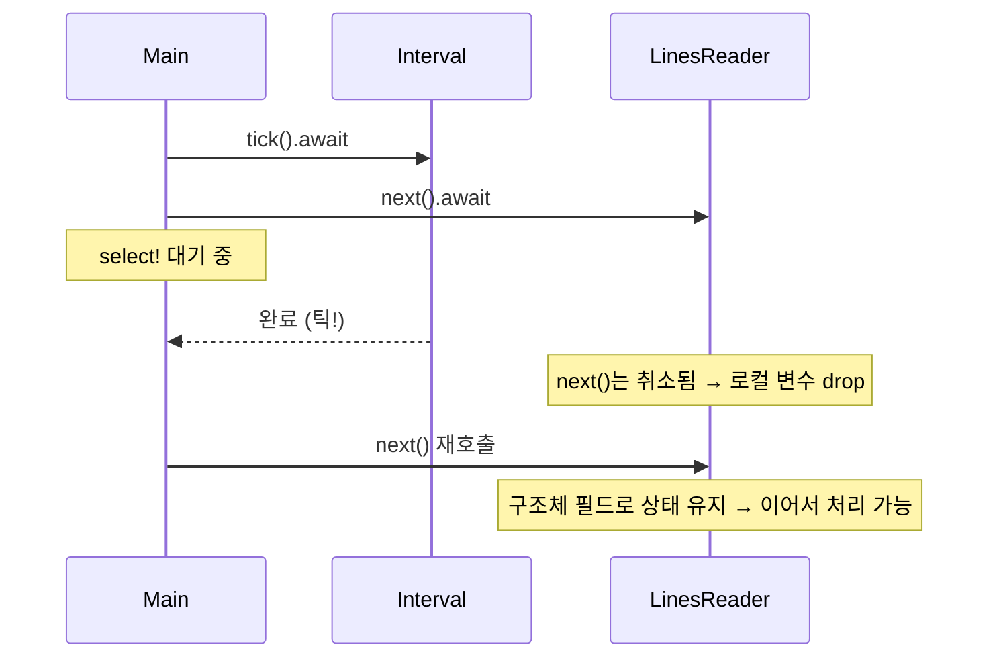
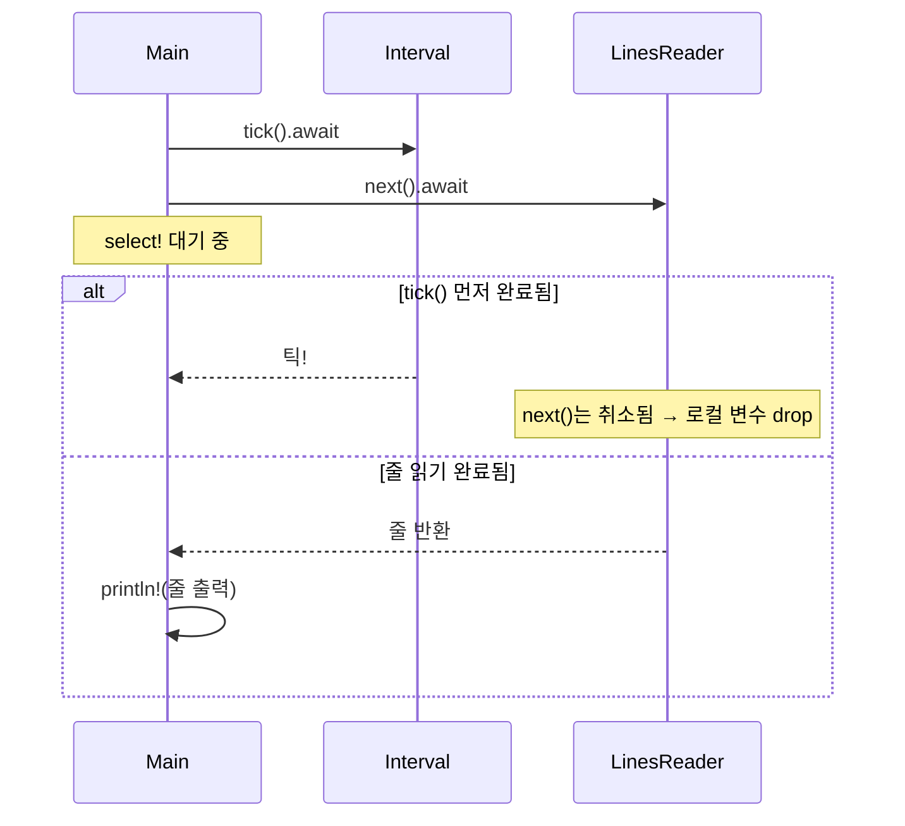

# Fucture 취소

이 예제는 Rust의 비동기 시스템에서 **Future의 취소(cancellation)**가 어떻게 발생하고, 어떤 문제가 생길 수 있으며,
그걸 어떻게 구조적으로 회피할 수 있는지를 보여주는 실전적인 사례입니다.

## 예제 
```rust
use std::io::{self, ErrorKind};
use std::time::Duration;
use tokio::io::{AsyncReadExt, AsyncWriteExt, DuplexStream};

struct LinesReader {
    stream: DuplexStream,
}

impl LinesReader {
    fn new(stream: DuplexStream) -> Self {
        Self { stream }
    }

    async fn next(&mut self) -> io::Result<Option<String>> {
        let mut bytes = Vec::new();
        let mut buf = [0];
        while self.stream.read(&mut buf[..]).await? != 0 {
            bytes.push(buf[0]);
            if buf[0] == b'\n' {
                break;
            }
        }
        if bytes.is_empty() {
            return Ok(None);
        }
        let s = String::from_utf8(bytes)
            .map_err(|_| io::Error::new(ErrorKind::InvalidData, "not UTF-8"))?;
        Ok(Some(s))
    }
}

async fn slow_copy(source: String, mut dest: DuplexStream) -> std::io::Result<()> {
    for b in source.bytes() {
        dest.write_u8(b).await?;
        tokio::time::sleep(Duration::from_millis(10)).await
    }
    Ok(())
}

#[tokio::main]
async fn main() -> std::io::Result<()> {
    let (client, server) = tokio::io::duplex(5);
    let handle = tokio::spawn(slow_copy("hi\nthere\n".to_owned(), client));

    let mut lines = LinesReader::new(server);
    let mut interval = tokio::time::interval(Duration::from_millis(60));
    loop {
        tokio::select! {
            _ = interval.tick() => println!("틱!"),
            line = lines.next() => if let Some(l) = line? {
                print!("{}", l)
            } else {
                break
            },
        }
    }
    handle.await.unwrap()?;
    Ok(())
}

```

## ✅ 핵심 원리 요약
| 개념 요소             | 설명                                                                 |
|----------------------|----------------------------------------------------------------------|
| Future / await / poll | `async fn`은 내부적으로 Future로 변환되고, 실행자는 이를 poll하여 진행함 |
| tokio::select!       | 여러 Future 중 하나가 완료되면 나머지는 취소됨 (drop 처리됨)            |
| 취소(Cancellation)    | Future가 더 이상 poll되지 않고 중단됨 → 내부 상태가 손실될 수 있음       |
| 취소 안전성           | Future 내부 상태를 구조체 필드로 분리하면 drop되어도 상태 유지 가능       |


tokio::select!는 Future 취소가 발생할 수 있는 대표적인 구조일 뿐이고,   
우리가 select!를 써서 Future를 “중단시키는 목적”으로 사용하는 건 아닙니다.

## ✅ 핵심 정리
| 개념 요소           | 설명                                                                 |
|--------------------|----------------------------------------------------------------------|
| Future 취소         | await 중인 Future가 drop되어 더 이상 poll되지 않는 것                  |
| select!의 역할      | 여러 Future 중 먼저 완료된 하나만 실행하고 나머지는 자동으로 취소됨     |
| 문제점              | 취소된 Future 내부의 로컬 상태가 손실될 수 있음                         |
| 해결 전략           | 상태를 구조체 필드로 분리하여 drop되어도 상태가 유지되도록 설계         |


## 🔍 코드 단계별 설명
### 1. LinesReader::next()의 문제점
```rust
async fn next(&mut self) -> io::Result<Option<String>> {
    let mut bytes = Vec::new();
    let mut buf = [0];
    ...
}
```

- bytes, buf는 로컬 변수
- tokio::select!에서 tick()이 먼저 완료되면
→ next() Future는 **취소(dropped)**됨 → bytes에 쌓던 데이터가 손실됨

### 2. 취소 안전하게 구조 변경
```rust
struct LinesReader {
    stream: DuplexStream,
    bytes: Vec<u8>,
    buf: [u8; 1],
}
``

- bytes, buf를 구조체 필드로 이동
- next()가 취소되어도 LinesReader는 drop되지 않음
- 다음 호출에서 이전 상태를 이어받아 처리 가능

### 3. tokio::select!의 취소 흐름
```rust
tokio::select! {
    _ = interval.tick() => println!("틱!"),
    line = lines.next() => ...
}
```

- tick()이 먼저 완료되면 lines.next()는 취소됨
- 이때 next() 내부 상태가 로컬 변수면 손실됨
- 구조체 필드로 분리하면 취소 안전성 확보

## 📊 절차도: 취소 발생과 회피 구조


## 현재의 코드 흐름

