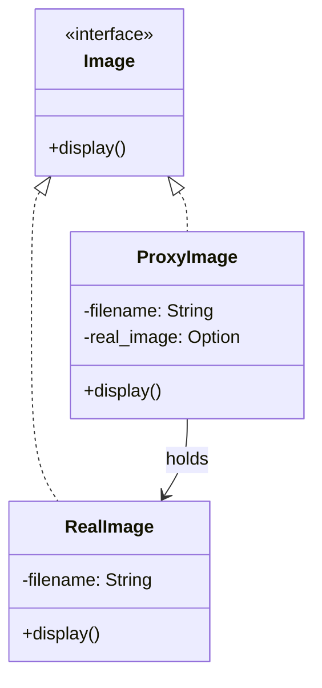

# 🧩 Proxy Pattern 개요

Proxy Pattern은 실제 객체에 접근하기 전에 중간에 대리 객체(Proxy)를 두어 접근을 제어하거나 기능을 추가하는 패턴입니다.

## 주로 다음과 같은 상황에서 사용됩니다:
- 접근 제어 (권한 확인, 인증 등)
- 지연 초기화 (Lazy Loading)
- 로깅 / 캐싱 / 리모트 호출

## 🦀 Rust 예제
```rust
trait Image {
    fn display(&self);
}

struct RealImage {
    filename: String,
}

impl RealImage {
    fn new(filename: &str) -> Self {
        println!("Loading image from disk: {}", filename);
        RealImage {
            filename: filename.to_string(),
        }
    }
}

impl Image for RealImage {
    fn display(&self) {
        println!("Displaying image: {}", self.filename);
    }
}

struct ProxyImage {
    filename: String,
    real_image: Option<RealImage>,
}

impl ProxyImage {
    fn new(filename: &str) -> Self {
        ProxyImage {
            filename: filename.to_string(),
            real_image: None,
        }
    }
}

impl Image for ProxyImage {
    fn display(&self) {
        let mut real = self.real_image.clone();
        if real.is_none() {
            real = Some(RealImage::new(&self.filename));
        }
        real.as_ref().unwrap().display();
    }
}

fn main() {
    let proxy = ProxyImage::new("rust_logo.png");
    proxy.display(); // 로딩 + 출력
    proxy.display(); // 재로딩 없이 출력
}
```


### 🧠 핵심 설명 (Rust 중심)
- Image 트레잇은 공통 인터페이스 역할
- RealImage는 실제 이미지 객체
- ProxyImage는 RealImage를 감싸고, 필요할 때만 초기화
- Option<RealImage>를 통해 지연 초기화(Lazy Loading) 구현

## 🧪 C++ 예제
```cpp
#include <iostream>
#include <string>
using namespace std;

class Image {
public:
    virtual void display() = 0;
};

class RealImage : public Image {
    string filename;
public:
    RealImage(string fname) : filename(fname) {
        cout << "Loading " << filename << endl;
    }
    void display() override {
        cout << "Displaying " << filename << endl;
    }
};

class ProxyImage : public Image {
    string filename;
    RealImage* realImage = nullptr;
public:
    ProxyImage(string fname) : filename(fname) {}
    void display() override {
        if (!realImage)
            realImage = new RealImage(filename);
        realImage->display();
    }
};

int main() {
    ProxyImage proxy("cpp_logo.png");
    proxy.display(); // 로딩 + 출력
    proxy.display(); // 재로딩 없이 출력
    return 0;
}
```

## 🧱 C# 예제
```csharp
using System;

interface IImage {
    void Display();
}

class RealImage : IImage {
    private string filename;
    public RealImage(string fname) {
        filename = fname;
        Console.WriteLine("Loading " + filename);
    }
    public void Display() {
        Console.WriteLine("Displaying " + filename);
    }
}

class ProxyImage : IImage {
    private string filename;
    private RealImage realImage;
    public ProxyImage(string fname) {
        filename = fname;
    }
    public void Display() {
        if (realImage == null)
            realImage = new RealImage(filename);
        realImage.Display();
    }
}

class Program {
    static void Main(string[] args) {
        ProxyImage proxy = new ProxyImage("csharp_logo.png");
        proxy.Display(); // 로딩 + 출력
        proxy.Display(); // 재로딩 없이 출력
    }
}
```

## 🐍 Python 예제
```python
class Image:
    def display(self):
        pass

class RealImage(Image):
    def __init__(self, filename):
        self.filename = filename
        print(f"Loading {filename}")

    def display(self):
        print(f"Displaying {self.filename}")

class ProxyImage(Image):
    def __init__(self, filename):
        self.filename = filename
        self.real_image = None

    def display(self):
        if self.real_image is None:
            self.real_image = RealImage(self.filename)
        self.real_image.display()

if __name__ == "__main__":
    proxy = ProxyImage("python_logo.png")
    proxy.display()  # 로딩 + 출력
    proxy.display()  # 재로딩 없이 출력
```

## 📊 Mermaid 클래스 다이어그램



