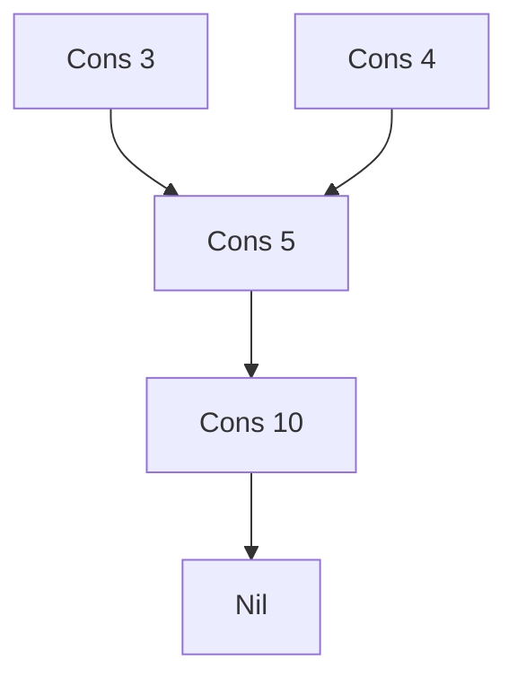
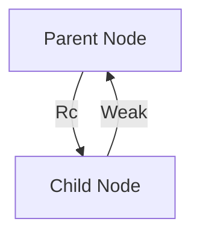

# Rc
Rust의 Rc<T> 스마트 포인터에 대해 완전하게 정리.  
복수 소유권과 데이터 공유의 개념을 정리.

## 🧠 Rc<T>란?
Rc<T>는 Reference Counted Smart Pointer의 줄임말로,
하나의 값을 여러 소유자가 공유할 수 있도록 해주는 Rust의 스마트 포인터입니다.  
참조 카운팅 공유 포인터입니다.  
여러 위치에서 동일한 데이터를 참조해야할 경우 사용합니다.


## ✅ Rc<T> vs Arc<T> 핵심 특징
| 항목               | Rc<T> (std::rc)                                | Arc<T> (std::sync)                              |
|--------------------|-----------------------------------------------|--------------------------------------------------|
| 의미               | Reference Counted                             | Atomic Reference Counted                         |
| 사용 환경          | 단일 스레드                                   | 멀티 스레드                                      |
| 내부 동기화        | 없음 (빠름)                                   | 있음 (스레드 안전, 느림)                         |
| 참조 카운트 방식   | 일반 카운팅                                   | 원자적 카운팅 (atomic operations)               |
| 대표 용도          | 그래프, 트리, 공유 리스트 등 단일 스레드 구조 | 병렬 처리, 스레드 간 데이터 공유                 |
| Clone 동작         | 참조 카운트 증가만 수행                        | 참조 카운트 증가만 수행                          |
| Drop 시점          | 참조 카운트가 0이 되면 자동 메모리 해제       | 동일하게 0이 되면 자동 해제                      |


## 🔍 Rc<T> 동작 예제
```rust
use std::rc::Rc;

fn main() {
    let origin = Rc::new(0);
    println!("Reference count: {}", Rc::strong_count(&origin)); // 1

    {
        let _dup1 = Rc::clone(&origin);
        println!("Reference count: {}", Rc::strong_count(&origin)); // 2

        {
            let _dup2 = Rc::clone(&origin);
            println!("Reference count: {}", Rc::strong_count(&origin)); // 3
        }

        println!("Reference count: {}", Rc::strong_count(&origin)); // 2
    }

    println!("Reference count: {}", Rc::strong_count(&origin)); // 1
}
```


- Rc::clone()은 참조 카운트만 증가시키고, 실제 데이터는 복사하지 않음
- 스코프가 끝나면 자동으로 참조 카운트가 감소됨

## 📦 Rc<T>를 사용하는 이유
- 그래프 구조나 공유 리스트처럼 여러 노드가 같은 데이터를 참조해야 할 때
- 컴파일 타임에 누가 마지막으로 데이터를 사용할지 알 수 없을 때
- Box<T>는 단일 소유권만 가능하므로, 공유가 필요한 경우 Rc<T>로 대체
- Rc는 참조 카운트를 통해 참조가 있는 동안은 Rc가 가리키고 있는 값이 메모리에서 해제되지 않음을 보장합니다.
- clone은 비용이 거의 들지 않습니다. 같은 곳을 가리키는 포인터를 하나 더 만들고, 참조 카운트를 늘립니다.

### 🧪 예제: Rc<T>를 이용한 리스트 공유
```rust
enum List {
    Cons(i32, Rc<List>),
    Nil,
}

use List::{Cons, Nil};
use std::rc::Rc;

fn main() {
    let a = Rc::new(Cons(5, Rc::new(Cons(10, Rc::new(Nil)))));
    let b = Cons(3, Rc::clone(&a));
    let c = Cons(4, Rc::clone(&a));
}
```
- a는 리스트 5 → 10 → Nil을 가리킴
- b와 c는 a를 공유함 → 참조 카운트는 3
- a가 스코프를 벗어나기 전까지 메모리는 해제되지 않음

### 🧬 데이터 공유 구조 시각화


- A → B → C는 리스트 a
- D와 E는 각각 b, c이며 a를 공유함
- Rc::clone()을 통해 A를 여러 노드가 참조

### 🧪 예제: Rc<T>를 이용한 노드 공유
```rust
struct Node {
    val: i32,
    next: Option<Rc<Node>>,
}

fn main() {
    let node1 = Rc::new(Node { val: 2, next: None });

    let head1 = Node {
        val: 1,
        next: Some(Rc::clone(&node1)),
    };

    let head2 = Node {
        val: 3,
        next: Some(Rc::clone(&node1)),
    };

    println!("{} {}", head1.val, head1.next.unwrap().val); // 1 2
    println!("{} {}", head2.val, head2.next.unwrap().val); // 3 2
}
```

- node1은 head1과 head2가 공유
- 참조 카운트는 3 (node1, head1.next, head2.next)


## ✅ Rc<T> 요약

| 항목               | 설명                                                                 |
|--------------------|----------------------------------------------------------------------|
| 목적               | 하나의 값을 여러 소유자가 공유할 수 있도록 함                        |
| 동작 방식          | 참조 카운트를 유지하며, 0이 되면 자동으로 메모리 해제                 |
| clone()            | 참조 카운트만 증가, 실제 데이터는 복사하지 않음                      |
| 사용 제한          | 단일 스레드 환경에서만 사용 가능 (`std::rc`)                         |
| 대표 사용 예       | 그래프, 트리, 공유 리스트 등 복수 참조가 필요한 구조                 |


---

# Rc::make_mut 
이건 Rust의 소유권과 참조 카운팅을 동시에 다루는 핵심 메서드입니다.

## 🧩 Rc::make_mut()란?
```rust
pub fn make_mut(this: &mut Rc<T>) -> &mut T
```

- Rc<T>가 단일 참조일 때는 그대로 mutable 참조 반환
- 복수 참조일 경우에는 내부 데이터를 복제해서 새로운 Rc를 만들고 mutable 참조 반환  
  → 즉, 참조 카운트가 1이 아니면 clone하고, 1이면 그대로 mutable 참조

## ✅ 언제 쓰는가?
- Rc<T>는 기본적으로 immutable 공유
- 하지만 내가 가진 Rc가 유일한 참조라면 → mutable하게 바꿔도 안전
- make_mut()는 이걸 자동으로 판단해서 처리해줌

## 🧪 샘플 코드
```rust
use std::rc::Rc;

#[derive(Debug, Clone)]
struct Data {
    value: i32,
}

fn main() {
    let mut a = Rc::new(Data { value: 10 });
    let b = Rc::clone(&a); // 참조 카운트 증가

    // Rc가 여러 개 → 내부 복제 발생
    let mut_ref = Rc::make_mut(&mut a);
    mut_ref.value += 1;

    println!("a: {:?}", a); // value: 11
    println!("b: {:?}", b); // value: 10 → 복제되었기 때문
}
```

## 🔍 내부 동작 흐름
| 참조 카운트 상태     | 동작                          | 결과                            |
|----------------------|-------------------------------|----------------------------------|
| 1 (유일한 참조)      | 그대로 mutable 참조 반환       | Rc 내부 데이터 수정 가능         |
| >1 (복수 참조 존재)  | 내부 데이터를 clone            | 새로운 Rc로 mutable 참조 반환    |


## 🔍 실전에서 이걸 어떻게 관리할까?
### 1. 명시적 버전 관리
struct Versioned<T> {
    current: Rc<T>,
    history: Vec<Rc<T>>,
}

- make_mut()로 분기된 순간 → history.push(old.clone())
- → undo/redo, branching, snapshot에 유용

### 2. ID 기반으로 추적
#[derive(Clone)]
struct Data {
    id: Uuid,
    value: i32,
}

- make_mut()로 복제되면 → 새로운 id 생성
- → 데이터 추적, 캐시 무효화, 동기화에 유용

### 3. RefCell로 상태 공유
- Rc<RefCell<T>>로 감싸면 → 내부 상태는 공유되고,
→ Rc 자체는 복제되어도 데이터는 동일하게 유지
- → 복제 없이 상태를 유지하고 싶을 때

### 4. Arc로 멀티스레드 관리
- Arc::make_mut()도 동일한 동작
- → 복제된 순간을 스레드 간 메시지로 전달하거나, 로그로 기록

--- 

# Weak / Arc<Mutex>

Rust에서 순환 참조를 방지하는 Weak<T>, 그리고 멀티스레드 환경에서 공유 데이터를 안전하게 다루는 Arc<Mutex<T>> 조합에 대해 정리. 
이 두 개념은 Rust의 메모리 안전성과 동시성 모델을 이해하는 데 핵심입니다.

## 🧠 1. Weak<T>로 순환 참조 방지하기
### ✅ 왜 필요한가?
- Rc<T>는 참조 카운트를 증가시키며 소유권을 공유합니다.
- 하지만 서로가 서로를 참조하는 구조(예: 부모-자식 트리, 양방향 링크드 리스트)는 참조 카운트가 0이 되지 않아 메모리 누수가 발생합니다.

### ❌ 문제 예시
```rust
use std::rc::Rc;
use std::cell::RefCell;

struct Node {
    parent: RefCell<Option<Rc<Node>>>,
    children: RefCell<Vec<Rc<Node>>>,
}
```
- parent와 children 모두 Rc<Node>를 사용하면 순환 참조 발생
- 참조 카운트가 절대 0이 되지 않아 drop이 호출되지 않음
- 
###  ✅ 해결 방법: Weak<T>
```rust
use std::rc::{Rc, Weak};
use std::cell::RefCell;

struct Node {
    parent: RefCell<Weak<Node>>, // 🔁 약한 참조
    children: RefCell<Vec<Rc<Node>>>,
}
```

- Weak<T>는 참조 카운트를 증가시키지 않음
- Rc::downgrade(&rc)로 생성
- .upgrade()를 호출하면 Option<Rc<T>>로 접근 가능

### 🧪 메모리 누수 없는 트리 구조
```rust
let parent = Rc::new(Node { ... });
let child = Rc::new(Node { ... });

*child.parent.borrow_mut() = Rc::downgrade(&parent);
```

- parent는 Rc, child.parent는 Weak
- parent가 drop되면 child.parent.upgrade()는 None 반환


## 🧭 2. Arc<Mutex<T>> 조합으로 멀티스레드 공유
### ✅ 왜 필요한가?
- Rc<T>는 단일 스레드 전용
- 멀티스레드에서 데이터를 공유하려면 스레드 안전한 Arc + Mutex 조합이 필요
### ✅ 구조
```rust
use std::sync::{Arc, Mutex};
use std::thread;

fn main() {
    let counter = Arc::new(Mutex::new(0));

    let mut handles = vec![];

    for _ in 0..10 {
        let counter = Arc::clone(&counter);
        let handle = thread::spawn(move || {
            let mut num = counter.lock().unwrap();
            *num += 1;
        });
        handles.push(handle);
    }

    for handle in handles {
        handle.join().unwrap();
    }

    println!("Result: {}", *counter.lock().unwrap()); // Result: 10
}
```

- Arc<T>: 멀티스레드에서 소유권 공유
- Mutex<T>: 동시 접근을 막고 하나의 스레드만 데이터 수정 가능
- .lock().unwrap()으로 뮤텍스 잠금 후 데이터 접근

## 🧬 순환 참조 구조 시각화


- A → B는 강한 참조 (Rc)
- B → A는 약한 참조 (Weak)
- 이 구조는 순환 참조를 방지하면서 관계를 유지함

## ✅ Weak<T> vs Arc<Mutex<T>> 요약

| 개념             | 목적                                      | 특징                                               |
|------------------|-------------------------------------------|----------------------------------------------------|
| `Weak<T>`        | 순환 참조 방지                            | 참조 카운트 증가 없음, `.upgrade()`로 접근 가능     |
| `Arc<Mutex<T>>`  | 멀티스레드 공유 + 동기화                  | 스레드 안전, 데이터 보호, 자동 잠금 해제            |
| `Rc<T>`          | 단일 스레드에서 복수 소유권               | 순환 참조 발생 가능, `Weak<T>`와 함께 사용 필요     |

---


