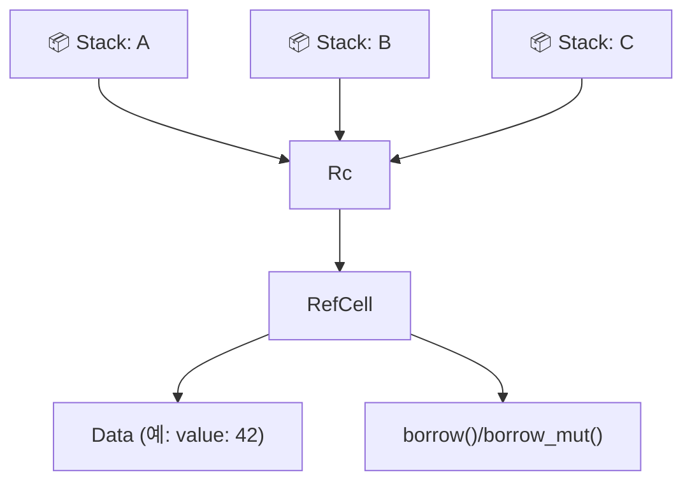
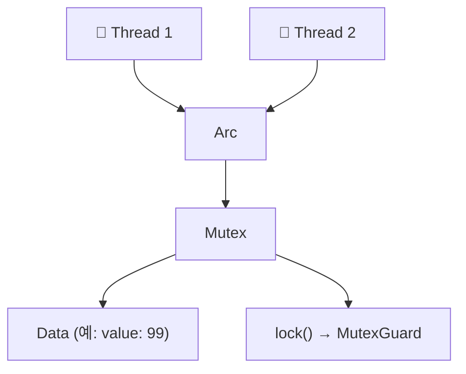

# 메모리 레이 아웃 분석
```rust
struct Dog {
    name: String,
    age: i8,
}
struct Cat {
    lives: i8,
}

trait Pet {
    fn talk(&self) -> String;
}

impl Pet for Dog {
    fn talk(&self) -> String {
        format!("멍멍, 제 이름은 {}입니다.", self.name)
    }
}

impl Pet for Cat {
    fn talk(&self) -> String {
        String::from("냐옹!")
    }
}

fn main() {
    let pets: Vec<Box<dyn Pet>> = vec![
        Box::new(Cat { lives: 9 }),
        Box::new(Dog { name: String::from("Fido"), age: 5 }),
    ];
    for pet in pets {
        println!("Hello, who are you? {}", pet.talk());
    }
}
```

## pets를 할당한 이후의 메모리 레이아웃:


---

# Rc / Arc 메모리 구조

## 🧠 Rc + RefCell 구조 (단일 스레드, 공유 + 변경)


- Rc<T>는 참조 카운트를 관리
- RefCell<T>는 내부 가변성을 제공
- borrow()/borrow_mut()은 런타임 검사

## 🧠 Arc + Mutex 구조 (멀티스레드, 공유 + 동기화)


- Arc<T>는 멀티스레드 참조 카운트
- Mutex<T>는 동기화된 내부 가변성
- lock()으로 안전한 접근

## 📦 비교 요약
| 구조               | 공유 가능 | 변경 가능 | 스레드 안전성 | 용도 예시                          |
|--------------------|-----------|-----------|----------------|-------------------------------------|
| Rc<T>              | ✅        | ❌        | ❌ (단일 스레드) | 여러 참조만 필요할 때 (읽기 전용)     |
| Rc<RefCell<T>>     | ✅        | ✅        | ❌              | 단일 스레드에서 공유 + 변경 필요할 때 |
| Arc<T>             | ✅        | ❌        | ✅              | 멀티스레드에서 읽기 공유만 필요할 때  |
| Arc<Mutex<T>>      | ✅        | ✅        | ✅              | 멀티스레드에서 공유 + 변경 필요할 때  |

## 🔍 요점 정리
- Rc는 참조 카운트만 관리 → 읽기 전용 공유
- RefCell은 내부 가변성 → 런타임에 변경 가능
- Arc는 멀티스레드용 참조 카운트
- Mutex는 동기화된 변경 → lock()으로 접근


## 🧠 Rc<RefCell<T>> 여러 곳에서 참조하는 구조


## 🔍 설명
- Rc는 참조 카운트를 관리하며 여러 스택 변수(A, B, C)에서 공유됨
- RefCell은 내부 가변성을 제공 → borrow()/borrow_mut()으로 런타임에 안전하게 접근
- 이 구조는 단일 스레드에서 공유 + 변경이 필요한 경우에 적합

## 🧠 Arc<Mutex<T>>의 lock 흐름 (멀티스레드 환경)


## 🔍 설명
- Arc는 멀티스레드에서 참조 카운트를 관리
- Mutex는 내부 데이터를 보호하며 lock()으로 접근
- MutexGuard를 통해 안전하게 읽기/쓰기 가능
- 이 구조는 멀티스레드 환경에서 공유 + 동기화된 변경이 필요할 때 사용

## ✅ 요약 비교
| 구조               | 공유 가능 | 변경 가능 | 스레드 안전성       | 접근 방식                  |
|--------------------|-----------|-----------|----------------------|----------------------------|
| Rc<RefCell<T>>     | ✅        | ✅        | ❌ (단일 스레드 전용) | borrow() / borrow_mut()   |
| Arc<Mutex<T>>      | ✅        | ✅        | ✅ (멀티스레드 안전)  | lock() → MutexGuard        |

---

