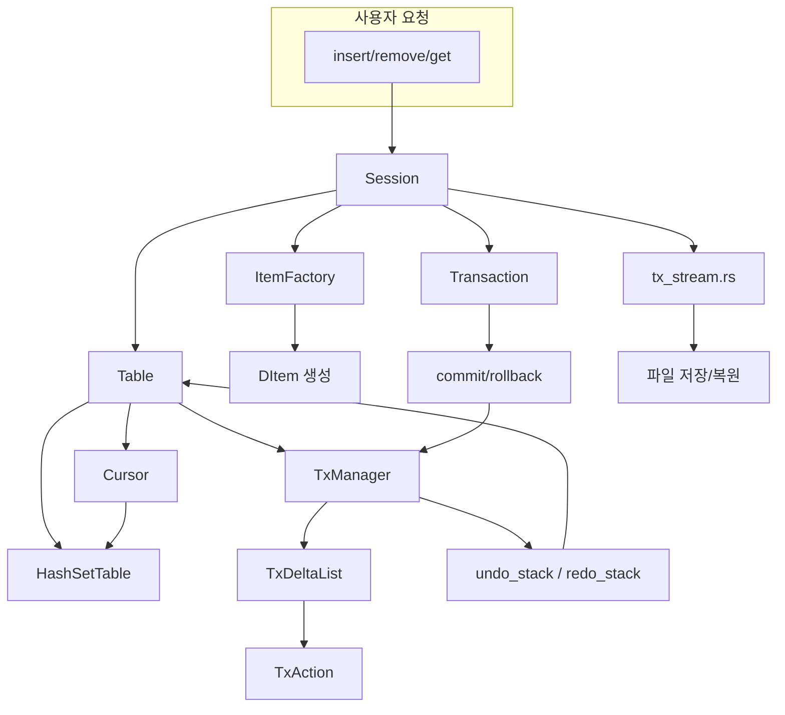
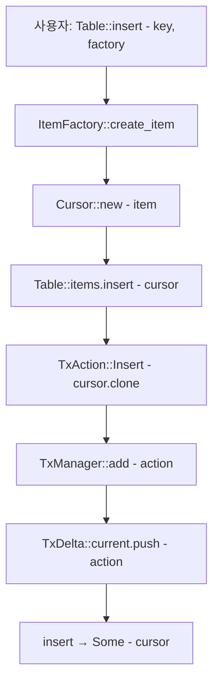
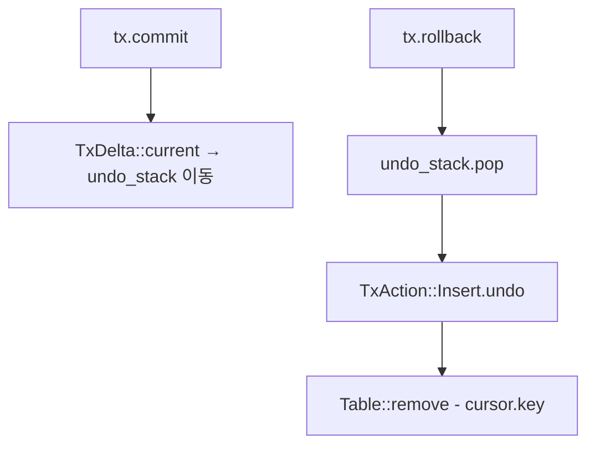
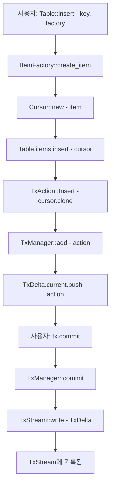
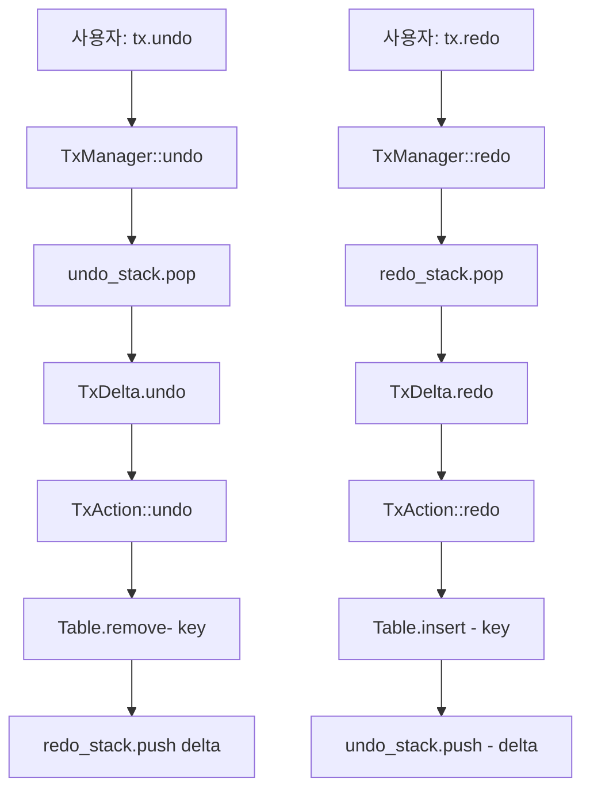
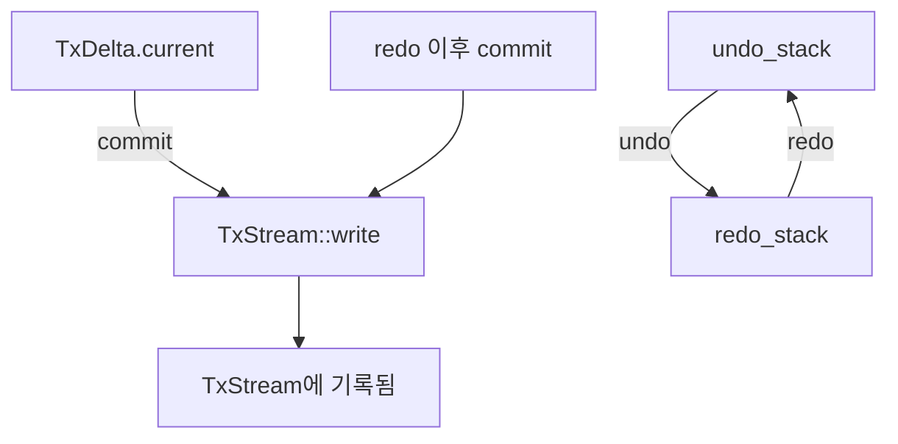

# DBMS 소스 구조

DBMS 시스템 문서를 기반으로 전체 구조와 함수 흐름을 다음과 같이 정리했습니다.  
각 모듈별 기능, 핵심 함수 설명, 그리고 전체 작동 흐름을 도표로 시각화.

## 📦 전체 모듈 구성
| 모듈명             | 설명                                   |
|--------------------|----------------------------------------|
| `define.rs`        | 트랜잭션 액션 및 시스템 상수 정의       |
| `guid.rs`          | GUID 생성 및 문자열 변환 기능           |
| `item.rs`          | DItem 인터페이스 및 Cursor 구조체       |
| `hashset.rs`       | 키 기반 항목 저장소 (HashMap 기반)      |
| `item_factory.rs`  | 항목 생성/삭제 콜백 등록 및 관리        |
| `table.rs`         | 테이블 단위 삽입/삭제/조회/트랜잭션 처리|
| `session.rs`       | 전체 테이블 관리 및 트랜잭션 일괄 처리  |
| `transaction.rs`   | 트랜잭션 객체 (commit/rollback/drop)    |
| `tx_delta_list.rs` | 트랜잭션 변경 목록 및 액션 관리          |
| `tx_manager.rs`    | undo/redo 스택 관리                     |
| `tx_stream.rs`     | 트랜잭션 스트림 입출력 (파일 기반)      |
| `mem_pool.rs`      | 메모리 풀 관리                          |
| `dbutil.rs`        | 문자열 포맷, 경로 유틸리티              |

## 🧩 핵심 구조체와 함수 설명
### 1. `TxAction`
- 트랜잭션 단위 액션: Insert, Remove, Modify
### 2. `Cursor`
- Arc<dyn DItem>을 감싸는 포인터
- visible, param_data, param 등 상태 포함
### 3. `HashSetTable`
- insert(cursor): 키 기반 삽입
- remove(key): 키 기반 삭제
- find_visible(key): visible 상태 항목 조회
### 4. `ItemFactory`
- register_type(...): 타입 등록
- create_item(item_type, key): 항목 생성
### 5. `Table`
- insert(key, factory): 항목 삽입 + 트랜잭션 기록
- remove(key): 항목 삭제 + 트랜잭션 기록
- undo() / redo(): 트랜잭션 되돌리기/재적용
### 6. `Session`
- register_table(...): 테이블 등록
- undo_all() / redo_all() / clear_all(): 전체 트랜잭션 처리
### 7. `Transaction`
- commit(): 반영 후 초기화
- rollback(): 되돌리기
- Drop: 자동 롤백

## 🔄 전체 흐름도


## insert() 호출 시 
내부적으로 어떤 흐름으로 동작이 이루어지는지를 정리한 것입니다.  
이 흐름은 Table::insert() 기준이며, Cursor, TxAction, ItemFactory, TxManager까지 포함합니다.

## 🧩 insert() 전체 흐름도 (Mermaid - Top to Bottom)


### 단계
| 번호 | 설명                                |
|-----------|-------------------------------------|
| ①         | Table::insert() 호출                |
| ②         | ItemFactory를 통해 DItem 생성       |
| ③         | 생성된 DItem으로 Cursor 생성        |
| ④         | Table.items에 Cursor 삽입           |
| ⑤         | TxAction::Insert(cursor) 생성       |
| ⑥         | TxManager::add()로 액션 등록        |
| ⑦         | TxDelta.current에 액션 저장         |
| ⑧         | 최종적으로 Some(cursor) 반환        |


### 🧪 이후 흐름


### 🔍 흐름 요약
- insert()는 단순히 데이터를 넣는 것뿐 아니라, 트랜잭션에 되돌릴 수 있는 액션을 등록합니다.
- TxManager::add()는 undo/redo를 위한 핵심 연결점이며, TxDelta.current는 아직 커밋되지 않은 작업을 보관합니다.
- Some(cursor)는 삽입된 아이템을 참조할 수 있는 핸들이며, 이후 연산에 사용됩니다.

---

### TxStream 흐름도

트랜잭션 스트림(TxStream)에 액션이 언제, 어떻게 기록되는지 흐름상 보이지 않는 상태입니다.  
이건 트랜잭션의 로그 기록 또는 복구 대상 저장소로서 TxStream이 어떤 시점에 개입하는지를 명확히 드러냄.

### 🧠 TxStream의 역할 요약
| 구성 요소              | 설명                                              |
|------------------------|---------------------------------------------------|
| TxStream               | 트랜잭션 로그를 기록하고 복구하는 스트림         |
| TxManager::commit()    | TxDelta를 확정하고 TxStream에 기록 요청           |
| TxStream::write(delta) | TxDelta를 직렬화하여 로그에 저장                  |
| TxStream::read()       | 저장된 로그를 읽어 트랜잭션 상태를 복구           |

### 🔍 흐름 요약
- TxManager::commit()은 트랜잭션을 확정하면서 TxDelta를 TxStream에 전달
- TxStream::write()는 이를 로그로 남겨서 복구 가능성을 확보
- 시스템 재시작 또는 장애 복구 시 TxStream::read()를 통해 트랜잭션을 재적용


### 🧩 확장된 흐름도 (TxStream 포함)



### ✅ 흐름 설명
| 단계            | 설명                                                                 |
|-----------------|----------------------------------------------------------------------|
| commit()        | 트랜잭션을 확정하며 현재 작업(TxDelta.current)을 처리함              |
| TxManager       | TxDelta.current을 undo_stack에 push하고, TxStream에 기록 요청         |
| TxStream::write() | TxDelta를 직렬화하여 트랜잭션 로그로 기록함                         |
| TxStream        | 트랜잭션 로그를 저장하고, 복구 시점에 read()로 재적용 가능            |

### 🔁 흐름 요약
- commit()은 단순한 상태 확정이 아니라 트랜잭션 로그 기록까지 포함
- TxManager는 트랜잭션 상태를 관리하며, TxStream은 영속적 기록자
- 이 구조 덕분에 시스템 재시작 시 TxStream::read()를 통해 트랜잭션을 복원할 수 있음

## 🧪 디버깅 팁
- TxStream::write() 호출 시점에 로그 출력 추가:  
```rust
println!("TxStream 기록: {:?}", delta);
```
- TxStream이 실제로 기록하는지 확인하려면: 
```rust 
assert!(tx_stream.len() > 0);
```

### 🧠 설계 철학
- TxManager는 트랜잭션 상태 관리자
- TxStream은 트랜잭션 로그 기록자
- commit()은 상태 확정 + 로그 기록을 동시에 수행

---

### Undo /Redo 흐름도
Undo와 Redo가 발생했을 때의 내부 동작을 정리한 Mermaid 흐름도와 단계별 설명 테이블입니다.  
이전에 설명드린 insert() 흐름과 동일한 스타일로 구성했고, TxManager, TxDelta, TxAction, TxStream까지 포함됩니다.

### 🧩 Undo / Redo 동작 흐름도 (Mermaid - Top to Bottom)



### 🧠 단계별 설명 테이블
| 단계 번호 | 설명                                      |
|-----------|-------------------------------------------|
| ①         | tx.undo() 호출                            |
| ②         | TxManager가 undo_stack에서 TxDelta 꺼냄   |
| ③         | TxDelta가 내부 TxAction들을 순회하며 undo |
| ④         | 각 TxAction이 Table에서 삭제 수행         |
| ⑤         | TxDelta는 redo_stack에 push됨             |
| ⑥         | 이후 tx.redo() 호출                       |
| ⑦         | TxManager가 redo_stack에서 TxDelta 꺼냄   |
| ⑧         | TxDelta가 내부 TxAction들을 순회하며 redo |
| ⑨         | 각 TxAction이 Table에 다시 삽입 수행      |
| ⑩         | TxDelta는 undo_stack에 다시 push됨        |


### 🔁 흐름 요약
- undo()는 마지막 커밋된 TxDelta를 되돌리고, redo_stack에 저장
- redo()는 되돌린 TxDelta를 다시 적용하고, undo_stack에 복원
- 이 구조는 다단계 undo/redo를 지원하며, TxStream과 연결하면 영속적 복구도 가능

---

### 🧠 왜 TxStream에 저장되지 않을까?
| 동작                      | 관련 스택/버퍼             | TxStream 기록 여부 | 설명                                               |
|---------------------------|-----------------------------|--------------------|----------------------------------------------------|
| TxStream::write() ← commit() | TxDelta.current             | ✅ 기록됨           | 커밋 시점에만 TxDelta가 TxStream에 직렬화되어 저장됨 |
| undo() → undo_stack.pop()   | TxDelta → redo_stack        | ❌ 기록 안됨        | 메모리에서 되돌리기만 수행, TxStream에는 기록 안 됨 |
| redo() → redo_stack.pop()   | TxDelta → undo_stack        | ❌ 기록 안됨        | 메모리에서 복원만 수행, TxStream에는 기록 안 됨     |

### 🔁 흐름 요약
- commit()만이 **TxStream::write()** 를 호출하여 트랜잭션 로그를 남깁니다
- undo()와 redo()는 메모리 상의 상태 전환일 뿐, 영속적 기록은 하지 않습니다
- 따라서 undo나 redo 이후에 다시 commit()을 호출해야만 TxStream에 반영됩니다

### 🔁 흐름 요약


- undo/redo는 TxStream과 무관한 메모리 기반 동작
- redo 이후 다시 commit()하면 그 시점에만 TxStream에 기록됨

### ✅ 요약
| 동작              | 상태 변화                    | TxStream 기록 여부 | 설명                                               |
|-------------------|------------------------------|--------------------|----------------------------------------------------|
| `insert()`          | TxDelta.current에 액션 추가   | ❌ 기록 안됨        | 아직 커밋되지 않은 상태, 메모리 상에만 존재        |
| `commit()`          | current → undo_stack 이동     | ✅ 기록됨           | TxStream::write() 호출로 트랜잭션 로그 저장        |
| `undo()`           | undo_stack → redo_stack 이동  | ❌ 기록 안됨        | 메모리에서 되돌리기만 수행, TxStream에는 기록 안 됨 |
| `redo()`            | redo_stack → undo_stack 이동  | ❌ 기록 안됨        | 메모리에서 복원만 수행, TxStream에는 기록 안 됨     |
| `redo` → `commit()`   | 복원된 상태를 다시 커밋       | ✅ 기록됨           | 이 시점에 TxStream::write() 호출되어 로그 저장됨   |


---


## ✅ 테스트 체크리스트
| 기능 항목         | 주요 메서드 / 속성                     | 테스트 목적                          |
|------------------|----------------------------------------|--------------------------------------|
| `insert`/`remove`/`get`| `Table::insert`, `remove`, `get`       | 항목 삽입, 삭제, 조회 동작 확인     |
| `undo`/`redo`        | `Table::undo`, `redo`                  | 트랜잭션 되돌리기 및 재적용 확인    |
| `commit`/`rollback`  | `Transaction::commit`, `rollback`      | 명시적 트랜잭션 처리 확인           |
| `Cursor`           | `visible`, `param_data`, `param`       | 항목 상태 및 파라미터 설정 확인     |
| `ItemFactory`      | `register_type`, `create_item`         | 타입 등록 및 항목 생성 확인         |
| `GUID`             | `to_string`, `from_string`             | GUID 생성 및 문자열 변환 확인       |
| `TxStream`         | `write_action`, `read_action`          | 트랜잭션 액션 직렬화/역직렬화 확인  |
| `Session`          | `register_table`, `get_table`          | 테이블 등록 및 조회 확인            |
| `TxDeltaList`      | `add`, `find_alive`, `find_by_key`     | 액션 추가, 필터링, 키 기반 조회 확인|


## 1. define.rs
### 📦 전체 파일 개요
이 파일은 DBMS의 트랜잭션 시스템에서 사용하는 핵심 enum과 상수들을 정의합니다.
- TxAction: 트랜잭션에서 발생할 수 있는 작업의 종류를 나타냄
- MAX_TABLE, MAX_ITEM_TYPE: 시스템이 다룰 수 있는 최대 테이블/아이템 타입 수
- STATUS_VISIBLE, STATUS_HIDDEN: 아이템의 가시성 상태를 나타내는 플래그

```rust
use crate::dbms::item::Cursor;

// 트랜잭션 상태 플래그
#[derive(Clone, Debug)]
pub enum TxAction {
    Insert(Cursor), // undo: remove
    Remove(Cursor), // undo: insert
    Modify { before: Cursor, after: Cursor },
}

// 시스템 제한값
pub const MAX_TABLE: usize = 256;
pub const MAX_ITEM_TYPE: usize = 1024;

// 기타 상태 플래그
pub const STATUS_VISIBLE: u8 = 0x01;
pub const STATUS_HIDDEN: u8 = 0x02;
```
### 🔹 use crate::dbms::item::Cursor;
- Cursor는 아이템을 가리키는 포인터 역할을 하는 구조체로 보입니다.
- 트랜잭션에서 어떤 아이템을 수정/삭제/삽입했는지를 추적할 때 사용됩니다.

### 🔸 TxAction enum
```rust
#[derive(Clone, Debug)]
pub enum TxAction {
    Insert(Cursor), // undo: remove
    Remove(Cursor), // undo: insert
    Modify { before: Cursor, after: Cursor },
}
```
### 🎯 목적
트랜잭션에서 발생한 변경 사항을 기록하는 자료구조입니다.  
이걸 기반으로 undo/redo, 트랜잭션 로그 저장, 재생 등을 구현할 수 있습니다.  
### 🧩 각 variant 설명
| Variant                        | 설명                                      | Undo 시 되돌릴 동작                  |
|-------------------------------|-------------------------------------------|--------------------------------------|
| Insert(Cursor)                | 새로운 아이템을 테이블에 삽입함           | Remove(Cursor)                       |
| Remove(Cursor)                | 기존 아이템을 테이블에서 제거함           | Insert(Cursor)                       |
| Modify { before, after }      | 아이템의 상태를 변경함 (before → after)   | Modify { after, before } 또는 Insert(before) |

### 🔸 시스템 제한값
```rust
pub const MAX_TABLE: usize = 256;
pub const MAX_ITEM_TYPE: usize = 1024;
```
- 시스템이 동시에 다룰 수 있는 최대 테이블 수와 아이템 타입 수를 제한합니다.
- 예: ItemFactory에서 item_type이 0~1023 범위 내여야 함

### 🔸 상태 플래그
```rust
pub const STATUS_VISIBLE: u8 = 0x01;
pub const STATUS_HIDDEN: u8 = 0x02;
```
- 아이템의 가시성 상태를 나타냅니다.
- 예: 삭제된 아이템은 STATUS_HIDDEN, 살아있는 아이템은 STATUS_VISIBLE로 표시


### ✅ 요약
| 항목                        | 설명                                                                 |
|-----------------------------|----------------------------------------------------------------------|
| `TxAction`                    | 트랜잭션에서 발생한 작업을 나타내는 열거형 (Insert, Remove, Modify) |
| `Cursor`                      | 아이템의 위치와 상태를 담는 포인터 구조체                          |
| `MAX_TABLE` / `MAX_ITEM_TYPE`   | 시스템이 지원하는 최대 테이블 수 / 아이템 타입 수                   |
| `STATUS_VISIBLE` / `HIDDEN`     | 아이템의 가시성 상태를 나타내는 플래그 (보임 / 숨김)                |


### 🧠 설계 의도
- TxAction은 undo/redo를 위한 최소 단위로 설계됨
- Cursor를 통해 아이템의 위치와 상태를 추적
- Modify는 before와 after를 모두 저장해서 되돌리기 가능
- Cancelled는 과거에는 사용됐지만, 현재는 제거 예정

## 2. guid.rs
```rust
#[derive(Clone, PartialEq, Eq, Hash, Debug)]
pub struct Guid {
    pub data1: u32,
    pub data2: u16,
    pub data3: u16,
    pub data4: [u8; 8],
}
```
```rust
impl Guid {
    /// 생성: 시간 + 랜덤 기반 GUID
    pub fn new() -> Self {
        use rand::Rng;
        let mut rng = rand::thread_rng();
        Guid {
            data1: rng.r#gen(),
            data2: rng.r#gen(),
            data3: rng.r#gen(),
            data4: rng.r#gen(),
        }
    }

    /// 문자열 변환: "XXXXXXXX-XXXX-XXXX-XXXX-XXXXXXXXXXXX"
    pub fn to_string(&self) -> String {
        format!(
            "{:08X}-{:04X}-{:04X}-{:02X}{:02X}-{:02X}{:02X}{:02X}{:02X}{:02X}{:02X}",
            self.data1,
            self.data2,
            self.data3,
            self.data4[0],
            self.data4[1],
            self.data4[2],
            self.data4[3],
            self.data4[4],
            self.data4[5],
            self.data4[6],
            self.data4[7]
        )
    }

    /// 문자열 → GUID 변환
    pub fn from_string(s: &str) -> Option<Self> {
        let clean: String = s.chars().filter(|c| c.is_ascii_hexdigit()).collect();
        if clean.len() != 32 {
            return None;
        }

        let parse = |i| u8::from_str_radix(&clean[i..i + 2], 16).ok();
        Some(Guid {
            data1: u32::from_str_radix(&clean[0..8], 16).ok()?,
            data2: u16::from_str_radix(&clean[8..12], 16).ok()?,
            data3: u16::from_str_radix(&clean[12..16], 16).ok()?,
            data4: [
                parse(16)?,
                parse(18)?,
                parse(20)?,
                parse(22)?,
                parse(24)?,
                parse(26)?,
                parse(28)?,
                parse(30)?,
            ],
        })
    }

    /// Null GUID
    pub fn null() -> Self {
        Guid {
            data1: 0,
            data2: 0,
            data3: 0,
            data4: [0; 8],
        }
    }

    /// Null 여부 확인
    pub fn is_null(&self) -> bool {
        *self == Guid::null()
    }
}
```

### 🧱 구조체 정의
```rust
#[derive(Clone, PartialEq, Eq, Hash, Debug)]
pub struct Guid {
    pub data1: u32,
    pub data2: u16,
    pub data3: u16,
    pub data4: [u8; 8],
}
```

### 🔍 설명
- Guid는 128비트 고유 식별자 구조입니다.
- 이는 Windows의 GUID, .NET의 System.Guid, UUID v4와 유사한 구조입니다.
- 총 16바이트로 구성:
    - data1 (4바이트)
    - data2 (2바이트)
    - data3 (2바이트)
    - data4 (8바이트)

### 🧩 파생 trait
- `Clone`: 복사 가능
- `PartialEq`, `Eq`: 비교 가능
- `Hash`: 해시 가능 (HashMap 키로 사용 가능)
- `Debug`: {:?}로 출력 가능

### ⚙️ Guid::new()
```rust
pub fn new() -> Self {
    use rand::Rng;
    let mut rng = rand::thread_rng();
    Guid {
        data1: rng.r#gen(),
        data2: rng.r#gen(),
        data3: rng.r#gen(),
        data4: rng.r#gen(),
    }
}
```

### 🎯 설명
- 랜덤 기반으로 새로운 GUID를 생성합니다.
- rand::Rng::gen()을 사용해 각 필드를 무작위로 채움
- `r#gen()` 은 gen이 예약어일 수 있어서 raw identifier로 사용
- 이 방식은 UUID v4와 유사하지만, 시간 기반은 포함되지 않음. 순서 보장 없이 완전 랜덤입니다.


### 🔁 to_string()
```rust
pub fn to_string(&self) -> String {
    format!(
        "{:08X}-{:04X}-{:04X}-{:02X}{:02X}-{:02X}{:02X}{:02X}{:02X}{:02X}{:02X}",
        self.data1,
        self.data2,
        self.data3,
        self.data4[0], self.data4[1],
        self.data4[2], self.data4[3],
        self.data4[4], self.data4[5],
        self.data4[6], self.data4[7]
    )
}
```

### 🎯 설명
- GUID를 문자열로 변환: "XXXXXXXX-XXXX-XXXX-XXXX-XXXXXXXXXXXX" 형식
- 대문자 16진수로 출력
- 이 형식은 Windows, COM, .NET 등에서 널리 사용됨

### 🔄 from_string(s: &str)
```rust
pub fn from_string(s: &str) -> Option<Self> {
    let clean: String = s.chars().filter(|c| c.is_ascii_hexdigit()).collect();
    if clean.len() != 32 {
        return None;
    }

    let parse = |i| u8::from_str_radix(&clean[i..i + 2], 16).ok();
    Some(Guid {
        data1: u32::from_str_radix(&clean[0..8], 16).ok()?,
        data2: u16::from_str_radix(&clean[8..12], 16).ok()?,
        data3: u16::from_str_radix(&clean[12..16], 16).ok()?,
        data4: [
            parse(16)?, parse(18)?, parse(20)?, parse(22)?,
            parse(24)?, parse(26)?, parse(28)?, parse(30)?,
        ],
    })
}
```

### 🎯 설명
- 문자열을 GUID로 파싱
- 하이픈 등은 제거하고 32자리 16진수만 추출
- 실패하면 None 반환
- 안전하고 유연한 파싱 방식

### 🧊 null() / is_null()
```rust
pub fn null() -> Self {
    Guid { data1: 0, data2: 0, data3: 0, data4: [0; 8] }
}

pub fn is_null(&self) -> bool {
    *self == Guid::null()
}
```

### 🎯 설명
- null()은 모든 값이 0인 GUID를 생성
- is_null()은 현재 GUID가 null인지 확인
- DB나 시스템에서 "값 없음"을 표현할 때 사용

### ✅ 요약
| 메서드        | 설명                                                   |
|---------------|--------------------------------------------------------|
| `new()`         | 랜덤 기반으로 새로운 GUID를 생성                       |
| `to_string()`   | GUID를 문자열 형식 ("XXXXXXXX-XXXX-XXXX-XXXX-XXXXXXXXXXXX")으로 변환 |
| `from_string()` | 문자열을 GUID로 파싱. 형식이 맞지 않으면 None 반환     |
| `null()`        | 모든 값이 0인 Null GUID 생성                           |
| `is_null()`     | 현재 GUID가 Null인지 확인                              |

### 🧠 설계 의도
- Guid는 DBMS나 트랜잭션 시스템에서 고유 식별자로 사용됨
- Hash, Eq 파생으로 HashMap 키로 사용 가능
- to_string() / from_string()으로 직렬화/복원 가능
- null()은 초기화 또는 삭제 상태 표현에 유용

## 3. heshset.rs
```rust
use crate::dbms::item::Cursor;
use std::collections::HashMap;

pub struct HashSetTable {
    pub table_type: u16,
    pub item_type: u16,
    pub items: HashMap<i32, Vec<Cursor>>, // key → list of items
}
```
```rust
impl HashSetTable {
    pub fn new(table_type: u16, item_type: u16) -> Self {
        HashSetTable {
            table_type,
            item_type,
            items: HashMap::new(),
        }
    }

    pub fn insert(&mut self, cursor: Cursor) {
        let key = cursor.key();
        self.items.entry(key).or_default().push(cursor);
    }

    pub fn remove(&mut self, key: i32) -> Option<Vec<Cursor>> {
        if let Some(list) = self.items.remove(&key) {
            Some(list)
        } else {
            None
        }
    }

    pub fn find(&self, key: i32) -> Option<&Vec<Cursor>> {
        self.items.get(&key)
    }

    pub fn find_mut(&mut self, key: i32) -> Option<&mut Vec<Cursor>> {
        self.items.get_mut(&key)
    }

    pub fn clear(&mut self) {
        self.items.clear();
    }

    pub fn count(&self) -> usize {
        self.items.len()
    }

    pub fn all_items(&self) -> impl Iterator<Item = &Cursor> {
        self.items.values().flat_map(|v| v.iter())
    }
}
```
```rust
impl HashSetTable {
    pub fn find_visible(&self, key: i32) -> Option<&Cursor> {
        self.items.get(&key)?.iter().find(|c| c.visible)
    }

    pub fn find_alive(&self, key: i32) -> Option<&Cursor> {
        self.items.get(&key)?.iter().find(|c| c.is_alive())
    }
}
```

### 🧱 구조체 정의
```rust
pub struct HashSetTable {
    pub table_type: u16,
    pub item_type: u16,
    pub items: HashMap<i32, Vec<Cursor>>, // key → list of items
}
```

### 🔍 설명
- `table_type`: 테이블의 종류를 구분하는 값 (예: 사용자 테이블, 로그 테이블 등)
- `item_type`: 이 테이블이 어떤 종류의 아이템을 저장하는지 나타냄 (ItemFactory와 연동)
- `items`: 실제 데이터를 저장하는 해시맵
- 키는 `i32` (아이템의 고유 키)
- 값은 Vec<Cursor> (해당 키에 연결된 아이템 목록)  
    하나의 키에 여러 Cursor가 연결될 수 있는 구조로, 버전 관리나 상태 추적에 유용합니다.

### ⚙️ 생성자
```rust
pub fn new(table_type: u16, item_type: u16) -> Self
```
- 새로운 HashSetTable을 생성
- table_type, item_type을 외부에서 지정 가능
- items는 빈 HashMap으로 초기화

### 📥 삽입
```rust
pub fn insert(&mut self, cursor: Cursor)
```

- `cursor.key()` 를 기준으로 items에 삽입
- 해당 키가 없으면 새 Vec을 만들고 추가
- 여러 Cursor가 같은 키에 쌓일 수 있음 → 버전 스택처럼 동작

### 🗑️ 삭제
```rust
pub fn remove(&mut self, key: i32) -> Option<Vec<Cursor>>
```

- 해당 키의 모든 Cursor를 제거
- 삭제된 목록을 반환하거나 없으면 None

### 🔍 조회
```rust
pub fn find(&self, key: i32) -> Option<&Vec<Cursor>>
pub fn find_mut(&mut self, key: i32) -> Option<&mut Vec<Cursor>>
```
- find: 읽기 전용 조회
- find_mut: 수정 가능한 조회

### 🧹 초기화
```rust
pub fn clear(&mut self)
```
- 모든 아이템 제거

### 🔢 개수 확인
```rust
pub fn count(&self) -> usize
```
- 현재 저장된 키의 개수 반환

### 🔁 전체 순회
```rust
pub fn all_items(&self) -> impl Iterator<Item = &Cursor>
```
- 모든 Cursor를 순회하는 iterator 반환
- HashMap의 모든 Vec<Cursor>를 평탄화

### 🔍 상태 기반 조회
```rust
pub fn find_visible(&self, key: i32) -> Option<&Cursor>
pub fn find_alive(&self, key: i32) -> Option<&Cursor>
```
- `find_visible` : visible == true인 첫 번째 Cursor 반환
- `find_alive` : is_alive()가 true인 첫 번째 Cursor 반환
- `is_alive()` 는 Cursor의 상태 플래그 기반으로 구현된 메서드로 추정됨  
이 메서드들은 상태 기반 필터링을 제공하여, 삭제된 아이템을 제외하거나 UI에 표시할 수 있는 항목만 추출할 때 유용합니다.

### ✅ 요약 테이블
| 메서드           | 설명                                               |
|------------------|----------------------------------------------------|
| `new()`            | 테이블 생성                                        |
| `insert()`         | 아이템 삽입                                        |
| `remove()`         | 키에 해당하는 아이템 전체 제거                     |
| `find()` / `find_mut()` | 키 기반 조회 (읽기/쓰기)                      |
| `clear()`          | 전체 초기화                                        |
| `count()`          | 저장된 키 개수 반환                                |
| `all_items()`      | 모든 Cursor 순회                                   |
| `find_visible()`   | visible 상태인 Cursor 조회                         |
| `find_alive()`     | is_alive() 상태인 Cursor 조회                      |

### 🧠 설계 의도
- HashMap<i32, Vec<Cursor>> 구조는 버전 관리, 상태 추적, undo/redo에 최적화
- insert()는 단순 덮어쓰기 대신 스택처럼 누적하는 방식
- find_visible() / find_alive()는 UI 표시나 트랜잭션 상태 판단에 유용

## 4. item.rs
```rust
use crate::dbms::session::Session;
use crate::dbms::tx_stream::TxStream;
use std::sync::Arc;

pub trait DItem: std::fmt::Debug + Send + Sync {
    fn key(&self) -> i32;
    fn item_type(&self) -> u16;
    fn table_type(&self) -> u16;
    fn serialize(&self, stream: &mut dyn TxStream, session: &Session);
}
```
```rust
#[derive(Clone, Debug)]
pub struct Cursor {
    pub data: Arc<dyn DItem>,
    pub visible: bool,
    pub temp_data: u16,
    pub param_data: u8,
    pub param: usize,
}
```
```rust
impl Cursor {
    pub fn new(data: Arc<dyn DItem>) -> Self {
        Cursor {
            data,
            visible: true,
            temp_data: 0,
            param_data: 0,
            param: 0,
        }
    }

    pub fn is_alive(&self) -> bool {
        self.visible
    }

    pub fn key(&self) -> i32 {
        self.data.key()
    }

    pub fn item_type(&self) -> u16 {
        self.data.item_type()
    }

    pub fn table_type(&self) -> u16 {
        self.data.table_type()
    }

    pub fn set_visible(&mut self, v: bool) {
        self.visible = v;
    }

    pub fn set_temp_data(&mut self, d: u16) {
        self.temp_data = d;
    }

    pub fn set_param_data(&mut self, d: u8) {
        self.param_data = d;
    }

    pub fn set_param(&mut self, p: usize) {
        self.param = p;
    }
}
```

### 🧱 DItem 트레이트
```rust
pub trait DItem: std::fmt::Debug + Send + Sync {
    fn key(&self) -> i32;
    fn item_type(&self) -> u16;
    fn table_type(&self) -> u16;
    fn serialize(&self, stream: &mut dyn TxStream, session: &Session);
}
```
### 🎯 목적
- DBMS에서 저장되는 모든 아이템의 공통 인터페이스를 정의합니다.
- dyn DItem을 통해 다양한 아이템 타입을 동적 디스패치로 처리할 수 있게 합니다.
### 🧩 각 메서드 설명
| 메서드         | 반환 타입 | 설명                                               |
|----------------|-----------|----------------------------------------------------|
| `key()`          | i32       | 아이템의 고유 키를 반환                            |
| `item_type()`    | u16       | 아이템의 타입 코드 반환                            |
| `table_type()`   | u16       | 아이템이 속한 테이블의 타입 코드 반환              |
| `serialize()`    | void      | 아이템을 트랜잭션 스트림에 직렬화 (저장용)         |

### 🧠 트레이트 바운드
- Debug: 디버깅 출력 가능
- Send + Sync: 멀티스레드 환경에서 안전하게 공유 가능

### 📦 Cursor 구조체
```rust
#[derive(Clone, Debug)]
pub struct Cursor {
    pub data: Arc<dyn DItem>,
    pub visible: bool,
    pub temp_data: u16,
    pub param_data: u8,
    pub param: usize,
}
```

### 🎯 목적
- Cursor는 아이템을 가리키는 포인터 역할을 하며, 추가적인 상태 정보를 함께 담습니다.
- Arc<dyn DItem>을 통해 공통 인터페이스를 가진 아이템을 안전하게 공유할 수 있습니다.
### 🧩 필드 설명
| 필드        | 타입              | 설명                                                                 |
|-------------|-------------------|----------------------------------------------------------------------|
| `data`        | Arc<dyn DItem>    | 실제 아이템을 가리키는 스마트 포인터. 다양한 타입의 아이템을 추상화 |
| `visible`     | bool              | 현재 아이템이 보이는 상태인지 여부 (삭제/숨김 여부 판단에 사용)       |
| `temp_data`   | u16               | 임시 데이터 저장용 필드 (예: 연산 중 상태, 정렬 우선순위 등)         |
| `param_data`  | u8                | 상태 플래그 저장용. 예: STATUS_VISIBLE, STATUS_HIDDEN 등             |
| `param`       | usize             | 사용자 정의 파라미터. undo/redo 태그, 정렬 인덱스 등 다양하게 활용 가능 |


### ⚙️ 주요 메서드
#### new(data: Arc<dyn DItem>)
- 새로운 Cursor를 생성
- 기본값: visible = true, 나머지 필드는 0

#### is_alive()
- 현재 Cursor가 살아있는 상태인지 확인
- 내부적으로 visible 플래그를 사용

#### key(), item_type(), table_type()
- 내부 DItem의 정보를 그대로 반환
- Cursor는 아이템의 메타 정보를 쉽게 접근할 수 있게 해줌

#### set_visible(v: bool), set_temp_data(d: u16), set_param_data(d: u8), set_param(p: usize)
- 각각의 상태 필드를 설정하는 setter 메서드
- 트랜잭션 중 상태 변경, UI 표시 여부, undo/redo 태그 등에 활용 가능

### ✅ 요약 테이블
| 구성 요소     | 설명                                                   |
|---------------|--------------------------------------------------------|
| `DItem` 트레이트| 모든 아이템의 공통 인터페이스                         |
| `Cursor` 구조체 | 아이템을 가리키는 포인터 + 상태 정보                  |
| `Arc<dyn DItem>`| 다양한 아이템을 안전하게 공유하는 스마트 포인터       |
| `visible`       | 아이템이 보이는지 여부                                |
| `param_data`    | 상태 플래그 (예: STATUS_VISIBLE, STATUS_HIDDEN)       |
| `param`         | 사용자 정의 파라미터                                  |

### 🧠 설계 의도
- Cursor는 단순 포인터가 아니라 상태를 포함한 트랜잭션 단위 객체
- Arc<dyn DItem>을 통해 다양한 아이템을 동적으로 처리하면서도 안전하게 공유
- param_data, param은 트랜잭션 흐름에서 유연한 확장성을 제공


## 5. item_factory.rs
이 코드는 ItemFactory라는 구조체와 관련 타입들을 정의한 것으로,  
DBMS에서 다양한 아이템 타입을 등록하고 생성/삭제할 수 있도록 관리하는 핵심 컴포넌트입니다.    
구조, 동작 원리, 설계 의도까지 하나씩 자세히 설명.

```rust
use crate::dbms::item::DItem;
use once_cell::sync::Lazy;
use std::collections::HashMap;
use std::sync::{Arc, Mutex};
```
```rust
// ✅ 반드시 sync 버전
pub type CreateCallback = Arc<dyn Fn(i32) -> Arc<dyn DItem> + Send + Sync>;
```
```rust
pub type DestroyCallback = Arc<dyn Fn(Arc<dyn DItem>) + Send + Sync>;
```

```rust
#[derive(Clone)]
pub struct TypeInfo {
    pub create: CreateCallback,
    pub destroy: DestroyCallback,
    pub item_type: u16,
    pub table_type: u16,
}
```
```rust
#[derive(Clone)]
pub struct ItemFactory {
    registry: HashMap<u16, TypeInfo>, // key: item_type
}
```
```rust
impl ItemFactory {
    pub fn new() -> Self {
        ItemFactory {
            registry: HashMap::new(),
        }
    }

    pub fn register_type(
        &mut self,
        item_type: u16,
        table_type: u16,
        create: CreateCallback,
        destroy: DestroyCallback,
    ) -> bool {
        if item_type == 0 || table_type == 0 || self.registry.contains_key(&item_type) {
            return false;
        }

        self.registry.insert(
            item_type,
            TypeInfo {
                create,
                destroy,
                item_type,
                table_type,
            },
        );
        true
    }

    pub fn create_item(&self, item_type: u16, key: i32) -> Option<Arc<dyn DItem>> {
        self.registry.get(&item_type).map(|info| (info.create)(key))
    }

    pub fn destroy_item(&self, item: Arc<dyn DItem>) {
        let item_type = item.item_type();
        if let Some(info) = self.registry.get(&item_type) {
            (info.destroy)(item);
        }
    }

    pub fn get_type_info(&self, item_type: u16) -> Option<&TypeInfo> {
        self.registry.get(&item_type)
    }
}
```
```rust
static FACTORY: Lazy<Mutex<ItemFactory>> = Lazy::new(|| Mutex::new(ItemFactory::new()));

pub fn item_factory() -> &'static Mutex<ItemFactory> {
    &FACTORY
}

pub fn item_factory_mut() -> &'static Mutex<ItemFactory> {
    &FACTORY
}
```

### 🧱 핵심 구조 요약
| 구성 요소       | 설명                                                             |
|----------------|------------------------------------------------------------------|
| `CreateCallback` | 아이템을 생성하는 함수 포인터 (key → DItem)                      |
| `DestroyCallback`| 아이템을 삭제하는 함수 포인터 (DItem → void)                     |
| `TypeInfo`       | 하나의 아이템 타입에 대한 생성/삭제 함수와 타입 정보             |
| `ItemFactory`    | 여러 타입을 등록하고 생성/삭제할 수 있는 레지스트리              |
| `FACTORY`        | 전역 싱글톤으로 사용되는 ItemFactory 인스턴스 (Lazy + Mutex)     |


### 🔸 CreateCallback / DestroyCallback
```rust
pub type CreateCallback = Arc<dyn Fn(i32) -> Arc<dyn DItem> + Send + Sync>;
pub type DestroyCallback = Arc<dyn Fn(Arc<dyn DItem>) + Send + Sync>;
```

### 🎯 설명
- CreateCallback: 아이템을 생성하는 함수. key를 받아서 Arc<dyn DItem>을 반환
- DestroyCallback: 아이템을 삭제하는 함수. Arc<dyn DItem>을 받아서 처리  
    Arc + Send + Sync를 사용함으로써 멀티스레드 환경에서도 안전하게 공유 가능


### 🔸 TypeInfo 구조체
```rust
pub struct TypeInfo {
    pub create: CreateCallback,
    pub destroy: DestroyCallback,
    pub item_type: u16,
    pub table_type: u16,
}
```

### 🎯 설명
- 하나의 아이템 타입에 대한 정보와 생성/삭제 함수들을 담은 구조체
- item_type: 아이템의 고유 타입 코드
- table_type: 이 아이템이 속한 테이블의 타입 코드

### 🔸 ItemFactory 구조체
```rust
pub struct ItemFactory {
    registry: HashMap<u16, TypeInfo>, // key: item_type
}
```

### 🎯 설명
- item_type을 키로 하여 TypeInfo를 저장하는 레지스트리
- 다양한 아이템 타입을 등록하고 생성/삭제할 수 있도록 관리

### ⚙️ 주요 메서드
#### new()
- 빈 레지스트리를 가진 ItemFactory 생성
```rust
register_type(...)
pub fn register_type(
    item_type: u16,
    table_type: u16,
    create: CreateCallback,
    destroy: DestroyCallback,
) -> bool
```
- 새로운 아이템 타입을 등록
- item_type == 0 또는 중복 등록이면 실패
- 성공 시 TypeInfo를 registry에 저장

#### create_item(item_type, key)
- 등록된 item_type에 대해 create 콜백을 호출하여 아이템 생성
- 실패 시 None 반환

#### destroy_item(item)
- 아이템의 item_type을 기준으로 destroy 콜백 호출

#### get_type_info(item_type)
- 해당 타입의 TypeInfo를 조회

### 🔒 전역 싱글톤: FACTORY
```rust
static FACTORY: Lazy<Mutex<ItemFactory>> = Lazy::new(|| Mutex::new(ItemFactory::new()));
```

- once_cell::Lazy를 사용해 전역에서 단 한 번만 초기화
- Mutex로 감싸서 동시 접근 안전성 확보
- item_factory() / item_factory_mut()로 접근  
    이 구조 덕분에 어디서든 item_factory().lock().unwrap()으로 안전하게 접근 가능

### ✅ 요약 테이블
| 메서드             | 설명                                               |
|--------------------|----------------------------------------------------|
| `new()`              | 빈 팩토리 생성                                     |
| `register_type()`    | 새로운 아이템 타입 등록                            |
| `create_item()`      | 등록된 타입으로 아이템 생성                        |
| `destroy_item()`     | 등록된 타입의 삭제 함수 호출                       |
| `get_type_info()`    | 타입 정보 조회                                     |
| `item_factory()`     | 전역 싱글톤 팩토리 접근 (읽기/쓰기 동일)          |

### 🧠 설계 의도
- 다양한 아이템 타입을 동적으로 등록하고 생성/삭제할 수 있도록 유연하게 설계
- `Arc<dyn DItem>` 기반으로 추상화된 아이템 처리
- `Lazy<Mutex<...>>` 로 전역 접근성과 동시성 안전성 확보
- `ItemFactory` 는 `TxAction`, `Cursor`, `HashSetTable` 등에서 아이템 생성의 중심 역할

## 6. mem_pool.rs
이 코드는 MemPool<T>라는 구조체를 정의하고, 메모리 풀 기반의 고속 메모리 할당/해제 시스템을 구현한 것입니다.  
구조, 동작 원리, 설계 의도까지 하나씩 자세히 설명.

```rust
use std::ptr::NonNull;

pub struct MemPool<T> {
    block_size: usize,
    chunk_size: usize,
    free_list: Vec<NonNull<T>>,
    chunks: Vec<Box<[u8]>>,
    active_count: usize,
}
```
```rust
impl<T> MemPool<T> {
    pub fn new(block_size: usize, chunk_size: usize) -> Self {
        assert!(chunk_size >= 1024);
        assert!(block_size >= size_of::<usize>());
        MemPool {
            block_size,
            chunk_size,
            free_list: Vec::new(),
            chunks: Vec::new(),
            active_count: 0,
        }
    }

    pub fn alloc(&mut self) -> NonNull<T> {
        if self.free_list.is_empty() {
            self.add_chunk();
        }
        self.active_count += 1;
        self.free_list.pop().unwrap()
    }

    pub fn dealloc(&mut self, ptr: NonNull<T>) {
        self.free_list.push(ptr);
        self.active_count -= 1;
        if self.active_count == 0 {
            self.clear();
        }
    }

    fn add_chunk(&mut self) {
        let count = (self.chunk_size - size_of::<usize>()) / self.block_size;
        let mut chunk = vec![0u8; self.chunk_size].into_boxed_slice();
        let base = chunk.as_mut_ptr();

        for i in 0..count {
            let ptr = unsafe { base.add(i * self.block_size) as *mut T };
            self.free_list.push(NonNull::new(ptr).unwrap());
        }

        self.chunks.push(chunk);
    }

    pub fn clear(&mut self) {
        self.free_list.clear();
        self.chunks.clear();
        self.active_count = 0;
    }
}
```

### 🧱 구조체 정의
```rust
pub struct MemPool<T> {
    block_size: usize,
    chunk_size: usize,
    free_list: Vec<NonNull<T>>,
    chunks: Vec<Box<[u8]>>,
    active_count: usize,
}
```

### 🎯 목적
- MemPool은 고정 크기 블록을 빠르게 할당/해제하기 위한 메모리 풀입니다.
- 일반적인 Box<T>나 Vec<T>보다 성능이 뛰어난 메모리 관리를 제공합니다.
- 특히 DBMS, 게임 엔진, 실시간 시스템에서 유용합니다.

### 🔍 필드 설명
| 필드         | 설명                                                                 |
|--------------|----------------------------------------------------------------------|
| block_size   | 각 블록의 크기 (단위: 바이트)                                       |
| chunk_size   | 한 번에 할당할 메모리 덩어리 크기 (단위: 바이트)                    |
| free_list    | 사용 가능한 블록 포인터 목록 (`NonNull<T>`)                         |
| chunks       | 실제 메모리 덩어리 (`Box<[u8]>`)들을 저장. drop 시 자동 해제됨      |
| active_count | 현재 사용 중인 블록 수. 0이 되면 자동으로 메모리 정리               |


### ⚙️ 생성자
```rust
pub fn new(block_size: usize, chunk_size: usize) -> Self
```
- block_size: 각 블록의 크기. size_of::<usize>() 이상이어야 함
- chunk_size: 한 번에 할당할 메모리 덩어리 크기. 최소 1024바이트
- 초기에는 free_list와 chunks가 비어 있음

### 📥 할당
```rust
pub fn alloc(&mut self) -> NonNull<T>
```
- free_list가 비어 있으면 add_chunk()로 새 메모리 덩어리 추가
- free_list에서 하나 꺼내서 반환
- active_count 증가

### 🗑️ 해제
```rust
pub fn dealloc(&mut self, ptr: NonNull<T>)
```
- 포인터를 free_list에 다시 넣음
- active_count 감소
- 사용 중인 블록이 0개가 되면 clear()로 메모리 정리

### 🧱 chunk 추가
```rust
fn add_chunk(&mut self)
```
- chunk_size만큼 메모리를 할당 (Box<[u8]>)
- block_size 단위로 나눠서 free_list에 포인터 등록
- chunks에 저장하여 drop 시 자동 해제되도록 관리
unsafe 블록은 포인터 연산을 위해 필요하지만, NonNull::new()로 null 안전성 확보

#### 🧠 add_chunk 자세히 설명
```rust
fn add_chunk(&mut self)
```
- self.chunk_size 크기의 메모리 덩어리(청크)를 만들고
- 그 안을 self.block_size 단위로 나눠서
- 각 블록의 포인터를 self.free_list에 등록
- 마지막에 self.chunks에 청크 자체를 저장

##### 🔍 단계별 설명
###### 1. 블록 개수 계산
```rust
let count = (self.chunk_size - size_of::<usize>()) / self.block_size;
```
- chunk_size: 전체 청크 크기
- block_size: 각 블록의 크기
- size_of::<usize>(): 청크 헤더나 정렬용으로 일부 공간 제외
- 결과적으로 count는 이 청크에서 만들 수 있는 블록 수

###### 2. 청크 메모리 할당
```rust
let mut chunk = vec![0u8; self.chunk_size].into_boxed_slice();
```
- vec![0u8; N]: N 바이트 크기의 0으로 초기화된 벡터
- into_boxed_slice(): 벡터를 힙에 고정된 배열(Box<[u8]>)로 변환
- 이 청크는 이후 self.chunks에 저장되어 소유권 유지

###### 3. 포인터 계산
```rust
let base = chunk.as_mut_ptr();
```
- Box<[u8]>의 시작 주소를 가져옴
- 이 주소를 기준으로 블록 단위로 포인터를 계산

###### 4. 블록 포인터 등록
```rust
for i in 0..count {
    let ptr = unsafe { base.add(i * self.block_size) as *mut T };
    self.free_list.push(NonNull::new(ptr).unwrap());
}
```
- base.add(offset): offset 바이트 뒤의 주소 계산 (unsafe 필요)
- `as *mut T` : 해당 주소를 T 타입 포인터로 캐스팅
- `NonNull::new(ptr).unwrap()`: null이 아닌 포인터로 래핑
- `free_list에 등록` → 이후 할당 시 이 리스트에서 꺼내 사용

###### 5. 청크 저장
```rust
self.chunks.push(chunk);
```
- 청크 자체를 self.chunks에 저장
- 메모리 누수 방지 및 lifetime 유지

##### 📦 전체 구조 예시
```rust
struct Pool<T> {
    chunk_size: usize,
    block_size: usize,
    free_list: Vec<NonNull<T>>,
    chunks: Vec<Box<[u8]>>,
}
```
- 이 구조는 T 타입의 객체를 빠르게 할당/해제할 수 있는 커스텀 메모리 풀을 구현하는 데 사용됩니다.


##### ✅ add_chunk() 동작 요약
| 단계            | 설명                                               |
|-----------------|----------------------------------------------------|
| 메모리 할당     | Vec<u8> → Box<[u8]>로 힙에 고정된 청크 생성        |
| 포인터 계산     | base.add(i * block_size)로 블록 시작 주소 계산     |
| 포인터 래핑     | NonNull<T>로 안전하게 포인터 래핑 후 free_list에 저장 |
| 청크 보존       | chunks 벡터에 Box<[u8]>를 저장하여 lifetime 유지    |


### 🧹 초기화
pub fn clear(&mut self)


- 모든 블록과 메모리 덩어리를 제거
- active_count도 0으로 초기화

### ✅ 요약 테이블
| 메서드     | 설명                                                   |
|------------|--------------------------------------------------------|
| new()      | 메모리 풀 생성                                         |
| alloc()    | 블록 하나 할당                                         |
| dealloc()  | 블록 하나 해제                                         |
| add_chunk()| 새 메모리 덩어리 추가                                  |
| clear()    | 전체 메모리 정리                                       |

### 🧠 설계 의도
- Vec<Box<[u8]>>로 메모리 덩어리를 관리 → drop 시 자동 해제
- NonNull<T>로 null-safe 포인터 관리
- free_list로 빠른 할당/해제
- active_count == 0일 때 자동 정리 → 메모리 누수 방지

### ⚠️ 주의사항
- unsafe 포인터 연산이 포함되어 있으므로 블록 크기와 정렬에 주의 필요
- T는 Copy가 아니어도 되지만, drop 시 안전하게 처리되도록 설계되어야 함


## 7. session.rs

이 코드는 Session이라는 구조체를 정의하고, DBMS에서 여러 테이블을 관리하는 세션 컨텍스트를 구현한 것입니다.  
구조, 동작 원리, 설계 의도까지 하나씩 자세히 설명.
```rust
use crate::dbms::table::Table;
use std::collections::HashMap;

pub struct Session {
    pub tables: HashMap<u16, Table>, // key: table_type
}
```
```rust
impl Session {
    pub fn new() -> Self {
        Session {
            tables: HashMap::new(),
        }
    }

    /// 테이블 등록
    pub fn register_table(&mut self, table_type: u16, item_type: u16) -> bool {
        if self.tables.contains_key(&table_type) {
            return false;
        }
        let table = Table::new(table_type, item_type);
        self.tables.insert(table_type, table);
        true
    }

    /// 테이블 조회
    pub fn get_table(&self, table_type: u16) -> Option<&Table> {
        self.tables.get(&table_type)
    }

    pub fn get_table_mut(&mut self, table_type: u16) -> Option<&mut Table> {
        self.tables.get_mut(&table_type)
    }
}
```
```rust
impl Session {
    /// 전체 undo
    pub fn undo_all(&mut self) {
        for table in self.tables.values_mut() {
            table.undo();
        }
    }

    /// 전체 redo
    pub fn redo_all(&mut self) {
        for table in self.tables.values_mut() {
            table.redo();
        }
    }

    /// 전체 초기화
    pub fn clear_all(&mut self) {
        for table in self.tables.values_mut() {
            table.clear();
        }
    }
}
```
```rust
impl Session {
    pub fn table_types(&self) -> Vec<u16> {
        self.tables.keys().cloned().collect()
    }

    pub fn table_count(&self) -> usize {
        self.tables.len()
    }
}
```
### 🧱 구조체 정의
```rust
pub struct Session {
    pub tables: HashMap<u16, Table>, // key: table_type
}
```

### 🎯 목적
- Session은 하나의 사용자 세션 또는 트랜잭션 범위에서 여러 테이블을 관리하는 컨테이너입니다.
- table_type을 키로 하여 Table 객체를 저장하고 조회할 수 있습니다.

### 🔍 필드 설명
| 필드    | 타입                    | 설명                                      |
|---------|-------------------------|-------------------------------------------|
| tables  | HashMap<u16, Table>     | 테이블 타입별로 테이블을 저장하는 맵      |


### ⚙️ 생성자
```rust
pub fn new() -> Self
```
- 빈 Session을 생성
- 내부 tables는 비어 있는 HashMap

### 📥 테이블 등록
```rust
pub fn register_table(&mut self, table_type: u16, item_type: u16) -> bool
```
- 새로운 테이블을 등록
- 이미 해당 table_type이 존재하면 false 반환
- 없으면 Table::new(table_type, item_type)로 생성 후 삽입
이 메서드는 중복 방지와 타입 연결을 동시에 처리합니다.


### 🔍 테이블 조회
```rust
pub fn get_table(&self, table_type: u16) -> Option<&Table>
pub fn get_table_mut(&mut self, table_type: u16) -> Option<&mut Table>
```
- get_table: 읽기 전용 조회
- get_table_mut: 수정 가능한 조회

## 🔁 전체 트랜잭션 제어
```rust
pub fn undo_all(&mut self)
pub fn redo_all(&mut self)
pub fn clear_all(&mut self)
```
- undo_all: 모든 테이블에 대해 undo 수행
- redo_all: 모든 테이블에 대해 redo 수행
- clear_all: 모든 테이블 초기화
이 메서드들은 세션 단위의 일괄 트랜잭션 제어를 가능하게 합니다.


## 📊 메타 정보
```rust
pub fn table_types(&self) -> Vec<u16>
pub fn table_count(&self) -> usize
```
- table_types: 등록된 테이블 타입 목록 반환
- table_count: 등록된 테이블 수 반환

## ✅ 요약 테이블
| 메서드           | 설명                                                   |
|------------------|--------------------------------------------------------|
| `new()`            | 빈 세션 생성                                           |
| `register_table()` | 새로운 테이블 등록                                     |
| `get_table()`      | 테이블 조회 (읽기 전용)                                |
| `get_table_mut()`  | 테이블 조회 (수정 가능)                                |
| `undo_all()`       | 모든 테이블에 대해 undo 수행                           |
| `redo_all()`      | 모든 테이블에 대해 redo 수행                           |
| `clear_all()`      | 모든 테이블 초기화                                     |
| `table_types()`    | 등록된 테이블 타입 목록 반환                           |
| `table_count()`    | 등록된 테이블 수 반환                                  |

### 🧠 설계 의도
- Session은 DBMS에서 사용자 단위 또는 트랜잭션 단위의 테이블 컨텍스트 역할
- HashMap<u16, Table> 구조로 빠른 조회와 타입 기반 분리 가능
- undo_all() / redo_all()은 트랜잭션 복원 기능을 세션 단위로 일괄 처리
- table_type은 ItemFactory와 연결되어 타입 기반 생성/관리가 가능

## 8. table.rs
이 코드는 Table 구조체와 그 메서드를 정의한 것으로, 하나의 테이블 단위에서 아이템을 삽입/삭제/조회하고 트랜잭션을 관리하는 핵심 컨테이너입니다.  
구조, 동작 원리, 설계 의도까지 하나씩 자세히 설명.

```rust
use crate::dbms::define::TxAction;
use crate::dbms::hashset::HashSetTable;
use crate::dbms::item::Cursor;
use crate::dbms::item_factory::ItemFactory;
use crate::dbms::tx_manager::TxManager;
use std::sync::Mutex;

pub struct Table {
    pub table_type: u16,
    pub item_type: u16,
    pub items: HashSetTable,
    pub tx: TxManager,
}
```
```rust
impl Table {
    pub fn new(table_type: u16, item_type: u16) -> Self {
        Table {
            table_type,
            item_type,
            items: HashSetTable::new(table_type, item_type),
            tx: TxManager::new(),
        }
    }

    /// 아이템 삽입
    pub fn insert(&mut self, key: i32, factory: &Mutex<ItemFactory>) -> Option<Cursor> {
        let factory = factory.lock().ok()?;
        let item = factory.create_item(self.item_type, key)?;
        let cursor = Cursor::new(item);

        self.items.insert(cursor.clone());
        self.tx.add(TxAction::Insert(cursor.clone())); // undo 시 삭제
        Some(cursor)
    }

    /// 아이템 삭제
    pub fn remove(&mut self, key: i32) -> bool {
        if let Some(cursors) = self.items.remove(key) {
            for cursor in cursors {
                self.tx.add(TxAction::Remove(cursor)); // undo 시 복원
            }
            true
        } else {
            false
        }
    }

    /// 아이템 조회
    pub fn get(&self, key: i32) -> Option<&Cursor> {
        self.items.find_visible(key)
    }

    /// 전체 초기화
    pub fn clear(&mut self) {
        self.items.clear();
        self.tx.clear();
    }

    /// Undo
    pub fn undo(&mut self) {
        println!("undo called1");
        if let Some(mut delta) = self.tx.undo() {
            println!("undo called2");
            for action in delta.iter_mut() {
                println!("undo called3");
                println!("{:?}", action);
                match action {
                    TxAction::Insert(cursor) => {
                        // 삽입 취소 → 삭제
                        self.items.remove(cursor.key());
                        *action = TxAction::Cancelled;
                    }
                    TxAction::Remove(cursor) => {
                        // 삭제 취소 → 다시 삽입
                        let mut c = cursor.clone();
                        c.set_visible(true);
                        self.items.insert(c);
                        *action = TxAction::Cancelled;
                    }
                    TxAction::Modify { before, .. } => {
                        // 수정 취소 → 이전 상태로 복원
                        let mut c = before.clone();
                        c.set_visible(true);
                        self.items.insert(c);
                        *action = TxAction::Cancelled;
                    }
                    TxAction::Cancelled => {}
                }

            }
        }
    }

    /// Redo
    pub fn redo(&mut self) {
        if let Some(mut delta) = self.tx.redo() {
            for action in delta.iter_mut() {
                match action {
                    TxAction::Insert(cursor) => {
                        // redo: 다시 삽입
                        let mut c = cursor.clone();
                        c.set_visible(true);
                        self.items.insert(c);
                        *action = TxAction::Cancelled;
                    }
                    TxAction::Remove(cursor) => {
                        // redo: 다시 삭제
                        self.items.remove(cursor.key());
                        *action = TxAction::Cancelled;
                    }
                    TxAction::Modify { after, .. } => {
                        let mut c = after.clone();
                        c.set_visible(true);
                        self.items.insert(c);
                        *action = TxAction::Cancelled;
                    }
                    TxAction::Cancelled => {}
                }
            }
        }
    }

}
```

### 🧱 구조체 정의
```rust
pub struct Table {
    pub table_type: u16,
    pub item_type: u16,
    pub items: HashSetTable,
    pub tx: TxManager,
}
```

### 🎯 설명
- `table_type`: 이 테이블의 고유 타입 코드
- `item_type`: 이 테이블이 저장하는 아이템의 타입 코드
- `items`: 실제 아이템을 저장하는 해시 기반 테이블 (HashSetTable)
- `tx` : 트랜잭션 관리자 (TxManager)로 undo/redo 기록을 관리

### ⚙️ 생성자
```rust
pub fn new(table_type: u16, item_type: u16) -> Self
```
- 새로운 테이블을 생성
- 내부적으로 HashSetTable과 TxManager도 초기화

###  📥 아이템 삽입
```rust
pub fn insert(&mut self, key: i32, factory: &Mutex<ItemFactory>) -> Option<Cursor>
```

- ItemFactory를 통해 item_type에 해당하는 아이템을 생성
- Cursor로 감싸서 items에 삽입
- TxAction::Insert로 트랜잭션 기록 추가 → undo 시 삭제 가능

### 🗑️ 아이템 삭제
```rust
pub fn remove(&mut self, key: i32) -> bool
```
- 해당 키의 모든 Cursor를 제거
- 각 Cursor에 대해 TxAction::Remove 기록 추가 → undo 시 복원 가능

### 🔍 아이템 조회
```rust
pub fn get(&self, key: i32) -> Option<&Cursor>
```
- visible == true인 Cursor만 반환
- UI나 트랜잭션에서 보이는 상태만 조회

### 🧹 전체 초기화
```rust
pub fn clear(&mut self)
```
- 모든 아이템과 트랜잭션 기록 제거

### 🔁 Undo / Redo
#### undo()
- TxManager.undo()를 호출해 이전 트랜잭션을 가져옴
- 각 TxAction에 따라 반대 동작 수행:
- Insert → 삭제
- Remove → 다시 삽입
- Modify → 이전 상태로 복원
- 처리 후 TxAction::Cancelled로 마킹
#### redo()
- TxManager.redo()를 호출해 되돌린 트랜잭션을 다시 적용
- 각 TxAction에 따라 원래 동작 수행:
- Insert → 다시 삽입
- Remove → 다시 삭제
- Modify → 이후 상태로 복원
- 처리 후 TxAction::Cancelled로 마킹

### ✅ 요약 테이블
| 메서드       | 설명                                                   |
|--------------|--------------------------------------------------------|
| `new()`        | 테이블 생성                                            |
| `insert()`     | 아이템 생성 및 삽입, 트랜잭션 기록                     |
| `remove()`     | 아이템 삭제, 트랜잭션 기록                             |
| `get()`        | visible 상태의 아이템 조회                             |
| `clear()`      | 전체 초기화                                            |
| `undo()`       | 트랜잭션 되돌리기 (Insert → Remove 등)                |
| `redo()`       | 트랜잭션 재적용 (Insert, Remove, Modify 다시 실행)    |

### 🧠 설계 의도
- Table은 Session의 하위 단위로, 아이템 저장 + 트랜잭션 관리를 담당
- ItemFactory를 통해 타입 기반 아이템 생성 가능
- TxManager와 TxAction을 통해 undo/redo 기능 완전 지원
- Cancelled 마킹으로 트랜잭션 중복 적용 방지

### 🧩 확장 아이디어
- TxAction::apply_to(table)로 동작 추상화 가능
- Table에 modify() 메서드 추가 → TxAction::Modify 기록
- insert()에서 param_data, param 설정 가능하도록 확장


## 9. transaction.rs
이 코드는 Transaction 구조체를 정의하고, DBMS에서 트랜잭션의 시작, 커밋, 롤백, 자동 복구를 관리하는 핵심 흐름을 구현한 것입니다.  
구조, 동작 원리, 설계 의도까지 하나씩 자세히 설명드릴게요.

```rust
use crate::dbms::session::Session;

pub struct Transaction<'a> {
    session: &'a mut Session,
    committed: bool,
}
```
```rust
impl<'a> Transaction<'a> {
    pub fn new(session: &'a mut Session) -> Self {
        Transaction {
            session,
            committed: false,
        }
    }

    /// 명시적 커밋
    pub fn commit(mut self) {
        self.session.clear_all(); // 트랜잭션 반영 후 초기화
        self.committed = true;
    }

    /// 명시적 롤백
    pub fn rollback(mut self) {
        self.session.undo_all();
        self.committed = true;
    }
}

impl<'a> Drop for Transaction<'a> {
    fn drop(&mut self) {
        if !self.committed {
            self.session.undo_all(); // 자동 롤백
        }
    }
}
```


## 🧱 구조체 정의
```rust
pub struct Transaction<'a> {
    session: &'a mut Session,
    committed: bool,
}
```

### 🎯 설명
- Transaction은 하나의 트랜잭션 범위를 나타냅니다.
- session: 트랜잭션이 영향을 미치는 테이블 컨텍스트 (Session)
- committed: 트랜잭션이 명시적으로 커밋되었는지 여부  
    'a는 라이프타임 파라미터로, Session의 생존 기간과 연결되어 안전하게 빌림을 보장합니다.


### ⚙️ 생성자
```rust
pub fn new(session: &'a mut Session) -> Self
```
- 새로운 트랜잭션을 시작
- committed = false로 초기화 → 아직 커밋되지 않음

### ✅ 명시적 커밋
```rust
pub fn commit(mut self)
```
- 트랜잭션을 커밋
- session.clear_all()을 호출하여 모든 테이블의 트랜잭션 기록 제거
- committed = true로 설정  
이 방식은 트랜잭션이 반영되었음을 의미하며, 이후 undo/redo 불가능


### ❌ 명시적 롤백
```rust
pub fn rollback(mut self)
```
- 트랜잭션을 롤백
- session.undo_all()을 호출하여 모든 테이블의 변경사항 되돌림
- committed = true로 설정  
이 방식은 트랜잭션을 취소하고 이전 상태로 복원


### 🧠 자동 롤백 (Drop 트레이트)
```rust
impl<'a> Drop for Transaction<'a> {
    fn drop(&mut self) {
        if !self.committed {
            self.session.undo_all(); // 자동 롤백
        }
    }
}
```

### 🎯 설명
- Transaction이 스코프를 벗어나면서 drop될 때 자동 호출
- committed == false이면 자동으로 undo_all() 수행
- 예외 발생, return 누락 등으로 커밋되지 않은 경우에도 자동 복구  
이 패턴은 RAII (Resource Acquisition Is Initialization) 기반으로, Rust에서 자주 사용되는 안전한 트랜잭션 처리 방식입니다.

### ✅ 요약 테이블
| 메서드       | 설명                                                   |
|--------------|--------------------------------------------------------|
| `new()`        | 트랜잭션 시작                                          |
| `commit()`     | 트랜잭션 반영 후 기록 제거                             |
| `rollback()`   | 트랜잭션 취소 후 이전 상태로 복원                      |
| `drop()`       | 커밋되지 않은 경우 자동 롤백                           |

### 🧠 설계 의도
- Transaction은 Session을 감싸서 트랜잭션 범위를 명확하게 관리
- commit()과 rollback()은 명시적 제어
- Drop을 통한 자동 롤백은 예외 안전성과 실수 방지에 매우 효과적
- Session 내부의 Table들이 TxManager를 통해 undo/redo를 수행

### 🧩 확장 아이디어
- Transaction::modify() 같은 메서드로 중간 작업 추적
- TxStream과 연결하여 트랜잭션 로그 저장
- TransactionGuard로 트랜잭션 중첩 지원


## 10. tx_delta_list.rs
이 코드는 TxDeltaList라는 구조체를 정의하고, 트랜잭션에서 발생한 변경 사항들을 중복 없이 관리하고 반복 처리할 수 있도록 설계된 핵심 컨테이너입니다.  
구조, 동작 원리, 설계 의도까지 하나씩 자세히 설명.

```rust
use crate::dbms::define::TxAction;
use crate::dbms::item::Cursor;
use std::collections::HashSet;

#[derive(Default, Clone)]
pub struct TxDeltaList {
    pub actions: Vec<TxAction>,
    pub keys: HashSet<i32>,
}
```
```rust
impl TxDeltaList {
    pub fn new() -> Self {
        TxDeltaList {
            actions: Vec::new(),
            keys: HashSet::new(),
        }
    }

    /// TxAction 추가 (중복 키 방지)
    pub fn add(&mut self, action: TxAction) {
        let key = match &action {
            TxAction::Insert(c) => c.key(),
            TxAction::Remove(c) => c.key(),
            TxAction::Modify { after, .. } => after.key(),
            TxAction::Cancelled => return, // 무시
        };

        if self.keys.insert(key) {
            self.actions.push(action);
        }
    }

    /// 전체 초기화
    pub fn clear(&mut self) {
        self.actions.clear();
        self.keys.clear();
    }

    /// TxAction 수
    pub fn count(&self) -> usize {
        self.actions.len()
    }

    /// 읽기 전용 반복자
    pub fn iter(&self) -> impl Iterator<Item = &TxAction> {
        self.actions.iter()
    }

    /// 가변 반복자
    pub fn iter_mut(&mut self) -> impl Iterator<Item = &mut TxAction> {
        self.actions.iter_mut()
    }

    /// 살아있는 커서만 반환
    pub fn find_alive(&self) -> Vec<&Cursor> {
        self.actions
            .iter()
            .filter_map(|action| match action {
                TxAction::Insert(c) | TxAction::Remove(c) => {
                    if c.is_alive() {
                        Some(c)
                    } else {
                        None
                    }
                }
                TxAction::Modify { after, .. } => {
                    if after.is_alive() {
                        Some(after)
                    } else {
                        None
                    }
                }
                TxAction::Cancelled => None,
            })
            .collect()
    }

    /// 키로 커서 찾기
    pub fn find_by_key(&self, key: i32) -> Option<&Cursor> {
        self.actions.iter().find_map(|action| match action {
            TxAction::Insert(c) | TxAction::Remove(c) => {
                if c.key() == key {
                    Some(c)
                } else {
                    None
                }
            }
            TxAction::Modify { after, .. } => {
                if after.key() == key {
                    Some(after)
                } else {
                    None
                }
            }
            TxAction::Cancelled => None,
        })
    }
}
```

### 🧱 구조체 정의
```rust
#[derive(Default, Clone)]
pub struct TxDeltaList {
    pub actions: Vec<TxAction>,
    pub keys: HashSet<i32>,
}
```

### 🎯 설명
- TxDeltaList는 트랜잭션 중 발생한 TxAction들을 저장하는 리스트입니다.
- actions: 실제 트랜잭션 작업 목록
- keys: 중복 방지를 위한 키 집합  
Clone과 Default를 파생시켜서 초기화와 복제가 간편하게 가능

### 🔍 필드 설명
| 필드     | 타입             | 설명                                               |
|----------|------------------|----------------------------------------------------|
| actions  | Vec<TxAction>    | 트랜잭션에서 발생한 작업들을 순서대로 저장         |
| keys     | HashSet<i32>     | 중복 키 방지를 위한 집합. 하나의 키당 하나의 액션 |


### ⚙️ 주요 메서드
#### new()
- 빈 TxDeltaList 생성

#### add(action: TxAction)
- 새로운 트랜잭션 작업을 추가
- Insert, Remove, Modify의 경우 key()를 추출
- Cancelled는 무시
- keys.insert(key)가 성공한 경우에만 actions.push() → 중복 키 방지  
이 방식은 하나의 키에 대해 하나의 트랜잭션만 기록되도록 보장합니다.

#### clear()
- 모든 액션과 키 초기화

#### count()
- 저장된 액션 수 반환

#### iter() / iter_mut()
- 읽기 전용 / 수정 가능한 반복자 반환
- for action in delta.iter() 또는 for action in delta.iter_mut() 형태로 사용 가능

#### find_alive()
```rust
pub fn find_alive(&self) -> Vec<&Cursor>
```

- Insert, Remove, Modify 중 Cursor.is_alive()가 true인 것만 반환
- Cancelled는 무시
- UI 표시, 상태 복원 등에 유용

#### find_by_key(key: i32)
```rust
pub fn find_by_key(&self, key: i32) -> Option<&Cursor>
```

- 해당 키에 대응하는 Cursor를 찾아 반환
- Insert, Remove, Modify(after)에서 검색
- Cancelled는 무시

### ✅ 요약 테이블
| 메서드         | 설명                                                   |
|----------------|--------------------------------------------------------|
| `new()`          | 빈 트랜잭션 델타 리스트 생성                           |
| `add()`          | 중복 키 없이 TxAction 추가                             |
| `clear()`        | 전체 초기화                                            |
| `count()`        | 저장된 액션 수 반환                                    |
| `iter()`         | 읽기 전용 반복자 반환                                  |
| `iter_mut()`     | 수정 가능한 반복자 반환                                |
| `find_alive()`   | 살아있는 Cursor만 반환                                 |
| `find_by_key()`  | 특정 키에 해당하는 Cursor 반환                         |

### 🧠 설계 의도
- TxDeltaList는 TxManager 내부에서 트랜잭션 단위 변경 사항을 추적하는 데 사용
- keys를 통해 중복 키 방지 → 하나의 키에 대해 여러 액션이 쌓이지 않음
- find_alive()는 UI 표시나 트랜잭션 복원 시 유용
- find_by_key()는 특정 아이템의 상태를 빠르게 조회 가능

### 🧩 확장 아이디어
- `remove_by_key()` 로 특정 키의 액션 제거
- `merge(other: TxDeltaList)` 로 델타 병합
- `serialize()` / `deserialize()` 로 파일 저장/복원  
이제 이 TxDeltaList는 TxManager의 undo/redo 스택에서 핵심적으로 사용되며, Table의 트랜잭션 흐름을 구성하는 중요한 단위입니다.


## 11. tx_manager.rs
이 코드는 TxManager 구조체를 정의하고, 트랜잭션 단위의 변경 사항을 undo/redo 가능한 스택 구조로 관리하는 핵심 컴포넌트입니다.  
구조, 동작 원리, 설계 의도까지 하나씩 자세히 설명.

```rust
use crate::dbms::define::TxAction;
use crate::dbms::tx_delta_list::TxDeltaList;

#[derive(Default, Clone)]
pub struct TxManager {
    undo_stack: Vec<TxDeltaList>,
    redo_stack: Vec<TxDeltaList>,
    current: TxDeltaList,
}
```
```rust
impl TxManager {
    pub fn new() -> Self {
        TxManager {
            undo_stack: Vec::new(),
            redo_stack: Vec::new(),
            current: TxDeltaList::new(),
        }
    }

    /// 현재 트랜잭션에 액션 추가
    pub fn add(&mut self, action: TxAction) {
        self.current.add(action);
    }

    /// 커밋: 현재 변경사항을 undo 스택에 저장
    pub fn commit(&mut self) {
        if self.current.count() > 0 {
            println!("self.undo_stack().len={}", self.undo_stack.len());
            println!("self.redo_stack().len={}", self.redo_stack.len());
            self.undo_stack.push(std::mem::take(&mut self.current));
            self.redo_stack.clear(); // 커밋 시 redo 초기화
        }
    }

    /// Undo: 마지막 변경사항을 되돌림
    pub fn undo(&mut self) -> Option<TxDeltaList> {
        if let Some(delta) = self.undo_stack.pop() {
            self.redo_stack.push(delta.clone());
            Some(delta)
        } else {
            None
        }
    }

    /// Redo: 마지막 undo를 다시 적용
    pub fn redo(&mut self) -> Option<TxDeltaList> {
        if let Some(delta) = self.redo_stack.pop() {
            self.undo_stack.push(delta.clone());
            Some(delta)
        } else {
            None
        }
    }

    /// 전체 초기화
    pub fn clear(&mut self) {
        self.undo_stack.clear();
        self.redo_stack.clear();
        self.current.clear();
    }

    /// 현재 트랜잭션 액션 수
    pub fn current_count(&self) -> usize {
        self.current.count()
    }

    pub fn has_undo(&self) -> bool {
        !self.undo_stack.is_empty()
    }

    pub fn has_redo(&self) -> bool {
        !self.redo_stack.is_empty()
    }
}
```

### 🧱 구조체 정의
```rust
pub struct TxManager {
    undo_stack: Vec<TxDeltaList>,
    redo_stack: Vec<TxDeltaList>,
    current: TxDeltaList,
}
```

### 🎯 설명
- TxManager는 테이블 단위에서 발생한 트랜잭션 변경 사항을 관리합니다.
- TxDeltaList는 TxAction들의 묶음이며, 한 번의 트랜잭션 단위를 의미합니다.

| 필드        | 설명                                                                 |
|-------------|----------------------------------------------------------------------|
| undo_stack  | 이전 트랜잭션들을 저장하는 스택. undo 시 여기서 꺼내서 되돌림         |
| redo_stack  | undo 후 다시 적용할 수 있는 트랜잭션 스택. redo 시 여기서 꺼냄        |
| current     | 현재 진행 중인 트랜잭션의 변경 사항 모음. commit 시 undo_stack에 저장 |

### ⚙️ 주요 메서드 설명
#### new()
- 빈 undo/redo 스택과 빈 현재 트랜잭션을 가진 TxManager 생성

#### add(action: TxAction)
- 현재 트랜잭션(current)에 액션을 추가
- 내부적으로 TxDeltaList::add()를 호출하여 중복 키 방지 처리

#### commit()
```rust
pub fn commit(&mut self)
```

- 현재 트랜잭션을 undo_stack에 저장
- current는 비워지고, redo_stack은 초기화됨
- 즉, 새로운 변경이 확정되면 redo는 무효화됨  
std::mem::take(&mut self.current)은 current를 비우면서 값은 이동시킴

#### undo()
```rust
pub fn undo(&mut self) -> Option<TxDeltaList>
```

- undo_stack에서 마지막 트랜잭션을 꺼내서 redo_stack에 저장
- 되돌릴 트랜잭션(TxDeltaList)을 반환  
실제 되돌리기는 Table::undo()에서 이 delta를 받아 처리

#### redo()
```rust
pub fn redo(&mut self) -> Option<TxDeltaList>
```
- redo_stack에서 마지막 트랜잭션을 꺼내서 undo_stack에 다시 넣음
- 다시 적용할 트랜잭션을 반환

#### clear()
- 모든 스택과 현재 트랜잭션을 초기화

#### current_count()
- 현재 트랜잭션에 저장된 액션 수 반환

#### has_undo() / has_redo()
- 각각 undo/redo 가능한 상태인지 확인

### ✅ 요약 테이블
| 메서드         | 설명                                                   |
|----------------|--------------------------------------------------------|
| `new()`          | TxManager 생성                                         |
| `add()`          | 현재 트랜잭션에 TxAction 추가                          |
| `commit()`       | 현재 트랜잭션을 undo 스택에 저장, redo 스택 초기화     |
| `undo()`         | 마지막 트랜잭션 되돌리기 (redo 스택에 백업)            |
| `redo()`         | 마지막 undo 트랜잭션 다시 적용                         |
| `clear()`        | 전체 초기화                                            |
| `current_count()`| 현재 트랜잭션 액션 수 확인                             |
| `has_undo()`     | undo 가능 여부 확인                                    |
| `has_redo()`     | redo 가능 여부 확인                                    |

### 🧠 설계 의도
- TxManager는 Table 단위에서 트랜잭션 히스토리를 관리하는 책임을 가짐
- TxDeltaList를 통해 트랜잭션 단위로 묶어서 관리 → undo/redo가 깔끔하게 동작
- commit() 시 redo를 초기화함으로써 트랜잭션 일관성 보장
- Drop을 활용한 Transaction과 함께 사용하면 자동 롤백도 가능

### 🧩 확장 아이디어
- peek_undo() / peek_redo()로 미리보기 기능
- max_undo_depth 설정으로 메모리 제한
- TxDeltaList에 타임스탬프 추가 → 트랜잭션 타임라인 구현  
이제 이 TxManager는 Table, Session, Transaction과 함께 작동하며 완전한 undo/redo 트랜잭션 시스템을 구성합니다.


## 12. tx_stream.rs
이 코드는 TxStream 트레이트와 FileTxStream 구조체를 통해 트랜잭션 데이터를 파일에 직렬화/역직렬화하는 기능을 구현한 것입니다.  
DBMS에서 트랜잭션 로그를 저장하고 복원하는 데 핵심적인 역할을 합니다.  
구조, 동작 원리, 설계 의도까지 하나씩 자세히 설명.
```rust
use crate::dbms::define::TxAction;
use crate::dbms::guid::Guid;
use crate::dbms::item::Cursor;
use crate::dbms::item_factory::ItemFactory;
use std::fs::File;
use std::io::{BufReader, BufWriter, Read, Write};
use std::sync::Mutex;

pub trait TxStream {
    fn write_guid(&mut self, guid: &Guid);
    fn read_guid(&mut self) -> Option<Guid>;

    fn write_u32(&mut self, value: u32);
    fn read_u32(&mut self) -> Option<u32>;

    fn flush(&mut self);
    fn write_action(&mut self, action: &TxAction);
    fn read_action(&mut self, item_type: u16, factory: &Mutex<ItemFactory>) -> Option<TxAction>;
}
```
```rust
pub struct FileTxStream {
    writer: BufWriter<File>,
    reader: Option<BufReader<File>>,
}
```
```rust
impl FileTxStream {
    pub fn new_write(path: &str) -> std::io::Result<Self> {
        let file = File::create(path)?;
        Ok(FileTxStream {
            writer: BufWriter::new(file),
            reader: None,
        })
    }

    pub fn new_read(path: &str) -> std::io::Result<Self> {
        let file = File::open(path)?;
        Ok(FileTxStream {
            writer: BufWriter::new(File::create("/dev/null")?), // dummy writer
            reader: Some(BufReader::new(file)),
        })
    }

    pub fn write_u16(&mut self, value: u16) {
        self.writer.write_all(&value.to_le_bytes()).unwrap();
    }

    pub fn read_u16(&mut self) -> Option<u16> {
        let mut buf = [0u8; 2];
        self.reader.as_mut()?.read_exact(&mut buf).ok()?;
        Some(u16::from_le_bytes(buf))
    }
}
```
```rust
impl TxStream for FileTxStream {
    fn write_guid(&mut self, guid: &Guid) {
        self.write_u32(guid.data1);
        self.write_u16(guid.data2);
        self.write_u16(guid.data3);
        self.writer.write_all(&guid.data4).unwrap();
    }

    fn read_guid(&mut self) -> Option<Guid> {
        let data1 = self.read_u32()?;
        let data2 = self.read_u16()?;
        let data3 = self.read_u16()?;
        let mut data4 = [0u8; 8];
        self.reader.as_mut()?.read_exact(&mut data4).ok()?;
        Some(Guid {
            data1,
            data2,
            data3,
            data4,
        })
    }

    fn write_u32(&mut self, value: u32) {
        self.writer.write_all(&value.to_le_bytes()).unwrap();
    }

    fn read_u32(&mut self) -> Option<u32> {
        let mut buf = [0u8; 4];
        self.reader.as_mut()?.read_exact(&mut buf).ok()?;
        Some(u32::from_le_bytes(buf))
    }

    fn write_action(&mut self, action: &TxAction) {
        match action {
            TxAction::Insert(cursor) => {
                self.write_u32(cursor.key() as u32);
                self.writer.write_all(&[0x01]).unwrap(); // 상태: Insert
                self.writer.write_all(&[cursor.param_data]).unwrap();
                self.write_u32(cursor.param as u32);
            }
            TxAction::Remove(cursor) => {
                self.write_u32(cursor.key() as u32);
                self.writer.write_all(&[0x02]).unwrap(); // 상태: Remove
                self.writer.write_all(&[cursor.param_data]).unwrap();
                self.write_u32(cursor.param as u32);
            }
            TxAction::Modify { before,after, .. } => {
                self.write_u32(before.key() as u32); // before key
                self.writer.write_all(&[0x03]).unwrap(); // 상태: Modify
                self.writer.write_all(&[before.param_data]).unwrap();
                self.write_u32(before.param as u32);

                self.write_u32(after.key() as u32); // after key
                self.writer.write_all(&[after.param_data]).unwrap();
                self.write_u32(after.param as u32);

            }
            TxAction::Cancelled => {
            }
        }
    }

    fn read_action(&mut self, item_type: u16, factory: &Mutex<ItemFactory>) -> Option<TxAction> {
        let key = self.read_u32()? as i32;

        let mut status = [0u8; 1];
        let mut param_data = [0u8; 1];

        self.reader.as_mut()?.read_exact(&mut status).ok()?;
        self.reader.as_mut()?.read_exact(&mut param_data).ok()?;

        let param = self.read_u32()? as usize;

        let factory = factory.lock().ok()?;
        let item = factory.create_item(item_type, key)?;
        let mut cursor = Cursor::new(item);

        cursor.param_data = param_data[0];
        cursor.param = param;

        match status[0] {
            0x01 => Some(TxAction::Insert(cursor)), // 삭제된 항목 → 복원
            0x02 => Some(TxAction::Remove(cursor)), // 삽입된 항목 → 삭제
            0x03 => {
                // before
                let before_key = key;
                let before_param_data = param_data[0];
                let before_param = param;

                // after
                let after_key = self.read_u32()? as i32;
                let mut after_param_data = [0u8; 1];
                self.reader.as_mut()?.read_exact(&mut after_param_data).ok()?;
                let after_param = self.read_u32()? as usize;

                let factory = factory; // 또는 이름을 바꾸지 않고 그대로 사용

                let before_item = factory.create_item(item_type, before_key)?;
                let after_item = factory.create_item(item_type, after_key)?;

                let mut before_cursor = Cursor::new(before_item);
                before_cursor.param_data = before_param_data;
                before_cursor.param = before_param;

                let mut after_cursor = Cursor::new(after_item);
                after_cursor.param_data = after_param_data[0];
                after_cursor.param = after_param;

                Some(TxAction::Modify {
                    before: before_cursor,
                    after: after_cursor,
                })
            }
            0xFF => Some(TxAction::Cancelled), // 취소된 항목
            _ => None,
        }
    }

    fn flush(&mut self) {
        self.writer.flush().unwrap();
    }
}
```
### 🧱 구조 요약
| 구성 요소       | 설명                                                             |
|----------------|------------------------------------------------------------------|
| TxStream       | 트랜잭션 스트림 인터페이스. GUID, 숫자, 액션을 읽고 쓰는 기능 정의 |
| FileTxStream   | 파일 기반 구현체. BufWriter/BufReader로 파일 입출력 처리         |

### 🔸 TxStream 트레이트
```rust
pub trait TxStream {
    fn write_guid(&mut self, guid: &Guid);
    fn read_guid(&mut self) -> Option<Guid>;

    fn write_u32(&mut self, value: u32);
    fn read_u32(&mut self) -> Option<u32>;

    fn flush(&mut self);
    fn write_action(&mut self, action: &TxAction);
    fn read_action(&mut self, item_type: u16, factory: &Mutex<ItemFactory>) -> Option<TxAction>;
}
```

### 🎯 설명
- 트랜잭션 로그를 저장하거나 복원할 때 사용하는 추상 스트림 인터페이스
- write_* / read_* 메서드로 다양한 타입을 직렬화/역직렬화
- write_action() / read_action()은 핵심 트랜잭션 단위인 TxAction을 처리

### 🔸 FileTxStream 구조체
```rust
pub struct FileTxStream {
    writer: BufWriter<File>,
    reader: Option<BufReader<File>>,
}
```

### 🎯 설명
- 파일 기반 트랜잭션 스트림 구현체
- writer: 트랜잭션을 기록할 때 사용
- reader: 트랜잭션을 복원할 때 사용 (옵션 타입으로 읽기/쓰기 모드 구분)

### ⚙️ 생성자
```rust
pub fn new_write(path: &str) -> std::io::Result<Self>
pub fn new_read(path: &str) -> std::io::Result<Self>
```
- new_write: 지정된 경로에 파일 생성 후 쓰기 모드로 초기화
- new_read: 지정된 경로에서 파일 열기 후 읽기 모드로 초기화
- writer는 항상 존재하며, 읽기 모드에서는 /dev/null에 더미로 연결

### 🔁 기본 타입 직렬화
```rust
fn write_u32(&mut self, value: u32)
fn read_u32(&mut self) -> Option<u32>
fn write_u16(&mut self, value: u16)
fn read_u16(&mut self) -> Option<u16>
```

- to_le_bytes()로 리틀엔디안 바이트 배열로 변환 후 기록
- read_exact()로 바이트를 읽고 다시 숫자로 변환

### 🧬 GUID 직렬화
```rust
fn write_guid(&mut self, guid: &Guid)
fn read_guid(&mut self) -> Option<Guid>
```

- Guid 구조체의 4개 필드를 순서대로 기록/복원
- data4는 [u8; 8] 배열로 직접 기록

### 🔁 TxAction 직렬화
#### write_action()
- TxAction의 종류에 따라 상태 바이트를 기록:
- 0x01: Insert
- 0x02: Remove
- 0x03: Modify
- 0xFF: Cancelled (읽기 전용에서만 사용)
- 각 Cursor의 key, param_data, param을 기록
#### read_action()
- 상태 바이트를 읽고 Cursor를 생성
- ItemFactory를 통해 item_type에 맞는 아이템 생성
- Modify의 경우 before와 after를 모두 읽어 복원

### ✅ 요약 테이블
| 메서드             | 설명                                                   |
|--------------------|--------------------------------------------------------|
| `write_guid()`       | GUID를 바이트로 기록                                   |
| `read_guid()`        | 바이트에서 GUID 복원                                   |
| `write_u32/u16()`    | 숫자 기록                                               |
| `read_u32/u16()`     | 숫자 복원                                               |
| `write_action()`     | TxAction을 상태 바이트 + 파라미터로 직렬화            |
| `read_action()`      | 상태 바이트 기반으로 TxAction 복원                     |
| `flush()`            | 버퍼 비우기 (파일에 강제 기록)                         |

### 🧠 설계 의도
- TxStream은 다양한 저장 방식 (파일, 네트워크, 메모리 등)을 지원하기 위한 추상화 인터페이스
- FileTxStream은 파일 기반 구현으로, 트랜잭션 로그 저장/복원에 사용
- ItemFactory를 통해 타입 기반 아이템 복원 가능
- param_data, param을 통해 트랜잭션 상태 정보 유지

🧩 확장 아이디어
- TxStream을 MemoryTxStream, NetworkTxStream 등으로 확장 가능
- write_action_batch()로 여러 액션을 한 번에 기록
- read_all_actions()로 전체 트랜잭션 로그 복원  
이제 이 FileTxStream은 TxManager, Table, Session과 함께 작동하며 트랜잭션 로그 기반 복원 시스템을 완성합니다.

## 13. dbutil.rs
이 코드는 string_utils.rs 또는 common.rs 같은 유틸리티 모듈에 들어갈 만한 함수들로,  
문자열 처리와 경로 생성에 자주 쓰이는 기능들을 깔끔하게 정리한 것입니다.  
아래에 각 함수의 역할과 설계 의도를 요약.
```rust
use std::env;
use std::fmt::Arguments;
use std::path::PathBuf;

/// 문자열 포맷: printf 스타일
#[allow(unused)]
pub fn format_string(format: &str, args: impl std::fmt::Display) -> String {
    format!("{}", args)
}
```
```rust
/// 문자열 치환: 모든 패턴을 교체
pub fn replace_all(message: &str, pattern: &str, replacement: &str) -> String {
    message.replace(pattern, replacement)
}
```
```rust
/// 임시 경로 반환: OS별 temp 디렉토리 + "nxdbms"
pub fn get_db_temp_path() -> PathBuf {
    env::temp_dir().join("nxdbms")
}
```
```rust
/// Rust의 format!을 감싸는 유틸리티
pub fn format_string_args(args: Arguments) -> String {
    format!("{}", args)
}
```

### 🧩 함수 설명 요약
| 함수명               | 설명                                                                 |
|----------------------|----------------------------------------------------------------------|
| format_string()      | printf 스타일 포맷을 흉내내지만 실제로는 Display trait을 그대로 출력 |
| replace_all()        | 문자열 내의 모든 패턴을 지정된 문자열로 치환                        |
| get_db_temp_path()   | OS별 임시 디렉토리 경로에 "nxdbms"를 붙여 반환                       |
| format_string_args() | Rust의 format! 매크로를 감싸서 Arguments 타입을 받아 문자열 생성     |

### 🔍 상세 설명
#### format_string(format: &str, args: impl Display)
- 이름은 format_string이지만 실제로는 format!("{}", args)만 수행
- format 인자는 사용되지 않음 → #[allow(unused)]로 경고 제거
- 개선 아이디어: format_args!()를 활용해 진짜 포맷 문자열을 처리할 수도 있음

#### replace_all(message, pattern, replacement)
- str::replace()는 모든 패턴을 치환하므로 이름과 동작이 일치
- 예: "a-b-c".replace("-", "_") → "a_b_c"

#### get_db_temp_path()
- env::temp_dir()는 OS별 임시 디렉토리를 반환
- Windows: C:\Users\...\AppData\Local\Temp
- Linux/macOS: /tmp
- 여기에 "nxdbms"를 붙여서 DBMS 전용 임시 경로 생성

#### format_string_args(args: Arguments)
- format_args!()로 생성된 Arguments를 받아서 문자열로 변환
- 예: format_string_args(format_args!("Hello {}", name))

### 🧠 설계 의도
- 간단한 문자열 유틸리티를 모아놓은 모듈
- format_string_args()는 log!, debug!, write! 같은 매크로와 함께 사용 가능
- get_db_temp_path()는 임시 파일 저장, 캐시, 로그 등에 활용 가능

----

# 테스트 코드

이 테스트 모듈은 DummyItem을 정의하고, 전체 DBMS 트랜잭션 흐름을 테스트하기 위한 준비 단계로 보입니다. 
아래에 핵심 구조와 설계 의도를 요약.

## 🧪 테스트용 구조 요약
| 구성 요소     | 설명                                                                 |
|----------------|----------------------------------------------------------------------|
| DummyItem      | 테스트용 아이템. 실제 DBMS 아이템 대신 사용                          |
| DItem 트레이트 | DummyItem이 구현. key/item_type/table_type/serialize 메서드 포함     |
| #[cfg(test)]   | 테스트 전용 모듈. 실제 빌드에는 포함되지 않음                        |

이 테스트 모듈은 DummyItem을 정의하고, 전체 DBMS 트랜잭션 흐름을 테스트하기 위한 준비 단계로 보입니다. 
아래에 핵심 구조와 설계 의도를 요약.

## 🔍 DummyItem 구조체
```rust
#[derive(Debug)]
pub struct DummyItem {
    key: i32,
    item_type: u16,
    table_type: u16,
}
```
- key: 아이템 고유 식별자
- item_type: 테스트용 타입 코드 (예: 100)
- table_type: 테스트용 테이블 코드 (예: 1)  
실제 DBMS에서 사용하는 아이템 대신, 테스트 목적의 더미 객체

## 🧩 DItem 구현
```rust
impl DItem for DummyItem {
    fn key(&self) -> i32 { ... }
    fn item_type(&self) -> u16 { ... }
    fn table_type(&self) -> u16 { ... }
    fn serialize(&self, _stream: &mut dyn TxStream, _session: &Session) { ... }
}
```
- key, item_type, table_type는 그대로 반환
- serialize()는 테스트에서는 생략 → 실제 직렬화는 필요 없음

## 🧠 설계 의도
- DummyItem은 ItemFactory, Cursor, TxAction, Table, Session 등과 함께 테스트할 수 있는 경량 아이템
- DItem 트레이트를 구현함으로써 실제 시스템과 동일한 인터페이스를 제공
- serialize() 생략으로 테스트 속도와 단순성 확보

```rust
#[cfg(test)]
mod tests {
    use std::sync::{Arc, Mutex};
    use geometry::dbms::define::TxAction;
    use geometry::dbms::guid::Guid;
    use geometry::dbms::hashset::HashSetTable;
    use geometry::dbms::item::{Cursor, DItem};
    use geometry::dbms::item_factory::{item_factory_mut, ItemFactory};
    use geometry::dbms::session::Session;
    use geometry::dbms::table::Table;
    use geometry::dbms::transaction::Transaction;
    use geometry::dbms::tx_stream::{FileTxStream, TxStream};

    #[derive(Debug)]
    pub struct DummyItem {
        key: i32,
        item_type: u16,
        table_type: u16,
    }

    impl DummyItem {
        pub fn new(key: i32) -> Self {
            DummyItem {
                key,
                item_type: 100,   // 테스트용 타입
                table_type: 1,    // 테스트용 테이블
            }
        }
    }

    impl DItem for DummyItem {
        fn key(&self) -> i32 {
            self.key
        }

        fn item_type(&self) -> u16 {
            self.item_type
        }

        fn table_type(&self) -> u16 {
            self.table_type
        }

        fn serialize(&self, _stream: &mut dyn TxStream, _session: &Session) {
            // 테스트에서는 직렬화 생략
        }
    }
```

## 1. GUID 생성 및 변환 테스트
```rust

    #[test]
    fn guid_string_roundtrip() {
        let g1 = Guid::new();
        let s = g1.to_string();
        let g2 = Guid::from_string(&s).expect("valid guid");
        assert_eq!(g1, g2);
    }
```
- 이 테스트는 Guid 구조체의 직렬화 → 역직렬화 → 동등성 확인을 검증하는 것으로, GUID 시스템의 신뢰성을 보장하는 핵심 테스트입니다.

### ✅ 테스트 목적
- Guid::new()로 생성된 GUID를 문자열로 변환
- 다시 Guid::from_string()으로 복원
- 원본과 복원된 GUID가 동일한지 확인

### 🔍 테스트 흐름 요약
- expect("valid guid")은 실패 시 메시지를 출력하며 테스트를 중단합니다.

### 🧠 설계 의도
- to_string()과 from_string()이 정확히 대응되는지 확인
- GUID의 직렬화 포맷 안정성을 검증
- PartialEq 구현이 정확히 작동하는지 확인

### 🧪 확장 아이디어
- assert_ne!(g1, Guid::new())로 GUID가 랜덤하게 생성되는지 확인
- assert!(Guid::from_string("invalid").is_none())로 오류 처리 검증
- assert_eq!(Guid::null().to_string(), "00000000-0000-0000-0000-000000000000")로 null GUID 포맷 확인

## 2. Cursor 상태 테스트
```rust
    #[test]
    fn cursor_state_flags() {
        let dummy = Arc::new(DummyItem::new(42));
        let mut c = Cursor::new(dummy);
        assert!(c.is_alive());
        c.set_visible(false);
        assert!(!c.is_alive());
        c.set_param_data(7);
        c.set_param(123);
        assert_eq!(c.param_data, 7);
        assert_eq!(c.param, 123);
    }
```
이 테스트는 Cursor의 가시성 플래그와 파라미터 필드들이 정상적으로 작동하는지를 검증합니다.  
아래에 테스트 흐름과 설계 의도를 요약.

### ✅ 테스트 목적
- Cursor 생성 시 기본 상태 확인
- visible 플래그를 변경하고 is_alive()로 확인
- param_data와 param 값을 설정하고 정확히 반영되는지 확인

### 🔍 테스트 흐름 요약
```rust
#[test]
fn cursor_state_flags() {
    let dummy = Arc::new(DummyItem::new(42)); // 더미 아이템 생성
    let mut c = Cursor::new(dummy);           // Cursor 생성

    assert!(c.is_alive());                    // 기본 visible == true
    c.set_visible(false);                     // visible 변경
    assert!(!c.is_alive());                   // 변경 확인

    c.set_param_data(7);                      // 상태 플래그 설정
    c.set_param(123);                         // 사용자 파라미터 설정

    assert_eq!(c.param_data, 7);              // 값 확인
    assert_eq!(c.param, 123);
}
```
### 🧠 설계 의도
- Cursor는 단순 포인터가 아니라 상태를 포함한 트랜잭션 단위 객체
- visible은 UI 표시 여부, 삭제 여부 판단에 사용
- param_data, param은 undo/redo, 트랜잭션 태깅, 정렬 등에 활용 가능

🧪 확장 아이디어
- Cursor::clone() 후 상태 유지 여부 확인
- Cursor::key() / item_type() / table_type() 값 검증
- TxAction::Insert(c) → Table::undo() 흐름 테스트

## 3. HashSetTable 삽입/조회/삭제 테스트
```rust

    #[test]
    fn hashset_insert_find_remove() {
        let mut table = HashSetTable::new(1, 100);
        let dummy = Arc::new(DummyItem::new(10));
        let cursor = Cursor::new(dummy.clone());
        table.insert(cursor.clone());
        assert!(table.find(10).is_some());
        assert!(table.find_visible(10).is_some());
        let removed = table.remove(10);
        assert!(removed.is_some());
        assert!(table.find(10).is_none());
    }
```
이 테스트는 HashSetTable의 핵심 기능인 삽입 → 조회 → 삭제 흐름이 정확히 동작하는지를 검증합니다.  
아래에 테스트 흐름과 설계 의도를 정리.

### ✅ 테스트 목적
- HashSetTable에 Cursor를 삽입하고, 키 기반으로 조회 및 삭제가 정확히 수행되는지 확인
- find()와 find_visible()의 동작 차이를 확인
- 삭제 후에는 해당 키가 더 이상 조회되지 않아야 함

### 🔍 테스트 흐름 요약
```rust
#[test]
fn hashset_insert_find_remove() {
    let mut table = HashSetTable::new(1, 100);         // 테이블 생성
    let dummy = Arc::new(DummyItem::new(10));          // 더미 아이템 생성
    let cursor = Cursor::new(dummy.clone());           // 커서 생성
    table.insert(cursor.clone());                      // 삽입

    assert!(table.find(10).is_some());                 // 전체 조회 성공
    assert!(table.find_visible(10).is_some());         // visible 상태 조회 성공

    let removed = table.remove(10);                    // 삭제
    assert!(removed.is_some());                        // 삭제 성공
    assert!(table.find(10).is_none());                 // 삭제 후 조회 실패
}
```

### 🧠 설계 의도
- HashSetTable은 key를 기준으로 Cursor를 저장하는 구조
- find()는 모든 상태의 커서를 찾고, find_visible()은 visible == true인 커서만 반환
- remove()는 해당 키의 모든 커서를 제거하고 반환

### 🧪 확장 아이디어
- insert() 후 동일 키로 여러 개 삽입 → 중복 처리 확인
- remove() 후 undo()로 복원 → TxManager와 연동 테스트
- find_visible()이 visible == false일 때 None 반환하는지 확인

## 4. ItemFactory 등록 및 생성 테스트
```rust
    #[test]
    fn item_factory_create_destroy() {
        let mut factory = ItemFactory::new();
        let create = Arc::new(|key| Arc::new(DummyItem::new(key)) as Arc<dyn DItem>);
        let destroy = Arc::new(|_item| {});
        let ok = factory.register_type(100, 1, create.clone(), destroy.clone());
        assert!(ok);
        let item = factory.create_item(100, 42).expect("created");
        assert_eq!(item.key(), 42);
    }
```   
ItemFactory의 타입 등록 → 아이템 생성 흐름이 정확히 작동하는지를 검증합니다.  
아래에 테스트 흐름과 설계 의도를 정리.

### ✅ 테스트 목적
- ItemFactory에 새로운 타입을 등록
- 등록된 타입으로 아이템을 생성
- 생성된 아이템의 key()가 정확히 설정되었는지 확인

### 🔍 테스트 흐름 요약
```rust
#[test]
fn item_factory_create_destroy() {
    let mut factory = ItemFactory::new(); // 팩토리 생성

    let create = Arc::new(|key| Arc::new(DummyItem::new(key)) as Arc<dyn DItem>);
    let destroy = Arc::new(|_item| {}); // 삭제 콜백은 테스트에서는 생략

    let ok = factory.register_type(100, 1, create.clone(), destroy.clone()); // 타입 등록
    assert!(ok); // 등록 성공 확인

    let item = factory.create_item(100, 42).expect("created"); // 아이템 생성
    assert_eq!(item.key(), 42); // key 확인
}
```
### 🧠 설계 의도
- ItemFactory는 다양한 타입의 아이템을 생성/삭제할 수 있도록 설계된 동적 생성기
- register_type()으로 타입별 생성/삭제 로직을 등록
- create_item()으로 해당 타입의 아이템을 생성
- DummyItem은 테스트용으로 DItem 트레이트를 구현한 더미 객체

### 🧪 확장 아이디어
- register_type() 중복 등록 시 실패 확인: assert!(!factory.register_type(...))
- create_item() 실패 케이스 확인: 존재하지 않는 타입으로 생성 시 None
- destroy_item() 호출 후 상태 확인 (예: 로그 출력, drop 여부)

## 5. Table 삽입/삭제/트랜잭션 테스트
```rust
    #[test]
    fn table_insert_remove_undo_redo() {
        let mut factory = ItemFactory::new();
        let create = Arc::new(|key| Arc::new(DummyItem::new(key)) as Arc<dyn DItem>);
        let destroy = Arc::new(|_item| {});
        factory.register_type(100, 1, create.clone(), destroy.clone());

        let mut table = Table::new(1, 100);
        let cursor = table.insert(42, &Mutex::new(factory)).expect("inserted");
        table.tx.commit(); // ✅ 트랜잭션 커밋

        assert_eq!(cursor.key(), 42);
        assert!(table.get(42).is_some());

        table.remove(42);
        assert!(table.get(42).is_none());
        table.tx.commit(); // ✅ 삭제 트랜잭션 커밋

        table.undo();

        for cursor in table.items.all_items() {
            println!(
                "key={}, visible={}, param_data={}, param={}",
                cursor.key(),
                cursor.visible,
                cursor.param_data,
                cursor.param
            );
        }

        table.redo();
        assert!(table.get(42).is_none());
    }
```
이 테스트는 Table과 TxManager를 연결하여 삽입 → 삭제 → undo → redo 흐름이 정확히 작동하는지를 검증합니다.  
아래에 테스트 흐름과 설계 의도를 정리.

### ✅ 테스트 목적
- 아이템을 삽입하고 트랜잭션 커밋
- 아이템을 삭제하고 트랜잭션 커밋
- undo로 삭제를 되돌리고, redo로 다시 삭제 적용
- Cursor의 상태를 출력하여 내부 상태 확인

### 🔍 테스트 흐름 요약
```rust
let mut factory = ItemFactory::new();
factory.register_type(100, 1, create, destroy);

let mut table = Table::new(1, 100);
let cursor = table.insert(42, &Mutex::new(factory)).unwrap();
table.tx.commit(); // 삽입 트랜잭션 커밋

assert_eq!(cursor.key(), 42);
assert!(table.get(42).is_some());

table.remove(42);
assert!(table.get(42).is_none());
table.tx.commit(); // 삭제 트랜잭션 커밋

table.undo(); // 삭제 되돌리기

for cursor in table.items.all_items() {
    println!("key={}, visible={}, param_data={}, param={}", ...);
}

table.redo(); // 다시 삭제 적용
assert!(table.get(42).is_none());
```
### 🧠 설계 의도
- insert() → TxAction::Insert 기록
- remove() → TxAction::Remove 기록
- commit() → TxDeltaList를 undo_stack에 저장
- undo() → Insert는 삭제, Remove는 복원
- redo() → Insert는 삽입, Remove는 삭제  
Cursor의 visible 상태를 통해 실제 삭제 여부를 판단하며, param_data, param은 상태 추적에 활용됩니다.


## 6. Transaction 자동 롤백 테스트
```rust
    #[test]
    fn transaction_auto_rollback_fixed() {
        let mut session = Session::new();
        session.register_table(1, 100);

        {
            // tx가 session을 빌림
            let mut tx = Transaction::new(&mut session);

            // 여기서 session을 다시 빌리면 오류 발생하므로, 필요한 작업은 tx 내부에서 처리
            {
                let mut factory = item_factory_mut().lock().unwrap();
                factory.register_type(100, 1, Arc::new(|k| Arc::new(DummyItem::new(k))), Arc::new(|_| {}));
            }

            // session을 직접 빌리지 않고 tx 내부에서 처리되도록 설계
            // 예: tx.insert(...) 같은 API가 있다면 여기서 사용
        } // tx drop → rollback 발생

        // 이제 session을 다시 빌릴 수 있음
        let table = session.get_table(1).unwrap();
        assert!(table.get(99).is_none());
    }
```
이 테스트는 Transaction이 스코프를 벗어날 때 자동으로 rollback()을 수행하는 RAII 기반 트랜잭션 복구 메커니즘을 검증합니다.  
아래에 흐름과 설계 의도를 정리.

### ✅ 테스트 목적
- Transaction이 drop될 때 자동으로 undo_all()이 호출되는지 확인
- session을 Transaction이 빌리고 있는 동안 직접 접근하지 않도록 안전하게 설계
- 트랜잭션 내에서 작업이 있었지만 커밋하지 않았을 경우 → 자동 롤백되어야 함

### 🔍 테스트 흐름 요약
```rust
let mut session = Session::new();
session.register_table(1, 100);
{
    let mut tx = Transaction::new(&mut session);
    {
        let mut factory = item_factory_mut().lock().unwrap();
        factory.register_type(100, 1, Arc::new(|k| Arc::new(DummyItem::new(k))), Arc::new(|_| {}));
    }
    // tx 내부에서 insert 등 작업이 있었다면, 커밋하지 않으면 drop 시 rollback
} // tx drop → rollback 발생

let table = session.get_table(1).unwrap();
assert!(table.get(99).is_none()); // rollback 되었는지 확인
```            
### 🧠 설계 의도
- Transaction은 Drop 트레이트를 통해 스코프 종료 시 자동 복구를 수행
- committed == false일 경우 undo_all() 호출
- Rust의 RAII 패턴을 활용하여 예외 안전성과 실수 방지를 구현

### 🧪 확장 아이디어
- tx.commit()을 명시적으로 호출한 경우 rollback이 발생하지 않는지 확인
- tx.rollback()을 명시적으로 호출한 경우에도 drop 시 중복 undo가 발생하지 않는지 확인
- tx.insert() 같은 API를 만들어 실제 삽입 후 rollback 여부를 확인


## 7. tx_stream_write_read_roundtrip
```rust
    #[test]
    fn tx_stream_write_read_roundtrip() {
        use std::fs;
        use std::sync::Mutex;

        // 준비: 임시 파일 경로
        let path = "test_tx_stream.bin";
        let _ = fs::remove_file(path); // 기존 파일 제거

        // 더미 Cursor 생성
        let dummy = Arc::new(DummyItem::new(123));
        let mut cursor = Cursor::new(dummy.clone());
        cursor.set_param_data(7);
        cursor.set_param(42);

        // 액션 목록
        let actions = vec![
            TxAction::Insert(cursor.clone()),
            TxAction::Remove(cursor.clone()),
            TxAction::Cancelled,
        ];

        // 쓰기
        {
            let mut stream = FileTxStream::new_write(path).expect("create stream");
            for action in &actions {
                stream.write_action(action);
            }
            stream.flush();
        }

        // 읽기
        {
            let mut stream = FileTxStream::new_read(path).expect("open stream");
            let factory = Mutex::new({
                let mut f = ItemFactory::new();
                let create = Arc::new(|key| Arc::new(DummyItem::new(key)) as Arc<dyn DItem>);
                let destroy = Arc::new(|_item| {});
                f.register_type(100, 1, create, destroy);
                f
            });

            let mut read_actions = Vec::new();
            while let Some(action) = stream.read_action(100, &factory) {
                read_actions.push(action);
            }

            // 검증
            assert_eq!(read_actions.len(), 2);
            match &read_actions[0] {
                TxAction::Insert(c) => assert_eq!(c.key(), 123),
                _ => panic!("Expected Insert"),
            }
            match &read_actions[1] {
                TxAction::Remove(c) => assert_eq!(c.key(), 123),
                _ => panic!("Expected Remove"),
            }
        }

        // 정리
        let _ = fs::remove_file(path);
    }
```

직렬화/역직렬화 테스트입니다.  
이 테스트는 TxAction을 파일에 저장하고 다시 읽어들여 정확히 복원되는지 검증하는 핵심 테스트입니다. 
 아래에 흐름과 설계 의도를 정리.

### ✅ 테스트 목적
- TxAction을 FileTxStream을 통해 파일에 기록
- 기록된 파일을 다시 읽어 TxAction으로 복원
- 원본과 동일한 액션이 정확히 복원되었는지 확인

### 🔍 테스트 흐름 요약
1. 임시 파일 경로 설정 및 기존 파일 제거
2. DummyItem 기반 Cursor 생성 및 상태 설정
3. Insert, Remove, Cancelled 액션 생성
4. FileTxStream으로 액션들을 파일에 기록
5. 다시 파일을 열어 액션들을 역직렬화
6. Cancelled은 기록되지 않으므로 2개만 읽힘
7. 읽은 액션이 Insert/Remove이고 key가 123인지 확인
8. 테스트 파일 삭제

### 🧠 설계 의도
- FileTxStream::write_action()은 TxAction::Cancelled를 기록하지 않음
- read_action()은 item_type과 ItemFactory를 통해 Cursor를 복원
- param_data, param도 함께 직렬화되어 정확히 복원됨

### 🧪 검증 포인트
- ✅ read_actions.len() == 2 → Cancelled은 무시됨
- ✅ 첫 번째 액션은 Insert이고 key == 123
- ✅ 두 번째 액션은 Remove이고 key == 123  

이 테스트는 TxStream 기반 트랜잭션 로그 시스템의 정확성과 안정성을 보장하는 핵심 단위입니다.


## 8. tx_stream_modify_roundtrip
```rust
    #[test]
    fn tx_stream_modify_roundtrip() {
        use std::fs;
        use std::sync::Mutex;

        let path = "test_tx_stream_modify.bin";
        let _ = fs::remove_file(path);

        // 더미 Cursor 생성
        let dummy = Arc::new(DummyItem::new(42));
        let mut before = Cursor::new(dummy.clone());
        before.param_data = 1;
        before.param = 100;

        let mut after = Cursor::new(dummy.clone());
        after.param_data = 2;
        after.param = 200;

        let modify = TxAction::Modify {
            before: before.clone(),
            after: after.clone(),
        };

        // 쓰기
        {
            let mut stream = FileTxStream::new_write(path).expect("create stream");
            stream.write_action(&modify);
            stream.flush();
        }

        // 읽기
        {
            let mut stream = FileTxStream::new_read(path).expect("open stream");
            let factory = Mutex::new({
                let mut f = ItemFactory::new();
                let create = Arc::new(|key| Arc::new(DummyItem::new(key)) as Arc<dyn DItem>);
                let destroy = Arc::new(|_item| {});
                f.register_type(100, 1, create, destroy);
                f
            });

            let action = stream.read_action(100, &factory).expect("read action");
            match action {
                TxAction::Modify { before: b, after: a } => {
                    assert_eq!(b.key(), 42);
                    assert_eq!(b.param_data, 1);
                    assert_eq!(b.param, 100);
                    assert_eq!(a.param_data, 2);
                    assert_eq!(a.param, 200);
                }
                _ => panic!("Expected Modify action"),
            }
        }

        let _ = fs::remove_file(path);
    }
```
이 테스트는 TxAction::Modify 타입이 FileTxStream을 통해 정확히 저장되고 복원되는지를 검증합니다.  
아래에 흐름과 설계 의도를 정리.

### ✅ 테스트 목적
- TxAction::Modify를 파일에 기록
- 기록된 파일을 다시 읽어 Modify 액션으로 복원
- before와 after 커서의 상태가 정확히 유지되는지 확인

### 🔍 테스트 흐름 요약
```rust
let path = "test_tx_stream_modify.bin";
fs::remove_file(path); // 기존 파일 제거

// 1. Modify 액션 생성
let dummy = Arc::new(DummyItem::new(42));
let mut before = Cursor::new(dummy.clone());
before.param_data = 1;
before.param = 100;

let mut after = Cursor::new(dummy.clone());
after.param_data = 2;
after.param = 200;

let modify = TxAction::Modify { before, after };

// 2. 파일에 기록
let mut stream = FileTxStream::new_write(path)?;
stream.write_action(&modify);
stream.flush();

// 3. 파일에서 읽기
let factory = ItemFactory::new(); // 타입 등록 포함
let action = stream.read_action(100, &factory)?;

// 4. 검증
match action {
    TxAction::Modify { before, after } => {
        assert_eq!(before.key(), 42);
        assert_eq!(before.param_data, 1);
        assert_eq!(before.param, 100);
        assert_eq!(after.param_data, 2);
        assert_eq!(after.param, 200);
    }
    _ => panic!("Expected Modify action"),
}
```

### 🧠 설계 의도
- TxAction::Modify는 before와 after 커서를 모두 직렬화해야 하므로 가장 복잡한 액션 타입
- FileTxStream::write_action()은 두 커서의 key, param_data, param을 순서대로 기록
- read_action()은 이를 정확히 복원하여 Modify 액션으로 반환
- ItemFactory는 item_type에 맞는 아이템을 생성하여 커서 복원에 사용

### 🧪 검증 포인트
- ✅ before 커서의 key, param_data, param 값이 정확히 복원됨
- ✅ after 커서의 값도 정확히 복원됨
- ✅ 액션 타입이 Modify로 유지됨

이 테스트는 TxStream 기반 트랜잭션 로그 시스템에서 가장 복잡한 액션인 Modify의 안정성을 검증하는 핵심 단위입니다.


## 9. replay_tx_stream
```rust
    fn replay_tx_stream(path: &str, item_type: u16, factory: &Mutex<ItemFactory>, table: &mut HashSetTable) {
        let mut stream = FileTxStream::new_read(path).expect("open stream");
        while let Some(action) = stream.read_action(item_type, factory) {
            match action {
                TxAction::Insert(cursor) => {
                    table.insert(cursor); // ✅ HashSetTable이 insert(cursor) 메서드를 갖고 있어야 함
                }
                TxAction::Remove(cursor) => {
                    table.items.remove(&cursor.key());
                }
                TxAction::Modify { after, .. } => {
                    table.insert(after); // ✅ 수정된 상태 삽입
                }
                _ => {}
            }
        }
    }

    #[test]
    fn tx_stream_replay_integrated_test() {

        use std::fs;
        use std::sync::Mutex;

        let path = "test_tx_stream_replay.bin";
        let _ = fs::remove_file(path);

        // ItemFactory 준비
        let factory = Mutex::new({
            let mut f = ItemFactory::new();
            let create = Arc::new(|key| Arc::new(DummyItem::new(key)) as Arc<dyn DItem>);
            let destroy = Arc::new(|_item| {});
            f.register_type(100, 1, create, destroy);
            f
        });

        // 트랜잭션 기록
        {
            let mut stream = FileTxStream::new_write(path).expect("create stream");

            let mut insert = Cursor::new(Arc::new(DummyItem::new(42)));
            insert.param_data = 1;
            insert.param = 100;
            stream.write_action(&TxAction::Insert(insert.clone()));

            let mut modify_after = insert.clone();
            modify_after.param_data = 2;
            modify_after.param = 200;
            stream.write_action(&TxAction::Modify {
                before: insert.clone(),
                after: modify_after.clone(),
            });

            stream.write_action(&TxAction::Remove(modify_after.clone()));
            stream.flush();
        }

        // 테이블에 재생
        let mut table = HashSetTable {
            table_type: 1,
            item_type: 100,
            items: Default::default(),
        };

        replay_tx_stream(path, 100, &factory, &mut table);

        // 검증: 최종적으로 삭제되었으므로 항목 없음
        assert!(table.items.get(&42).is_none());

        let _ = fs::remove_file(path);
    }
}
```
이 코드는 TxStream을 통해 기록된 트랜잭션 로그를 HashSetTable에 재생(replay)하고, 최종 상태를 검증하는 흐름을 보여줍니다.  
아래에 전체 구조와 설계 의도를 정리.

### ✅ 테스트 목적
- TxAction들을 파일에 기록 (Insert → Modify → Remove)
- 기록된 파일을 FileTxStream으로 읽어 HashSetTable에 적용
- 최종적으로 해당 키가 삭제되었는지 확인

### 🔍 핵심 흐름 요약
#### 1. 트랜잭션 로그 기록
```rust
stream.write_action(&TxAction::Insert(...));
stream.write_action(&TxAction::Modify { before, after });
stream.write_action(&TxAction::Remove(...));
```
- Cursor 상태를 변경하며 Insert → Modify → Remove 순으로 기록
- param_data, param을 통해 상태 변화 추적

#### 2. 로그 재생 함수
```rust
fn replay_tx_stream(...) {
    while let Some(action) = stream.read_action(...) {
        match action {
            Insert(cursor) => table.insert(cursor),
            Remove(cursor) => table.items.remove(&cursor.key()),
            Modify { after, .. } => table.insert(after),
            _ => {}
        }
    }
}
- Insert → 삽입
- Modify → 수정된 상태 삽입
- Remove → 삭제
- Cancelled은 무시

### 3. 검증
```rust
assert!(table.items.get(&42).is_none());
```
- 최종적으로 Remove가 적용되었으므로 해당 키는 존재하지 않아야 함

### 🧠 설계 의도
- TxStream은 트랜잭션 로그를 파일에 저장하고 복원하는 역할
- replay_tx_stream()은 로그를 순서대로 적용하여 테이블 상태를 재현
- HashSetTable은 insert()와 remove()를 통해 커서 상태를 관리
- ItemFactory는 read_action()에서 커서를 복원하는 데 사용

이 테스트는 TxStream 기반 트랜잭션 로그 시스템이 정확히 기록되고 복원되는지를 검증하는 중요한 통합 테스트입니다.

---
