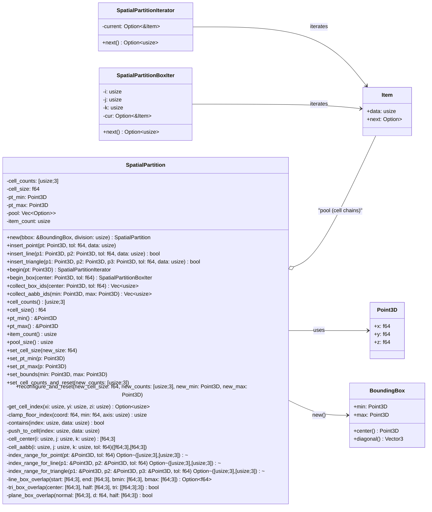

# SpatialPartition — Design & API Guide

> 균일 3D 격자(Uniform Grid) 위에 포인트/선분/삼각형을 **빠르게 삽입하고**, 셀 단위로 **후보 집합을 질의**하기 위한 경량 공간 파티셔너.
> 여기 문서는 구현 의도, 설계, 수학적 배경, 그리고 **함수별 상세 설명**을 담습니다. 

---

## 0) 구조도



## 1) 핵심 아이디어

- 전체 공간을 같은 크기의 `cell_size`를 갖는 3D 격자로 나눕니다.
- 각 셀은 **싱글 링크드리스트**로 아이템들을 보관합니다. 아이템은 단순히 `data: usize`(혹은 핸들)만 들고 있습니다.
- 삽입 시, **해당 지오메트리(AABB 확장 포함)가 커버하는 셀 범위를 계산**하고, 교차 테스트(포인트/선분/삼각형 vs AABB)를 통과하는 셀에 `data`를 추가합니다.
- 질의는 보통 “특정 셀” 또는 “여러 셀 박스 범위”에서 아이템들을 모으는 방식으로 이뤄집니다.

---

## 2) 자료구조 개요

```rust
#[derive(Debug)]
struct Item {
    data: usize,
    next: Option<Box<Item>>,
}

pub struct SpatialPartition {
    cell_counts: [usize; 3], // 각 축의 셀 개수
    cell_size: f64,          // 모든 축에서 동일
    pt_min: Point3D,         // 그리드 전체 최소 코너
    pt_max: Point3D,         // 그리드 전체 최대 코너

    pool: Vec<Option<Box<Item>>>, // 셀 헤드 체인 (cell -> Item linked-list head)
    item_count: usize,
}
```

---

## 3) 그리드 구성: `new(bbox, division)`

**의미와 순서**
1. `division`을 홀수로 보정 → 중심을 기준으로 좌우/상하/전후 대칭 셀 배치.
2. `bbox.diagonal().length()`를 기준으로 약간 확대(`margin=0.1%`)하여 외곽 여유.
3. `cell_size = max_dist / division`.
4. 각 축 길이를 `cell_size`로 나눠 `cell_counts`를 구하고, 마찬가지로 홀수로 보정.
5. `pt_min/pt_max`는 **중심 정렬**로 계산: `center - 0.5*cell_size*cell_counts` … `+` …

> 홀수 셀 수를 유지하면, **정중앙에 정확히 셀 중심이 오도록** 설계할 수 있어 수학적으로 직관적이며, 디버깅이 쉬워집니다.

---

## 4) 인덱싱 수학

### 4.1 셀 인덱스 → 풀 인덱스
```rust
fn get_cell_index(&self, xi: usize, yi: usize, zi: usize) -> Option<usize> {
    if xi >= self.cell_counts[0] || yi >= self.cell_counts[1] || zi >= self.cell_counts[2] {
        return None;
    }
    Some((xi * self.cell_counts[1] + yi) * self.cell_counts[2] + zi)
}
```

### 4.2 좌표 → 셀 인덱스 (클램프 필수)
```rust
fn clamp_floor_index(&self, coord: f64, min: f64, axis: usize) -> usize {
    let rel = (coord - min) / self.cell_size;
    let raw = rel.floor();
    if raw.is_nan() { return 0; }
    if raw <= 0.0 { return 0; }
    let idx = raw as isize;
    let max_i = self.cell_counts[axis] as isize - 1;
    if idx > max_i { max_i as usize } else { idx as usize }
}
```

> **왜 `clamp`가 필요한가?** 음수 좌표 또는 범위 밖 좌표를 그냥 `as usize`로 캐스팅하면 **큰 양수**로 바뀌어 인덱스 에러가 발생합니다. 반드시 0…count-1에 **클램프**하세요.

---

## 5) 교차 테스트(Overlap Tests)

### 5.1 선분 vs AABB (`line_box_overlap` — Slab 방식)
- 각 축(`x,y,z`)에 대해 파라미터 범위를 잘라 나가며, 누적 교집합 `[fst, fet]`이 비면 교차 없음.
- C++의 **슬랩 교차 테스트**와 동일한 원리.

```rust
fn line_box_overlap(start: [f64;3], end: [f64;3], bmin: [f64;3], bmax: [f64;3]) -> Option<f64> {
    let mut fst = 0.0; let mut fet = 1.0;
    for ax in 0..3 {
        let si = start[ax]; let ei = end[ax]; let di = ei - si;
        if di.abs() < f64::EPSILON {
            if si < bmin[ax] || si > bmax[ax] { return None; }
            continue;
        }
        let (st, et) = if si < ei {
            if si > bmax[ax] || ei < bmin[ax] { return None; }
            (if si < bmin[ax] {(bmin[ax]-si)/di} else {0.0},
             if ei > bmax[ax] {(bmax[ax]-si)/di} else {1.0})
        } else {
            if ei > bmax[ax] || si < bmin[ax] { return None; }
            (if si > bmax[ax] {(bmax[ax]-si)/di} else {0.0},
             if ei < bmin[ax] {(bmin[ax]-si)/di} else {1.0})
        };
        if st > fst { fst = st; }
        if et < fet { fet = et; }
        if fet < fst { return None; }
    }
    Some(fst)
}
```

### 5.2 삼각형 vs AABB (`tri_box_overlap` — SAT 방식)
- **Separation Axis Theorem**: 분리축이 존재하면 교차하지 않음.
- 테스트 순서
  1) 9개 축: `(각 triangle edge) × (AABB의 x,y,z 축)`
  2) 3개 축: AABB 자체 축(X, Y, Z) — 사실상 삼각형 AABB vs 박스 AABB
  3) 1개 축: 삼각형 평면 법선 (평면-박스 겹침)

> `tol`을 허용하기 위해 박스 **half-size**에 `+ tol`을 더하거나, 셀 AABB를 `±tol`로 확장합니다.

---

## 6) 삽입 연산

### 6.1 `insert_point(pt, tol, data)`
- `(pt ± tol)` 박스를 덮는 셀 인덱스 범위 계산 → 범위 내부 전 셀에 대해 `contains` 확인 후 미존재 시 체인 머리에 삽입.

복잡도: 셀 개수에 비례(보통 매우 작음).

### 6.2 `insert_line(p1, p2, tol, data)`
- `index_range_for_line`로 AABB 범위를 구한 뒤, 각 셀의 확장 AABB(`±tol`)와 **슬랩 교차**를 검사합니다.
- 통과 시 `data` 삽입.

복잡도: 커버 셀 수 × 슬랩 테스트. (슬랩은 상수 시간)

### 6.3 `insert_triangle(p1, p2, p3, tol, data)`
- `index_range_for_triangle`로 AABB 범위를 구하고, 각 셀 중심/half-size로 구성된 박스와 **SAT 테스트**를 수행합니다.
- 통과 시 `data` 삽입.

복잡도: 커버 셀 수 × SAT(상수 시간; 약간 더 무겁지만 여전히 빠름).

---

## 7) 질의(Queries)

### 7.1 단일 셀 이터레이터: `begin(pt) -> SpatialPartitionIterator`
- `pt`가 속한 **하나의 셀 체인**만 순회합니다.
- C++의 `begin(point)` 패턴과 동일.

```rust
pub fn begin(&self, pt: Point3D) -> SpatialPartitionIterator<'_> { /* ... */ }
```

### 7.2 여러 셀 이터레이터: `begin_box(center, tol) -> SpatialPartitionBoxIter`
- `center ± tol` 정방형 박스를 덮는 **여러 셀**을 순회합니다.
- 내부적으로 3중 for 인덱스를 보유하고, **빈 셀은 건너뛰고 다음 비어있지 않은 셀의 체인**부터 이어서 제공합니다.

```rust
pub fn begin_box(&self, center: Point3D, tol: f64) -> SpatialPartitionBoxIter<'_> { /* ... */ }
```

#### ▷ *왜 이터레이터를 썼나?*
1. **게으른(lazy) 순회**: 필요한 만큼만 뽑아서 사용 → 메모리/시간 절약.
2. **표준 Iterator 어댑터** 활용: `take(n)`, `any`, `filter`, `collect` 등과 자연스럽게 결합.
3. 기존 `begin(pt)`와 **API 일관성**: “시작점에서 순회한다”는 패러다임 유지.

> 단, 프로젝트 취향에 따라 이터레이터 대신 **즉시 수집 API**를 써도 무방합니다.

### 7.3 즉시 수집 API (이터레이터 없이)
- `collect_box_ids(center, tol) -> Vec<usize>`: **중복 제거** 후 정렬해 반환.
- `collect_aabb_ids(min, max) -> Vec<usize>`: AABB 범위 기반 수집.
- `for_each_in_box(center, tol, f: FnMut(usize))`: 중복 제거 없이 콜백 실행.

이 방식은 **프라이빗 필드 접근 없이** 외부 테스트나 호출부에서 쓰기 쉽고, 단순합니다.

---

## 8) 중복 방지

### 8.1 기본: 선형 `contains(index, data)`
- 셀 체인을 선형 탐색.
- 보통 셀 당 원소 수가 적어서 충분히 빠름.

### 8.2 대용량 최적화(선택)
- **stamp(visit id)**: `Vec<u32>`에 마지막 방문 프레임 기록 → O(1) 중복 체크.
- `HashSet<usize>` per cell: 데이터가 아주 많고 변동이 잦지 않은 경우 고려.

---

## 9) 성능 & 메모리

- **Box<Item> 체인**: 구현 단순, 할당 많음, 캐시 비우호적.
- **슬랩(`Vec<Node>` + `Option<usize>`) 체인**: 구현 조금 복잡, 할당 적음, 캐시 우호적 → **추천**.
- **cell_size/ division**: 너무 작으면 메모리/삽입 비용 증가, 너무 크면 후보 집합이 비대해짐. 도메인 스케일에 맞게 조정.
- `tol`: 교차 허용 오차. 삽입 시 박스 확장 또는 half-size 확장으로 반영.

---

## 10) 엣지 케이스 & 안전성 체크리스트

- **인덱스 클램프**: 음수/범위 밖 좌표는 반드시 0…count-1로 클램프.
- **빈 범위**: `start > end`인 축이 하나라도 있으면 **바로 리턴**.
- **NaN**: 좌표/길이에서 NaN 발생 시 0으로 처리하거나 해당 항목 스킵.
- **퇴화 기하**: 길이 0 선분, 면적 0 삼각형 → 삽입 전 필터링 권장.
- **큰 tol**: 과도한 확장은 후보 과다. 알고리즘 문제라기보다 파라미터 선택 이슈.

---

## 11) 함수별 요약 표

| 함수 | 역할 | 주의/비고 |
|---|---|---|
| `new(bbox, division)` | 격자 생성, 홀수 셀 수/여유 마진 반영 | division은 내부적으로 홀수화 |
| `get_cell_index(x,y,z)` | 3D 인덱스 → 풀 인덱스 | 범위 체크 |
| `clamp_floor_index(coord, min, axis)` | 좌표 → 셀 인덱스(클램프) | **반드시** 사용 (음수/범위 밖 보호) |
| `cell_center(i,j,k)` | 셀 중심 좌표 | SAT에서 박스 센터 제공 |
| `cell_aabb(i,j,k,tol)` | 셀 AABB(±tol) | 선분 교차용 |
| `index_range_for_point/line/triangle` | 커버 인덱스 범위 계산 | `s>e`면 None |
| `contains(index, data)` | 셀 체인 중복 검사 | 선형 탐색 |
| `push_to_cell(index, data)` | 셀 헤드에 삽입 | O(1) |
| `insert_point(pt, tol, data)` | 포인트 삽입 | 작은 범위 |
| `insert_line(a, b, tol, data)` | 선분 삽입(슬랩 교차) | 커버 셀 × O(1) |
| `insert_triangle(a,b,c,tol,data)` | 삼각형 삽입(SAT 교차) | 커버 셀 × O(1) |
| `line_box_overlap(...)` | 선분–AABB 교차 | 슬랩 방식 |
| `tri_box_overlap(...)` | 삼각형–AABB 교차 | SAT: 9+3+1 축 |
| `plane_box_overlap(...)` | 평면–AABB 교차 | SAT 일부 |
| `begin(pt)` | 단일 셀 이터레이터 | 기존 `begin` 패턴 |
| `begin_box(center,tol)` | 다중 셀 이터레이터 | **iterator 사용 이유** 참고 |
| `collect_box_ids(center,tol)` | 즉시 수집, 중복제거 | 외부 테스트/사용에 편리 |
| `collect_aabb_ids(min,max)` | 즉시 수집, 중복제거 | FindBox 스타일 |
| `for_each_in_box(center,tol,f)` | 콜백 순회 | 중복 제거는 호출측에서 |

---

## 12) 간단 사용 예

```rust
let bbox = BoundingBox::new(Point3D{x:0.0,y:0.0,z:0.0}, Point3D{x:10.0,y:10.0,z:10.0});
let mut sp = SpatialPartition::new(&bbox, 9);

// 삽입
sp.insert_point(Point3D{x:1.2,y:1.3,z:1.4}, 0.05, 42);
sp.insert_line(Point3D{x:0.2,y:0.2,z:0.2}, Point3D{x:6.8,y:0.2,z:0.2}, 0.0, 111);
sp.insert_triangle(
    Point3D{x:3.0,y:3.0,z:1.0},
    Point3D{x:7.0,y:3.5,z:1.0},
    Point3D{x:4.0,y:7.5,z:1.0},
    0.0,
    999);

// 질의 1) 단일 셀
let here = Point3D{x:1.2,y:1.3,z:1.4};
for id in sp.begin(here) {
    println!("id in this cell: {id}");
}

// 질의 2) 박스(정방형 반경 tol)
let ids = sp.collect_box_ids(Point3D{x:3.5,y:3.7,z:1.0}, 2.0);
println!("ids near box: {ids:?}");
```

---

## 13) C++ → Rust 이식 팁

- C++ 매크로(`SUB`, `CROSS`, `DOT`, `FINDMINMAX`)는 **짧은 헬퍼 함수**로 치환.
- float → f64로 올려 수치 안전성 확보(필요 시 f32로 낮춰도 무방).
- 음수 캐스팅/오버플로 같은 **UB 가능성**을 전부 `clamp`로 제거.
- 외부 테스트에서는 **프라이빗 필드 접근을 지양**하고 공개 API(`collect_*`, `begin_*`)를 사용.

---

## 14) 마무리

이 구조는 **간단하지만 강력**합니다.  
빠른 후보 수집이 핵심인 충돌 감지/근접 질의/메시-프루닝에 적합하고,  
필요에 따라 슬랩 아레나/스탬프 방식/모튼 인덱싱 등으로 점진적 최적화가 가능합니다.    
사용 패턴에 맞춰 `iterator`와 `즉시 수집` API를 병행 제공하는 것을 권합니다.  


----

## 소스 코드
```rust
use std::collections::HashSet;
use crate::math::boundingbox::BoundingBox;
use crate::math::prelude::Point3D;

#[derive(Debug)]
struct Item {
    data: usize,
    next: Option<Box<Item>>,
}

pub struct SpatialPartition {
    cell_counts: [usize; 3],
    cell_size: f64,
    pt_min: Point3D,
    pt_max: Point3D,
    pool: Vec<Option<Box<Item>>>,
    item_count: usize,
}


impl SpatialPartition {
    // --------------------
    // Getters (읽기)
    // --------------------

    /// 각 축(x,y,z)의 셀 개수
    #[inline]
    pub fn cell_counts(&self) -> [usize; 3] {
        self.cell_counts
    }

    /// 셀 한 변의 길이
    #[inline]
    pub fn cell_size(&self) -> f64 {
        self.cell_size
    }

    #[inline]
    pub fn pt_min(&self) -> &Point3D {
        &self.pt_min
    }

    #[inline]
    pub fn pt_max(&self) -> &Point3D {
        &self.pt_max
    }

    #[inline]
    pub fn item_count(&self) -> usize {
        self.item_count
    }

    /// 전체 셀 개수 (pool 크기)
    #[inline]
    pub fn pool_size(&self) -> usize {
        self.pool.len()
    }

    #[inline]
    pub fn set_pt_min(&mut self, p: Point3D) {
        self.pt_min = p;
    }

    /// 그리드 최대 코너 설정 (주의: 인덱싱 기준이 바뀝니다)
    #[inline]
    pub fn set_pt_max(&mut self, p: Point3D) {
        self.pt_max = p;
    }

    #[inline]
    pub fn set_bounds(&mut self, min: Point3D, max: Point3D) {
        self.pt_min = min;
        self.pt_max = max;
    }

}


pub struct SpatialPartitionBoxIter<'a> {
    part: &'a SpatialPartition,
    s: [usize; 3],
    e: [usize; 3],
    i: usize,
    j: usize,
    k: usize,
    cur: Option<&'a Item>,
}

impl<'a> SpatialPartitionBoxIter<'a> {
    fn new(part: &'a SpatialPartition, s: [usize;3], e: [usize;3]) -> Self {
        let mut it = Self {
            part, s, e,
            i: s[0], j: s[1], k: s[2],
            cur: None,
        };
        it.advance_to_next_nonempty_cell();
        it
    }

    fn advance_to_next_nonempty_cell(&mut self) {
        loop {
            if self.i > self.e[0] { self.cur = None; return; }
            if self.j > self.e[1] { self.i += 1; self.j = self.s[1]; continue; }
            if self.k > self.e[2] { self.j += 1; self.k = self.s[2]; continue; }

            if let Some(cell) = self.part.get_cell_index(self.i, self.j, self.k) {
                self.cur = self.part.pool[cell].as_deref();
                self.k += 1;
                if self.cur.is_some() { return; }
            } else {
                self.k += 1;
            }
        }
    }
}

impl<'a> Iterator for SpatialPartitionBoxIter<'a> {
    type Item = usize;
    fn next(&mut self) -> Option<Self::Item> {
        if let Some(node) = self.cur {
            self.cur = node.next.as_deref();
            Some(node.data)
        } else {
            self.advance_to_next_nonempty_cell();
            if let Some(node) = self.cur {
                self.cur = node.next.as_deref();
                Some(node.data)
            } else {
                None
            }
        }
    }
}
impl SpatialPartition {
    pub fn new(bbox: &BoundingBox, division: usize) -> Self {
        let mut div = if division % 2 == 0 { division + 1 } else { division };
        let mut max_dist = bbox.diagonal().length();
        max_dist += max_dist * 0.001;

        let cell_size = max_dist / div as f64;

        let mut cell_counts = [0usize; 3];
        for i in 0..3 {
            let dist = bbox.max[i] - bbox.min[i];
            let expanded = dist + max_dist * 0.001;
            let count = (expanded / cell_size).ceil() as usize;
            cell_counts[i] = if count % 2 == 0 { count + 1 } else { count };
        }

        let center = bbox.center();
        let pt_min = Point3D::new(
            center.x - cell_size * cell_counts[0] as f64 * 0.5,
            center.y - cell_size * cell_counts[1] as f64 * 0.5,
            center.z - cell_size * cell_counts[2] as f64 * 0.5,
        );
        let pt_max = Point3D::new(
            pt_min.x + cell_size * cell_counts[0] as f64,
            pt_min.y + cell_size * cell_counts[1] as f64,
            pt_min.z + cell_size * cell_counts[2] as f64,
        );

        let pool_size = cell_counts[0] * cell_counts[1] * cell_counts[2];

        let mut pool = Vec::with_capacity(pool_size);
        pool.resize_with(pool_size, || None);

        Self {
            cell_counts,
            cell_size,
            pt_min,
            pt_max,
            pool,
            item_count: 0,
        }
    }


}

impl SpatialPartition {

    #[inline] fn dot(a: [f64;3], b: [f64;3]) -> f64 { a[0]*b[0] + a[1]*b[1] + a[2]*b[2] }
    #[inline] fn cross(a: [f64;3], b: [f64;3]) -> [f64;3] {
        [ a[1]*b[2] - a[2]*b[1],
            a[2]*b[0] - a[0]*b[2],
            a[0]*b[1] - a[1]*b[0] ]
    }
    #[inline] fn sub(a: [f64;3], b: [f64;3]) -> [f64;3] { [a[0]-b[0], a[1]-b[1], a[2]-b[2]] }

    pub fn get_cell_index(&self, xi: usize, yi: usize, zi: usize) -> Option<usize> {
        if xi >= self.cell_counts[0] || yi >= self.cell_counts[1] || zi >= self.cell_counts[2] {
            return None;
        }
        Some((xi * self.cell_counts[1] + yi) * self.cell_counts[2] + zi)
    }

    fn floor_index(&self, coord: f64, min: f64) -> usize {
        ((coord - min) / self.cell_size).floor() as usize
    }

    #[inline]
    fn cell_center(&self, i: usize, j: usize, k: usize) -> [f64;3] {
        let h = self.cell_size * 0.5;
        [
            i as f64 * self.cell_size + h + self.pt_min.x,
            j as f64 * self.cell_size + h + self.pt_min.y,
            k as f64 * self.cell_size + h + self.pt_min.z,
        ]
    }

    #[inline]
    fn cell_aabb(&self, i: usize, j: usize, k: usize, tol: f64) -> ([f64;3], [f64;3]) {
        let min = [
            i as f64 * self.cell_size + self.pt_min.x - tol,
            j as f64 * self.cell_size + self.pt_min.y - tol,
            k as f64 * self.cell_size + self.pt_min.z - tol,
        ];
        let max = [
            (i+1) as f64 * self.cell_size + self.pt_min.x + tol,
            (j+1) as f64 * self.cell_size + self.pt_min.y + tol,
            (k+1) as f64 * self.cell_size + self.pt_min.z + tol,
        ];
        (min, max)
    }

    #[inline]
    pub fn clamp_floor_index(&self, coord: f64, min: f64, axis: usize) -> usize {
        // 좌표를 셀 인덱스로 변환하되 0..=cell_counts[axis]-1 로 클램프
        let rel = (coord - min) / self.cell_size;
        let raw = rel.floor();
        if raw.is_nan() {
            return 0;
        }
        if raw <= 0.0 {
            return 0;
        }
        let idx = raw as isize;
        let max_i = self.cell_counts[axis] as isize - 1;
        if idx > max_i { max_i as usize } else { idx as usize }
    }

    fn index_range_for_point(&self, pt: &Point3D, tol: f64) -> Option<([usize;3],[usize;3])> {
        let s = [
            self.clamp_floor_index(pt.x - tol, self.pt_min.x, 0),
            self.clamp_floor_index(pt.y - tol, self.pt_min.y, 1),
            self.clamp_floor_index(pt.z - tol, self.pt_min.z, 2),
        ];
        let e = [
            self.clamp_floor_index(pt.x + tol, self.pt_min.x, 0),
            self.clamp_floor_index(pt.y + tol, self.pt_min.y, 1),
            self.clamp_floor_index(pt.z + tol, self.pt_min.z, 2),
        ];
        if s[0] > e[0] || s[1] > e[1] || s[2] > e[2] { return None; }
        Some((s,e))
    }

    /// 두 점 pt1, pt2에 대해 포함 AABB 인덱스 범위 (C++ GetBoxIndexByLine 과 동일 의도)
    fn index_range_for_line(&self, p1: &Point3D, p2: &Point3D, tol: f64) -> Option<([usize;3],[usize;3])> {
        let minp = [p1.x.min(p2.x)-tol, p1.y.min(p2.y)-tol, p1.z.min(p2.z)-tol];
        let maxp = [p1.x.max(p2.x)+tol, p1.y.max(p2.y)+tol, p1.z.max(p2.z)+tol];
        let s = [
            self.clamp_floor_index(minp[0], self.pt_min.x, 0),
            self.clamp_floor_index(minp[1], self.pt_min.y, 1),
            self.clamp_floor_index(minp[2], self.pt_min.z, 2),
        ];
        let e = [
            self.clamp_floor_index(maxp[0], self.pt_min.x, 0),
            self.clamp_floor_index(maxp[1], self.pt_min.y, 1),
            self.clamp_floor_index(maxp[2], self.pt_min.z, 2),
        ];
        if s[0] > e[0] || s[1] > e[1] || s[2] > e[2] { return None; }
        Some((s,e))
    }

    /// 세 점 pt1,2,3에 대해 포함 AABB 인덱스 범위 (C++ GetBoxIndexByTriangle 과 동일 의도)
    fn index_range_for_triangle(&self, p1: &Point3D, p2: &Point3D, p3: &Point3D, tol: f64) -> Option<([usize;3],[usize;3])> {
        let min_p = [
            p1.x.min(p2.x).min(p3.x) - tol,
            p1.y.min(p2.y).min(p3.y) - tol,
            p1.z.min(p2.z).min(p3.z) - tol,
        ];
        let max_p = [
            p1.x.max(p2.x).max(p3.x) + tol,
            p1.y.max(p2.y).max(p3.y) + tol,
            p1.z.max(p2.z).max(p3.z) + tol,
        ];
        let s = [
            self.clamp_floor_index(min_p[0], self.pt_min.x, 0),
            self.clamp_floor_index(min_p[1], self.pt_min.y, 1),
            self.clamp_floor_index(min_p[2], self.pt_min.z, 2),
        ];
        let e = [
            self.clamp_floor_index(max_p[0], self.pt_min.x, 0),
            self.clamp_floor_index(max_p[1], self.pt_min.y, 1),
            self.clamp_floor_index(max_p[2], self.pt_min.z, 2),
        ];
        if s[0] > e[0] || s[1] > e[1] || s[2] > e[2] { return None; }
        Some((s,e))
    }

    fn line_box_overlap(start: [f64;3], end: [f64;3], bmin: [f64;3], bmax: [f64;3]) -> Option<f64> {
        let mut fst = 0.0;
        let mut fet = 1.0;
        for ax in 0..3 {
            let si = start[ax];
            let ei = end[ax];
            let di = ei - si;

            if di.abs() < f64::EPSILON {
                if si < bmin[ax] || si > bmax[ax] { return None; }
                continue;
            }

            let mut st;
            let mut et;
            if si < ei {
                if si > bmax[ax] || ei < bmin[ax] { return None; }
                st = if si < bmin[ax] {(bmin[ax]-si)/di} else {0.0};
                et = if ei > bmax[ax] {(bmax[ax]-si)/di} else {1.0};
            } else {
                if ei > bmax[ax] || si < bmin[ax] { return None; }
                st = if si > bmax[ax] {(bmax[ax]-si)/di} else {0.0};
                et = if ei < bmin[ax] {(bmin[ax]-si)/di} else {1.0};
            }

            if st > fst { fst = st; }
            if et < fet { fet = et; }
            if fet < fst { return None; }
        }
        Some(fst)
    }

    /// 평면–AABB overlap 테스트 보조
    fn plane_box_overlap(normal: [f64;3], d: f64, half: [f64;3]) -> bool {
        let mut vmin = [0.0;3];
        let mut vmax = [0.0;3];
        for q in 0..3 {
            if normal[q] > 0.0 {
                vmin[q] = -half[q];
                vmax[q] =  half[q];
            } else {
                vmin[q] =  half[q];
                vmax[q] = -half[q];
            }
        }
        let dn1 = Self::dot(normal, vmin) + d;
        if dn1 > 0.0 { return false; }
        let dn2 = Self::dot(normal, vmax) + d;
        dn2 >= 0.0
    }

    /// 삼각형 vs AABB (Separation Axis Theorem)
    fn tri_box_overlap(box_center: [f64;3], box_half: [f64;3], tri: [[f64;3];3]) -> bool {
        // 삼각형 정점 box 중심 기준으로 이동
        let v0 = Self::sub(tri[0], box_center);
        let v1 = Self::sub(tri[1], box_center);
        let v2 = Self::sub(tri[2], box_center);

        let e0 = Self::sub(v1, v0);
        let e1 = Self::sub(v2, v1);
        let e2 = Self::sub(v0, v2);

        // 9개 축(각 edge x {X,Y,Z})
        let fe0 = [e0[0].abs(), e0[1].abs(), e0[2].abs()];
        let fe1 = [e1[0].abs(), e1[1].abs(), e1[2].abs()];
        let fe2 = [e2[0].abs(), e2[1].abs(), e2[2].abs()];

        // 헬퍼: 프로젝션 범위 테스트
        let mut axis_test = |a: f64, b: f64, va: [f64;3], vb: [f64;3], fa: f64, fb: f64, i0: usize, i1: usize| -> bool {
            let p0 = a*va[i0] - b*va[i1];
            let p1 = a*vb[i0] - b*vb[i1];
            let (minp, maxp) = if p0 < p1 {(p0,p1)} else {(p1,p0)};
            let rad = fa*box_half[i0] + fb*box_half[i1];
            !(minp > rad || maxp < -rad)
        };

        // X축 관련 (i0=1(Y), i1=2(Z))
        if !axis_test(e0[2], e0[1], v0, v2, fe0[2], fe0[1], 1, 2) { return false; }
        if !axis_test(e1[2], e1[1], v0, v1, fe1[2], fe1[1], 1, 2) { return false; }
        if !axis_test(e2[2], e2[1], v0, v1, fe2[2], fe2[1], 1, 2) { return false; }

        // Y축 관련 (i0=0(X), i1=2(Z)) ; 부호 주의
        let mut axis_test_y = |a: f64, b: f64, va: [f64;3], vb: [f64;3], fa: f64, fb: f64| -> bool {
            let p0 = -a*va[0] + b*va[2];
            let p1 = -a*vb[0] + b*vb[2];
            let (minp, maxp) = if p0 < p1 {(p0,p1)} else {(p1,p0)};
            let rad = fa*box_half[0] + fb*box_half[2];
            !(minp > rad || maxp < -rad)
        };
        if !axis_test_y(e0[2], e0[0], v0, v2, fe0[2], fe0[0]) { return false; }
        if !axis_test_y(e1[2], e1[0], v0, v1, fe1[2], fe1[0]) { return false; }
        if !axis_test_y(e2[2], e2[0], v0, v2, fe2[2], fe2[0]) { return false; }

        // Z축 관련 (i0=0(X), i1=1(Y))
        let mut axis_test_z = |a: f64, b: f64, va: [f64;3], vb: [f64;3], fa: f64, fb: f64| -> bool {
            let p0 = a*va[0] - b*va[1];
            let p1 = a*vb[0] - b*vb[1];
            let (minp, maxp) = if p0 < p1 {(p0,p1)} else {(p1,p0)};
            let rad = fa*box_half[0] + fb*box_half[1];
            !(minp > rad || maxp < -rad)
        };
        if !axis_test_z(e0[1], e0[0], v1, v2, fe0[1], fe0[0]) { return false; }
        if !axis_test_z(e1[1], e1[0], v0, v1, fe1[1], fe1[0]) { return false; }
        if !axis_test_z(e2[1], e2[0], v0, v1, fe2[1], fe2[0]) { return false; }

        // AABB 축(X/Y/Z)
        let mut minmax = |a: f64, b: f64, c: f64| -> (f64,f64) {
            let mut minv = a; let mut maxv = a;
            if b < minv { minv = b; } if b > maxv { maxv = b; }
            if c < minv { minv = c; } if c > maxv { maxv = c; }
            (minv, maxv)
        };
        let (minx, maxx) = minmax(v0[0], v1[0], v2[0]);
        if minx > box_half[0] || maxx < -box_half[0] { return false; }
        let (miny, maxy) = minmax(v0[1], v1[1], v2[1]);
        if miny > box_half[1] || maxy < -box_half[1] { return false; }
        let (minz, maxz) = minmax(v0[2], v1[2], v2[2]);
        if minz > box_half[2] || maxz < -box_half[2] { return false; }

        // 평면 vs AABB
        let n = Self::cross(e0, e1);
        let d = -Self::dot(n, v0);
        if !Self::plane_box_overlap(n, d, box_half) { return false; }

        true
    }

    pub fn begin_box(&self, center: Point3D, tol: f64) -> SpatialPartitionBoxIter<'_> {
        // 인덱스 범위 계산 (clamp 포함)
        let s = [
            self.clamp_floor_index(center.x - tol, self.pt_min.x, 0),
            self.clamp_floor_index(center.y - tol, self.pt_min.y, 1),
            self.clamp_floor_index(center.z - tol, self.pt_min.z, 2),
        ];
        let e = [
            self.clamp_floor_index(center.x + tol, self.pt_min.x, 0),
            self.clamp_floor_index(center.y + tol, self.pt_min.y, 1),
            self.clamp_floor_index(center.z + tol, self.pt_min.z, 2),
        ];
        SpatialPartitionBoxIter::new(self, s, e)
    }

    pub fn collect_box_ids(&self, center: Point3D, tol: f64) -> Vec<usize> {
        let s = [
            self.clamp_floor_index(center.x - tol, self.pt_min.x, 0),
            self.clamp_floor_index(center.y - tol, self.pt_min.y, 1),
            self.clamp_floor_index(center.z - tol, self.pt_min.z, 2),
        ];
        let e = [
            self.clamp_floor_index(center.x + tol, self.pt_min.x, 0),
            self.clamp_floor_index(center.y + tol, self.pt_min.y, 1),
            self.clamp_floor_index(center.z + tol, self.pt_min.z, 2),
        ];
        let mut set = HashSet::new();
        for i in s[0]..=e[0] {
            for j in s[1]..=e[1] {
                for k in s[2]..=e[2] {
                    if let Some(cell) = self.get_cell_index(i, j, k) {
                        let mut cur = self.pool[cell].as_deref();
                        while let Some(node) = cur {
                            set.insert(node.data);
                            cur = node.next.as_deref();
                        }
                    }
                }
            }
        }
        let mut out: Vec<_> = set.into_iter().collect();
        out.sort_unstable();
        out
    }
}

impl SpatialPartition {
    pub fn insert_point(&mut self, pt: Point3D, tol: f64, data: usize) {
        let s = [
            self.floor_index(pt.x - tol, self.pt_min.x),
            self.floor_index(pt.y - tol, self.pt_min.y),
            self.floor_index(pt.z - tol, self.pt_min.z),
        ];
        let e = [
            self.floor_index(pt.x + tol, self.pt_min.x),
            self.floor_index(pt.y + tol, self.pt_min.y),
            self.floor_index(pt.z + tol, self.pt_min.z),
        ];

        for i in s[0]..=e[0].min(self.cell_counts[0] - 1) {
            for j in s[1]..=e[1].min(self.cell_counts[1] - 1) {
                for k in s[2]..=e[2].min(self.cell_counts[2] - 1) {
                    if let Some(index) = self.get_cell_index(i, j, k) {
                        if !self.contains(index, data) {
                            let new_item = Box::new(Item {
                                data,
                                next: self.pool[index].take(),
                            });
                            self.pool[index] = Some(new_item);
                            self.item_count += 1;
                        }
                    }
                }
            }
        }
    }

    fn contains(&self, index: usize, data: usize) -> bool {
        let mut current = self.pool[index].as_ref();
        while let Some(item) = current {
            if item.data == data {
                return true;
            }
            current = item.next.as_ref();
        }
        false
    }

    pub fn insert_line(&mut self, pt1: Point3D, pt2: Point3D, tol: f64, data: usize) -> bool {
        let Some((s,e)) = self.index_range_for_line(&pt1, &pt2, tol) else { return false; };

        let a = [pt1.x, pt1.y, pt1.z];
        let b = [pt2.x, pt2.y, pt2.z];

        for i in s[0]..=e[0] {
            for j in s[1]..=e[1] {
                for k in s[2]..=e[2] {
                    if let Some(cell) = self.get_cell_index(i,j,k) {
                        let (bmin, bmax) = self.cell_aabb(i,j,k, tol);
                        if Self::line_box_overlap(a, b, bmin, bmax).is_some() {
                            if !self.contains(cell, data) {
                                self.push_to_cell(cell, data);
                            }
                        }
                    }
                }
            }
        }
        true
    }
    #[inline]
    fn push_to_cell(&mut self, index: usize, data: usize) {
        // 셀 헤드에 새 노드를 스택처럼 붙임
        let new_item = Box::new(Item {
            data,
            next: self.pool[index].take(),
        });
        self.pool[index] = Some(new_item);
        self.item_count += 1;
    }

    /// 삼각형 삽입: (pt1, pt2, pt3, tol)와 교차하는 모든 셀에 data 추가
    pub fn insert_triangle(&mut self, pt1: Point3D, pt2: Point3D, pt3: Point3D, tol: f64, data: usize) -> bool {
        let Some((s,e)) = self.index_range_for_triangle(&pt1, &pt2, &pt3, tol) else { return false; };

        let tri = [
            [pt1.x, pt1.y, pt1.z],
            [pt2.x, pt2.y, pt2.z],
            [pt3.x, pt3.y, pt3.z],
        ];
        let half = [self.cell_size*0.5 + tol, self.cell_size*0.5 + tol, self.cell_size*0.5 + tol];

        for i in s[0]..=e[0] {
            for j in s[1]..=e[1] {
                for k in s[2]..=e[2] {
                    if let Some(cell) = self.get_cell_index(i,j,k) {
                        let center = self.cell_center(i,j,k);
                        if Self::tri_box_overlap(center, half, tri) {
                            if !self.contains(cell, data) {
                                self.push_to_cell(cell, data);
                            }
                        }
                    }
                }
            }
        }
        true
    }
}

pub struct SpatialPartitionIterator<'a> {
    current: Option<&'a Item>,
}

impl<'a> Iterator for SpatialPartitionIterator<'a> {
    type Item = usize;

    fn next(&mut self) -> Option<Self::Item> {
        if let Some(item) = self.current {
            self.current = item.next.as_deref();
            Some(item.data)
        } else {
            None
        }
    }
}

impl SpatialPartition {
    pub fn begin(&self, pt: Point3D) -> SpatialPartitionIterator {
        let xi = self.floor_index(pt.x, self.pt_min.x);
        let yi = self.floor_index(pt.y, self.pt_min.y);
        let zi = self.floor_index(pt.z, self.pt_min.z);

        if let Some(index) = self.get_cell_index(xi, yi, zi) {
            SpatialPartitionIterator {
                current: self.pool[index].as_deref(),
            }
        } else {
            SpatialPartitionIterator { current: None }
        }
    }
}
```

## 테스트 코드
```rust
#[cfg(test)]
mod tests {
    use geometry::core::spatial_partition::SpatialPartition;
    use geometry::math::boundingbox::BoundingBox;
    use geometry::math::prelude::Point3D;
    use geometry::mesh::mesh::MeshFace;

    //✅ 1. 삼각형 면 유효성 테스트
    #[test]
    fn test_mesh_face_validity() {
        let face = MeshFace::new_tri(0, 1, 2);
        assert!(face.is_triangle());
        assert!(face.is_valid(10));

        let invalid_face = MeshFace::new_tri(1, 1, 2);
        assert!(!invalid_face.is_valid(10));
    }

    //✅ 2. BoundingBox 포함 테스트
    #[test]
    fn test_bbox_includes_point() {
        let bbox = BoundingBox::new(
            Point3D::new(0.0, 0.0, 0.0),
            Point3D::new(5.0, 5.0, 5.0),
        );
        let p_inside = Point3D::new(2.0, 2.0, 2.0);
        let p_outside = Point3D::new(6.0, 2.0, 2.0);

        assert!(bbox.includes_point(&p_inside, false));
        assert!(!bbox.includes_point(&p_outside, false));
    }

    //✅ 3. SpatialPartition 경계 테스트
    #[test]
    fn test_spatial_partition_bounds() {
        let bbox = BoundingBox::new(
            Point3D::new(-1.0, -1.0, -1.0),
            Point3D::new(1.0, 1.0, 1.0),
        );
        let sp = SpatialPartition::new(&bbox, 5);

        let pt = Point3D::new(0.0, 0.0, 0.0);
        let iter = sp.begin(pt);
        assert!(iter.count() == 0, "초기 상태에서는 데이터 없음");
    }
}


#[cfg(test)]
mod insert_triangle_tests {
    use std::collections::HashSet;
    use geometry::core::spatial_partition::SpatialPartition;
    use geometry::math::boundingbox::BoundingBox;
    use geometry::math::prelude::Point3D;

    // ---- 테스트 유틸 ----
    fn mk_pt(x: f64, y: f64, z: f64) -> Point3D {
        Point3D { x, y, z }
    }
    fn mk_bbox() -> BoundingBox {
        // 필요 시 당신 프로젝트의 API에 맞게 수정
        // (예: BoundingBox::from_min_max(min, max) 등)
        let min = mk_pt(0.0, 0.0, 0.0);
        let max = mk_pt(10.0, 10.0, 10.0);
        BoundingBox::new(min, max)
    }

    // begin_box()가 있다면 이걸 사용하고,
    // 없다면 아래 fallback 스캐너로 동일 동작 수행.
    fn collect_in_box(part: &SpatialPartition, center: Point3D, half: [f64; 3]) -> HashSet<usize> {
        let tol = half[0].max(half[1]).max(half[2]);
        part.collect_box_ids(center, tol).into_iter().collect()
    }

    #[test]
    fn insert_point_and_find_with_begin() {
        let bbox = mk_bbox();
        let mut sp = SpatialPartition::new(&bbox, 9);

        let p = mk_pt(1.2, 1.3, 1.4);
        let id = 42usize;
        sp.insert_point(p, 0.05, id);

        // 같은 셀에서 begin()으로 훑으면 id가 나와야 함
        let mut found = false;
        for got in sp.begin(p) {
            if got == id { found = true; break; }
        }
        assert!(found, "insert_point 한 데이터가 begin()에서 안 나옵니다");
    }

    #[test]
    fn duplicate_point_is_not_duplicated() {
        let bbox = mk_bbox();
        let mut sp = SpatialPartition::new(&bbox, 9);

        let p = mk_pt(2.0, 2.0, 2.0);
        let id = 7usize;

        // 첫 삽입
        let before = sp.item_count();
        sp.insert_point(p, 0.01, id);
        let after1 = sp.item_count();
        assert!(after1 > before, "첫 삽입 후 item_count 증가 필요");

        // 동일 포인트/아이디 재삽입 → contains로 막혀야 함
        sp.insert_point(p, 0.01, id);
        let after2 = sp.item_count();
        assert_eq!(after1, after2, "중복 삽입이 차단되지 않았습니다");
    }

    #[test]
    fn insert_line_and_find_in_range() {
        let bbox = mk_bbox();
        let mut sp = SpatialPartition::new(&bbox, 9);

        let a = mk_pt(0.2, 0.2, 0.2);
        let b = mk_pt(6.8, 0.2, 0.2);
        let id = 111usize;

        assert!(sp.insert_line(a, b, 0.0, id), "insert_line 실패");

        // 라인 AABB 근방 박스로 훑어서 id가 있어야 함
        let center = mk_pt((a.x + b.x)*0.5, (a.y + b.y)*0.5, (a.z + b.z)*0.5);
        let half = [ (b.x - a.x).abs()*0.5 + 0.2, 0.5, 0.5 ];
        let got = collect_in_box(&sp, center, half);
        assert!(got.contains(&id), "insert_line 한 id를 박스 범위 조회에서 찾지 못함");
    }

    #[test]
    fn insert_triangle_and_hit_cells() {
        let bbox = mk_bbox();
        let mut sp = SpatialPartition::new(&bbox, 9);

        // XY 평면에 비스듬히 놓인 삼각형
        let p1 = mk_pt(3.0, 3.0, 1.0);
        let p2 = mk_pt(7.0, 3.5, 1.0);
        let p3 = mk_pt(4.0, 7.5, 1.0);
        let id = 999usize;

        assert!(sp.insert_triangle(p1, p2, p3, 0.0, id), "insert_triangle 실패");

        // 삼각형의 AABB 중심/반경으로 수집
        let cx = (p1.x + p2.x + p3.x)/3.0;
        let cy = (p1.y + p2.y + p3.y)/3.0;
        let cz = 1.0;
        let center = mk_pt(cx, cy, cz);
        let minx = p1.x.min(p2.x).min(p3.x);
        let maxx = p1.x.max(p2.x).max(p3.x);
        let miny = p1.y.min(p2.y).min(p3.y);
        let maxy = p1.y.max(p2.y).max(p3.y);
        let half = [ (maxx-minx)*0.5 + 0.5, (maxy-miny)*0.5 + 0.5, 0.75 ];

        let got = collect_in_box(&sp, center, half);
        assert!(got.contains(&id), "insert_triangle 한 id를 박스 범위에서 찾지 못함");
    }

    #[test]
    fn begin_returns_only_current_cell_items() {
        let bbox = mk_bbox();
        let mut sp = SpatialPartition::new(&bbox, 9);

        let id_a = 1usize;
        let id_b = 2usize;

        // 서로 다른 셀에 들어가도록 약간 거리 둔다
        let p_a = mk_pt(1.1, 1.1, 1.1);
        let p_b = mk_pt(4.9, 1.1, 1.1);

        sp.insert_point(p_a, 0.01, id_a);
        sp.insert_point(p_b, 0.01, id_b);

        // p_a 위치 셀에서 begin → id_a만 나와야 함
        let got: HashSet<_> = sp.begin(p_a).collect();
        assert!(got.contains(&id_a));
        assert!(!got.contains(&id_b), "begin()은 단일 셀만 순회해야 합니다");
    }
}


#[cfg(test)]
mod iterator_tests {
    use super::*;
    use std::collections::HashSet;
    use geometry::core::spatial_partition::SpatialPartition;
    use geometry::math::boundingbox::BoundingBox;
    use geometry::math::prelude::Point3D;

    // --- 유틸 ---
    fn mk_pt(x: f64, y: f64, z: f64) -> Point3D {
        Point3D { x, y, z }
    }
    fn mk_bbox() -> BoundingBox {
        // 프로젝트 API에 맞게 조정하세요 (예: from_min_max 등)
        let min = mk_pt(0.0, 0.0, 0.0);
        let max = mk_pt(10.0, 10.0, 10.0);
        BoundingBox::new(min, max)
    }

    /// 이터레이터 `begin_box`로 “그리드 전체”를 스캔해서
    /// 중복을 제거한 id 집합을 얻는다.
    fn scan_all_with_iterator(part: &SpatialPartition) -> HashSet<usize> {
        // 충분히 큰 tol로 전체 커버 (clamp가 있으므로 크게 잡아도 안전)
        let center = mk_pt(
            (part.pt_min().x + part.pt_max().x) * 0.5,
            (part.pt_min().y + part.pt_max().y) * 0.5,
            (part.pt_min().z + part.pt_max().z) * 0.5,
        );
        let tol_all = (part.pt_max().x - part.pt_min().x)
            .max(part.pt_max().y - part.pt_min().y)
            .max(part.pt_max().z - part.pt_min().z) * 2.0; // 여유있게 전체 커버

        // begin_box는 셀 단위로 순회하므로 "같은 data"가 여러 셀에 있으면 중복이 나올 수 있음.
        // HashSet으로 중복 제거.
        let mut set = HashSet::new();
        for id in part.begin_box(center, tol_all) {
            set.insert(id);
        }
        set
    }

    #[test]
    fn iterator_scans_entire_grid_and_finds_everything() {
        let bbox = mk_bbox();
        let mut sp = SpatialPartition::new(&bbox, 9);

        // 서로 다른 유형으로 몇 개 삽입
        let id_point = 1usize;
        let id_line  = 2usize;
        let id_tri   = 3usize;
        let id_point_far = 4usize;

        // point
        sp.insert_point(mk_pt(1.2, 1.3, 1.4), 0.05, id_point);

        // line
        let a = mk_pt(0.2, 0.2, 0.2);
        let b = mk_pt(7.8, 0.2, 0.2);
        assert!(sp.insert_line(a, b, 0.0, id_line));

        // triangle
        let p1 = mk_pt(3.0, 3.0, 1.0);
        let p2 = mk_pt(7.0, 3.5, 1.0);
        let p3 = mk_pt(4.0, 7.5, 1.0);
        assert!(sp.insert_triangle(p1, p2, p3, 0.0, id_tri));

        // far point (다른 영역)
        sp.insert_point(mk_pt(9.1, 9.2, 9.3), 0.05, id_point_far);

        // --- 이터레이터로 "전체 스캔" ---
        let found = scan_all_with_iterator(&sp);

        // 우리가 넣은 모든 id가 나와야 한다 (중복은 HashSet으로 제거)
        for expect in [id_point, id_line, id_tri, id_point_far] {
            assert!(found.contains(&expect), "iterator 전체 스캔에서 id {expect}를 찾지 못함");
        }
    }
}

```
