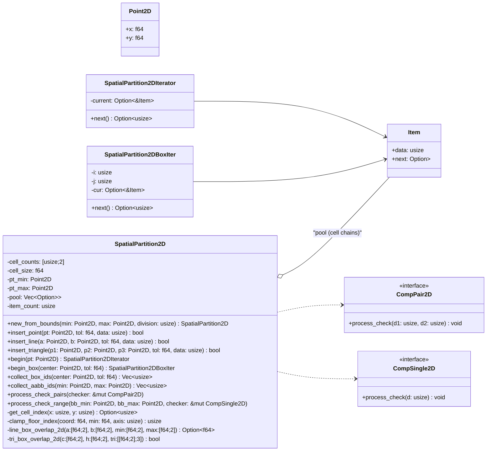

# SpatialPartition2D (Rust) — Design, Tests, and Diagrams

- 2D 균일 격자(Uniform Grid) 위에 **포인트/선분/삼각형**을 빠르게 삽입하고, 셀 단위로 후보를 질의하기 위한 경량 공간 파티셔너.  


## 0) 프로그램 구조



---

## 1) 핵심 아이디어

- 공간을 `cell_size`로 동일한 크기의 2D 셀(격자)로 나눕니다.
- 각 셀은 **싱글 링크드리스트**로 아이템들을 보관합니다. `Item { data: usize, next }` 형태.
- 삽입 시, 대상 기하(포인트/선분/삼각형)의 **AABB 인덱스 범위**를 먼저 구한 뒤, 셀별로 **정확 교차 테스트**(2D slab, 2D SAT)를 통과한 셀에만 저장합니다.
- 질의는 보통 “특정 셀(begin)” 또는 “여러 셀(begin_box / collect)”의 아이템을 훑는 방식입니다.

---

## 2) 자료구조

```rust
#[derive(Debug)]
struct Item {
    data: usize,
    next: Option<Box<Item>>,
}

pub struct SpatialPartition2D {
    cell_counts: [usize; 2],
    cell_size:  f64,
    pt_min:     Point2D,
    pt_max:     Point2D,
    pool:       Vec<Option<Box<Item>>>,
    item_count: usize,
}
```

---

## 3) 초기화: `new_from_bounds(min,max,division)`

- `division`은 내부적으로 **홀수**로 보정(그리드 중앙 정렬).
- 가장 긴 변(`max_dist`)을 0.1% 확장 후 `cell_size = max_dist / division`.
- 각 축 셀 수 계산 (`ceil(expanded / cell_size)`) 후 다시 홀수로 보정.
- `pt_min/pt_max`는 **중심 정렬** 기준으로 계산.

---

## 4) 인덱싱/유틸

- `get_cell_index(xi, yi) -> Option<usize>`: 2D 인덱스 → 풀 인덱스
- `clamp_floor_index(coord, min, axis) -> usize`: 좌표를 셀 인덱스로 변환 **+ 클램프** (0…count-1)
- `index_range_for_point/line/triangle(...) -> Option<([usize;2],[usize;2])>`: AABB 인덱스 범위

> **왜 클램프?** 음수/범위 밖 좌표를 `as usize`로 캐스팅하면 큰 양수가 되어 인덱스 오염이 납니다. 반드시 클램프 처리.

---

## 5) 교차 테스트 (2D)

- **선분 vs AABB**: 슬랩 방식(각 축 구간을 [0,1] 파라미터 범위로 집약).
- **삼각형 vs AABB**: 2D SAT.  
  - 박스 축(X,Y) 투영 검사 → AABB 빠른 배제
  - 삼각형 3개 엣지의 **수직 벡터**를 분리축으로 사용 → 프로젝션 간격이 박스 반경을 벗어나면 분리.

> `tol`은 박스 half-size 확장 또는 AABB `±tol` 확장으로 반영.

---

## 6) 삽입

- `insert_point(pt, tol, data)`  
- `insert_line(a, b, tol, data)`  
- `insert_triangle(p1, p2, p3, tol, data)`  
  - 모두 “AABB 범위 → 정확 교차 검사 → `contains`로 중복 방지 → `push_to_cell`” 순서.

---

## 7) 질의

- `begin(pt) -> SpatialPartition2DIterator`: **한 셀**만 순회.
- `begin_box(center, tol) -> SpatialPartition2DBoxIter`: **여러 셀**을 **게으르게(lazy)** 순회.  
  왜 이터레이터인가? → 메모리 낭비 없이 필요한 만큼만 소비 + 표준 Iterator 어댑터(`filter/any/take/collect`) 사용 + 3D와 API 일관성.
- 즉시 수집 API:  
  - `collect_box_ids(center, tol) -> Vec<usize>` (중복 제거/정렬)  
  - `collect_aabb_ids(min,max) -> Vec<usize>`

---

## 8) C++ ProcessCheck와의 1:1 대응

- `ProcessCheck(ICompPair2D*)` → `process_check_pairs(&mut impl CompPair2D)`  
  각 셀 내부에서 (i<j) 모든 쌍에 대해 콜백 호출.
- `ProcessCheckRange(ptMin, ptMax, ICompSingle2D*)` → `process_check_range(bb_min, bb_max, &mut impl CompSingle2D)`  
  범위 셀들의 모든 아이템에 대해 콜백 호출(중복 제거 없음 — C++과 동일).

트레이트 시그니처:
```rust
pub trait CompPair2D    { fn process_check(&mut self, d1: usize, d2: usize); }
pub trait CompSingle2D  { fn process_check(&mut self, d: usize); }
```

---

## 9) 함수별 요약

| 함수 | 역할 | 비고 |
|---|---|---|
| `new_from_bounds(min,max,div)` | 그리드 초기화 | 홀수 셀 수, 중심 정렬 |
| `get_cell_index(x,y)` | 2D→1D 인덱스 | 범위 체크 |
| `clamp_floor_index(..)` | 좌표→인덱스 | 0…count-1 클램프 |
| `index_range_for_*` | AABB 인덱스 범위 | 빈 범위면 `None` |
| `line_box_overlap_2d(..)` | 선분–AABB | 슬랩 방식 |
| `tri_box_overlap_2d(..)` | 삼각형–AABB | 2D SAT |
| `insert_point/line/triangle` | 삽입 | contains로 중복 방지 |
| `begin / begin_box` | 이터레이터 | lazy 순회 |
| `collect_box_ids / collect_aabb_ids` | 즉시 수집 | 중복 제거/정렬 |
| `process_check_pairs` | 쌍 검사 | C++ ProcessCheck |
| `process_check_range` | 범위 단일 검사 | C++ ProcessCheckRange |
| `remove_all` | 전체 삭제 | 풀 초기화 |

---

## 10) 사용 예

```rust
let min = Point2D{x:0.0,y:0.0};
let max = Point2D{x:10.0,y:10.0};
let mut sp2 = SpatialPartition2D::new_from_bounds(min, max, 9);

sp2.insert_point(Point2D{x:1.0,y:1.0}, 0.05, 1);
sp2.insert_line(Point2D{x:0.5,y:0.5}, Point2D{x:9.5,y:0.5}, 0.0, 2);
sp2.insert_triangle(Point2D{x:3.0,y:3.0}, Point2D{x:7.0,y:3.5}, Point2D{x:4.0,y:7.5}, 0.0, 3);

// 단일 셀
for id in sp2.begin(Point2D{x:1.0,y:1.0}) {
    println!(\"cell item: {id}\");
}
// 박스(정방형 tol) 수집
let ids = sp2.collect_box_ids(Point2D{x:3.5,y:3.8}, 2.0);
```

