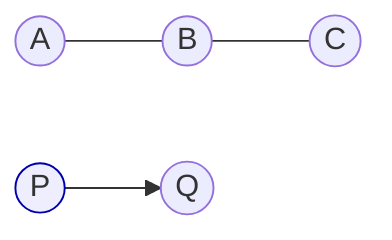

# Barycentric ambiguity in (degenerate) triangles

## 왜 답이 둘인가? (퇴화 삼각형: 세 점이 일직선)
세 점이 **일직선**(퇴화 삼각형)일 때, 임의의 점 $P$ 에서 삼각형에 내린 **최근접점 $Q$** 은
유일하지만, 그 $Q$ 를 표현하는 **바리센트릭 좌표 $(\lambda_A,\lambda_B,\lambda_C)$** 는
**여러 가지** 가 됩니다. 이유는 삼각형의 면적이 0이라 바리센트릭 해가 유일하지 않기 때문입니다.
구현에서는 보통 “세 변 중 최단 거리인 변”의 두 꼭짓점만을 사용해 $(\lambda_A,\lambda_B,\lambda_C)$ 를
정하고, 동률일 때의 **타이브레이크 규칙** (예: AC 우선, 인덱스 작은 변 우선)을 명시합니다.

---

## 1) 문제 설정
- 삼각형 $\( \triangle ABC \)$, 점 $P$.
- 목표: $\(P\)$ 에서 삼각형으로의 **최근접점** $\(Q\)$ 와 바리센트릭 $(\lambda_A,\lambda_B,\lambda_C)$,  
  $\(\lambda_A+\lambda_B+\lambda_C=1\)$, $\(Q=\lambda_A A + \lambda_B B + \lambda_C C\)$.

### 비퇴화(면적 > 0)일 때
- $\(Q\)$ 가 삼각형 **내부** 면 그대로 $\(Q\)$, 바리센트릭 **유일**.
- $\(Q\)$ 가 **외부**면, 세 변(AB, BC, CA)으로 각각 사영한 후보 중 최단을 택함.

### 퇴화(면적 = 0: A, B, C가 일직선)일 때
- 삼각형의 내부가 없음 → 최근접점은 **항상 어떤 변(또는 꼭짓점)** 위.
- **같은 $\(Q\)$** 에 대해 서로 다른 바리센트릭이 존재 (유일하지 않음).

---

## 2) 선분으로의 사영 (핵심 공식)
점 $\(P\)$ 를 선분 $\(XY\)$ 로 사영:

$$
t = \frac{(P-X)\cdot(Y-X)}{\|Y-X\|^2},\qquad t_{\mathrm{clamp}}=\min\big(\max(t,0),1\big),\qquad
Q_{XY} = X + t_{\mathrm{clamp}}(Y-X).
$$

- $\(t\in[0,1]\)$: 정규 사영(수선의 발)  
- 범위 밖: 가까운 끝점이 최단

삼각형에 대해서는 AB, BC, CA 각각에 대해 $\(Q_{AB}, Q_{BC}, Q_{CA}\)$ 와 거리를 구해 **최단** 을 선택.
동률이면 **정책** 으로 결정. (예: AC 우선)

---

## 3) 바리센트릭과 퇴화
정상 삼각형이면, $\(Q\)$ 에 대한 $\((\lambda_A,\lambda_B,\lambda_C)\)$ 가 **유일**.
하지만 A, B, C가 **일직선**이면, 같은 $\(Q\)$ 를 만드는 바리센트릭 해가 **무한**히 존재:
예를 들어 $\(Q\)$ 가 변 AB 위이면, $\((1-t,t,0)\)$ 형태가 되고,
같은 $\(Q\)$ 를 변 BC로 표현하면 $\((0,1-t,t)\)$ 처럼 **다른 해**를 얻을 수 있습니다.

---

## 4) 예제 (퇴화)
A = (0,0,0), B = (1,0,0), C = (2,0,0) (모두 x축)
P = (1.2, 2, 0)

- AC에 사영: $\(t_{AC}=0.6 \Rightarrow Q=(1.2,0,0)\)$
- BC에 사영: $\(t_{BC}=0.2 \Rightarrow Q=(1.2,0,0)\)$
- AB에 사영: $\(t_{AB}=1.2\Rightarrow\)$ 클램프 1 → $\(Q=B\)$ (거리 더 큼)

**AC와 BC가 동률(최단)** → 구현의 규칙에 따라 하나를 택함.
- AC를 택하면: $\((\lambda_A,\lambda_B,\lambda_C)=(0.4, 0, 0.6)\)$
- BC를 택하면: $\((0, 0.8, 0.2)\)$
둘 다 $\(\lambda_A+\lambda_B+\lambda_C=1\)$ 이고 $\(Q\)$ 동일.

---

## 5) 알고리즘 개요 (Flow)

```
y
↑
|           P(1.2,2)
|             *
|
|------------------------→ x
A(0)   B(1)   *Q(1.2)   C(2)

- A,B,C는 일직선
- P에서 내린 수선의 발 Q는 x=1.2
- AC/BC 모두에 수직으로 떨어져 동률(최단)

```

---

## 6) 단순 도식 (정렬된 노드 배치)


---

## 7) 결정론적 동작을 위한 팁
- 동률일 때:
  - **고정 우선순위**: AB > BC > CA
  - **가장 긴 변 우선**
  - **인덱스가 작은 두 꼭짓점 우선**
- 수치 안정성:
  - 제곱거리 비교 사용
  - $\(\varepsilon\)$ 임계로 동률 판단

---

## 8) 의사코드 (타이브레이크: AC > BC > AB)
```pseudo
candidates = [
  project_to_segment(P, A, B),  // (Qab, dist2ab, baryab)
  project_to_segment(P, B, C),  // (Qbc, dist2bc, barybc)
  project_to_segment(P, C, A),  // (Qca, dist2ca, baryca)
]
dmin = min(dist2ab, dist2bc, dist2ca)
pick those with |dist2 - dmin| <= eps
if multiple:
    choose by priority (AC > BC > AB)
return chosen Q, barycentric
```

---

## 9) 참고 수식
- 선분 사영: 위 (2) 식
- 바리센트릭: $\(Q=\lambda_A A + \lambda_B B + \lambda_C C,\;\sum\lambda=1\)$

---

## 10) 테스트 체크리스트
- 일반 삼각형 내부 점 → 유일한 바리센트릭
- 외부 점 → 세 변 중 최단 변 선택
- **퇴화(일직선)** → 동률 시 정책대로 바리센트릭이 **결정론적**
- 매우 짧은 변 / 동일점 포함(0 길이) / 큰 좌표값 → 수치 안정성 확인
