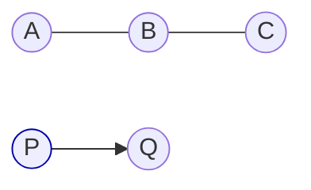

# Barycentric ambiguity in (degenerate) triangles

## 왜 답이 둘인가? (퇴화 삼각형: 세 점이 일직선)
세 점이 **일직선**(퇴화 삼각형)일 때, 임의의 점 $P$ 에서 삼각형에 내린 **최근접점 $Q$** 은
유일하지만, 그 $Q$ 를 표현하는 **바리센트릭 좌표 $(\lambda_A,\lambda_B,\lambda_C)$** 는
**여러 가지** 가 됩니다. 이유는 삼각형의 면적이 0이라 바리센트릭 해가 유일하지 않기 때문입니다.
구현에서는 보통 “세 변 중 최단 거리인 변”의 두 꼭짓점만을 사용해 $(\lambda_A,\lambda_B,\lambda_C)$ 를
정하고, 동률일 때의 **타이브레이크 규칙** (예: AC 우선, 인덱스 작은 변 우선)을 명시합니다.

---

## 1) 문제 설정
- 삼각형 $\( \triangle ABC \)$, 점 $P$.
- 목표: $\(P\)$ 에서 삼각형으로의 **최근접점** $\(Q\)$ 와 바리센트릭 $(\lambda_A,\lambda_B,\lambda_C)$,  
  $\(\lambda_A+\lambda_B+\lambda_C=1\)$, $\(Q=\lambda_A A + \lambda_B B + \lambda_C C\)$.

### 비퇴화(면적 > 0)일 때
- $\(Q\)$ 가 삼각형 **내부** 면 그대로 $\(Q\)$, 바리센트릭 **유일**.
- $\(Q\)$ 가 **외부**면, 세 변(AB, BC, CA)으로 각각 사영한 후보 중 최단을 택함.

### 퇴화(면적 = 0: A, B, C가 일직선)일 때
- 삼각형의 내부가 없음 → 최근접점은 **항상 어떤 변(또는 꼭짓점)** 위.
- **같은 $Q$** 에 대해 서로 다른 바리센트릭이 존재 (유일하지 않음).

---

## 2) 선분으로의 사영 (핵심 공식)
점 $P$ 를 선분 $XY$ 로 사영:

$$
t = \frac{(P-X)\cdot(Y-X)}{\|Y-X\|^2},\qquad t_{\mathrm{clamp}}=\min\big(\max(t,0),1\big),\qquad
Q_{XY} = X + t_{\mathrm{clamp}}(Y-X).
$$

- $\(t\in[0,1]\)$: 정규 사영(수선의 발)  
- 범위 밖: 가까운 끝점이 최단

삼각형에 대해서는 AB, BC, CA 각각에 대해 $\(Q_{AB}, Q_{BC}, Q_{CA}\)$ 와 거리를 구해 **최단** 을 선택.
동률이면 **정책** 으로 결정. (예: AC 우선)

---

## 3) 바리센트릭과 퇴화
정상 삼각형이면, $Q$ 에 대한 $(\lambda_A,\lambda_B,\lambda_C)$ 가 **유일**.
하지만 A, B, C가 **일직선**이면, 같은 $Q$ 를 만드는 바리센트릭 해가 **무한**히 존재:
예를 들어 $Q$ 가 변 AB 위이면, $(1-t,t,0)$ 형태가 되고,
같은 $Q$ 를 변 BC로 표현하면 $(0,1-t,t)$ 처럼 **다른 해**를 얻을 수 있습니다.

---

## 4) 예제 (퇴화)
A = (0,0,0), B = (1,0,0), C = (2,0,0) (모두 x축)
P = (1.2, 2, 0)

- AC에 사영: $\(t_{AC}=0.6 \Rightarrow Q=(1.2,0,0)\)$
- BC에 사영: $\(t_{BC}=0.2 \Rightarrow Q=(1.2,0,0)\)$
- AB에 사영: $\(t_{AB}=1.2\Rightarrow\)$ 클램프 1 → $\(Q=B\)$ (거리 더 큼)

**AC와 BC가 동률(최단)** → 구현의 규칙에 따라 하나를 택함.
- AC를 택하면: $(\lambda_A,\lambda_B,\lambda_C)=(0.4, 0, 0.6)$
- BC를 택하면: $(0, 0.8, 0.2)$
둘 다 $\(\lambda_A+\lambda_B+\lambda_C=1\)$ 이고 $Q$ 동일.

---

## 5) 알고리즘 개요 (Flow)

```
y
↑
|           P(1.2,2)
|             *
|
|------------------------→ x
A(0)   B(1)   *Q(1.2)   C(2)

- A,B,C는 일직선
- P에서 내린 수선의 발 Q는 x=1.2
- AC/BC 모두에 수직으로 떨어져 동률(최단)

```

---

## 6) 단순 도식 (정렬된 노드 배치)


---

## 7) 결정론적 동작을 위한 팁
- 동률일 때:
  - **고정 우선순위**: AB > BC > CA
  - **가장 긴 변 우선**
  - **인덱스가 작은 두 꼭짓점 우선**
- 수치 안정성:
  - 제곱거리 비교 사용
  - $\(\varepsilon\)$ 임계로 동률 판단

---

## 8) 의사코드 (타이브레이크: AC > BC > AB)
```pseudo
candidates = [
  project_to_segment(P, A, B),  // (Qab, dist2ab, baryab)
  project_to_segment(P, B, C),  // (Qbc, dist2bc, barybc)
  project_to_segment(P, C, A),  // (Qca, dist2ca, baryca)
]
dmin = min(dist2ab, dist2bc, dist2ca)
pick those with |dist2 - dmin| <= eps
if multiple:
    choose by priority (AC > BC > AB)
return chosen Q, barycentric
```

---

## 9) 참고 수식
- 선분 사영: 위 (2) 식
- 바리센트릭: $\(Q=\lambda_A A + \lambda_B B + \lambda_C C,\;\sum\lambda=1\)$

---

## 10) 테스트 체크리스트
- 일반 삼각형 내부 점 → 유일한 바리센트릭
- 외부 점 → 세 변 중 최단 변 선택
- **퇴화(일직선)** → 동률 시 정책대로 바리센트릭이 **결정론적**
- 매우 짧은 변 / 동일점 포함(0 길이) / 큰 좌표값 → 수치 안정성 확인

---

## 실전 코드
```rust
pub fn closest_pt_to_triangle(
    input: &Point3D,
    tri: &[Point3D; 3],
) -> (Point3D, f64, f64, f64) {
    let a = tri[0];
    let b = tri[1];
    let c = tri[2];

    // 1) 평면 해 시도
    if let Some((mut bary_a, mut bary_b, mut bary_c)) =
        closest_pt_to_triangle_helper(&a, &b, &c, input)
    {
        // 아주 작은 음수/수치진동은 0으로
        if bary_a <= ON_ZERO_TOLERANCE { bary_a = 0.0; }
        if bary_b <= ON_ZERO_TOLERANCE { bary_b = 0.0; }
        if bary_c <= ON_ZERO_TOLERANCE { bary_c = 0.0; }

        // 한 변/꼭짓점으로 스냅되는 케이스: 에지 후보들 비교
        if bary_a == 0.0 || bary_b == 0.0 || bary_c == 0.0 {
            let mut a0 = -1.0; let mut b0 = -1.0; let mut c0 = -1.0;
            let mut a1 = -1.0; let mut b1 = -1.0; let mut c1 = -1.0;
            let mut has_second = false;

            if bary_a == 0.0 {
                if bary_b == 0.0 {
                    // A=0,B=0 → AC, BC 두 에지 후보
                    let (aa, cc) = closest_pt_to_edge_bary(input, &a, &c);
                    a0 = aa; c0 = cc; b0 = 1.0 - a0 - c0;

                    let (bb, cc2) = closest_pt_to_edge_bary(input, &b, &c);
                    b1 = bb; c1 = cc2; a1 = 1.0 - b1 - c1;
                    has_second = true;
                } else if bary_c == 0.0 {
                    // A=0,C=0 → AB, CB 두 후보
                    let (aa, bb) = closest_pt_to_edge_bary(input, &a, &b);
                    a0 = aa; b0 = bb; c0 = 1.0 - a0 - b0;

                    let (cc, bb2) = closest_pt_to_edge_bary(input, &c, &b);
                    c1 = cc; b1 = bb2; a1 = 1.0 - c1 - b1;
                    has_second = true;
                } else {
                    // A=0만 0 → BC만 후보
                    let (bb, cc) = closest_pt_to_edge_bary(input, &b, &c);
                    b0 = bb; c0 = cc; a0 = 1.0 - b0 - c0;
                }
            } else if bary_b == 0.0 {
                if bary_c == 0.0 {
                    // B=0,C=0 → BA, CA 두 후보
                    let (bb, aa) = closest_pt_to_edge_bary(input, &b, &a);
                    b0 = bb; a0 = aa; c0 = 1.0 - b0 - a0;

                    let (cc, aa2) = closest_pt_to_edge_bary(input, &c, &a);
                    c1 = cc; a1 = aa2; b1 = 1.0 - c1 - a1;
                    has_second = true;
                } else {
                    // B=0만 0 → CA만 후보
                    let (cc, aa) = closest_pt_to_edge_bary(input, &c, &a);
                    c0 = cc; a0 = aa; b0 = 1.0 - c0 - a0;
                }
            } else if bary_c == 0.0 {
                // C=0만 0 → AB만 후보
                let (aa, bb) = closest_pt_to_edge_bary(input, &a, &b);
                a0 = aa; b0 = bb; c0 = 1.0 - a0 - b0;
            }

            // 우선 첫 후보 채택
            let mut ba = a0; let mut bb_ = b0; let mut bc = c0;

            if has_second {
                let p0 = Point3D {
                    x: ba*a.x + bb_*b.x + bc*c.x,
                    y: ba*a.y + bb_*b.y + bc*c.y,
                    z: ba*a.z + bb_*b.z + bc*c.z,
                };
                let p1 = Point3D {
                    x: a1*a.x + b1*b.x + c1*c.x,
                    y: a1*a.y + b1*b.y + c1*c.y,
                    z: a1*a.z + b1*b.z + c1*c.z,
                };
                if Point3D::distance_squared_ref(&p0, input) > Point3D::distance_squared_ref(&p1, input) {
                    ba = a1; bb_ = b1; bc = c1;
                }
            }

            // 최종 미세 음수는 0으로
            if ba <= ON_ZERO_TOLERANCE { ba = 0.0; }
            if bb_ <= ON_ZERO_TOLERANCE { bb_ = 0.0; }
            if bc <= ON_ZERO_TOLERANCE { bc = 0.0; }

            let out = Point3D {
                x: ba*a.x + bb_*b.x + bc*c.x,
                y: ba*a.y + bb_*b.y + bc*c.y,
                z: ba*a.z + bb_*b.z + bc*c.z,
            };
            return (out, ba, bb_, bc);
        }

        // 평면 내부 일반 케이스
        let out = Point3D {
            x: bary_a*a.x + bary_b*b.x + bary_c*c.x,
            y: bary_a*a.y + bary_b*b.y + bary_c*c.y,
            z: bary_a*a.z + bary_b*b.z + bary_c*c.z,
        };
        return (out, bary_a, bary_b, bary_c);
    }

    // 2) 헬퍼 실패(퇴화) → 에지 별로 비교
    let (mut ba, mut bb) = closest_pt_to_edge_bary(input, &a, &b);
    let mut bc = 0.0;
    let mut best = Point3D {
        x: ba*a.x + bb*b.x,
        y: ba*a.y + bb*b.y,
        z: ba*a.z + bb*b.z,
    };
    let mut best_d2 = Point3D::distance_squared_ref(&best, input);

    // Edge BC
    let (b2, c2) = closest_pt_to_edge_bary(input, &b, &c);
    let cand = Point3D {
        x: b2*b.x + c2*c.x,
        y: b2*b.y + c2*c.y,
        z: b2*b.z + c2*c.z,
    };
    let d2 = Point3D::distance_squared_ref(&cand, input);
    if d2 < best_d2 {
        best_d2 = d2;
        ba = 0.0; bb = b2; bc = c2;
        best = cand;
    }

    // Edge CA
    let (c3, a3) = closest_pt_to_edge_bary(input, &c, &a);
    let cand2 = Point3D {
        x: c3*c.x + a3*a.x,
        y: c3*c.y + a3*a.y,
        z: c3*c.z + a3*a.z,
    };
    let d3  = Point3D::distance_squared_ref(&cand2, input);
    if d3 < best_d2 {
        ba = a3; bb = 0.0; bc = c3;
        best = cand2;
    }

    (best, ba, bb, bc)
}
```

## 테스트 코드
```rust
fn triangle_collinear_edge_case() {
    // 세 점이 일직선: A(0), B(1), C(2) on X-axis
    let tri = [pt(0.0,0.0,0.0), pt(1.0,0.0,0.0), pt(2.0,0.0,0.0)];
    let p = pt(1.2, 2.0, 0.0); // 위쪽에서 투사 → 선분 AC의 x=1.2가 최단

    let (q, a, b, c) = closest_pt_to_triangle(&p, &tri);
    // 기대 사영점 (1.2,0,0)
    assert!(dist2(&q, &pt(1.2,0.0,0.0)) < 1e-18);

    // bary(둘 중 하나 허용)
    let ok_bc = (a - 0.0).abs() < 1e-9 && (b - 0.8).abs() < 1e-9 && (c - 0.2).abs() < 1e-9;
    let ok_ac = (a - 0.4).abs() < 1e-9 && (b - 0.0).abs() < 1e-9 && (c - 0.6).abs() < 1e-9;
    assert!(ok_bc || ok_ac, "unexpected bary: a={a}, b={b}, c={c}");
    assert_relative_eq!(a + b + c, 1.0, epsilon = 1e-12);
}
```

