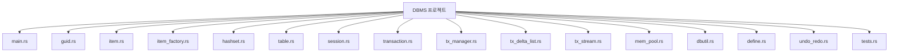

# DBMS For Rust

## 소개
Rust 기반 Undo/Redo 트랜잭션 시스템

## 주요 기능
- 트랜잭션 기반 데이터 조작
- Undo/Redo 지원
- 동적 아이템 타입 등록
- 메모리 풀 최적화
- 직렬화/복구 가능

## 모듈 설명
- DItem / Cursor
- ItemFactory
- HashSetTable
- TxAction / TxDeltaList / TxManager
- Table / Session / Transaction
- TxStream / FileTxStream
- MemPool / Guid / dbutil

## 프로젝트 구성도


## 실행 예제
```
cargo run
```

테스트
```
cargo test
```

## 라이센스
MIT
