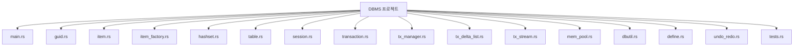

# DBMS For Rust

## 소개
Rust 기반 Undo/Redo 트랜잭션 시스템

## 주요 기능
- 트랜잭션 기반 데이터 조작
- Undo/Redo 지원
- 동적 아이템 타입 등록
- 메모리 풀 최적화
- 직렬화/복구 가능

## 모듈 설명
- DItem / Cursor
- ItemFactory
- HashSetTable
- TxAction / TxDeltaList / TxManager
- Table / Session / Transaction
- TxStream / FileTxStream
- MemPool / Guid / dbutil

## 프로젝트 구성도


## 찾아 가기

| 파일 이름            | 설명                                                  |
|---------------------|-------------------------------------------------------|
| [Rust_For_Undo_Redo.md](https://github.com/xmlbuilder/RustTutorial/blob/main/Chapter-17(%EC%8B%A4%EC%A0%84%20%EC%98%88%EC%A0%9C%EC%99%80%20%ED%94%84%EB%A1%9C%EC%A0%9D%ED%8A%B8)/DBMS/Project/src/main.rs) | 프로그램 구조 설명 |
| [main.rs](https://github.com/xmlbuilder/RustTutorial/blob/main/Chapter-17(%EC%8B%A4%EC%A0%84%20%EC%98%88%EC%A0%9C%EC%99%80%20%ED%94%84%EB%A1%9C%EC%A0%9D%ED%8A%B8)/DBMS/Project/src/main.rs) | 전체 시스템 실행 진입점 |
| [guid.rs](https://github.com/xmlbuilder/RustTutorial/blob/main/Chapter-17(%EC%8B%A4%EC%A0%84%20%EC%98%88%EC%A0%9C%EC%99%80%20%ED%94%84%EB%A1%9C%EC%A0%9D%ED%8A%B8)/DBMS/Project/src/guid.rs) | GUID 생성 및 문자열 변환 |
| [dbutil.rs](https://github.com/xmlbuilder/RustTutorial/blob/main/Chapter-17(%EC%8B%A4%EC%A0%84%20%EC%98%88%EC%A0%9C%EC%99%80%20%ED%94%84%EB%A1%9C%EC%A0%9D%ED%8A%B8)/DBMS/Project/src/dbutil.rs) | 문자열 포맷 및 경로 유틸리티 |
| [mem_pool.rs](https://github.com/xmlbuilder/RustTutorial/blob/main/Chapter-17(%EC%8B%A4%EC%A0%84%20%EC%98%88%EC%A0%9C%EC%99%80%20%ED%94%84%EB%A1%9C%EC%A0%9D%ED%8A%B8)/DBMS/Project/src/mem_pool.rs) | 커스텀 메모리 풀 |
| [item.rs](https://github.com/xmlbuilder/RustTutorial/blob/main/Chapter-17(%EC%8B%A4%EC%A0%84%20%EC%98%88%EC%A0%9C%EC%99%80%20%ED%94%84%EB%A1%9C%EC%A0%9D%ED%8A%B8)/DBMS/Project/src/item.rs) | DItem 트레잇 및 Cursor 정의 |
| [item_factory.rs](https://github.com/xmlbuilder/RustTutorial/blob/main/Chapter-17(%EC%8B%A4%EC%A0%84%20%EC%98%88%EC%A0%9C%EC%99%80%20%ED%94%84%EB%A1%9C%EC%A0%9D%ED%8A%B8)/DBMS/Project/src/item_factory.rs) | 아이템 생성/소멸 팩토리 |
| [hashset.rs](https://github.com/xmlbuilder/RustTutorial/blob/main/Chapter-17(%EC%8B%A4%EC%A0%84%20%EC%98%88%EC%A0%9C%EC%99%80%20%ED%94%84%EB%A1%9C%EC%A0%9D%ED%8A%B8)/DBMS/Project/src/hashset.rs) | 키 기반 테이블 저장소 |
| [table.rs](https://github.com/xmlbuilder/RustTutorial/blob/main/Chapter-17(%EC%8B%A4%EC%A0%84%20%EC%98%88%EC%A0%9C%EC%99%80%20%ED%94%84%EB%A1%9C%EC%A0%9D%ED%8A%B8)/DBMS/Project/src/table.rs) | 삽입/삭제/조회 및 트랜잭션 기록 |
| [session.rs](https://github.com/xmlbuilder/RustTutorial/blob/main/Chapter-17(%EC%8B%A4%EC%A0%84%20%EC%98%88%EC%A0%9C%EC%99%80%20%ED%94%84%EB%A1%9C%EC%A0%9D%ED%8A%B8)/DBMS/Project/src/session.rs) | 테이블 관리 및 전체 undo/redo |
| [transaction.rs](https://github.com/xmlbuilder/RustTutorial/blob/main/Chapter-17(%EC%8B%A4%EC%A0%84%20%EC%98%88%EC%A0%9C%EC%99%80%20%ED%94%84%EB%A1%9C%EC%A0%9D%ED%8A%B8)/DBMS/Project/src/transaction.rs) | 트랜잭션 스코프 관리 |
| [tx_manager.rs](https://github.com/xmlbuilder/RustTutorial/blob/main/Chapter-17(%EC%8B%A4%EC%A0%84%20%EC%98%88%EC%A0%9C%EC%99%80%20%ED%94%84%EB%A1%9C%EC%A0%9D%ED%8A%B8)/DBMS/Project/src/tx_manager.rs) | undo/redo 스택 관리 |
| [tx_delta_list.rs](https://github.com/xmlbuilder/RustTutorial/blob/main/Chapter-17(%EC%8B%A4%EC%A0%84%20%EC%98%88%EC%A0%9C%EC%99%80%20%ED%94%84%EB%A1%9C%EC%A0%9D%ED%8A%B8)/DBMS/Project/src/tx_delta_list.rs) | 트랜잭션 작업 묶음 |
| [tx_stream.rs](https://github.com/xmlbuilder/RustTutorial/blob/main/Chapter-17(%EC%8B%A4%EC%A0%84%20%EC%98%88%EC%A0%9C%EC%99%80%20%ED%94%84%EB%A1%9C%EC%A0%9D%ED%8A%B8)/DBMS/Project/src/tx_stream.rs) | 트랜잭션 직렬화/복구 |
| [define.rs](https://github.com/xmlbuilder/RustTutorial/blob/main/Chapter-17(%EC%8B%A4%EC%A0%84%20%EC%98%88%EC%A0%9C%EC%99%80%20%ED%94%84%EB%A1%9C%EC%A0%9D%ED%8A%B8)/DBMS/Project/src/define.rs) | TxAction 정의 |
| [undo_redo_tests.rs](https://github.com/xmlbuilder/RustTutorial/blob/main/Chapter-17(%EC%8B%A4%EC%A0%84%20%EC%98%88%EC%A0%9C%EC%99%80%20%ED%94%84%EB%A1%9C%EC%A0%9D%ED%8A%B8)/DBMS/Project/src/undo_redo.rs) | undo/redo 관련 로직 |


## 실행 예제
```
cargo run
```

테스트
```
cargo test
```

## 라이센스
MIT
