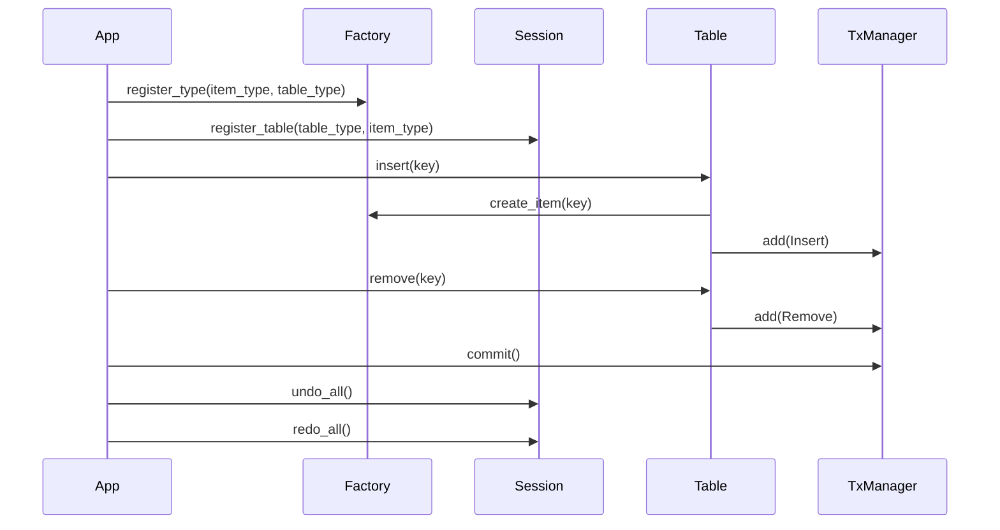
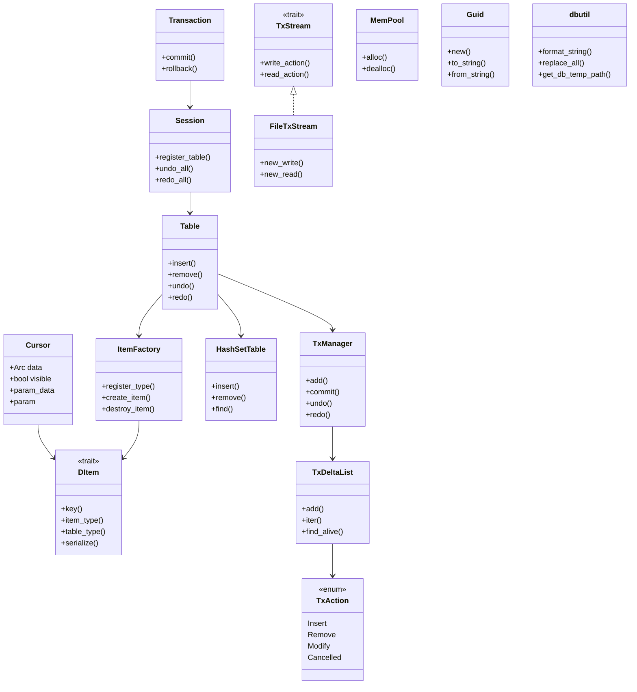

# 🧠 전체 시스템의 의미
이 시스템은 다음을 목표로 설계:
- 트랜잭션 기반 데이터 조작: 삽입, 삭제, 수정 작업을 기록하고 되돌릴 수 있음
- Undo/Redo 지원: 작업 이력을 스택에 저장하고, 되돌리거나 다시 적용 가능
- 동적 아이템 타입 등록: 다양한 구조체를 DItem으로 등록해서 확장 가능
- 메모리 최적화: MemPool을 통해 반복적인 객체 생성/소멸을 효율적으로 처리
- 직렬화/복구 가능: TxStream을 통해 트랜잭션을 파일에 저장하거나 불러올 수 있음

## 🧩 핵심 모듈 설명과 관계
### 1. DItem + Cursor
- DItem: 모든 아이템이 구현해야 할 공통 인터페이스
- Cursor: DItem을 감싸는 래퍼로, 트랜잭션에서 상태 추적 가능
- 관계: Cursor는 Arc<dyn DItem>을 포함하며, visible, param_data, param 등의 상태를 관리
### 2. ItemFactory
- 역할: 다양한 아이템 타입을 등록하고 생성/소멸하는 팩토리
- 관계: Table이 insert() 시 ItemFactory를 통해 DItem을 생성
### 3. HashSetTable
- 역할: 키 기반으로 여러 Cursor를 저장
- 관계: Table 내부에서 실제 데이터를 저장하는 구조체
### 4. TxAction
- 역할: 트랜잭션에서 수행된 작업을 표현하는 열거형
- 종류: Insert, Remove, Modify, Cancelled
- 관계: TxDeltaList가 여러 TxAction을 묶고, TxManager가 이를 스택으로 관리
### 5. TxDeltaList
- 역할: 하나의 트랜잭션 단위에서 수행된 작업 묶음
- 관계: TxManager가 undo_stack, redo_stack으로 관리
### 6. TxManager
- 역할: 트랜잭션 이력을 관리하는 관리자
- 관계: Table이 내부적으로 TxManager를 포함하여 undo/redo를 수행
### 7. Table
- 역할: 아이템 삽입/삭제/조회 및 트랜잭션 기록
- 관계:
- HashSetTable을 통해 데이터 저장
- TxManager를 통해 트랜잭션 기록
- ItemFactory를 통해 아이템 생성
### 8. Session
- 역할: 여러 테이블을 관리하고 전체 undo/redo 수행
- 관계: Table을 table_type 기준으로 관리
### 9. Transaction
- 역할: 트랜잭션 스코프를 관리
- 관계: Session을 참조하여 commit() 또는 rollback() 수행
- 특징: Drop에서 자동 undo 처리
### 10. TxStream / FileTxStream
- 역할: 트랜잭션을 파일에 저장하거나 복구
- 관계: Cursor, TxAction, Guid 등을 직렬화/역직렬화
### 11. MemPool
- 역할: 반복적인 객체 생성을 위한 메모리 풀
- 관계: MyNode 같은 구조체를 효율적으로 생성/소멸
### 12. Guid
- 역할: 고유 식별자 생성 및 문자열 변환
- 관계: 트랜잭션이나 객체 식별에 사용 가능
####  13. dbutil
- 역할: 문자열 포맷, 치환, 임시 경로 생성 유틸리티

## 🔁 트랜잭션 생명주기 흐름

## 🧠 전체 시스템 구조도 (Mermaid)

