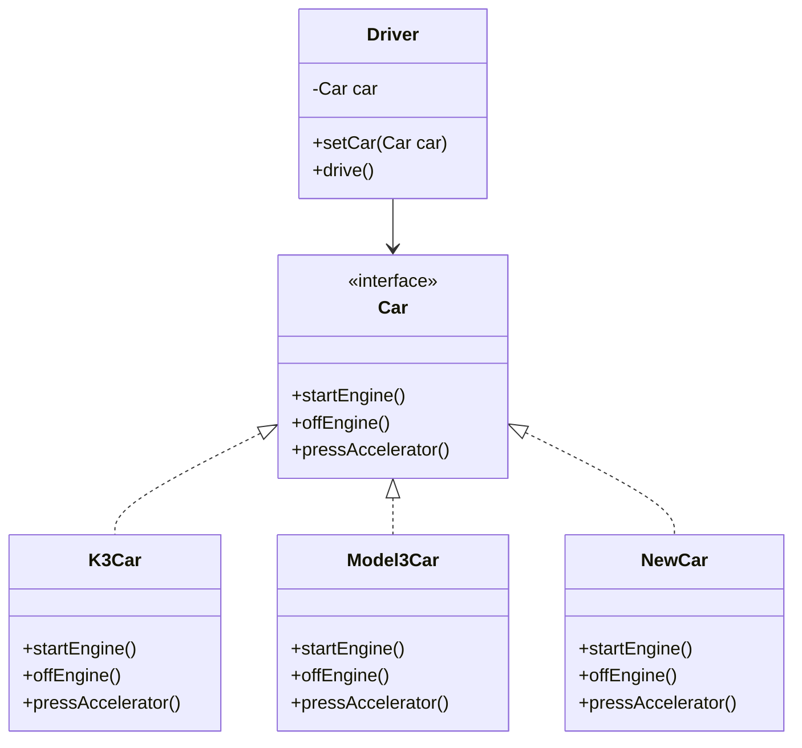

# OOP 설계
객체 지향 프로그래밍(OOP)의 핵심 개념과 좋은 설계 원칙을 정리

## 🎯 좋은 객체 지향 프로그래밍이란?
### 1️⃣ 객체 중심 사고
- 프로그램을 명령어의 나열이 아닌 객체들의 협력 관계로 이해
- 객체는 독립된 단위로서 메시지를 주고받고 데이터를 처리함
- "혼자 있는 객체는 없다" → 클라이언트와 서버 객체는 항상 협력함

### 2️⃣ 역할과 구현의 분리
- 역할(Role): 인터페이스로 정의
- 구현(Implementation): 역할을 수행하는 클래스
- 역할과 구현을 분리하면:
- 세상이 단순해지고
- 유연해지며
- 변경이 편리해짐
#### ✅ 장점
- 클라이언트는 역할만 알면 됨 → 구현 내부 구조 몰라도 됨
- 구현 변경 시 클라이언트에 영향 없음
- 확장 가능한 설계 가능
- 인터페이스를 안정적으로 잘 설계하는 것이 핵심

### 3️⃣ 다형성 (Polymorphism)
- 인터페이스를 구현한 객체를 실행 시점에 유연하게 교체 가능
- 오버라이딩된 메서드가 실행됨
- 다양한 구현체를 하나의 역할로 다룰 수 있음
#### 💡 실세계 비유
- 운전자 → 자동차 역할 → K3, 아반떼, 테슬라 모델3
- 공연 무대 → 로미오/줄리엣 역할 → 배우 교체 가능
- 키보드/마우스 → USB 인터페이스에 맞춰 다양한 장치 연결

### 4️⃣ 유연하고 변경에 강한 구조
- 마치 레고 블럭처럼 조립하듯이 구현을 교체 가능
- 공연 무대에서 배우를 바꾸듯이 객체를 교체 가능
- 스프링 프레임워크의 핵심인 IoC, DI도 결국 다형성 기반

### 5️⃣ 인터페이스 설계의 중요성
- 인터페이스 자체가 변경되면 클라이언트와 서버 모두 큰 영향을 받음
- 예: 자동차 → 비행기로 변경, USB 규격 변경 등
- 따라서 역할(인터페이스)은 안정적으로 설계해야 함

## ✅ 핵심 요약
| 개념               | 설명                                                                 |
|--------------------|----------------------------------------------------------------------|
| 객체 협력           | 객체는 혼자 존재하지 않으며, 서로 메시지를 주고받으며 협력함             |
| 역할과 구현 분리     | 인터페이스로 역할 정의, 클래스로 구현 → 유연하고 변경에 강한 구조         |
| 다형성              | 하나의 역할로 다양한 구현을 실행 시점에 교체 가능                         |
| 인터페이스 설계 중요 | 인터페이스가 바뀌면 클라이언트·서버 모두 영향 → 안정적 설계가 필수         |
| 유연한 구조 비유     | 레고 블럭, 공연 무대, USB 인터페이스처럼 조립과 교체가 쉬운 구조             |
| 디자인 패턴 기반     | 대부분의 디자인 패턴은 다형성을 활용 → 스프링의 IoC, DI도 포함됨           |

---

# polymorphism

 **다형성(polymorphism)**과 역할과 구현의 분리가 왜 중요한지를 정리.  
 코드 흐름, 문제점, 개선점, 그리고 구조적 시각화를 모두 포함.

## ✅ 다형성 - 역할과 구현 정리
### 1️⃣ 예제1: 역할과 구현 분리 없이 개발
#### 구조
```java
public class Driver {
    private K3Car k3Car;
    private Model3Car model3Car; //추가

    public void setK3Car(K3Car k3Car) {
        this.k3Car = k3Car;
    }
    //추가
    public void setModel3Car(Model3Car model3Car) {
        this.model3Car = model3Car;
    }
    //변경
    public void drive() {
        System.out.println("자동차를 운전합니다.");
        if (k3Car != null) {
            k3Car.startEngine();
            k3Car.pressAccelerator();
            k3Car.offEngine();
        } else if (model3Car != null) {
            model3Car.startEngine();
            model3Car.pressAccelerator();
            model3Car.offEngine();
        }
    }
}
```
- Driver 클래스가 K3Car 클래스에 직접 의존
- Driver 내부에서 K3Car의 메서드를 직접 호출
#### 문제점
- 새로운 차량(Model3Car) 추가 시 Driver 코드 변경 필요
- 차량마다 필드, 메서드, 조건 분기 추가 → 유지보수 어려움

## 2️⃣ 예제2: 차량 추가 시 발생하는 문제
### 구조

- Driver가 K3Car, Model3Car 둘 다 직접 참조
- drive() 메서드에서 조건 분기 처리
### 문제점
- 차량이 늘어날수록 Driver 코드가 계속 변경됨
- OCP(Open-Closed Principle) 위반 → 확장에는 열려 있으나 변경에는 닫혀 있어야 함

## 3️⃣ 예제3: 다형성을 활용한 역할과 구현 분리
### 구조
```java
public interface Car {
    void startEngine();
    void offEngine();
    void pressAccelerator();
}
public class K3Car implements Car {
    @Override
    public void startEngine() {
        System.out.println("K3Car.startEngine");
    }
    @Override
    public void offEngine() {
        System.out.println("K3Car.offEngine");
    }
    @Override
    public void pressAccelerator() {
        System.out.println("K3Car.pressAccelerator");
    }
}
public class Model3Car implements Car {
    @Override
    public void startEngine() {
        System.out.println("Model3Car.startEngine");
    }
    @Override
    public void offEngine() {
        System.out.println("Model3Car.offEngine");
    }
    @Override
    public void pressAccelerator() {
        System.out.println("Model3Car.pressAccelerator");
    }
}

public class Driver {
    private Car car;
    public void setCar(Car car) {
        System.out.println("자동차를 설정합니다: " + car);
        this.car = car;
    }
    public void drive() {
        System.out.println("자동차를 운전합니다.");
        car.startEngine();
        car.pressAccelerator();
        car.offEngine();
    }
}
```
- Car 인터페이스 정의 → 역할
- K3Car, Model3Car는 Car 인터페이스 구현 → 구현
- Driver는 Car 타입만 참조 → 구현체 변경 시 코드 수정 없음
### 장점
- 새로운 차량 추가 시 Driver 코드 변경 없음
- 런타임에 구현 객체 교체 가능 → 유연한 설계
- 유지보수 용이, 확장성 확보


## 소스 코드
```java
public interface Car {
    void startEngine();
    void offEngine();
    void pressAccelerator();
}

public class K3Car implements Car {
    @Override
    public void startEngine() {
        System.out.println("K3Car.startEngine");
    }
    @Override
    public void offEngine() {
        System.out.println("K3Car.offEngine");
    }
    @Override
    public void pressAccelerator() {
        System.out.println("K3Car.pressAccelerator");
    }
}
public class Model3Car implements Car {
    @Override
    public void startEngine() {
        System.out.println("Model3Car.startEngine");
    }
    @Override
    public void offEngine() {
        System.out.println("Model3Car.offEngine");
    }
    @Override
    public void pressAccelerator() {
        System.out.println("Model3Car.pressAccelerator");
    }
}

public class Driver {
    private Car car;
    public void setCar(Car car) {
        System.out.println("자동차를 설정합니다: " + car);
        this.car = car;
    }
    public void drive() {
        System.out.println("자동차를 운전합니다.");
        car.startEngine();
        car.pressAccelerator();
        car.offEngine();
    }
}

public class CarMain1 {
    public static void main(String[] args) {
        Driver driver = new Driver();
        //차량 선택(k3)
        Car k3Car = new K3Car();
        driver.setCar(k3Car);
        driver.drive();
        //차량 변경(k3 -> model3)
        Car model3Car = new Model3Car();
        driver.setCar(model3Car);
        driver.drive();
    }
}

```


## 📊 클래스 구조도
classDiagram
    class Car {
        <<interface>>
        +startEngine()
        +offEngine()
        +pressAccelerator()
    }

    class K3Car {
        +startEngine()
        +offEngine()
        +pressAccelerator()
    }

    class Model3Car {
        +startEngine()
        +offEngine()
        +pressAccelerator()
    }

    class Driver {
        -Car car
        +setCar(Car car)
        +drive()
    }

    Car <|.. K3Car
    Car <|.. Model3Car
    Driver --> Car


## 💡 구조 해설
- Car는 역할(인터페이스)
- K3Car, Model3Car는 구현체
- Driver는 Car에만 의존 → 구현체 교체 가능
- Car 인터페이스를 통해 다형성 실현

## 🔁 실행 흐름 요약
- Driver는 Car 타입의 객체를 참조
- setCar()로 구현 객체 주입 (DI: Dependency Injection)
- drive() 호출 시 오버라이딩된 구현체의 메서드 실행
- 새로운 차량 추가 시 Driver는 변경 없음

## ✅ 핵심 요약

| 개념               | 설명                                                                 |
|--------------------|----------------------------------------------------------------------|
| 역할과 구현 분리     | `Car` 인터페이스로 역할 정의, `K3Car`, `Model3Car`는 구현체               |
| 다형성              | `Driver`는 `Car` 타입만 참조 → 다양한 자동차를 유연하게 운전 가능           |
| 의존 관계 주입(DI)  | `Driver.setCar(Car car)`로 구현 객체 주입 → 실행 중에도 교체 가능             |
| OCP 원칙            | 새로운 자동차 추가 시 `Driver` 코드 변경 없음 → 확장에는 열려 있고 변경에는 닫힘 |
| Driver ↔ Car 관계   | `Driver`는 `Car` 역할에만 의존 → 구현체와 분리되어 유지보수 용이               |
| 유지보수성 향상      | 구현체가 늘어나도 클라이언트(`Driver`)는 변경 없음 → 안정적이고 유연한 구조       |

---

## ✅ OCP (Open-Closed Principle) 원칙
###🔹 정의
- Open for extension: 새로운 기능을 추가할 수 있도록 열려 있어야 함
- Closed for modification: 기존 코드를 수정하지 않도록 닫혀 있어야 함
즉, 기존 코드를 건드리지 않고도 새로운 기능을 추가할 수 있는 구조를 의미함

### 🔹 적용 예시: 자동차 운전 프로그램
#### 구조
- Car 인터페이스: 역할 정의
- K3Car, Model3Car, NewCar: Car 인터페이스 구현 → 기능 확장
- Driver: Car 인터페이스만 참조 → 구현체 변경 시 코드 수정 없음
#### 결과
- 새로운 차량 추가 시 Driver 클래스는 변경 없음
- main()에서 새로운 차량 객체를 생성하고 Driver.setCar()로 주입만 하면 됨

## 🔹 변하지 않는 부분 vs 변하는 부분
| 구분             | 설명                                                                 |
|------------------|----------------------------------------------------------------------|
| 변하지 않는 부분   | `Driver` 클래스는 `Car` 인터페이스에만 의존 → 새로운 차량 추가 시 코드 변경 없음 |
| 변하지 않는 부분   | `Car` 인터페이스를 사용하는 클라이언트 코드 → 다형성으로 유연하게 대응 가능


## 🎯 전략 패턴 (Strategy Pattern)
### 🔹 정의
- 알고리즘(전략)을 클라이언트 코드의 변경 없이 유연하게 교체할 수 있도록 하는 디자인 패턴
### 🔹 구조 매칭
| 구성 요소           | 역할 설명                                   |
|--------------------|----------------------------------------------|
| `Car`              | 전략 인터페이스 (역할)                        |
| `K3Car`, `Model3Car` | `Car` 인터페이스를 구현한 구체적인 전략 (구현) |
| `Driver`           | `Car` 역할에만 의존하는 클라이언트 (사용자)     |


### 🔹 장점
- 전략 교체가 자유로움
- 클라이언트 코드 변경 없음
- 확장성과 유지보수성 우수

### 📊 클래스 구조도


## ✅ 최종 요약

| 항목             | 설명                                                                 |
|------------------|----------------------------------------------------------------------|
| 역할과 구현 분리   | `Car` 인터페이스로 역할 정의, `Driver`는 구현체가 아닌 역할에만 의존         |
| 다형성 활용        | `Driver`는 `Car` 타입만 참조 → 다양한 자동차를 유연하게 운전 가능             |
| OCP 원칙 적용     | 새로운 차량 추가 시 `Driver` 코드 변경 없음 → 확장에는 열려 있고 변경에는 닫힘 |
| 전략 패턴 구조     | `Car`는 전략 인터페이스, `K3Car`, `Model3Car`는 전략 구현체, `Driver`는 사용자 |
| 핵심 유지 영역     | `Car`를 사용하는 클라이언트인 `Driver`는 변경 없음 → 안정적이고 유연한 구조     |
| 설정 변경 영역     | `main()`에서 새로운 차량 객체 생성 및 주입 → 설정 코드만 변경됨                |

---

#  실전 예제

## ✅ 문제 1: 다중 메시지 발송
### 📌 목표
- 여러 종류의 메시지 발송기를 하나의 인터페이스로 통합
- 다형성을 활용해 Sender 인터페이스 기반으로 메시지 전송
🔧 요구사항
- Sender 인터페이스 정의
- EmailSender, SmsSender, FaceBookSender 클래스 구현
- SendMain에서 다형성으로 메시지 전송
### ✅ 핵심 코드 구조
```java
public interface Sender {
    void sendMessage(String message);
}


public class EmailSender implements Sender {
    public void sendMessage(String message) {
        System.out.println("메일을 발송합니다: " + message);
    }
}


public class SmsSender implements Sender {
    public void sendMessage(String message) {
        System.out.println("SMS를 발송합니다: " + message);
    }
}


public class FaceBookSender implements Sender {
    public void sendMessage(String message) {
        System.out.println("페이스북에 발송합니다: " + message);
    }
}


public class SendMain {
    public static void main(String[] args) {
        Sender[] senders = {new EmailSender(), new SmsSender(), new FaceBookSender()};
        for (Sender sender : senders) {
            sender.sendMessage("환영합니다!");
        }
    }
}
```

### 🎯 학습 포인트
- 인터페이스 기반 다형성
- 확장에 강하고 변경에 유연한 구조

## ✅ 문제 2: 결제 시스템 리팩토링
### 📌 목표
- 결제 수단이 늘어나도 PayService를 수정하지 않도록 구조 개선
- OCP 원칙(Open-Closed Principle) 적용
🔧 기존 문제점
- PayService가 결제 수단마다 if-else로 직접 객체 생성
- 새로운 결제 수단 추가 시 PayService를 계속 수정해야 함
### ✅ 리팩토링 방향
- Pay 인터페이스 도입
- 각 결제 수단 클래스가 Pay 인터페이스를 구현
- 결제 수단을 Map<String, Pay> 형태로 관리
### 🔧 핵심 구조 예시
```java
public interface Pay {
    boolean pay(int amount);
}


public class KakaoPay implements Pay {
    public boolean pay(int amount) {
        System.out.println("카카오페이 시스템과 연결합니다.");
        System.out.println(amount + "원 결제를 시도합니다.");
        return true;
    }
}


public class NaverPay implements Pay {
    public boolean pay(int amount) {
        System.out.println("네이버페이 시스템과 연결합니다.");
        System.out.println(amount + "원 결제를 시도합니다.");
        return true;
    }
}


public class PayService {
    private Map<String, Pay> payMap = new HashMap<>();

    public PayService() {
        payMap.put("kakao", new KakaoPay());
        payMap.put("naver", new NaverPay());
        // 새로운 결제 수단은 여기만 추가하면 됨
    }

    public void processPay(String option, int amount) {
        System.out.println("결제를 시작합니다: option=" + option + ", amount=" + amount);
        Pay pay = payMap.get(option);
        boolean result = (pay != null) ? pay.pay(amount) : false;

        if (result) {
            System.out.println("결제가 성공했습니다.");
        } else {
            System.out.println("결제가 실패했습니다.");
        }
    }
}
```


### 🎯 학습 포인트
- OCP 원칙 적용: 기존 코드를 수정하지 않고 기능 확장
- 인터페이스 기반 설계로 유연한 구조 확보


## 📄 결제 시스템 리팩토링 문서
### 🎯 목표
- 다양한 결제 수단을 유연하게 처리할 수 있는 구조 설계
- 새로운 결제 수단 추가 시 기존 코드를 수정하지 않도록 리팩토링
- OCP 원칙(Open-Closed Principle)과 다형성 적용

### 🧩 핵심 구성 요소
#### 1. Pay 인터페이스
```java
public interface Pay {
    boolean pay(int amount);
}
```

- 모든 결제 수단은 이 인터페이스를 구현
- PayService는 이 인터페이스에만 의존

#### 2. 결제 수단 구현 클래스
```java
public class KakaoPay implements Pay {
    public boolean pay(int amount) {
        System.out.println("카카오페이 시스템과 연결합니다.");
        System.out.println(amount + "원 결제를 시도합니다.");
        return true;
    }
}


public class NaverPay implements Pay {
    public boolean pay(int amount) {
        System.out.println("네이버페이 시스템과 연결합니다.");
        System.out.println(amount + "원 결제를 시도합니다.");
        return true;
    }
}


public class DefaultPay implements Pay {
    public boolean pay(int amount) {
        System.out.println("결제 수단이 없습니다.");
        return false;
    }
}

```

#### 3. PayStore 클래스
```java
public abstract class PayStore {
    public static Pay findPay(String option) {
        if (option.equals("kakao")) {
            return new KakaoPay();
        } else if (option.equals("naver")) {
            return new NaverPay();
        } else {
            return new DefaultPay();
        }
    }
}

```
- 결제 수단 이름으로 실제 구현체를 반환
- null 대신 항상 실패하는 DefaultPay를 반환하여 안정성 확보
- abstract로 선언해 객체 생성을 방지

### 4. PayService 클래스
```java
public class PayService {
    public void processPay(String option, int amount) {
        System.out.println("결제를 시작합니다: option=" + option + ", amount=" + amount);
        Pay pay = PayStore.findPay(option);
        boolean result = pay.pay(amount);
        if (result) {
            System.out.println("결제가 성공했습니다.");
        } else {
            System.out.println("결제가 실패했습니다.");
        }
    }
}
```

- Pay 인터페이스에만 의존
- 새로운 결제 수단 추가 시 코드 변경 없음

### 5. 실행 클래스
### ✅ PayMain1 — 고정된 테스트
```java
public class PayMain1 {
    public static void main(String[] args) {
        PayService payService = new PayService();
        payService.processPay("kakao", 5000);
        payService.processPay("naver", 10000);
        payService.processPay("bad", 15000);
    }
}
```

### ✅ PayMain2 — 사용자 입력 기반
```java
public class PayMain2 {
    public static void main(String[] args) {
        Scanner scanner = new Scanner(System.in);
        PayService payService = new PayService();
        while (true) {
            System.out.print("결제 수단을 입력하세요:");
            String payOption = scanner.nextLine();
            if (payOption.equals("exit")) {
                System.out.println("프로그램을 종료합니다.");
                return;
            }
            System.out.print("결제 금액을 입력하세요:");
            int amount = scanner.nextInt();
            scanner.nextLine();
            payService.processPay(payOption, amount);
        }
    }
}
```


### 🖥️ 실행 결과 예시
```
결제를 시작합니다: option=kakao, amount=5000
카카오페이 시스템과 연결합니다.
5000원 결제를 시도합니다.
결제가 성공했습니다.

결제를 시작합니다: option=naver, amount=10000
네이버페이 시스템과 연결합니다.
10000원 결제를 시도합니다.
결제가 성공했습니다.

결제를 시작합니다: option=bad, amount=15000
결제 수단이 없습니다.
결제가 실패했습니다.
```
### ✅ 설계 원칙 적용 요약

| 설계 원칙              | 적용 요소            | 설명                                                                 |
|------------------------|----------------------|----------------------------------------------------------------------|
| OCP (개방-폐쇄 원칙)   | PayStore             | 새로운 결제 수단 추가 시 기존 코드 수정 없이 확장 가능               |
| 다형성                 | Pay 인터페이스       | 다양한 결제 수단을 동일한 방식으로 처리 가능                         |
| 안정성 (Null 방지)     | DefaultPay           | 결제 수단이 없을 경우에도 null 대신 실패 객체를 반환하여 예외 방지   |
| 의존 역전 원칙 (DIP)   | PayService → Pay     | 고수준 모듈(PayService)이 저수준 구현체가 아닌 추상(Pay)에 의존함   |

----


