# Spare Matrix

## 🧠 CSR(Compressed Sparse Row) 핵심 요약
CSR은 **희소 행렬(sparse matrix)** 을 효율적으로 저장하기 위한 방식으로, 0이 아닌 값만 저장합니다.  
세 개의 벡터 i, j, a를 통해 전체 행렬을 복원할 수 있습니다.  

### 📦 구성 요소

| 이름 | 의미             | 길이         |
|------|------------------|--------------|
| a    | 비제로 값들       | nnz          |
| j    | 각 값의 열 인덱스 | nnz          |
| i    | 각 행의 시작 위치 | n_rows + 1   |


### 🧩 예제 행렬
#### 행렬 A (3×4):
```
A = [
  [10, 0, 0, 2],
  [ 3, 9, 0, 0],
  [ 0, 7, 8, 7]
]
```
### 1️⃣ a와 j 구성 (a와 j는 “비제로들”만 차례대로 저장)

| 행  | j (열 인덱스) | a (값) |
|-----|---------------|--------|
| 0행 | [0, 3]        | [10, 2]|
| 1행 | [0, 1]        | [3, 9] |
| 2행 | [1, 2, 3]     | [7, 8, 7] |

- → j = [0, 3, 0, 1, 1, 2, 3]
- → a = [10, 2, 3, 9, 7, 8, 7]

### 2️⃣ i 구성

| 행 번호 | 시작 인덱스 | 설명                         |
|---------|--------------|------------------------------|
| 0행     | 0            | 0번째부터 시작               |
| 1행     | 2            | 앞 행의 2개 다음부터 시작    |
| 2행     | 4            | 앞 행의 2개 다음부터 시작    |
| 끝      | 7            | 전체 비제로 개수             |

- ➡️ i = [0, 2, 4, 7]

- 0행: 첫 원소는 0번째부터 시작 (i[0] = 0)
- 1행: 그 다음 2개 (i[1] = 2)
- 2행: 그 다음 2개 (i[2] = 4)
- 마지막: 전체 비제로 개수 7 (i[3] = 7)

### 🔍 이 세 개로 어떻게 행렬이 만들어지는가?
```
i = [0, 2, 4, 7]
j = [0, 3, 0, 1, 1, 2, 3]
a = [10, 2, 3, 9, 7, 8, 7]
```

- 행 0: i[0]..i[1] = 0..2  
    → j[0..2] = [0,3], a[0..2] = [10,2]  
    → (0,0)=10, (0,3)=2  

- 행 1: i[1]..i[2] = 2..4  
    → j[2..4] = [0,1], a[2..4] = [3,9]  
    → (1,0)=3, (1,1)=9  

- 행 2: i[2]..i[3] = 4..7  
    → j[4..7] = [1,2,3], a[4..7] = [7,8,7]  
    → (2,1)=7, (2,2)=8, (2,3)=7  

- 이 정보로 원래의 A 전체 행렬을 100% 복원할 수 있음.

## 🔍 복원 방식
### 각 행 r에 대해:
```rust
for k in i[r]..i[r+1] {
    A[r, j[k]] = a[k];
}
```
### 시각화
```
행 인덱스:  0 | 1 | 2 | 3
i:         [0, 2, 4, 7]
                 |  |  |
                 ↓  ↓  ↓
j,a 구간:   [0..2) [2..4) [4..7)
```

### 🔬 Rust 코드 예제
```rust
fn print_from_csr(i: &[usize], j: &[usize], a: &[f64], n_rows: usize, n_cols: usize) {
    println!("CSR to Dense Matrix:");
    for r in 0..n_rows {
        let mut row = vec![0.0; n_cols];
        let start = i[r];
        let end = i[r + 1];
        for k in start..end {
            row[j[k]] = a[k];
        }
        println!("{:?}", row);
    }
}

fn main() {
    let i = vec![0, 2, 4, 7];
    let j = vec![0, 3, 0, 1, 1, 2, 3];
    let a = vec![10.0, 2.0, 3.0, 9.0, 7.0, 8.0, 7.0];

    print_from_csr(&i, &j, &a, 3, 4);
}
```

### 출력 결과
```
CSR to Dense Matrix:
[10.0, 0.0, 0.0, 2.0]
[3.0, 9.0, 0.0, 0.0]
[0.0, 7.0, 8.0, 7.0]
```

### 시각화


## ✅ 최종 정리

| 이름 | 역할 |
|------|------|
| i    | i[r]..i[r+1] → r행의 범위 |
| j    | 각 비제로 항목의 열 인덱스 |
| a    | 각 비제로 항목의 실제 값 |
|      | for k in i[r]..i[r+1] { A[r, j[k]] = a[k] } |

---

## 🧠 CSC(Compressed Sparse Column) 핵심 요약 
CSR과 반대되는 방식인 CSC(Compressed Sparse Column) 방식으로 설명  
CSC는 열 중심으로 희소 행렬을 저장하는 방식입니다.  
0이 아닌 값만 저장하며, 세 개의 벡터 a, i, j를 사용합니다.

### 📦 구성 요소
| 이름 | 의미                         | 길이         |
|------|------------------------------|--------------|
| a    | 비제로 값들                  | nnz          |
| i    | 각 값의 행 인덱스            | nnz          |
| j    | 각 열의 시작 위치 (누적합)   | n_cols + 1   |


### 🧩 예제 행렬
#### 행렬 A (3×4):
```
A = [
  [10, 0, 0, 2],
  [ 3, 9, 0, 0],
  [ 0, 7, 8, 7]
]
```

### 1️⃣ a와 i 구성 (열 기준)

| 열  | i (행 인덱스) | a (값) |
|-----|----------------|--------|
| 0열 | [0, 1]         | [10, 3]|
| 1열 | [1, 2]         | [9, 7] |
| 2열 | [2]            | [8]    |
| 3열 | [0, 2]         | [2, 7] |


- → i = [0, 1, 1, 2, 0, 2]
- → a = [10, 3, 9, 7, 8, 2, 7]
- → j = [0, 2, 4, 5, 7] ← 열별 시작 인덱스

### 🔬 Rust 구현 예제
```rust
fn print_from_csc(j: &[usize], i: &[usize], a: &[f64], n_rows: usize, n_cols: usize) {
    println!("CSC to Dense Matrix:");
    let mut matrix = vec![vec![0.0; n_cols]; n_rows];

    for col in 0..n_cols {
        let start = j[col];
        let end = j[col + 1];
        for k in start..end {
            let row = i[k];
            matrix[row][col] = a[k];
        }
    }

    for row in matrix {
        println!("{:?}", row);
    }
}

fn main() {
    let j = vec![0, 2, 4, 5, 7]; // 열 시작 위치
    let i = vec![0, 1, 1, 2, 2, 0, 2]; // 행 인덱스
    let a = vec![10.0, 3.0, 9.0, 7.0, 8.0, 2.0, 7.0]; // 값

    print_from_csc(&j, &i, &a, 3, 4);
}
```

### 출력 결과
```
CSC to Dense Matrix:
[10.0, 0.0, 0.0, 2.0]
[3.0, 9.0, 0.0, 0.0]
[0.0, 7.0, 8.0, 7.0]
```


## ✅ 최종 정리
| 이름 | 역할 |
|------|------|
| j    | j[c]..j[c+1] → c열의 범위 |
| i    | 각 비제로 항목의 행 인덱스 |
| a    | 각 비제로 항목의 실제 값 |
|      | for k in j[c]..j[c+1] { A[i[k], c] = a[k] } |

---

## 테스트 코드
```rust

#[cfg(test)]
mod tests_csr {
    use geometry::geom::utils::math::{
        on_csr_from_dense, 
        on_csr_from_triplets, 
        on_csr_row_dot, 
        on_print_dense_from_csr, 
        on_print_from_csc};

    #[test]
    fn test_csr_row_dot() {
        let i = vec![0usize, 2, 4, 7];
        let j = vec![0usize, 3, 0, 1, 1, 2, 3];
        let a = vec![10.0, 2.0, 3.0, 9.0, 7.0, 8.0, 7.0];
        let x = vec![1.0, 2.0, 3.0, 4.0];

        assert_eq!(on_csr_row_dot(0, &i, &j, &a, &x), 18.0);
        assert_eq!(on_csr_row_dot(1, &i, &j, &a, &x), 21.0);
        assert_eq!(on_csr_row_dot(2, &i, &j, &a, &x), 66.0);
    }

    #[test]
    fn test_csr_from_dense() {
        let dense = vec![
            vec![10.0, 0.0, 0.0, 2.0],
            vec![ 3.0, 9.0, 0.0, 0.0],
            vec![ 0.0, 7.0, 8.0, 7.0],
        ];
        let (i, j, a) = on_csr_from_dense(&dense);
        println!("i = {:?}", i);
        println!("j = {:?}", j);
        println!("a = {:?}", a);
    }

    #[test]
    fn test_csr_from_triplets() {
        // 목표 A의 triplet
        let n_rows = 3;
        let n_cols = 4;
        let trips = vec![
            (0, 0, 10.0), (0, 3, 2.0),
            (1, 0, 3.0),  (1, 1, 9.0),
            (2, 1, 7.0),  (2, 2, 8.0), (2, 3, 7.0),
        ];

        let (i, j, a) = on_csr_from_triplets(n_rows, n_cols, trips);

        // 확인 출력
        println!("i = {:?}", i); // [0, 2, 4, 7]
        println!("j = {:?}", j); // [0, 3, 0, 1, 1, 2, 3]
        println!("a = {:?}", a); // [10.0, 2.0, 3.0, 9.0, 7.0, 8.0, 7.0]
    }

    #[test]
    fn test_print_dense_from_csr() {
        // 예제 CSR (3x4)
        let i = vec![0usize, 2, 4, 7];                    // row pointer
        let j = vec![0usize, 3, 0, 1, 1, 2, 3];           // col indices
        let a = vec![10.0, 2.0, 3.0, 9.0, 7.0, 8.0, 7.0]; // values

        on_print_dense_from_csr(3, 4, &i, &j, &a);
    }

    #[test]
    fn test_print_from_csc() {
        let j = vec![0, 2, 4, 5, 7]; // 열 시작 위치
        let i = vec![0, 1, 1, 2, 2, 0, 2]; // 행 인덱스
        let a = vec![10.0, 3.0, 9.0, 7.0, 8.0, 2.0, 7.0]; // 값

        on_print_from_csc(&j, &i, &a, 3, 4);
    }
}
```


