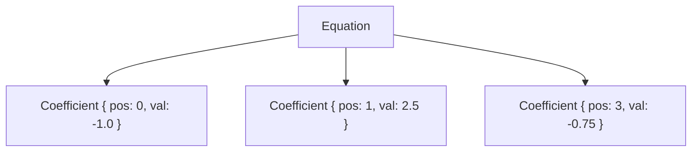

# Equation / Coefficient

## 🧠 코드 구조 분석
### 🔹 Coefficient 구조체
```rust
pub struct Coefficient {
    pub pos: usize, // 열 인덱스
    pub val: f64,   // 해당 위치의 값
}
```

- 희소 행렬의 한 항을 표현
- PartialEq은 pos 기준으로만 비교 → 같은 열인지 판단에 사용

### 🔹 Equation 구조체
```rust
pub struct Equation {
    terms: Vec<Coefficient>, // 항상 pos 오름차순 유지
}
```

- 하나의 희소 벡터 또는 선형 방정식을 표현
- 내부적으로 terms는 정렬된 Coefficient 리스트

## 🔧 주요 메서드

| 메서드 이름              | 설명                                      | 주요 인자         |
|--------------------------|-------------------------------------------|--------------------|
| add(pos, val)            | pos 위치에 항을 추가하거나 병합           | pos: 열 인덱스     |
| remove_at_shift(pos)     | 해당 열 제거 후, 이후 열 인덱스를 -1 이동 | pos: 제거할 열 인덱스 |
| get(pos)                 | 특정 열 인덱스에 해당하는 항을 조회       | pos: 조회할 열 인덱스 |
| terms()                  | 전체 항 목록을 읽기 전용으로 반환         | (없음)             |
| dot_dense(x)             | 밀집 벡터 x와 내적 계산                   | x: &[f64]          |
| dot_csr(row, i, j, a, x) | CSR 형식의 행과 벡터 x의 내적 계산        | row, i, j, a, x    |


## 🏗️ CAD 시스템에서의 활용 위치
이 구조는 CAD의 수치 해석 엔진에서 다음과 같은 역할을 수행할 수 있습니다:

### 1. 🎯 기하 제약 해석 (Geometric Constraint Solving)
- CAD에서 점, 선, 원 사이의 관계(거리, 각도, 평행 등)를 수학적으로 표현
- 이 관계들은 선형 방정식으로 구성되며, Equation은 그 희소 표현
- 예: "점 A와 B 사이의 거리는 10" → Equation으로 표현 후 해석

### 2. 🧮 희소 행렬 기반 해법
- 대규모 시스템에서 대부분의 항이 0인 경우가 많음
- Equation은 각 행을 희소하게 표현 → 메모리 절약 + 연산 최적화
- dot_dense와 dot_csr는 해법 알고리즘에서 핵심 연산

### 3. 🛠️ 파라메트릭 모델링
- 사용자가 모델의 일부를 수정하면 관련 요소들이 자동으로 재계산됨
- 이때 내부적으로 선형 시스템을 풀어야 하며, Equation이 각 요소의 수학적 관계를 표현

### 4. 📐 구속 조건 제거 및 변수 재정렬
- remove_at_shift는 CAD에서 변수(예: 특정 점의 좌표)를 제거할 때 유용
- 이후 연산을 위해 열 인덱스를 자동으로 재정렬

## ✅ 요약
| 구성 요소             | 설명                                      | 관련 메서드                  | 주요 역할                     |
|----------------------|-------------------------------------------|------------------------------|-------------------------------|
| Coefficient          | 하나의 항 (열 인덱스 + 값)                | N/A                          | 희소 행렬 항목 표현           |
| Equation             | Coefficient들의 정렬된 리스트             | new, with_capacity, terms    | 희소 벡터 또는 방정식 표현    |
| add/remove_at_shift  | 항 추가 및 제거 + 열 인덱스 재정렬        | add(pos, val), remove_at_shift(pos) | 항 병합, 변수 제거 처리       |
| dot_dense/dot_csr    | 벡터 또는 CSR 행과의 내적 계산            | dot_dense(x), dot_csr(row, i, j, a, x) | 수치 해석 연산 (내적)         |

---

# 🏗️ 실전 예제 시나리오: CAD에서 기하 제약 해석

## ✏️ 문제 상황
사용자가 CAD에서 다음과 같은 제약을 설정했다고 가정해요:
- 점 A와 B의 x좌표 차이가 10이어야 한다 → x_B - x_A = 10
- 점 B와 C의 x좌표 차이가 5이어야 한다 → x_C - x_B = 5

### 이걸 선형 방정식으로 표현하면:
```
-1·x_A + 1·x_B = 10
-1·x_B + 1·x_C = 5
```

- 이 두 식을 Equation 구조체로 표현하고, on_solve_2x2로 해를 구해볼 수 있음.

### 🧪 Rust 코드 예제
```rust
use crate::equation::{Equation, Coefficient, on_solve_2x2};

fn main() {
    // 첫 번째 제약식: -1·x_A + 1·x_B = 10
    let mut eq1 = Equation::new();
    eq1.add(0, -1.0); // x_A
    eq1.add(1, 1.0);  // x_B
    let d0 = 10.0;

    // 두 번째 제약식: -1·x_B + 1·x_C = 5
    let mut eq2 = Equation::new();
    eq2.add(1, -1.0); // x_B
    eq2.add(2, 1.0);  // x_C
    let d1 = 5.0;

    // 2x2 시스템으로 축소: x_B와 x_C만 해석한다고 가정
    let m00 = eq1.get(1).map_or(0.0, |c| c.val); // x_B in eq1
    let m01 = 0.0; // x_C not in eq1
    let m10 = eq2.get(1).map_or(0.0, |c| c.val); // x_B in eq2
    let m11 = eq2.get(2).map_or(0.0, |c| c.val); // x_C in eq2

    let result = on_solve_2x2(m00, m01, m10, m11, d0, d1);
    println!("해석 결과: {:?}", result);
}
```


### ✅ 출력 예시
````
해석 결과: Solve2x2Result {
    rank: 2,
    x: 10.0, // x_B
    y: 15.0, // x_C
    pivot_ratio: 1.0
}
```

### 구조도



## 🧠 확장 아이디어
- 여러 Equation을 모아 희소 행렬 시스템으로 구성 → LU 분해, Gauss 소거법 등 적용 가능
- remove_at_shift로 CAD에서 특정 점을 삭제하거나 변수 재정렬
- dot_dense로 해를 적용해 제약 만족 여부 검증

---

