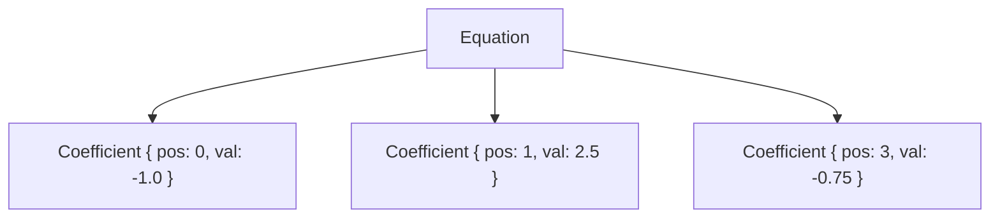

# Equation / Coefficient

## 🧠 코드 구조 분석
### 🔹 Coefficient 구조체
```rust
pub struct Coefficient {
    pub pos: usize, // 열 인덱스
    pub val: f64,   // 해당 위치의 값
}
```

- 희소 행렬의 한 항을 표현
- PartialEq은 pos 기준으로만 비교 → 같은 열인지 판단에 사용

### 🔹 Equation 구조체
```rust
pub struct Equation {
    terms: Vec<Coefficient>, // 항상 pos 오름차순 유지
}
```

- 하나의 희소 벡터 또는 선형 방정식을 표현
- 내부적으로 terms는 정렬된 Coefficient 리스트

## 🔧 주요 메서드

| 메서드 이름              | 설명                                      | 주요 인자         |
|--------------------------|-------------------------------------------|--------------------|
| add(pos, val)            | pos 위치에 항을 추가하거나 병합           | pos: 열 인덱스     |
| remove_at_shift(pos)     | 해당 열 제거 후, 이후 열 인덱스를 -1 이동 | pos: 제거할 열 인덱스 |
| get(pos)                 | 특정 열 인덱스에 해당하는 항을 조회       | pos: 조회할 열 인덱스 |
| terms()                  | 전체 항 목록을 읽기 전용으로 반환         | (없음)             |
| dot_dense(x)             | 밀집 벡터 x와 내적 계산                   | x: &[f64]          |
| dot_csr(row, i, j, a, x) | CSR 형식의 행과 벡터 x의 내적 계산        | row, i, j, a, x    |


## 🏗️ CAD 시스템에서의 활용 위치
이 구조는 CAD의 수치 해석 엔진에서 다음과 같은 역할을 수행할 수 있습니다:

### 1. 🎯 기하 제약 해석 (Geometric Constraint Solving)
- CAD에서 점, 선, 원 사이의 관계(거리, 각도, 평행 등)를 수학적으로 표현
- 이 관계들은 선형 방정식으로 구성되며, Equation은 그 희소 표현
- 예: "점 A와 B 사이의 거리는 10" → Equation으로 표현 후 해석

### 2. 🧮 희소 행렬 기반 해법
- 대규모 시스템에서 대부분의 항이 0인 경우가 많음
- Equation은 각 행을 희소하게 표현 → 메모리 절약 + 연산 최적화
- dot_dense와 dot_csr는 해법 알고리즘에서 핵심 연산

### 3. 🛠️ 파라메트릭 모델링
- 사용자가 모델의 일부를 수정하면 관련 요소들이 자동으로 재계산됨
- 이때 내부적으로 선형 시스템을 풀어야 하며, Equation이 각 요소의 수학적 관계를 표현

### 4. 📐 구속 조건 제거 및 변수 재정렬
- remove_at_shift는 CAD에서 변수(예: 특정 점의 좌표)를 제거할 때 유용
- 이후 연산을 위해 열 인덱스를 자동으로 재정렬

## ✅ 요약
| 구성 요소             | 설명                                      | 관련 메서드                  | 주요 역할                     |
|----------------------|-------------------------------------------|------------------------------|-------------------------------|
| Coefficient          | 하나의 항 (열 인덱스 + 값)                | N/A                          | 희소 행렬 항목 표현           |
| Equation             | Coefficient들의 정렬된 리스트             | new, with_capacity, terms    | 희소 벡터 또는 방정식 표현    |
| add/remove_at_shift  | 항 추가 및 제거 + 열 인덱스 재정렬        | add(pos, val), remove_at_shift(pos) | 항 병합, 변수 제거 처리       |
| dot_dense/dot_csr    | 벡터 또는 CSR 행과의 내적 계산            | dot_dense(x), dot_csr(row, i, j, a, x) | 수치 해석 연산 (내적)         |

---

# 🏗️ 실전 예제 시나리오: CAD에서 기하 제약 해석

## ✏️ 문제 상황
사용자가 CAD에서 다음과 같은 제약을 설정했다고 가정해요:
- 점 A와 B의 x좌표 차이가 10이어야 한다 → x_B - x_A = 10
- 점 B와 C의 x좌표 차이가 5이어야 한다 → x_C - x_B = 5

### 이걸 선형 방정식으로 표현하면:
```
-1·x_A + 1·x_B = 10
-1·x_B + 1·x_C = 5
```

- 이 두 식을 Equation 구조체로 표현하고, on_solve_2x2로 해를 구해볼 수 있음.

### 🧪 Rust 코드 예제
```rust
use crate::equation::{Equation, Coefficient, on_solve_2x2};

fn main() {
    // 첫 번째 제약식: -1·x_A + 1·x_B = 10
    let mut eq1 = Equation::new();
    eq1.add(0, -1.0); // x_A
    eq1.add(1, 1.0);  // x_B
    let d0 = 10.0;

    // 두 번째 제약식: -1·x_B + 1·x_C = 5
    let mut eq2 = Equation::new();
    eq2.add(1, -1.0); // x_B
    eq2.add(2, 1.0);  // x_C
    let d1 = 5.0;

    // 2x2 시스템으로 축소: x_B와 x_C만 해석한다고 가정
    let m00 = eq1.get(1).map_or(0.0, |c| c.val); // x_B in eq1
    let m01 = 0.0; // x_C not in eq1
    let m10 = eq2.get(1).map_or(0.0, |c| c.val); // x_B in eq2
    let m11 = eq2.get(2).map_or(0.0, |c| c.val); // x_C in eq2

    let result = on_solve_2x2(m00, m01, m10, m11, d0, d1);
    println!("해석 결과: {:?}", result);
}
```


### ✅ 출력 예시
```
해석 결과: Solve2x2Result {
    rank: 2,
    x: 10.0, // x_B
    y: 15.0, // x_C
    pivot_ratio: 1.0
}
```

### 구조도



## 🧠 확장 아이디어
- 여러 Equation을 모아 희소 행렬 시스템으로 구성 → LU 분해, Gauss 소거법 등 적용 가능
- remove_at_shift로 CAD에서 특정 점을 삭제하거나 변수 재정렬
- dot_dense로 해를 적용해 제약 만족 여부 검증

---

## 소스
```rust
#[derive(Debug, Clone, Copy)]
pub struct Coefficient {
    pub pos: usize,
    pub val: f64,
}

// Note: If you only want to compare "same column" semantically, use PartialEq based on pos.
// (Use only in sort/merge, and manage it in the public API to avoid confusion.)
impl PartialEq for Coefficient {
    fn eq(&self, other: &Self) -> bool { self.pos == other.pos }
}
impl Eq for Coefficient {}

#[derive(Debug, Default, Clone)]
pub struct Equation {
    terms: Vec<Coefficient>, // Always keep pos in ascending order
}

impl Equation {
    pub fn new() -> Self {
        Self { terms: Vec::new() }
    }

    pub fn with_capacity(n: usize) -> Self {
        Self { terms: Vec::with_capacity(n) }
    }

    /// Maintain sorting + merge same pos
    pub fn add(&mut self, pos: usize, val: f64) {
        match self.terms.binary_search_by_key(&pos, |c| c.pos) {
            Ok(i) => {
                self.terms[i].val += val;
                // Optionally remove very small values to 0 if necessary
                // if self.terms[i].val.abs() < 1e-20 { self.terms.remove(i); }
            }
            Err(i) => self.terms.insert(i, Coefficient { pos, val }),
        }
    }

    /// Remove the column (pos) and increment all indices of columns greater than it by 1.
    /// (Preserves the original C# RemoveAt intent + off-by-one/fixes omissions)
    pub fn remove_at_shift(&mut self, pos: usize) {
        match self.terms.binary_search_by_key(&pos, |c| c.pos) {
            Ok(i) => {
                // Remove the term corresponding to pos
                self.terms.remove(i);
                // All pos in the back row are -1
                for t in &mut self.terms[i..] {
                    t.pos -= 1;
                }
            }
            Err(_insertion_point) => {
                // Even if the column doesn't exist, all larger columns are -1 (renumber columns by deleting variables)
                for t in &mut self.terms {
                    if t.pos > pos {
                        t.pos -= 1;
                    }
                }
                // Sort is maintained
            }
        }
    }

    /// Get the item corresponding to pos as a reference.
    pub fn get(&self, pos: usize) -> Option<&Coefficient> {
        self.terms
            .binary_search_by_key(&pos, |c| c.pos)
            .ok()
            .map(|i| &self.terms[i])
    }

    /// Expose the current items as a (pos,val) slice (read-only)
    pub fn terms(&self) -> &[Coefficient] {
        &self.terms
    }

    /// Sparse-dense inner product: sum_i val_i * x[pos_i]
    pub fn dot_dense(&self, x: &[f64]) -> f64 {
        let mut acc = 0.0;
        for c in &self.terms {
            acc += c.val * x[c.pos];
        }
        acc
    }

    /// Dot product in a single row in CSR format: for row r, sum_{k=I[r]..I[r+1]-1} A[k]*x[J[k]]
    pub fn dot_csr(row: usize, i: &[usize], j: &[usize], a: &[f64], x: &[f64]) -> f64 {
        assert!(row + 1 < i.len(), "CSR: I must have len >= rows+1");
        let (s, e) = (i[row], i[row + 1]);
        assert!(e <= a.len() && e <= j.len(), "CSR: A/J length mismatch");

        let mut acc = 0.0;
        for k in s..e {
            acc += a[k] * x[j[k]];
        }
        acc
    }
}
```

### 테스트 코드
```rust
#[cfg(test)]
mod tests {
    use geometry::core::equation::{Coefficient, Equation};
    use geometry::geom::utils::math::on_solve_2x2;

    fn approx(a: f64, b: f64, eps: f64) -> bool {
        (a - b).abs() <= eps
    }

    #[test]
    fn add_merges_same_pos_and_keeps_sorted() {
        let mut eq = Equation::new();
        eq.add(3, 2.0);
        eq.add(1, 5.0);
        eq.add(3, 0.5); // 병합되어 pos=3 항의 값이 2.5가 됨
        eq.add(2, -1.0);

        let terms = eq.terms();
        let poses: Vec<_> = terms.iter().map(|c| c.pos).collect();
        let vals:  Vec<_> = terms.iter().map(|c| c.val).collect();

        assert_eq!(poses, vec![1, 2, 3], "positions must be sorted and unique");
        assert!(approx(vals[0], 5.0, 1e-12));
        assert!(approx(vals[1], -1.0, 1e-12));
        assert!(approx(vals[2],  2.5, 1e-12));
    }

    #[test]
    fn remove_at_shift_existing_pos() {
        // 초기:  (1:5.0), (2:-1.0), (3:2.5)
        let mut eq = Equation::new();
        eq.add(1, 5.0);
        eq.add(2, -1.0);
        eq.add(3, 2.5);

        // pos=2 제거 → (2:-1.0) 삭제, pos>2 들은 -1 → (1:5.0),(2:2.5)
        eq.remove_at_shift(2);

        let terms = eq.terms();
        let poses: Vec<_> = terms.iter().map(|c| c.pos).collect();
        let vals:  Vec<_> = terms.iter().map(|c| c.val).collect();

        assert_eq!(poses, vec![1, 2]);
        assert!(approx(vals[0], 5.0, 1e-12));
        assert!(approx(vals[1], 2.5, 1e-12));
    }

    #[test]
    fn remove_at_shift_missing_pos_still_shifts_bigger() {
        // 초기: (1:1.0), (3:3.0), (5:5.0)
        let mut eq = Equation::new();
        eq.add(1, 1.0);
        eq.add(3, 3.0);
        eq.add(5, 5.0);

        // pos=2 제거: 실제로 pos=2 항은 없지만, pos>2 인 것들(3,5)은 각각 2,4로 -1
        eq.remove_at_shift(2);

        let terms = eq.terms();
        let poses: Vec<_> = terms.iter().map(|c| c.pos).collect();
        let vals:  Vec<_> = terms.iter().map(|c| c.val).collect();

        assert_eq!(poses, vec![1, 2, 4]);
        assert!(approx(vals[0], 1.0, 1e-12));
        assert!(approx(vals[1], 3.0, 1e-12));
        assert!(approx(vals[2], 5.0, 1e-12));
    }

    #[test]
    fn get_returns_some_when_present_none_when_absent() {
        let mut eq = Equation::new();
        eq.add(4, 10.0);
        eq.add(7, -2.0);

        let c4 = eq.get(4).copied();
        let c6 = eq.get(6).copied();

        assert!(matches!(c4, Some(Coefficient { pos: 4, val: v }) if approx(v, 10.0, 1e-12)));
        assert!(c6.is_none());
    }

    #[test]
    fn dot_dense_is_correct() {
        // eq: 2*x1 + (-1)*x3 + 0.5*x5
        let mut eq = Equation::new();
        eq.add(1, 2.0);
        eq.add(3, -1.0);
        eq.add(5, 0.5);

        let x = vec![0.0, 10.0, 0.0, 1.5, 0.0, 8.0];
        let y = eq.dot_dense(&x);
        // 2*10 + (-1)*1.5 + 0.5*8 = 20 - 1.5 + 4 = 22.5
        assert!(approx(y, 22.5, 1e-12));
    }

    #[test]
    fn dot_csr_is_correct() {
        // 3x3 예: 행별로 테스트
        // A = [[2, 0, 1],
        //      [0, 3, 0],
        //      [4, 0, 5]]
        // CSR:
        // I = [0, 2, 3, 5]
        // J = [0, 2, 1, 0, 2]
        // V = [2, 1, 3, 4, 5]
        let i = vec![0, 2, 3, 5];
        let j = vec![0, 2, 1, 0, 2];
        let a = vec![2.0, 1.0, 3.0, 4.0, 5.0];
        let x = vec![1.0, 2.0, 3.0];

        // row0: 2*x0 + 1*x2 = 2*1 + 1*3 = 5
        let y0 = Equation::dot_csr(0, &i, &j, &a, &x);
        // row1: 3*x1 = 6
        let y1 = Equation::dot_csr(1, &i, &j, &a, &x);
        // row2: 4*x0 + 5*x2 = 4*1 + 5*3 = 19
        let y2 = Equation::dot_csr(2, &i, &j, &a, &x);

        assert!(approx(y0, 5.0, 1e-12));
        assert!(approx(y1, 6.0, 1e-12));
        assert!(approx(y2, 19.0, 1e-12));
    }

    #[test]
    fn test_equation_solver2x2() {
        // 첫 번째 제약식: -1·x_A + 1·x_B = 10
        let mut eq1 = Equation::new();
        eq1.add(0, -1.0); // x_A
        eq1.add(1, 1.0);  // x_B
        let d0 = 10.0;

        // 두 번째 제약식: -1·x_B + 1·x_C = 5
        let mut eq2 = Equation::new();
        eq2.add(1, -1.0); // x_B
        eq2.add(2, 1.0);  // x_C
        let d1 = 5.0;

        // 2x2 시스템으로 축소: x_B와 x_C만 해석한다고 가정
        let m00 = eq1.get(1).map_or(0.0, |c| c.val); // x_B in eq1
        let m01 = 0.0; // x_C not in eq1
        let m10 = eq2.get(1).map_or(0.0, |c| c.val); // x_B in eq2
        let m11 = eq2.get(2).map_or(0.0, |c| c.val); // x_C in eq2

        let result = on_solve_2x2(m00, m01, m10, m11, d0, d1);
        println!("해석 결과: {:?}", result);
        // 해석 결과: Solve2x2Result {
        //     rank: 2,
        //     x: 10.0, // x_B
        //     y: 15.0, // x_C
        //     pivot_ratio: 1.0
        // }
    }

    #[test]
    fn dot_dense_matches_csharp_meaning() {
        // eq: 2*x1 + (-1)*x3 + 0.5*x5
        let mut eq = Equation::new();
        eq.add(1, 2.0);
        eq.add(3, -1.0);
        eq.add(5, 0.5);

        let x = vec![0.0, 10.0, 0.0, 1.5, 0.0, 8.0];
        // 2*10 + (-1)*1.5 + 0.5*8 = 22.5
        assert!((eq.dot_dense(&x) - 22.5).abs() < 1e-12);
    }

    #[test]
    fn dot_csr_row_matches_standard_csr() {
        // A = [[2,0,1],
        //      [0,3,0],
        //      [4,0,5]]
        // CSR:
        // I = [0, 2, 3, 5]
        // J = [0, 2, 1, 0, 2]
        // V = [2, 1, 3, 4, 5]
        let i = vec![0, 2, 3, 5];
        let j = vec![0, 2, 1, 0, 2];
        let a = vec![2.0, 1.0, 3.0, 4.0, 5.0];
        let x = vec![1.0, 2.0, 3.0];

        // row0: 2*x0 + 1*x2 = 5
        // row1: 3*x1 = 6
        // row2: 4*x0 + 5*x2 = 19
        assert!((Equation::dot_csr(0, &i, &j, &a, &x) - 5.0).abs() < 1e-12);
        assert!((Equation::dot_csr(1, &i, &j, &a, &x) - 6.0).abs() < 1e-12);
        assert!((Equation::dot_csr(2, &i, &j, &a, &x) - 19.0).abs() < 1e-12);
    }
}
```

