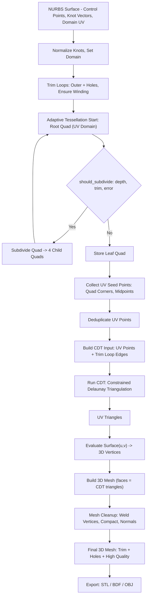

# Surface adaptive tessellation + trim + CDT
## 0. 전체 목표
- NURBS 서페이스(트림 포함)를 입력으로 받아서:
    - UV 공간에서 adaptive tessellation으로 seed 절점들을 생성하고
    - Trim loop(outer + holes)를 기준으로 UV 도메인을 잘라내고
    - 이 UV 절점들과 trim loop를 CDT(Constrained Delaunay Triangulation) 입력으로 넘겨
    - Trim 및 hole을 정확히 반영한 고품질 삼각형 메쉬를 만들고
    - 마지막에 UV → 3D로 평가해서 최종 3D 메쉬를 얻는 것.
- 핵심 아이디어:
    - Adaptive tessellation은 **절점 생성기(seed generator)** 역할만 한다.
    - 최종 삼각형 메쉬는 CDT가 만든다.
    - Trim은 이미 부드러운 커브지만, CDT 입장에서는 폴리라인 경계(outer + holes) 로 전달된다.

## 1. 데이터 구조 개요
### 1.1. NURBS surface
```rust
struct NurbsSurface {
    dim: usize,           // 3
    pu: usize,            // degree in u
    pv: usize,            // degree in v
    nu: usize,            // control point count in u
    nv: usize,            // control point count in v
    ctrl: Vec<Point4D>,   // homogeneous control points
    ku: KnotVector,       // U knot
    kv: KnotVector,       // V knot
    domain_u: Interval,   // [u_min, u_max]
    domain_v: Interval,   // [v_min, v_max]
}
```

- 중요한 점:
    - ku, kv는 normalisation 필요할 수 있음.
    - 예: [10,10,20,20] → [0,0,1,1] 로 정규화.
        - evaluate(u,v) -> Point3D 가 반드시 domain_u/domain_v에 맞게 동작해야 한다.

### 1.2. Trim / Feature / Boundary
```rust
struct TrimLoops {
    outer: TrimLoop,      // 바깥 경계(필수)
    inners: Vec<TrimLoop> // holes (optional)
}
```
```rust
struct TrimLoop {
    points: Vec<(f64, f64)>, // UV 좌표의 폴리라인 (닫힌 루프, 첫/마지막 동일)
    // 필요 시 winding 보정 함수
    // fn ensure_ccw(&mut self)
}
```

- outer는 일반적으로 CCW(winding)
- hole(inners)은 보통 CW
- winding은 point-in-polygon / inside 테스트에서 중요하다.

### 1.3. ParamQuad (UV domain subdivision)
- UV 공간에서 사용하는 기본 단위 사각형.
```rust
struct ParamQuad {
    uv: [(f64, f64); 4], // 보통 (bl, br, tr, tl) 또는 (0,1,2,3) 순서 일관성 유지
    // 필요 시 precalc된 bbox 등
}
```
- 기본적으로 하는 역할:
    - UV 직사각형 영역 표현
    - subdivide로 4개의 자식 quad 생성
    - trim과의 교차 여부 검사
    - quad의 중심, edge midpoints 등 계산

### 1.4. AdaptiveTessellation 옵션
```rust
struct AdaptiveTessellationOptions {
    max_deviation: f64,     // 허용 최대 형상 편차
    max_normal_angle: f64,  // 허용 최대 법선 각도 (deg)
    max_edge_length: f64,   // 허용 최대 edge 길이 (UV 또는 3D 기준, 설계에 따라)
    min_edge_length: f64,   // (선택 사항) 너무 작은 edge는 더 안 자름
    max_depth: usize,       // 재귀 최대 깊이
    refine_boundaries: bool,// trim / boundary 근처 추가 refine 여부
    boundary_curves: Vec<Curve2D>,
    feature_curves: Vec<Curve2D>,
    min_uv_size: f64,       // UV 상 최소 사이즈 (너무 작으면 중단)
}
```

### 1.5. PatchTessellator
- 한 서페이스 패치에 대한 tessellation 컨텍스트.
```rust
struct PatchTessellator<'a> {
    surface: &'a NurbsSurface,
    patch: SurfacePatch,      // 해당 패치의 UV 영역
    options: AdaptiveTessellationOptions,

    boundary_curves: Vec<Curve2D>,
    feature_curves: Vec<Curve2D>,
    trim_loops: TrimLoops,
}
```

### 1.6. Mesh
```rust
struct Mesh {
    vertices: Vec<Point3D>,
    faces: Vec<[usize; 4]>,   // 삼각형이면 [i0, i1, i2, i2]
    normals: Option<Vec<Vector3>>,
}
```

- 후처리에서:
    - vertex 중복 제거
    - triangularization
    - normals 계산
    - compact 등 수행.

## 2. UV 공간 Adaptive Tessellation 알고리즘
### 2.1. 전체 흐름
- 초기 quad: 패치 UV 영역 전체 (예: (0,0)-(1,1)).
- subdivide_quad(root, depth = 0, leaf_quads) 재귀 호출.
- 각 quad마다 should_subdivide(quad, depth) 평가.
- subdivide → 네 개의 자식 quad 생성 → 재귀.
- subdivide 안 하면 leaf_quads에 그대로 추가.
- 최종적으로 leaf_quads는 trim 안쪽 + 경계 근처 quad들만 남게 됨.

### 2.2. should_subdivide 로직 (Trim-aware)
- 아주 중요한 함수. 대략적인 구조:
```rust
pub fn should_subdivide(&self, quad: &ParamQuad, depth: usize) -> bool {
    // 1) depth limit
    if depth >= self.options.max_depth {
        return false;
    }

    // 2) 최소 UV 사이즈 제한 (너무 작으면 더 안 자름)
    if quad.too_small(self.options.min_uv_size) {
        return false;
    }

    // 3) (선택) 완전히 trim 바깥이면 일찍 버릴 수 있음
    // 이 부분을 너무 aggressive하게 쓰면 교차 quad를 놓치므로 주의.
    // 보통은 "center + intersects" 조합으로 쓰는 게 좋다.
    //
    // if !quad.center_inside_any_trim(&self.trim_loops)
    //    && !quad.intersects_trim(&self.trim_loops) {
    //     return false;
    // }

    // 4) trim 경계와 교차하면 → 무조건 subdivide
    let inter = quad.intersects_trim(&self.trim_loops);
    let center_in = quad.center_inside_any_trim(&self.trim_loops);
    println!("depth={}, inter_trim={}, center_in_trim={}", depth, inter, center_in);

    if inter {
        return true;
    }

    // 5) feature / boundary 근처면 subdivide
    if quad.has_feature_intersection(&self.feature_curves)
        || quad.has_feature_intersection(&self.boundary_curves)
    {
        return true;
    }

    // 6) 곡률/편차 기반 subdivide
    let err = self.eval_quad_error(quad);
    println!("depth={}, err={:?}", depth, err);

    if err.deviation > self.options.max_deviation {
        return true;
    }
    if err.normal_angle > self.options.max_normal_angle {
        return true;
    }
    if err.max_edge_len > self.options.max_edge_length {
        return true;
    }

    // 7) 여기까지 와서 center가 trim 안쪽이 아니면, 사실상 필요 없는 quad
    if !center_in {
        return false;
    }

    // 8) center가 trim 안이고, 에러도 작고, 교차도 없으면 subdivide 안 함 = leaf
    true
}
```
- 포인트:
    - 교차(intersects_trim) 여부를 최우선으로 본다.
    - center는 discard 용으로만 사용, 교차 quad를 막아버리는 데 쓰면 안 됨.
    - 에러 기준은 shape 복잡도에 따라 적절히 조정.

### 2.3. eval_quad_error
- 대략적으로:
    - quad의 각 코너 UV → 3D 평가.
    - center UV → 3D 평가.
    - 코너 기반 bilinear 보간 결과와 실제 center 평가 결과의 거리 → deviation.
    - 네 개의 코너에서 normal 계산 → normal 사이 각도 중 최대값 → normal_angle.
    - edge 길이 중 최대값 → max_edge_len.
```rust
struct QuadError {
    deviation: f64,
    normal_angle: f64,
    max_edge_len: f64,
}
```
- max_deviation, max_normal_angle, max_edge_length 를 잘 조절해서 subdivide 깊이를 제어한다.

### 2.4. subdivide 재귀
```rust
pub fn subdivide_quad(&self, quad: &ParamQuad, depth: usize, out: &mut Vec<ParamQuad>) {
    let subdiv = self.should_subdivide(quad, depth);
    println!("subdivide? depth={}, subdiv={}, quad={:?}", depth, subdiv, quad);

    if !subdiv {
        out.push(*quad);
        return;
    }

    let (q0, q1, q2, q3) = quad.subdivide(); // UV 영역을 4분할
    self.subdivide_quad(&q0, depth + 1, out);
    self.subdivide_quad(&q1, depth + 1, out);
    self.subdivide_quad(&q2, depth + 1, out);
    self.subdivide_quad(&q3, depth + 1, out);
}
```
- 최종적으로 leaf_quads.len()이 1이 아니라 여러 개가 나오면 subdivide가 실제로 잘 동작하고 있는 것.

## 3. UV → Mesh (하지만, 여기서는 “seed point 생성” 정도까지만)
### 3.1. 기존 quads_to_mesh의 역할
- 기존에는:
    - leaf_quads를 받아서
    - 각 quad를 두 개의 삼각형으로 나누고
    - 각 삼각형의 UV를 evaluate 해서 3D vertex를 생성하고
    - Mesh 객체를 반환.
- 예:
```rust
fn quads_to_mesh(tess: &PatchTessellator, quads: &[ParamQuad]) -> Mesh {
    let mut mesh = Mesh::new();

    for quad in quads {
        let tris = quad.to_triangles_uv(); // [(u,v); 3] × 2

        for tri in &tris {
            let i0 = mesh.vertices.len();
            for &(u, v) in tri {
                let p = tess.surface.evaluate(u, v);
                mesh.vertices.push(p);
            }
            mesh.faces.push([i0, i0 + 1, i0 + 2, i0 + 2]);
        }
    }

    mesh
}
```

- 이 방식의 문제:
    - triangle마다 vertex를 새로 만들기 때문에 같은 위치에 있는 vertex가 공유되지 않고 중복된다.
- 하지만 CDT를 도입하면 이 단계에서 삼각형을 만들지 말고:
    - UV 절점만
    - 또는 UV + trim loop만
    - CDT 입력용으로 사용하게 된다.

### 3.2. 지금부터는 “삼각형 만들지 말고, UV seed point만 쓴다”
- 새로운 목표:
    - Adaptive tessellation 결과에서:
    - quad의 corner / edge / center에서 UV 절점을 추출
    - 이 UV 절점들을 deduplication하고
    - Trim loop의 vertex들과 함께 CDT 입력으로 넘긴다.
- 즉, 여기서는 Mesh를 직접 만들 필요 없이,
```rust
struct UvVertex {
    u: f64,
    v: f64,
}
```
- 들의 리스트만 얻으면 된다.
- 예:
```rust
fn collect_uv_seeds_from_quads(quads: &[ParamQuad]) -> Vec<(f64, f64)> {
    let mut seeds = Vec::new();
    for quad in quads {
        for &(u, v) in &quad.uv {
            seeds.push((u, v));
        }
        // 필요하다면 center, edge midpoint도 포함 가능
        // let center = quad.center();
        // seeds.push(center);
    }
    seeds
}
```

- 이후 UV seed는 CDT로 넘기기 전에 deduplication 해야 한다.

## 4. Vertex 정리(deduplication)와 mesh 후처리
### 4.1. Tessellation 이후 반드시 필요한 정리
- raw tessellation:
    - vertex 중복
    - face 간 vertex 공유 없음
    - normals 없음
    - topology 없음
- 후처리 단계에서 해야 할 일:
    - Vertex deduplication
    - 같은 좌표의 vertex를 하나로 병합
    - face 인덱스를 재매핑
    - Compact
    - 사용되지 않는 vertex 제거
    - 인덱스 정렬
    - Triangulate(필요시)
    - quad → triangle
    - Normals 계산
    - face normal, vertex normal
    - Topology 생성(선택)
- edge, face adjacency 정보.
- Rust 코드에서 예시:
```rust
let mut mesh = quads_to_mesh(&tess, &leaf_quads);

// 1) vertex 병합
Mesh::optimize_mesh(&mut mesh);
// 또는
// on_weld_vertices(&mut mesh, 1e-6);
// 2) compact
on_compact_vertices(&mut mesh);
// 3) triangulate 강제 (필요시)
on_force_triangulate(&mut mesh);

// 4) normals
mesh.compute_normals();
```

## 5. CDT(Constrained Delaunay Triangulation)와의 결합
- 여기부터가 진짜 파이프라인의 핵심이다.
### 5.1. CDT가 하는 일
- CDT는:
    - 주어진 점 집합(point set)과
    - 주어진 constraint edge들(경계, trim loop)을 입력으로 받고
    - constraint를 유지하면서 Delaunay에 가까운 삼각형 mesh를 생성한다.
- 중요한 특성:
    - CDT는 내부 절점을 “알아서” 추가하지 않는다.  
        (일부 알고리즘/라이브러리는 refinement를 제공하지만, 기본 CDT는 그러지 않는다.)
    - **어디에 점을 더 추가해야 하는지** 는 CDT가 모른다.
    - 따라서 곡률 기반으로 내부 점을 생성하는 역할은 다른 알고리즘(여기서는 Adaptive Tessellation)이 맡아야 한다.

### 5.2. 그래서 Adaptive Tessellation + CDT 조합이 필요한 이유
- 정리하면:
    - Adaptive Tessellation
    - 곡률 기반/에러 기반으로 UV 공간에 seed 절점 생성
    - trim-aware subdivide로 경계 근처 더 촘촘하게 점 생성
    - 이 절점들은 “어디가 어려운 영역인지”를 반영
    - CDT
    - 주어진 절점들 + trim loop(outer + holes)를 입력으로 받아
    - constraint를 지키면서 Delaunay triangulation
    - 삼각형 연결(토폴로지)을 잘 만들어 주는 역할
- 둘을 합치면:
    - 곡률/형상 복잡도 → Adaptive Tessellation이 반영
    - 경계/trim/hole 정확도 → CDT가 반영
- 결과적으로:
    - 곡률도 반영되고
    - trim 경계도 정확하게 따르고
    - hole도 정확하게 뚫린
    - 고품질 triangle mesh를 얻는다.

### 5.3. CDT 입력 단계 설계
- CDT에 넘길 데이터:
    - Point set (UV)
    - Adaptive tessellation에서 얻은 seed UV 절점들
    - Trim loop의 모든 vertex (outer + inner)
    - 필요하다면 feature/boundary curves 샘플링한 점들
    - Constraint edges
    - Trim loop의 각 segment를 edge로 등록
    - outer loop, inner holes 모두 포함
    - feature curve가 있으면 이들도 constraint로 포함 가능.
- 절차:
    - leaf_quads에서 UV seed 추출 (collect_uv_seeds_from_quads).
    - Trim loop의 점들도 point set에 포함.
    - UV 좌표 기반 deduplication (eps 허용).
    - 각 trim loop에 대해, (p[i], p[i+1])를 constraint edge로 등록 (마지막은 첫 점과 연결).
    - 이 point set + edge set을 CDT 라이브러리로 넘겨 triangulation.
- CDT 결과:
    - UV triangle 리스트: 각 triangle은 3개의 (u,v) 인덱스로 표현.

### 5.4. UV Triangle → 3D Mesh
- 마지막 단계:
    - 각 UV vertex에 대해 surface.evaluate(u,v) 호출
    - Mesh.vertices를 채우고
    - faces를 CDT 결과에 맞게 채운다.
- 예:
```rust
fn uv_tris_to_mesh(surface: &NurbsSurface, uv_vertices: &[(f64, f64)], tris: &[[usize; 3]]) -> Mesh {
    let mut mesh = Mesh::new();

    // 1. UV vertex → 3D vertex
    for &(u, v) in uv_vertices {
        mesh.vertices.push(surface.evaluate(u, v));
    }

    // 2. faces
    for tri in tris {
        let [i0, i1, i2] = *tri;
        mesh.faces.push([i0, i1, i2, i2]);
    }

    // 3. normals 등 후처리
    // Mesh::optimize_mesh(&mut mesh); // 필요시
    // mesh.compute_normals();

    mesh
}
```

## 6. 이 설계에서 중요한 포인트 요약
- NURBS → UV tessellation → CDT → 3D mesh가 전체 구조다.
- Adaptive tessellation은 삼각형을 직접 만드는 게 목적이 아니다.
- 목적: **어디에 점이 필요할지** 알려주는 seed point generator.
- Trim-aware subdivision:
    - trim 바깥 quad는 early discard 가능
    - trim 경계와 교차하는 quad는 반드시 subdivide
    - center 기반 inside/outside 판정은 leaf에서만 discard용으로 써야 한다.
    - min_uv_size는 **더 이상 자르지 말자** 는 하한이지, subdivide를 유도하지는 않는다.
- 에러 로깅:
    - depth, inter_trim, center_in_trim, err 찍어보는 게 디버깅 핵심.
- Mesh 후처리는 필수:
    - vertex deduplication
    - compact
    - triangulate
    - normals 계산
- CDT는:
    - 내부 점 생성하지 않는다 → 반드시 adaptive한 seed 점이 필요
    - trim/holes 같은 경계를 constraint edge로 유지해준다.
- 최종적으로:
    - Adaptive tessellation의 절점들은 **CDT 입력 seed** 로만 사용하고 삼각형은 CDT가 만들도록 맡기는 설계가 가장 안정적이다.

## 전체 과정


---
