## 📘 NURBS Surface Knot Vector Generation for Scattered Points
- Algorithm Documentation for on_fitting_knots_full and Supporting Functions

### 1. Overview
- on_fitting_knots_full는 랜덤하게 흩어진 2D 파라미터 점 집합
```math
\{ (u_i,v_i)\} _{i=0}^n
```
- 으로부터 NURBS 표면의 U/V Knot Vector를 자동으로 생성하는 알고리즘이다.
- 이 알고리즘은 다음 문제를 해결한다:
    - 격자형(N×M) 구조가 아닌 임의 점 분포에서
    - U/V 방향 Knot Vector를 어떻게 배치해야 하는가?

- 일반적인 chord-length, centripetal 방식은 1D 곡선에만 적합하며,  
    2D 표면에서는 점 분포의 비균일성 때문에 품질이 크게 떨어진다.
- on_fitting_knots_full는 다음 전략을 사용한다:
    - U/V 파라미터를 정렬
    - 여러 방식(method 1~4)으로 strip subdivision 수행
    - 각 strip에 포함되는 점 개수 분석
    - 2D grid(u-span × v-span)에서 점 분포 균형 평가
    - 가장 균형 좋은 U/V knot vector 선택

### 2. Mathematical Background
#### 2.1 Knot Vector Definition
- 차수 p 의 NURBS 곡선/표면에서 Knot Vector U 는 다음 조건을 만족해야 한다:
- 단조 증가
```math
U_0\leq U_1\leq \cdots \leq U_m
```
- 클램프(clamped)
```math
U_0=U_1=\cdots =U_p,\quad U_{m-p}=\cdots =U_m
```
- 내부 knot 개수
```math
r=m-(2p+1)
```
### 3. Algorithm Structure
#### 3.1 전체 흐름
```
on_fitting_knots_full
 ├─ 정렬된 u/v 파라미터 생성 (usort, vsort)
 ├─ U 방향 knot 후보 생성 (on_compute_param_sub_strips × 4 methods)
 ├─ V 방향 knot 후보 생성 (on_compute_param_sub_strips × 4 methods)
 ├─ U 후보 × V 후보 조합 평가
 │    └─ 각 (u-span, v-span) 박스에 포함된 점 개수 계산 (on_count_points_in_box)
 ├─ 가장 균형 좋은 조합 선택 (on_select_best_span)
 └─ 최종 Knot Vector 출력
```


### 4. Supporting Functions

#### 4.1 on_binary_search_bound — Binary Search for Parameter Location
- 목적
    - 정렬된 파라미터 배열 pars에서 주어진 값 pm이 속하는 구간 index를 찾는다.
- LEFT 모드
```math
\mathrm{find\  smallest\  }i\mathrm{\  such\  that\  pars}[i]\geq pm
```
- RIGHT 모드
```math
\mathrm{find\  largest\  }i\mathrm{\  such\  that\  pars}[i]\leq pm
```
- 반환값
    - LEFT: lower bound
    - RIGHT: upper bound

#### 4.2 on_count_param_spans — Count Points in a 1D Strip
- 목적
    - 구간 [pm_1,pm_2] 안에 포함되는 파라미터 개수를 센다.
```math
\mathrm{count}=|\{ i\mid pm_1\leq pars[i]\leq pm_2\} |
```

#### 4.3 on_count_points_in_box — Count Points in a 2D Box
- 목적
- 2D 파라미터 공간에서 다음 박스에 포함되는 점 개수를 센다:
```math
pm_1\leq u\leq pm_2,\quad pn_1\leq v\leq pn_2
```
이는 U/V knot 후보 조합의 품질을 평가하는 핵심 지표다.

#### 4.4 on_select_best_span — Best Span Selection
- 입력
    - mins[i]: i번째 방법에서 strip 중 최소 점 개수
    - maxs[i]: i번째 방법에서 strip 중 최대 점 개수
    - nums[i][j]: i번째 방법의 j번째 strip 점 개수
- 선택 기준
- 다음 우선순위로 가장 좋은 방법을 선택한다:
- 최소 점 개수(mins)가 가장 큰 방법
```math
\max (\mathrm{mins})
```
- 최소 점 개수가 같다면
    - 그 최소값을 가진 strip 개수가 많은 방법
- 그래도 같다면
    - 최대 점 개수(maxs)가 가장 작은 방법

### 5. on_compute_param_sub_strips — 1D Strip Subdivision (핵심 알고리즘)
- 목적
- 정렬된 파라미터 배열 pars에서 구간 [pm_1,pm_2] 을 nd+1개의  
    sub-strip으로 나누고 각 strip의 경계 knot 후보를 생성한다.
- 출력
    - kts[0..nd]: sub-strip 경계 knot
    - nks[0..nd]: 각 strip에 포함된 점 개수
    - min, max: strip 중 최소/최대 점 개수

#### 5.1 Strip Subdivision
- 구간 길이
```math
D=\frac{(i_2-i_1+1)}{nd+1}
```
- 각 sub-strip 경계는
```math
t_j=pm_1+jD,\quad j=1..nd
```
- 하지만 단순 등분이 아니라, method 1~4에 따라 다른 방식으로 보정된다.

#### 5.2 Method 1 — Linear Interpolation
```math
kts[j]=(1-\alpha )\, pars[\ell ]+\alpha \, pars[\ell +1]
```

#### 5.3 Method 2 — Local Averaging
```math
kts[j]=\frac{1}{n}\sum _{i=k_1}^{k_2}pars[i]
```

#### 5.4 Method 3 — Sliding Window Weighted Average
- 먼저 deg+nd-1 개의 임시 knot 생성
- 차수 deg 길이의 슬라이딩 윈도우로 평균
```math
kts[j]=\frac{\sum _{i=0}^{deg-1}nks[j+i]\cdot kts\_ full[j+i]}{\sum nks[j+i]}
```
#### 5.5 Method 4 — Adaptive Weighted Subdivision
- 각 sub-strip의 길이 변화량
```math
\Delta _j=\max (d_j-d_{j-1},\mathrm{tol})
```
- 가중치
```math
w_j=\frac{\max (\Delta )}{\Delta _j}
```
- 최종 knot
```math
kts[i]=\frac{\sum _{j=0}^{deg-1}w_{i+j}\cdot kts\_ full[i+j]}{\sum w_{i+j}}
```
### 6. 2D Grid Evaluation
- U/V knot 후보가 정해지면  
    각 U-span × V-span 박스에 포함되는 점 개수를 계산한다.
```math
N_{ij}=|\{ k\mid U_i\leq u_k<U_{i+1},\; V_j\leq v_k<V_{j+1}\} |
```
- 이 분포가 균일할수록 좋은 knot vector다.

### 7. Final Knot Vector Construction
- 선택된 U/V knot 후보를 기반으로 최종 Knot Vector는 다음과 같이 구성된다:

- base knot vector가 주어진 경우 내부 knot는 multiplicity까지 보존된다.

### 8. Summary
- 이 알고리즘은:
    - 랜덤 점 기반 표면 피팅에서
    - U/V 방향 knot vector를 자동으로 생성하는
    - 고급 adaptive subdivision 방식이다.
- 특징:
    - 1D strip subdivision (4 methods)
    - 2D grid balancing
    - base knot multiplicity 보존
    - cluster 대응
    - CAD 수준의 안정성

### 전체 흐름

```mermaid
flowchart TD

    A(Start: Input u, v, p, q, knu, knv, base knots) --> B(Sort u → usort, uidx)
    A --> C(Sort v → vsort, vidx)

    B --> D{U has internal knots❓}
    D -->|No ❲r = 2p+1❳| E(Clamp U using min/max or base)
    D -->|Yes| F(Compute U candidates via on_compute_param_sub_strips ❲4 methods❳)

    C --> G{V has internal knots❓}
    G -->|No ❲s = 2q+1❳| H(Clamp V using min/max or base)
    G -->|Yes| I(Compute V candidates via on_compute_param_sub_strips ❲4 methods❳)

    F --> J(U candidates ❲4 sets❳ )
    I --> K(V candidates ❲4 sets❳ )

    J --> L(Evaluate U×V combinations)
    K --> L

    L --> M(For each grid cell: count points via on_count_points_in_box)
    M --> N(Compute min/max distribution)
    N --> O(Select best combination via on_select_best_span)

    O --> P(Construct final U knot vector)
    O --> Q(Construct final V knot vector)

    P --> R(Return knu, knv ❲on_fitting_knots_full❳)
    Q --> R
```


###  on_compute_param_sub_strips 


###  2D Grid 평가

```mermaid
flowchart TD

    A(U candidates) --> C(Combine Uᵢ with Vⱼ)
    B(V candidates) --> C

    C --> D(Count points in each cell via on_count_points_in_box)
    D --> E(Compute min/max distribution)
    E --> F(Evaluate fairness metrics)
    F --> G(Select best via on_select_best_span)
```


--- 
## 소스 코드
```rust
/// - `a` is sorted in-place ascending.
/// - returns `ind` such that after sorting: `a[i] == a_in[ind[i]]`.
pub fn on_shell_sort_with_index(a: &mut [usize]) -> Vec<usize> {
    let len = a.len();
    if len == 0 {
        return Vec::new();
    }

    // ind[i] = original index of the element now at i
    let mut ind: Vec<usize> = (0..len).collect();

    // In C: n = highest index, so count = n+1
    let n = len - 1;

    // k is gap "count" (C starts from n+1)
    let mut k = n + 1;

    while k > 1 {
        if k >= 5 {
            k = (5 * k - 1) / 11; // same gap shrink as C
        } else {
            k = 1;
        }

        // for (i = n-k; i >= 0; --i)
        // Rust descending loop: (0..=n-k).rev()
        if n >= k {
            for i in (0..=(n - k)).rev() {
                let b = a[i];
                let bi = ind[i];

                // j = i+k; while j<=n && b > a[j] { shift } j+=k
                let mut j = i + k;
                while j <= n && b > a[j] {
                    a[j - k] = a[j];
                    ind[j - k] = ind[j];
                    j += k;
                }

                a[j - k] = b;
                ind[j - k] = bi;
            }
        }
    }

    ind
}
```
```rust
pub fn on_shell_sort_with_index_real(a: &mut [Real]) -> Vec<usize> {
    let len = a.len();
    let mut ind: Vec<usize> = (0..len).collect();
    if len <= 1 { return ind; }

    let n = len - 1;
    let mut k = n + 1;

    while k > 1 {
        if k >= 5 { k = (5 * k - 1) / 11; } else { k = 1; }

        if n >= k {
            for i in (0..=(n - k)).rev() {
                let b = a[i];
                let bi = ind[i];
                let mut j = i + k;
                while j <= n && b > a[j] {
                    a[j - k] = a[j];
                    ind[j - k] = ind[j];
                    j += k;
                }
                a[j - k] = b;
                ind[j - k] = bi;
            }
        }
    }
    ind
}
```
```rust
pub fn on_shellsort_index_only(a: &[usize]) -> (Vec<usize>, Vec<usize>) {
    let len = a.len();
    let mut ind: Vec<usize> = (0..len).collect();

    // shellsort ind by comparing a[ind[*]]
    let n = len.saturating_sub(1);
    let mut k = n + 1;

    while k > 1 {
        if k >= 5 { k = (5 * k - 1) / 11; } else { k = 1; }
        if n >= k {
            for i in (0..=(n - k)).rev() {
                let bi = ind[i];
                let b = a[bi];

                let mut j = i + k;
                while j <= n && b > a[ind[j]] {
                    ind[j - k] = ind[j];
                    j += k;
                }
                ind[j - k] = bi;
            }
        }
    }

    let mut sorted = Vec::with_capacity(len);
    for &ix in &ind {
        sorted.push(a[ix]);
    }
    (sorted, ind)
}
```
```rust
fn on_binary_search_bound(pars: &[Real], n1: usize, n2: usize, pm: Real, side: Side) -> isize {
    let mut low = n1 as isize;
    let mut high = n2 as isize;
    let mut mid = ((n1 + n2) / 2) as isize;

    match side {
        Side::Left => {
            if pm <= pars[n1] {
                return n1 as isize;
            }
            if pm > pars[n2] {
                return (n2 as isize) + 1;
            }

            while pm <= pars[(mid - 1) as usize] || pm > pars[mid as usize] {
                if pm <= pars[(mid - 1) as usize] {
                    high = mid;
                } else {
                    if low != mid {
                        low = mid;
                    } else {
                        low = high;
                    }
                }
                mid = (low + high) / 2;
            }
        }

        Side::Right => {
            if pm >= pars[n2] {
                return n2 as isize;
            }
            if pm < pars[n1] {
                return (n1 as isize) - 1;
            }

            while pm < pars[mid as usize] || pm >= pars[(mid + 1) as usize] {
                if pm < pars[mid as usize] {
                    high = mid;
                } else {
                    if low != mid {
                        low = mid;
                    } else {
                        low = high;
                    }
                }
                mid = (low + high) / 2;
            }
        }
    }

    mid
}
```
```rust
fn on_count_param_spans(pars: &[Real], n1: usize, n2: usize, pm1: Real, pm2: Real) -> (usize, usize, usize) {
    let mut ii1 = on_binary_search_bound(pars, n1, n2, pm1, Side::Left);
    let mut ii2 = on_binary_search_bound(pars, n1, n2, pm2, Side::Right);

    let mut nn = ii2 - ii1 + 1;
    if nn < 0 {
        nn = 0;
    }

    if ii1 > n2 as isize {
        ii1 = n2 as isize;
    }
    if ii2 < n1 as isize {
        ii2 = n1 as isize;
    }

    (nn as usize, ii1 as usize, ii2 as usize)
}
```
```rust
fn on_count_points_in_box(
    p_sort: &[Real],
    p_idx: &[usize],
    n1: usize,
    n2: usize,
    p_unsort_other_axis: &[Real],
    ps1: Real,
    ps2: Real,
    pu1: Real,
    pu2: Real,
) -> usize {
    let mut i1 = on_binary_search_bound(p_sort, n1, n2, ps1, Side::Left);
    let mut i2 = on_binary_search_bound(p_sort, n1, n2, ps2, Side::Right);

    if i2 < i1 {
        return 0;
    }

    if i1 > n2 as isize {
        i1 = n2 as isize;
    }
    if i2 < n1 as isize {
        i2 = n1 as isize;
    }

    let mut num = 0usize;
    for jj in (i1 as usize)..=(i2 as usize) {
        let kk = p_idx[jj];
        let val = p_unsort_other_axis[kk];
        if val >= pu1 && val <= pu2 {
            num += 1;
        }
    }
    num
}
```
```rust
fn on_select_best_span(n: usize, nums: &[Vec<usize>], nu: usize, mins: &[isize], maxs: &[isize]) -> usize {
    let mut kmn: isize = -1;
    let mut kmx: isize = -1;
    let mut kdx: usize = 0;

    for ii in 0..=n {
        if mins[ii] < 0 {
            continue;
        }
        if mins[ii] < kmn {
            continue;
        }

        if mins[ii] > kmn {
            kmn = mins[ii];
            kmx = maxs[ii];
            kdx = ii;
            continue;
        }

        let mut j1 = 0usize;
        let mut j2 = 0usize;

        for jj in 0..=nu {
            if nums[ii][jj] as isize == kmn {
                j1 += 1;
            }
            if nums[kdx][jj] as isize == kmn {
                j2 += 1;
            }
        }

        if j2 < j1 {
            continue;
        }
        if j2 == j1 && maxs[ii] >= kmx {
            continue;
        }

        kmn = mins[ii];
        kmx = maxs[ii];
        kdx = ii;
    }

    kdx
}
```
```rust
fn on_compute_param_sub_strips(
    pars: &[Real],
    n1: usize,
    n2: usize,
    pm1: Real,
    pm2: Real,
    nd: usize,
    method: i32,
    deg: usize,
    kts: &mut [Real],  // 최소 nd+1 필요 (출력)
    nks: &mut [usize], // 최소 deg+nd 필요(원래 주석), 단 method3에서는 deg+nd-1 접근
    min_out: &mut isize,
    max_out: &mut isize,
    i1_out: &mut usize,
    i2_out: &mut usize,
    work: &mut [Real], // 부족하면 내부에서 임시 Vec를 만들어 사용
) {
    // ----------------------------
    // 입력 sanity + 범위 로그
    // ----------------------------
    if pars.is_empty() || n1 > n2 || n2 >= pars.len() {
        eprintln!(
            "[on_compute_param_sub_strips] ERROR: bad pars range. pars.len={} n1={} n2={}",
            pars.len(),
            n1,
            n2
        );
        *min_out = -1;
        *max_out = -1;
        return;
    }
    if nd == 0 {
        // 내부 knot 없음: min/max는 strip count로 계산되지만, 호출부가 nd==0으로 안 들어오는 경우가 많음.
        *min_out = 0;
        *max_out = 0;
        *i1_out = n1;
        *i2_out = n1;
        return;
    }
    if kts.len() < nd + 1 {
        eprintln!(
            "[on_compute_param_sub_strips] ERROR: kts too short. need {} got {} (deg={}, nd={}, method={})",
            nd + 1,
            kts.len(),
            deg,
            nd,
            method
        );
        panic!("kts too short");
    }

    // ----------------------------
    // strip 범위 찾기 (C 동일)
    // ----------------------------
    let mut i1 = on_binary_search_bound(pars, n1, n2, pm1, Side::Left);
    let mut i2 = on_binary_search_bound(pars, n1, n2, pm2, Side::Right);

    let mut mh = method;
    if i2 < i1 {
        mh = -1; // no parms in strip
    }

    if i1 > n2 as isize { i1 = n2 as isize; }
    if i2 < n1 as isize { i2 = n1 as isize; }

    *i1_out = i1 as usize;
    *i2_out = i2 as usize;

    let i1u = *i1_out;
    let i2u = *i2_out;

    // ----------------------------
    // method별 “필요 work 크기” 계산
    // ----------------------------
    // method 3:
    //   k = deg+nd-1 길이로 kts_full, nks[0..k]를 씀
    // method 4:
    //   k2=deg+nd-2 => (k2+1) 길이의 kts_full + (k2+1) 길이의 weights 필요
    let k_m3 = deg + nd - 1;           // method3 temp length
    let k2_m4 = deg + nd - 2;          // method4 last index
    let need_m4 = 2 * (k2_m4 + 1);     // method4 temp length (kts_full + weights)

    // nks는 method3에서 최소 k_m3까지 접근 가능해야 안전
    if nks.len() < k_m3 {
        eprintln!(
            "[on_compute_param_sub_strips] ERROR: nks too short. need {} got {} (deg={}, nd={}, method={})",
            k_m3,
            nks.len(),
            deg,
            nd,
            method
        );
        panic!("nks too short");
    }

    let need_work = 0;

    let mut local_buf: Vec<Real> = Vec::new();
    if need_work > 0 && work.len() < need_work {
        eprintln!(
            "[on_compute_param_sub_strips][m{}] WARN: work too short. need {} got {} -> using local buffer",
            mh,
            need_work,
            work.len()
        );
        local_buf.resize(need_work, 0.0);
        local_buf.as_mut_slice()
    } else {
        work
    };

    match mh {
        1 => {
            let d = (i2u as Real - i1u as Real + 1.0) / (nd as Real + 1.0);
            let kk = nd / 2;
            for j in 1..=nd {
                let ii = (j as Real * d).floor() as isize;
                let alf = j as Real * d - ii as Real;
                let ll = if j <= kk { ii } else { ii - 1 };
                let a = (ll as usize) + i1u;
                kts[j - 1] = (1.0 - alf) * pars[a] + alf * pars[a + 1];
            }
        }

        2 => {
            let d = (i2u as Real - i1u as Real + 1.0) / (nd as Real + 1.0);
            let kk = nd / 2;
            let mut k1 = i1u;

            for j in 1..=nd {
                let ii = (j as Real * d).floor() as isize;
                let mut alf = j as Real * d - ii as Real;
                let ll = if j <= kk { ii } else { ii - 1 };
                let lu = (ll as usize) + i1u;

                alf = pars[k1];
                let k2 = lu.saturating_sub(k1);
                for t in 1..=k2 {
                    alf += pars[k1 + t];
                }
                kts[j - 1] = alf / ((k2 + 1) as Real);

                if j > 1 {
                    kts[j - 2] = 0.5 * (kts[j - 1] + kts[j - 2]);
                }
                k1 = lu + 1;
            }

            let mut alf = pars[k1];
            for i in (k1 + 1)..=i2u {
                alf += pars[i];
            }
            kts[nd] = alf / ((i2u - k1 + 1) as Real);
            kts[nd - 1] = 0.5 * (kts[nd - 1] + kts[nd]);
        }

        3 => {
            let k = deg + nd - 1;
            let dp = (pm2 - pm1) / (k as Real);

            let mut kts_full = vec![0.0; k];

            let mut ll = i1u;

            for ii in 0..k {
                let d = if ii == k - 1 {
                    pm2
                } else {
                    pm1 + ((ii + 1) as Real) * dp
                };

                let mut alf = 0.0;
                nks[ii] = 0;

                while ll <= i2u && pars[ll] <= d {
                    alf += pars[ll];
                    nks[ii] += 1;
                    ll += 1;
                }

                if nks[ii] == 0 {
                    kts_full[ii] = 0.5 * (2.0 * d - dp);
                } else {
                    kts_full[ii] = alf / (nks[ii] as Real);
                }
            }

            // sliding window average
            for ii in 0..nd {
                let mut alf = 0.0;
                let mut cnt = 0usize;

                for jj in 0..deg {
                    alf += (nks[ii + jj] as Real) * kts_full[ii + jj];
                    cnt += nks[ii + jj];
                }

                kts[ii] = if cnt > 0 {
                    alf / (cnt as Real)
                } else if deg % 2 == 0 {
                    0.5 * (kts_full[ii + (deg - 1) / 2] + kts_full[ii + deg / 2])
                } else {
                    kts_full[ii + deg / 2]
                };
            }
        }
        4 => {
            let k2 = deg + nd - 2;
            let d = (i2u as Real - i1u as Real + 1.0) / ((k2 + 1) as Real);
            let kk = k2 / 2;

            // C는 kts_full = kts[..k2+1] 이지만 Rust는 불가 → 임시 Vec 사용
            let mut kts_full = vec![0.0; k2 + 1];
            let mut wts = vec![0.0; k2 + 1];

            let mut k1 = i1u + 1;
            let mut dp_max = 0.0;
            let mut d1 = pm1;
            let tol = 0.001 * ((pm2 - pm1) / (k2 as Real));

            for jj in 1..=k2 {
                let ii = (jj as Real * d).floor() as isize;
                let alf = jj as Real * d - ii as Real;

                let ll = if jj <= kk {
                    (ii as usize) + i1u
                } else {
                    (ii as usize) + i1u - 1
                };

                let d2 = (1.0 - alf) * pars[ll] + alf * pars[ll + 1];

                kts_full[jj - 1] = d1 + d2;
                for k3 in k1..ll {
                    kts_full[jj - 1] += pars[k3];
                }
                kts_full[jj - 1] /= (ll - k1 + 2) as Real;

                let mut dif = d2 - d1;
                if dif < tol { dif = tol; }
                if dif > dp_max { dp_max = dif; }
                wts[jj - 1] = dif;

                d1 = d2;
                k1 = ll + 2;
            }

            // tail
            kts_full[k2] = d1 + pm2;
            for k3 in k1..i2u {
                kts_full[k2] += pars[k3];
            }
            kts_full[k2] /= (i2u - k1 + 2) as Real;

            let mut dif = pm2 - d1;
            if dif < tol { dif = tol; }
            if dif > dp_max { dp_max = dif; }
            wts[k2] = dif;

            for t in 0..=k2 {
                wts[t] = dp_max / wts[t];
            }

            for ii in 0..nd {
                let mut num = 0.0;
                let mut den = 0.0;
                for jj in 0..deg {
                    let idx = ii + jj;
                    num += wts[idx] * kts_full[idx];
                    den += wts[idx];
                }
                kts[ii] = num / den;
            }
        }
        -1 => {
            let dp = (pm2 - pm1) / ((nd + 1) as Real);
            for i in 0..nd {
                kts[i] = pm1 + ((i + 1) as Real) * dp;
                nks[i] = 0;
            }
            nks[nd] = 0;
            *min_out = 0;
            *max_out = 0;
            return;
        }
        _ => {
            eprintln!(
                "[on_compute_param_sub_strips] ERROR: unknown method {} (deg={}, nd={})",
                mh, deg, nd
            );
            *min_out = -1;
            *max_out = -1;
            return;
        }
    }


    let mut k_min = i2u - i1u + 2;
    let mut l_max = 0usize;

    let mut k1 = i1u;
    let mut d = pm1;
    kts[nd] = pm2;

    for i in 0..=nd {
        let (cnt, j, _) = on_count_param_spans(pars, k1, i2u, d, kts[i]);
        nks[i] = cnt;
        k1 = j;
        d = kts[i];

        if nks[i] < k_min { k_min = nks[i]; }
        if nks[i] > l_max { l_max = nks[i]; }
    }

    *min_out = k_min as isize;
    *max_out = l_max as isize;
}
```
```rust
fn extract_base_internal_with_multiplicity(base: &[Real], deg: usize) -> Vec<Real> {
    let m = base.len().saturating_sub(1);
    if m < 2 * deg + 1 {
        return vec![];
    }
    let start = deg + 1;
    let end = m.saturating_sub(deg + 1);
    if start > end {
        return vec![];
    }
    base[start..=end].to_vec() // multiplicity 그대로
}
```
```rust
fn extract_candidate_internal(cand_nodes: &[Real]) -> Vec<Real> {
    if cand_nodes.len() <= 2 {
        return vec![];
    }
    cand_nodes[1..cand_nodes.len() - 1].to_vec()
}
```
```rust
fn build_internal_knots_keep_base(
    us: Real,
    ue: Real,
    iu: usize,
    base_internal: &[Real], // multiplicity 포함
    mut candi_internal: Vec<Real>,
) -> Vec<Real> {
    // 0) 후보 유효범위
    candi_internal.retain(|x| *x > us && *x < ue);

    // 1) base는 그대로 유지
    let mut out: Vec<Real> = base_internal.to_vec();

    // 2) 후보에서 base에 이미 있는 값 제거(정확 비교)
    //    (tol 비교가 필요해지면 여기만 바꾸면 됨)
    if !base_internal.is_empty() {
        let mut base_vals = base_internal.to_vec();
        base_vals.sort_by(|a, b| a.partial_cmp(b).unwrap());
        candi_internal.retain(|x| {
            base_vals
                .binary_search_by(|b| b.partial_cmp(x).unwrap())
                .is_err()
        });
    }

    // 3) 합치고 정렬
    out.extend(candi_internal);
    out.sort_by(|a, b| a.partial_cmp(b).unwrap());

    // 4) 길이 맞추기: base는 최대한 유지
    if out.len() > iu {
        if base_internal.len() > iu {
            // base multiplicity 자체가 최종 내부 슬롯보다 많으면 입력이 불가능한 케이스.
            // 그래도 "base 포함"을 최대한 유지하기 위해 앞쪽 iu개만 남김.
            return base_internal[0..iu].to_vec();
        }
        // base 이후 들어온 후보를 줄이는 형태로 truncate
        out.truncate(iu);
        return out;
    }

    if out.len() < iu {
        // 부족하면 gap 중간에 삽입
        while out.len() < iu {
            if out.is_empty() {
                out.push(0.5 * (us + ue));
                continue;
            }

            // [us] + out + [ue]에서 최대 간격 찾기
            let mut best_i = 0usize;
            let mut best_gap = -1.0;

            let mut prev = us;
            for (i, &x) in out.iter().enumerate() {
                let gap = x - prev;
                if gap > best_gap {
                    best_gap = gap;
                    best_i = i;
                }
                prev = x;
            }
            let gap_end = ue - prev;

            if gap_end > best_gap {
                out.push(0.5 * (prev + ue));
            } else {
                let left = if best_i == 0 { us } else { out[best_i - 1] };
                let right = out[best_i];
                out.insert(best_i, 0.5 * (left + right));
            }
        }

        out.sort_by(|a, b| a.partial_cmp(b).unwrap());
    }

    out
}
```
```rust
#[inline]
fn fitting_knots_log(msg: &str) {
    // 필요하면 println! 대신 log crate로 교체
    println!("{}", msg);
}
```
```rust
pub fn on_fitting_knots_full(
    u: &[Real],
    v: &[Real],
    p: usize,
    q: usize,
    p_flg: bool,
    mut us: Real,
    mut ue: Real,
    mut vs: Real,
    mut ve: Real,
    u_knots: Option<&KnotVector>,
    v_knots: Option<&KnotVector>,
    knu: &mut KnotVector,
    knv: &mut KnotVector,
) -> Result<(), String> {
    if u.len() != v.len() || u.is_empty() {
        return Err("INP_ERR: u/v size mismatch or empty".into());
    }
    let nn = u.len() - 1;

    // highest index (C의 r,s)
    let r = knu.knots.len().checked_sub(1).ok_or("INP_ERR: knu empty")?;
    let s = knv.knots.len().checked_sub(1).ok_or("INP_ERR: knv empty")?;

    if r < 2 * p + 1 {
        return Err("INP_ERR: knu too short".into());
    }
    if s < 2 * q + 1 {
        return Err("INP_ERR: knv too short".into());
    }

    // ----------------------------
    // validate base knots (optional)
    // ----------------------------
    let (rs, us_arr): (usize, Option<&[Real]>) = if let Some(bu) = u_knots {
        let rs = bu.knots.len().checked_sub(1).ok_or("INP_ERR: knus empty")?;
        if rs > r {
            return Err("INP_ERR: knus longer than knu".into());
        }
        if rs < 2 * p + 1 {
            return Err("INP_ERR: knus too short".into());
        }
        us = bu.knots[0];
        ue = bu.knots[rs];
        for ii in 1..=p {
            if bu.knots[ii] != us || bu.knots[rs - ii] != ue {
                return Err("INP_ERR: knus not clamped".into());
            }
        }
        (rs, Some(bu.knots.as_slice()))
    } else {
        (0, None)
    };

    let (ss, vs_arr): (usize, Option<&[Real]>) = if let Some(bv) = v_knots {
        let ss = bv.knots.len().checked_sub(1).ok_or("INP_ERR: knvs empty")?;
        if ss > s {
            return Err("INP_ERR: knvs longer than knv".into());
        }
        if ss < 2 * q + 1 {
            return Err("INP_ERR: knvs too short".into());
        }
        vs = bv.knots[0];
        ve = bv.knots[ss];
        for ii in 1..=q {
            if bv.knots[ii] != vs || bv.knots[ss - ii] != ve {
                return Err("INP_ERR: knvs not clamped".into());
            }
        }
        (ss, Some(bv.knots.as_slice()))
    } else {
        (0, None)
    };

    // ----------------------------
    // Sort U params unless U has no internal knots
    // ----------------------------
    let (mut ku1, mut ku2) = (0usize, nn);
    let mut usort: Vec<Real> = Vec::new();
    let mut uidx: Vec<usize> = Vec::new();

    if r == 2 * p + 1 {
        // no internal U
        if u_knots.is_none() && !p_flg {
            us = u[0];
            ue = u[0];
            for &x in u.iter().skip(1) {
                if x < us {
                    us = x;
                } else if x > ue {
                    ue = x;
                }
            }
        }
        for ii in 0..=p {
            knu.knots[ii] = us;
            knu.knots[p + ii + 1] = ue;
        }
    } else {
        usort = u.to_vec();
        uidx = unsafe { on_shell_sort_with_index_real(&mut usort) };

        if u_knots.is_none() && !p_flg {
            us = usort[0];
            ue = usort[nn];
            ku1 = 0;
            ku2 = nn;
        } else {
            let left = unsafe { on_binary_search_bound(&usort, 0, nn, us, Side::Left) };
            let right = unsafe { on_binary_search_bound(&usort, 0, nn, ue, Side::Right) };

            let mut l = left;
            let mut rgt = right - 1;

            if l < 0 {
                l = 0;
            }
            if rgt < 0 {
                rgt = 0;
            }
            if l > nn as isize {
                l = nn as isize;
            }
            if rgt > nn as isize {
                rgt = nn as isize;
            }

            ku1 = l as usize;
            ku2 = rgt as usize;

            if ku1 >= ku2 {
                return Err("INP_ERR: invalid [us,ue] range".into());
            }
        }
    }

    // ----------------------------
    // Sort V params unless V has no internal knots
    // ----------------------------
    let (mut kv1, mut kv2) = (0usize, nn);
    let mut vsort: Vec<Real> = Vec::new();
    let mut vidx: Vec<usize> = Vec::new();

    if s == 2 * q + 1 {
        // no internal V
        if v_knots.is_none() && !p_flg {
            vs = v[0];
            ve = v[0];
            for &x in v.iter().skip(1) {
                if x < vs {
                    vs = x;
                } else if x > ve {
                    ve = x;
                }
            }
        }
        for ii in 0..=q {
            knv.knots[ii] = vs;
            knv.knots[q + ii + 1] = ve;
        }
    } else {
        vsort = v.to_vec();
        vidx = unsafe { on_shell_sort_with_index_real(&mut vsort) };

        if v_knots.is_none() && !p_flg {
            vs = vsort[0];
            ve = vsort[nn];
            kv1 = 0;
            kv2 = nn;
        } else {
            let left = unsafe { on_binary_search_bound(&vsort, 0, nn, vs, Side::Left) };
            let right = unsafe { on_binary_search_bound(&vsort, 0, nn, ve, Side::Right) };

            let mut l = left;
            let mut rgt = right - 1;

            if l < 0 {
                l = 0;
            }
            if rgt < 0 {
                rgt = 0;
            }
            if l > nn as isize {
                l = nn as isize;
            }
            if rgt > nn as isize {
                rgt = nn as isize;
            }

            kv1 = l as usize;
            kv2 = rgt as usize;

            if kv1 >= kv2 {
                return Err("INP_ERR: invalid [vs,ve] range".into());
            }
        }
    }

    // both no internal -> done
    if r == 2 * p + 1 && s == 2 * q + 1 {
        return Ok(());
    }

    // ============================================================
    // Special: U no internal, V has internal
    // ============================================================
    if r == 2 * p + 1 && s > 2 * q + 1 {
        // V만 계산
        let iv = s - 2 * q - 1; // internal count

        // base == full size면 그냥 복사
        if let Some(vs_base) = vs_arr {
            if ss == s {
                knv.knots.copy_from_slice(vs_base);
                return Ok(());
            }
        }

        // 후보 4개 만들기: cand_nodes = [vs, internal..., ve]
        let mut cv = vec![vec![0.0; iv + 2]; 4];
        let mut mins = [-1isize; 4];
        let mut maxs = [-1isize; 4];

        for m in 0..4 {
            let mut i1_out = 0usize;
            let mut i2_out = 0usize;

            // on_compute_param_sub_strips는 kts len>=iv+1 필요 (nd=iv)
            let mut tmp_nks = vec![0usize; (iv + 1 + q + 8).max(16)];
            let mut tmp_work = vec![0.0; (iv + 1 + q + 8).max(16)];

            unsafe {
                on_compute_param_sub_strips(
                    &vsort,
                    kv1,
                    kv2,
                    vs,
                    ve,
                    iv,
                    (m + 1) as i32,
                    q,
                    &mut cv[m][1..(1 + iv + 1)], // iv+1
                    &mut tmp_nks[..],
                    &mut mins[m],
                    &mut maxs[m],
                    &mut i1_out,
                    &mut i2_out,
                    &mut tmp_work[..],
                );
            }
            cv[m][0] = vs;
            cv[m][iv + 1] = ve;
        }

        // best method 선택: min/max 점수 기반 간단 선택(원본은 L_bestsp)
        // 여기서는 mins가 큰 것, maxs가 작은 것 우선.
        let mut best = 0usize;
        for m in 1..4 {
            if mins[m] > mins[best] || (mins[m] == mins[best] && maxs[m] < maxs[best]) {
                best = m;
            }
        }

        // base merge 포함해서 내부 iv개 구성
        let cand_internal = extract_candidate_internal(&cv[best]);
        let base_internal = vs_arr
            .map(|b| extract_base_internal_with_multiplicity(b, q))
            .unwrap_or_default();
        let final_internal = if vs_arr.is_some() {
            build_internal_knots_keep_base(vs, ve, iv, &base_internal, cand_internal)
        } else {
            build_internal_knots_keep_base(vs, ve, iv, &[], cand_internal)
        };

        // load V
        for ii in 0..=q {
            knv.knots[ii] = vs;
            knv.knots[s - ii] = ve;
        }
        for (k, &val) in final_internal.iter().enumerate() {
            knv.knots[q + 1 + k] = val;
        }

        return Ok(());
    }

    // ============================================================
    // Special: V no internal, U has internal
    // ============================================================
    if r > 2 * p + 1 && s == 2 * q + 1 {
        // U만 계산
        let iu = r - 2 * p - 1;

        if let Some(us_base) = us_arr {
            if rs == r {
                knu.knots.copy_from_slice(us_base);
                return Ok(());
            }
        }

        let mut cu = vec![vec![0.0; iu + 2]; 4];
        let mut mins = [-1isize; 4];
        let mut maxs = [-1isize; 4];

        for m in 0..4 {
            let mut i1_out = 0usize;
            let mut i2_out = 0usize;

            let mut tmp_nks = vec![0usize; (iu + 1 + p + 8).max(16)];
            let mut tmp_work = vec![0.0; (iu + 1 + p + 8).max(16)];

            unsafe {
                on_compute_param_sub_strips(
                    &usort,
                    ku1,
                    ku2,
                    us,
                    ue,
                    iu,
                    (m + 1) as i32,
                    p,
                    &mut cu[m][1..(1 + iu + 1)], // iu+1
                    &mut tmp_nks[..],
                    &mut mins[m],
                    &mut maxs[m],
                    &mut i1_out,
                    &mut i2_out,
                    &mut tmp_work[..],
                );
            }
            cu[m][0] = us;
            cu[m][iu + 1] = ue;
        }

        let mut best = 0usize;
        for m in 1..4 {
            if mins[m] > mins[best] || (mins[m] == mins[best] && maxs[m] < maxs[best]) {
                best = m;
            }
        }

        let candi_internal = extract_candidate_internal(&cu[best]);
        let base_internal = us_arr
            .map(|b| extract_base_internal_with_multiplicity(b, p))
            .unwrap_or_default();
        let final_internal = if us_arr.is_some() {
            build_internal_knots_keep_base(us, ue, iu, &base_internal, candi_internal)
        } else {
            build_internal_knots_keep_base(us, ue, iu, &[], candi_internal)
        };

        // load U
        for ii in 0..=p {
            knu.knots[ii] = us;
            knu.knots[r - ii] = ue;
        }
        for (k, &val) in final_internal.iter().enumerate() {
            knu.knots[p + 1 + k] = val;
        }

        return Ok(());
    }

    // ============================================================
    // General case: U and V both internal
    // ============================================================
    let iu = r - 2 * p - 1;
    let iv = s - 2 * q - 1;

    let nu_nodes = iu + 2; // [us .. ue]
    let nv_nodes = iv + 2; // [vs .. ve]

    let mut cu = vec![vec![0.0; nu_nodes]; 4];
    let mut cv = vec![vec![0.0; nv_nodes]; 4];

    // 후보 생성용 스크래치(여기선 mins/maxs는 “방법별 유효성” 체크만)
    let mut mins_u = [-1isize; 4];
    let mut maxs_u = [-1isize; 4];
    let mut mins_v = [-1isize; 4];
    let mut maxs_v = [-1isize; 4];

    for m in 0..4 {
        let mut i1_out = 0usize;
        let mut i2_out = 0usize;

        let mut tmp_nks = vec![0usize; (iu + 1 + p + 8).max(16)];
        let mut tmp_work = vec![0.0; (iu + 1 + p + 8).max(16)];

        unsafe {
            on_compute_param_sub_strips(
                &usort,
                ku1,
                ku2,
                us,
                ue,
                iu,
                (m + 1) as i32,
                p,
                &mut cu[m][1..(1 + iu + 1)], // iu+1
                &mut tmp_nks[..],
                &mut mins_u[m],
                &mut maxs_u[m],
                &mut i1_out,
                &mut i2_out,
                &mut tmp_work[..],
            );
        }
        cu[m][0] = us;
        cu[m][nu_nodes - 1] = ue;
    }

    for m in 0..4 {
        let mut i1_out = 0usize;
        let mut i2_out = 0usize;

        let mut tmp_nks = vec![0usize; (iv + 1 + q + 8).max(16)];
        let mut tmp_work = vec![0.0; (iv + 1 + q + 8).max(16)];

        unsafe {
            on_compute_param_sub_strips(
                &vsort,
                kv1,
                kv2,
                vs,
                ve,
                iv,
                (m + 1) as i32,
                q,
                &mut cv[m][1..(1 + iv + 1)], // iv+1
                &mut tmp_nks[..],
                &mut mins_v[m],
                &mut maxs_v[m],
                &mut i1_out,
                &mut i2_out,
                &mut tmp_work[..],
            );
        }
        cv[m][0] = vs;
        cv[m][nv_nodes - 1] = ve;
    }

    // 4x4 조합 평가 (원본처럼: min_box 최대, min_box 개수 최소, max_box 최소)
    let u_strips = nu_nodes - 1;
    let v_strips = nv_nodes - 1;

    let mut best_u = 0usize;
    let mut best_v = 0usize;

    let mut best_min = -1isize;
    let mut best_max = (nn as isize) + 1;
    let mut best_count_min = isize::MAX;

    for mu in 0..4 {
        if mins_u[mu] < 0 {
            continue;
        }
        for mv in 0..4 {
            if mins_v[mv] < 0 {
                continue;
            }

            let mut min_box = (nn as isize) + 1;
            let mut max_box = -1isize;
            let mut count_min = 0isize;

            let mut k33 = ku1;

            for i1 in 0..u_strips {
                let a = cu[mu][i1];
                let b = cu[mu][i1 + 1];

                let k3 = unsafe { on_binary_search_bound(&usort, k33, ku2, a, Side::Left) };
                let k4 = unsafe { on_binary_search_bound(&usort, k33, ku2, b, Side::Right) };

                // clamp
                let mut k3u = k3;
                let mut k4u = k4;

                if k3u < k33 as isize {
                    k3u = k33 as isize;
                }
                if k3u > ku2 as isize {
                    k3u = ku2 as isize;
                }

                if k4u < k33 as isize {
                    k4u = k33 as isize;
                }
                if k4u > ku2 as isize {
                    k4u = ku2 as isize;
                }

                if k4u < k3u {
                    k4u = k3u;
                }

                k33 = k3u as usize;

                for i2 in 0..v_strips {
                    let c = cv[mv][i2];
                    let d = cv[mv][i2 + 1];

                    let cnt = unsafe {
                        on_count_points_in_box(
                            &usort,
                            &uidx,
                            k3u as usize,
                            k4u as usize,
                            v, // unsorted v
                            a,
                            b,
                            c,
                            d,
                        )
                    } as isize;

                    if cnt <= min_box {
                        if cnt < min_box {
                            min_box = cnt;
                            count_min = 1;
                        } else {
                            count_min += 1;
                        }
                    }
                    if cnt > max_box {
                        max_box = cnt;
                    }
                }
            }

            if min_box > best_min
                || (min_box == best_min && count_min < best_count_min)
                || (min_box == best_min && count_min == best_count_min && max_box < best_max)
            {
                best_u = mu;
                best_v = mv;
                best_min = min_box;
                best_max = max_box;
                best_count_min = count_min;
            }
        }
    }

    // ------------------------------------------------------------
    // 최종 knu/knv 로딩 (base multiplicity 보존 merge 적용)
    // ------------------------------------------------------------
    // U
    for ii in 0..=p {
        knu.knots[ii] = us;
        knu.knots[r - ii] = ue;
    }
    let cand_u_internal = extract_candidate_internal(&cu[best_u]); // 길이 iu일 수도, 더/덜일 수도
    let base_u_internal = us_arr
        .map(|b| extract_base_internal_with_multiplicity(b, p))
        .unwrap_or_default();

    let final_u_internal = if us_arr.is_some() {
        build_internal_knots_keep_base(us, ue, iu, &base_u_internal, cand_u_internal)
    } else {
        build_internal_knots_keep_base(us, ue, iu, &[], cand_u_internal)
    };

    if final_u_internal.len() != iu {
        fitting_knots_log(&format!(
            "[on_fitting_knots_full] WARN: final_u_internal len {} != iu {} (adjusted anyway)",
            final_u_internal.len(),
            iu
        ));
    }
    let u_fill = std::cmp::min(iu, final_u_internal.len());
    for k in 0..u_fill {
        knu.knots[p + 1 + k] = final_u_internal[k];
    }

    // V
    for ii in 0..=q {
        knv.knots[ii] = vs;
        knv.knots[s - ii] = ve;
    }
    let candi_v_internal = extract_candidate_internal(&cv[best_v]);
    let base_v_internal = vs_arr
        .map(|b| extract_base_internal_with_multiplicity(b, q))
        .unwrap_or_default();

    let final_v_internal = if vs_arr.is_some() {
        build_internal_knots_keep_base(vs, ve, iv, &base_v_internal, candi_v_internal)
    } else {
        build_internal_knots_keep_base(vs, ve, iv, &[], candi_v_internal)
    };

    if final_v_internal.len() != iv {
        fitting_knots_log(&format!(
            "[on_fitting_knots_full] WARN: final_v_internal len {} != iv {} (adjusted anyway)",
            final_v_internal.len(),
            iv
        ));
    }
    let v_fill = std::cmp::min(iv, final_v_internal.len());
    for k in 0..v_fill {
        knv.knots[q + 1 + k] = final_v_internal[k];
    }

    Ok(())
}
```
---

### 테스트 코드
```rust
#[cfg(test)]
mod tests {
    use nurbslib::core::knot::KnotVector;
    use nurbslib::core::math_extensions::on_fitting_knots_full;
    use nurbslib::core::types::Real;

    fn is_nondecreasing(x: &[Real]) -> bool {
        x.windows(2).all(|w| w[0] <= w[1])
    }

    fn is_clamped(k: &[Real], deg: usize) -> bool {
        if k.len() < 2 * deg + 2 { return false; }
        let r = k.len() - 1;
        let a = k[0];
        let b = k[r];
        for i in 0..=deg {
            if k[i] != a { return false; }
            if k[r - i] != b { return false; }
        }
        true
    }

    fn all_in_range(k: &[Real]) -> bool {
        let a = k[0];
        let b = *k.last().unwrap();
        k.iter().all(|&x| x >= a && x <= b)
    }

    fn count_occurrences(k: &[Real], val: Real) -> usize {
        k.iter().filter(|&&x| x == val).count()
    }

    /// base knot 내부값들이 결과 knot에 "중복도까지" 포함되는지 체크
    fn base_included_with_multiplicity(base: &[Real], out: &[Real], deg: usize) -> bool {
        // base 내부 구간: [deg+1 .. base.len()-deg-2] (end clamp 제외)
        let n = base.len();
        if n < 2 * deg + 2 { return true; }
        let start = deg + 1;
        let end = n - deg - 1; // exclusive

        // base 내부에 등장하는 각 knot값의 multiplicity가 out에 최소 그만큼 존재해야 함
        let mut i = start;
        while i < end {
            let v = base[i];
            let mut cnt = 1;
            while i + cnt < end && base[i + cnt] == v {
                cnt += 1;
            }
            if count_occurrences(out, v) < cnt {
                return false;
            }
            i += cnt;
        }
        true
    }

    fn make_scattered_params_unit(n: usize) -> (Vec<Real>, Vec<Real>) {
        let mut u = Vec::with_capacity(n);
        let mut v = Vec::with_capacity(n);

        // 단조 + 약간의 scatter (정렬/분포 모두 안정)
        for i in 0..n {
            let t = i as Real / (n as Real - 1.0);

            // u는 [0,1]에 확실히 들어오고, 약간의 비선형+노이즈
            let uu = (t + 0.02 * (t * 37.0).sin()).clamp(0.0, 1.0);

            // v도 [0,1]에 들어오게 (노이즈 포함)
            let vv = (t + 0.02 * (t * 53.0).cos()).clamp(0.0, 1.0);

            u.push(uu);
            v.push(vv);
        }

        (u, v)
    }
```
```rust
    #[test]
    fn fitting_knots_general_no_base_invariants() {
        let (u, v) = make_scattered_params_unit(3000);

        let p = 3usize;
        let q = 2usize;

        let r = 2 * p + 1 + 8; // internal 존재
        let s = 2 * q + 1 + 7;

        let mut knu = KnotVector { knots: vec![0.0; r + 1] };
        let mut knv = KnotVector { knots: vec![0.0; s + 1] };

        let rc = on_fitting_knots_full(
            &u, &v,
            p, q,
            false,
            0.0, 0.0,
            0.0, 0.0,
            None, None,
            &mut knu, &mut knv,
        );
        assert!(rc.is_ok(), "{:?}", rc);

        assert!(is_nondecreasing(&knu.knots));
        assert!(is_nondecreasing(&knv.knots));
        assert!(is_clamped(&knu.knots, p));
        assert!(is_clamped(&knv.knots, q));
        assert!(all_in_range(&knu.knots));
        assert!(all_in_range(&knv.knots));
    }
```
```rust
    #[test]
    fn fitting_knots_special_u_no_internal_knots() {
        // r==2p+1 케이스 (U쪽 내부 knot 없음)
        let (mut u, v) = make_scattered_params_unit(800);
        // U를 거의 단조로 만들기
        for i in 0..u.len() { u[i] = i as Real * 0.01 + 3.0; }

        let p = 3usize;
        let q = 2usize;

        let r = 2 * p + 1;      // no internal U
        let s = 2 * q + 1 + 10; // V has internal

        let mut knu = KnotVector { knots: vec![0.0; r + 1] };
        let mut knv = KnotVector { knots: vec![0.0; s + 1] };

        let rc = on_fitting_knots_full(
            &u, &v,
            p, q,
            false,
            0.0, 0.0,
            0.0, 0.0,
            None, None,
            &mut knu, &mut knv,
        );
        assert!(rc.is_ok(), "{:?}", rc);

        assert!(is_clamped(&knu.knots, p));
        assert!(is_clamped(&knv.knots, q));
        assert!(is_nondecreasing(&knu.knots));
        assert!(is_nondecreasing(&knv.knots));
        assert!(all_in_range(&knu.knots));
        assert!(all_in_range(&knv.knots));
    }
```
```rust
    #[test]
    fn fitting_knots_with_base_knots_keeps_base_multiplicity() {
        let (u, v) = make_scattered_params_unit(2000);

        let p = 3usize;
        let q = 2usize;

        // 최종 결과 knot 크기
        let r = 2 * p + 1 + 10;
        let s = 2 * q + 1 + 9;

        // base는 더 짧게 (중간 knot 몇 개만 있는 상태)
        let rs = 2 * p + 1 + 4;
        let ss = 2 * q + 1 + 3;

        let mut base_u = KnotVector { knots: vec![0.0; rs + 1] };
        let mut base_v = KnotVector { knots: vec![0.0; ss + 1] };

        // base는 임의로 clamped + 내부 중복도(같은 knot 반복)를 일부러 넣음
        // U: [0..0..0..0, 0.3, 0.3, 0.6, 1..1..1..1] (p=3 => end mult 4)
        let us = 0.0;
        let ue = 1.0;
        for i in 0..=p { base_u.knots[i] = us; base_u.knots[rs - i] = ue; }
        base_u.knots[p + 1] = 0.3;
        base_u.knots[p + 2] = 0.3; // multiplicity 2
        base_u.knots[p + 3] = 0.6;

        // V: [0..0..0, 0.4, 0.7, 1..1..1] (q=2 => end mult 3)
        let vs = 0.0;
        let ve = 1.0;
        for i in 0..=q { base_v.knots[i] = vs; base_v.knots[ss - i] = ve; }
        base_v.knots[q + 1] = 0.4;
        base_v.knots[q + 2] = 0.7;

        // 최종 출력 공간
        let mut knu = KnotVector { knots: vec![0.0; r + 1] };
        let mut knv = KnotVector { knots: vec![0.0; s + 1] };

        let rc = on_fitting_knots_full(
            &u, &v,
            p, q,
            true, // pflg=true => us/ue, vs/ve는 base에서 가져옴
            0.0, 0.0,
            0.0, 0.0,
            Some(&base_u),
            Some(&base_v),
            &mut knu,
            &mut knv,
        );
        assert!(rc.is_ok(), "{:?}", rc);

        // 불변성
        assert!(is_nondecreasing(&knu.knots));
        assert!(is_nondecreasing(&knv.knots));
        assert!(is_clamped(&knu.knots, p));
        assert!(is_clamped(&knv.knots, q));
        assert!(all_in_range(&knu.knots));
        assert!(all_in_range(&knv.knots));

        // base 내부 knot들이 multiplicity 포함해서 결과에 들어 있는지
        assert!(base_included_with_multiplicity(&base_u.knots, &knu.knots, p));
        assert!(base_included_with_multiplicity(&base_v.knots, &knv.knots, q));
    }
```
```rust
    #[test]
    fn fitting_knots_clustered_points_still_ok() {
        // 한 구간에 점이 매우 몰리는 케이스
        let n = 5000usize;
        let mut u = Vec::with_capacity(n);
        let mut v = Vec::with_capacity(n);

        for i in 0..n {
            let t = i as Real / (n as Real - 1.0);
            // 0.2~0.3 부근에 밀집
            let uu = if t < 0.8 { 0.25 + 1e-6 * (i as Real) } else { 10.0 * t };
            let vv = (t * 30.0).sin() * 0.001 + 0.5 * t;
            u.push(uu);
            v.push(vv);
        }

        let p = 3usize;
        let q = 2usize;
        let r = 2 * p + 1 + 12;
        let s = 2 * q + 1 + 12;

        let mut knu = KnotVector { knots: vec![0.0; r + 1] };
        let mut knv = KnotVector { knots: vec![0.0; s + 1] };

        let rc = on_fitting_knots_full(
            &u, &v,
            p, q,
            false,
            0.0, 0.0,
            0.0, 0.0,
            None, None,
            &mut knu, &mut knv
        );
        assert!(rc.is_ok(), "{:?}", rc);

        assert!(is_nondecreasing(&knu.knots));
        assert!(is_nondecreasing(&knv.knots));
        assert!(is_clamped(&knu.knots, p));
        assert!(is_clamped(&knv.knots, q));
    }
```
```rust
    #[cfg(test)]
    mod tests {
        use nurbslib::core::knot::KnotVector;
        use nurbslib::core::math_extensions::on_fitting_knots_full;
        use nurbslib::core::types::Real;

        fn is_nondecreasing(x: &[Real]) -> bool {
            x.windows(2).all(|w| w[0] <= w[1])
        }

        fn is_clamped(k: &[Real], deg: usize) -> bool {
            if k.len() < 2 * deg + 2 { return false; }
            let r = k.len() - 1;
            let a = k[0];
            let b = k[r];
            for i in 0..=deg {
                if k[i] != a { return false; }
                if k[r - i] != b { return false; }
            }
            true
        }

        fn all_in_range(k: &[Real]) -> bool {
            let a = k[0];
            let b = *k.last().unwrap();
            k.iter().all(|&x| x >= a && x <= b)
        }

        fn count_occurrences(k: &[Real], val: Real) -> usize {
            k.iter().filter(|&&x| x == val).count()
        }

        /// base knot 내부값들이 결과 knot에 "중복도까지" 포함되는지 체크
        fn base_included_with_multiplicity(base: &[Real], out: &[Real], deg: usize) -> bool {
            // base 내부 구간: [deg+1 .. base.len()-deg-2] (end clamp 제외)
            let n = base.len();
            if n < 2 * deg + 2 { return true; }
            let start = deg + 1;
            let end = n - deg - 1; // exclusive

            // base 내부에 등장하는 각 knot값의 multiplicity가 out에 최소 그만큼 존재해야 함
            let mut i = start;
            while i < end {
                let v = base[i];
                let mut cnt = 1;
                while i + cnt < end && base[i + cnt] == v {
                    cnt += 1;
                }
                if count_occurrences(out, v) < cnt {
                    return false;
                }
                i += cnt;
            }
            true
        }

        fn make_scattered_params_unit(n: usize) -> (Vec<Real>, Vec<Real>) {
            let mut u = Vec::with_capacity(n);
            let mut v = Vec::with_capacity(n);

            // 단조 + 약간의 scatter (정렬/분포 모두 안정)
            for i in 0..n {
                let t = i as Real / (n as Real - 1.0);

                // u는 [0,1]에 확실히 들어오고, 약간의 비선형+노이즈
                let uu = (t + 0.02 * (t * 37.0).sin()).clamp(0.0, 1.0);

                // v도 [0,1]에 들어오게 (노이즈 포함)
                let vv = (t + 0.02 * (t * 53.0).cos()).clamp(0.0, 1.0);

                u.push(uu);
                v.push(vv);
            }

            (u, v)
        }
```
```rust
        #[test]
        fn fitting_knots_general_no_base_invariants() {
            let (u, v) = make_scattered_params_unit(3000);

            let p = 3usize;
            let q = 2usize;

            let r = 2 * p + 1 + 8; // internal 존재
            let s = 2 * q + 1 + 7;

            let mut knu = KnotVector { knots: vec![0.0; r + 1] };
            let mut knv = KnotVector { knots: vec![0.0; s + 1] };

            let rc = on_fitting_knots_full(
                &u, &v,
                p, q,
                false,
                0.0, 0.0,
                0.0, 0.0,
                None, None,
                &mut knu, &mut knv,
            );
            assert!(rc.is_ok(), "{:?}", rc);

            assert!(is_nondecreasing(&knu.knots));
            assert!(is_nondecreasing(&knv.knots));
            assert!(is_clamped(&knu.knots, p));
            assert!(is_clamped(&knv.knots, q));
            assert!(all_in_range(&knu.knots));
            assert!(all_in_range(&knv.knots));
        }
```
```rust
        #[test]
        fn fitting_knots_special_u_no_internal_knots() {
            // r==2p+1 케이스 (U쪽 내부 knot 없음)
            let (mut u, v) = make_scattered_params_unit(800);
            // U를 거의 단조로 만들기
            for i in 0..u.len() { u[i] = i as Real * 0.01 + 3.0; }

            let p = 3usize;
            let q = 2usize;

            let r = 2 * p + 1;      // no internal U
            let s = 2 * q + 1 + 10; // V has internal

            let mut knu = KnotVector { knots: vec![0.0; r + 1] };
            let mut knv = KnotVector { knots: vec![0.0; s + 1] };

            let rc = on_fitting_knots_full(
                &u, &v,
                p, q,
                false,
                0.0, 0.0,
                0.0, 0.0,
                None, None,
                &mut knu, &mut knv,
            );
            assert!(rc.is_ok(), "{:?}", rc);

            assert!(is_clamped(&knu.knots, p));
            assert!(is_clamped(&knv.knots, q));
            assert!(is_nondecreasing(&knu.knots));
            assert!(is_nondecreasing(&knv.knots));
            assert!(all_in_range(&knu.knots));
            assert!(all_in_range(&knv.knots));
        }
```
```rust
        #[test]
        fn fitting_knots_with_base_knots_keeps_base_multiplicity() {
            let (u, v) = make_scattered_params_unit(2000);

            let p = 3usize;
            let q = 2usize;

            // 최종 결과 knot 크기
            let r = 2 * p + 1 + 10;
            let s = 2 * q + 1 + 9;

            // base는 더 짧게 (중간 knot 몇 개만 있는 상태)
            let rs = 2 * p + 1 + 4;
            let ss = 2 * q + 1 + 3;

            let mut base_u = KnotVector { knots: vec![0.0; rs + 1] };
            let mut base_v = KnotVector { knots: vec![0.0; ss + 1] };

            // base는 임의로 clamped + 내부 중복도(같은 knot 반복)를 일부러 넣음
            // U: [0..0..0..0, 0.3, 0.3, 0.6, 1..1..1..1] (p=3 => end mult 4)
            let us = 0.0;
            let ue = 1.0;
            for i in 0..=p { base_u.knots[i] = us; base_u.knots[rs - i] = ue; }
            base_u.knots[p + 1] = 0.3;
            base_u.knots[p + 2] = 0.3; // multiplicity 2
            base_u.knots[p + 3] = 0.6;

            // V: [0..0..0, 0.4, 0.7, 1..1..1] (q=2 => end mult 3)
            let vs = 0.0;
            let ve = 1.0;
            for i in 0..=q { base_v.knots[i] = vs; base_v.knots[ss - i] = ve; }
            base_v.knots[q + 1] = 0.4;
            base_v.knots[q + 2] = 0.7;

            // 최종 출력 공간
            let mut knu = KnotVector { knots: vec![0.0; r + 1] };
            let mut knv = KnotVector { knots: vec![0.0; s + 1] };

            let rc = on_fitting_knots_full(
                &u, &v,
                p, q,
                true, // pflg=true => us/ue, vs/ve는 base에서 가져옴
                0.0, 0.0,
                0.0, 0.0,
                Some(&base_u),
                Some(&base_v),
                &mut knu,
                &mut knv,
            );
            assert!(rc.is_ok(), "{:?}", rc);

            // 불변성
            assert!(is_nondecreasing(&knu.knots));
            assert!(is_nondecreasing(&knv.knots));
            assert!(is_clamped(&knu.knots, p));
            assert!(is_clamped(&knv.knots, q));
            assert!(all_in_range(&knu.knots));
            assert!(all_in_range(&knv.knots));

            // base 내부 knot들이 multiplicity 포함해서 결과에 들어 있는지
            assert!(base_included_with_multiplicity(&base_u.knots, &knu.knots, p));
            assert!(base_included_with_multiplicity(&base_v.knots, &knv.knots, q));
        }
```
```rust
        #[test]
        fn fitting_knots_clustered_points_still_ok() {
            // 한 구간에 점이 매우 몰리는 케이스
            let n = 5000usize;
            let mut u = Vec::with_capacity(n);
            let mut v = Vec::with_capacity(n);

            for i in 0..n {
                let t = i as Real / (n as Real - 1.0);
                // 0.2~0.3 부근에 밀집
                let uu = if t < 0.8 { 0.25 + 1e-6 * (i as Real) } else { 10.0 * t };
                let vv = (t * 30.0).sin() * 0.001 + 0.5 * t;
                u.push(uu);
                v.push(vv);
            }

            let p = 3usize;
            let q = 2usize;
            let r = 2 * p + 1 + 12;
            let s = 2 * q + 1 + 12;

            let mut knu = KnotVector { knots: vec![0.0; r + 1] };
            let mut knv = KnotVector { knots: vec![0.0; s + 1] };

            let rc = on_fitting_knots_full(
                &u, &v,
                p, q,
                false,
                0.0, 0.0,
                0.0, 0.0,
                None, None,
                &mut knu, &mut knv
            );
            assert!(rc.is_ok(), "{:?}", rc);

            assert!(is_nondecreasing(&knu.knots));
            assert!(is_nondecreasing(&knv.knots));
            assert!(is_clamped(&knu.knots, p));
            assert!(is_clamped(&knv.knots, q));
        }
    }
```
```rust
    #[test]
    fn fitting_knots_degenerate_all_same_values() {
        let n = 2000usize;
        let u = vec![0.5; n];
        let v = vec![0.5; n];

        let p = 3usize;
        let q = 2usize;
        let r = 2 * p + 1 + 8;
        let s = 2 * q + 1 + 8;

        let mut knu = KnotVector { knots: vec![0.0; r + 1] };
        let mut knv = KnotVector { knots: vec![0.0; s + 1] };

        let rc = on_fitting_knots_full(
            &u, &v,
            p, q,
            false,
            0.0, 0.0,
            0.0, 0.0,
            None, None,
            &mut knu, &mut knv,
        );
        assert!(rc.is_ok());

        assert!(is_clamped(&knu.knots, p));
        assert!(is_clamped(&knv.knots, q));
    }
```
```rust
    #[test]
    fn fitting_knots_u_monotonic_v_random() {
        use rand::Rng;

        let mut rng = rand::thread_rng();
        let n = 3000usize;

        let mut u = Vec::with_capacity(n);
        let mut v = Vec::with_capacity(n);

        for i in 0..n {
            u.push(i as Real / (n as Real - 1.0));
            v.push(rng.r#gen::<Real>());
        }

        let p = 3usize;
        let q = 2usize;
        let r = 2 * p + 1 + 10;
        let s = 2 * q + 1 + 10;

        let mut knu = KnotVector { knots: vec![0.0; r + 1] };
        let mut knv = KnotVector { knots: vec![0.0; s + 1] };

        let rc = on_fitting_knots_full(
            &u, &v,
            p, q,
            false,
            0.0, 0.0,
            0.0, 0.0,
            None, None,
            &mut knu, &mut knv,
        );
        assert!(rc.is_ok());

        assert!(is_nondecreasing(&knu.knots));
        assert!(is_nondecreasing(&knv.knots));
    }
}
```
---
