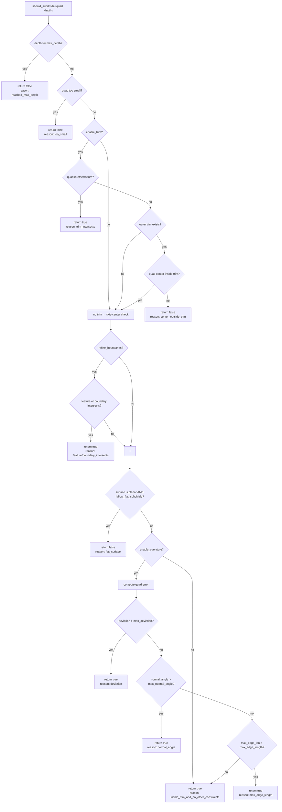

# Tessellation subdivide 규칙 설계 문서
## 1. 개요
- 이 문서는 NURBS 기반 곡면에 대해 Adaptive Tessellation을 수행할 때,  
    각 ParamQuad를 subdivide 할지 말지를 결정하는 함수:
```rust
pub fn should_subdivide(&self, quad: &ParamQuad, depth: usize) -> bool
```

- 의 최종 설계 규칙과 우선순위, 그리고 그 과정에서 도출된 옵션 구조를 정리한 것이다.
- 핵심 목표는:
    - 서로 다른 테스트/상황(평면, 구, 트림, 홀, 피처, 경계 등)에서  
        충돌 없이 일관된 subdivide 동작을 보장하는 것
    - 규칙을 코드가 아니라 문서로도 명확히 설명 가능한 상태로 만드는 것

## 2. subdivide 의사결정 규칙 전체 흐름
### 2.1 최종 우선순위 개요
- should_subdivide()는 다음 순서로 조건을 평가한다:
    - 깊이 제한 / 최소 크기
    - Trim 교차 여부
    - Trim 내부 여부 (center check)
    - Feature / Boundary 교차 여부
    - 평면 여부 (Flat Surface)
    - 곡률/편차/법선각/엣지 길이 기준
    - 그 외 → subdivide 유지
- 이 순서는 테스트 간 충돌을 피하기 위해 정교하게 조정된 결과이며,  
각 단계는 필요에 따라 옵션으로 활성/비활성화할 수 있다.

## 2.2 전체 흐름 다이어그램 (Mermaid)



## 3. 최종 should_subdivide() 구현
### 3.1 코드
```rust
pub fn should_subdivide(&self, quad: &ParamQuad, depth: usize) -> bool {
    println!("================ should_subdivide START ================");
    println!("depth = {}", depth);
    println!("quad = {:?}", quad.uv);
    println!("center = {:?}", quad.center());

    // 1) depth 제한
    if depth >= self.options.max_depth {
        println!("RETURN: false (reason: reached_max_depth)");
        return false;
    }
```
```rust
    // 2) 너무 작은 quad
    if quad.too_small(self.options.min_uv_size) {
        println!("RETURN: false (reason: too_small)");
        return false;
    }
```
```rust

    // 3) trim 교차 → subdivide
    if self.options.enable_trim {
        let trim_intersects = self.trim_loops.quad_intersects(quad);
        println!("trim_intersects = {}", trim_intersects);
        if trim_intersects {
            println!("RETURN: true (reason: trim_intersects)");
            return true;
        }
    }
```
```rust

    // 4) trim center check (outer trim이 있을 때만)
    if self.options.enable_trim && !self.trim_loops.outer.points.is_empty() {
        let inside = self.trim_loops.quad_center_inside(quad);
        println!("quad_center_inside = {}", inside);

        if !inside {
            println!("RETURN: false (reason: center_outside_trim)");
            return false;
        }
    } else {
        println!("no trim → skip center check");
    }
```
```rust

    // 5) feature/boundary 교차 → subdivide
    if self.options.refine_boundaries {
        let feat = quad.has_feature_intersection(&self.feature_curves);
        let bound = quad.has_feature_intersection(&self.boundary_curves);
        println!("feature_intersects = {}", feat);
        println!("boundary_intersects = {}", bound);

        if feat || bound {
            println!("RETURN: true (reason: feature/boundary_intersects)");
            return true;
        }
    }
```
```rust

    // 6) flat surface → curvature subdivide만 막음
    if self.surface.is_planar(ON_TOL6) && !self.options.allow_flat_subdivide {
        println!("RETURN: false (reason: flat_surface)");
        return false;
    }
```
```rust

    // 7) 곡률/편차/법선각/엣지 길이 기준
    if self.options.enable_curvature {
        let err = self.eval_quad_error(quad);
        println!("error.deviation = {}", err.deviation);
        println!("error.normal_angle = {}", err.normal_angle);
        println!("error.max_edge_len = {}", err.max_edge_len);

        if err.deviation > self.options.max_deviation {
            println!("RETURN: true (reason: deviation)");
            return true;
        }
        if err.normal_angle > self.options.max_normal_angle {
            println!("RETURN: true (reason: normal_angle)");
            return true;
        }
        if err.max_edge_len > self.options.max_edge_length {
            println!("RETURN: true (reason: max_edge_length)");
            return true;
        }
    }

    println!("RETURN: true (reason: inside_trim_and_no_other_constraints)");
    true
}
```

## 4. 옵션 설계
### 4.1 AdaptiveTessellationOptions
```rust
pub struct AdaptiveTessellationOptions {
    pub max_depth: usize,
    pub refine_boundaries: bool,
    pub boundary_curves: Vec<Curve>,
    pub feature_curves: Vec<Curve>,
    pub min_uv_size: f64,
    pub max_deviation: f64,
    pub max_normal_angle: f64,
    pub max_edge_length: f64,
    pub min_edge_length: f64,

    // 새로 도입된 옵션들
    pub enable_trim: bool,          // trim 관련 subdivide 활성화 여부
    pub enable_curvature: bool,     // 곡률/편차 기반 subdivide 활성화 여부
    pub allow_flat_subdivide: bool, // 평면에서도 subdivide 허용 여부
}
```

### 4.2 테스트별 옵션 조합
#### 4.2.1 평면: subdivide 되면 안 되는 경우
```rust
// flat_surface_should_not_subdivide
options.enable_trim = false;
options.enable_curvature = false;
options.allow_flat_subdivide = false;
```

#### 4.2.2 구(Sphere): 곡률 때문에 subdivide 되어야 하는 경우
```rust
// sphere_should_subdivide_due_to_curvature
options.enable_trim = false;
options.enable_curvature = true;
options.allow_flat_subdivide = true; // 어차피 sphere는 planar가 아님
```
#### 4.2.3 Trim hole 내부: subdivide 되면 안 되는 경우
```rust
// hole 안 quad는 subdivide 금지
options.enable_trim = true;
options.enable_curvature = true;
options.allow_flat_subdivide = true;
```

#### 4.2.4 Trim 교차: subdivide 되어야 하는 경우
```rust
// test_should_subdivide_trim_cross
options.enable_trim = true;
options.allow_flat_subdivide = true;
```

#### 4.2.5 Feature 교차: subdivide 되어야 하는 경우
```rust
// patch_tessellator_subdivides_on_feature_intersection
options.refine_boundaries = true;
options.allow_flat_subdivide = true;
options.enable_curvature = false; // 곡률은 필요 없음
```

## 5. 기하학적 기준 수식
### 5.1 Deviation (편차)
- Quad의 네 꼭짓점에서의 위치를 $\mathbf{p_{\mathnormal{ij}}}$,  
    중심 또는 보간된 기준점을 $\mathbf{p_{\mathnormal{c}}}$ 라고 할 때,
- 편차는 대략 다음과 같이 정의할 수 있다:
```math
\mathrm{deviation}=\max _{(i,j)\in \{ 0,1\} ^2}\| \mathbf{p_{\mathnormal{ij}}}-\mathbf{p_{\mathnormal{c}}}\|
``` 
- 또는, 실제 구현에서는:
    - 곡면 위의 샘플링 점들과
    - 보간된 평면/삼각형/quad 사이의 거리의 최대값으로 정의.
### 5.2 Normal angle (법선 각도)
- 각 꼭짓점에서의 법선 벡터를 $\mathbf{n_{\mathnormal{k}}}$ 라 할 때,
- 법선 각도는:
```math
\theta _{ij}=\arccos \left( \frac{\mathbf{n_{\mathnormal{i}}}\cdot \mathbf{n_{\mathnormal{j}}}}{\| \mathbf{n_{\mathnormal{i}}}\| \| \mathbf{n_{\mathnormal{j}}}\| }\right)
```
```math 
\mathrm{normal\_ angle}=\max _{i,j}\theta _{ij}
```
### 5.3 Edge length (엣지 길이)
- Quad의 네 변의 길이를:
```math
\ell _k=\| \mathbf{p_{\mathnormal{k+1}}}-\mathbf{p_{\mathnormal{k}}}\| 
```
- 라고 하면:
```math
\mathrm{max\_ edge\_ len}=\max _k\ell _k
```
- 이 값이 max_edge_length를 넘으면 subdivide 대상이 된다.

## 6. Quad subdivision 구조
### 6.1 Quad subdivision 트리 (ASCII)
- depth=0에서 시작해, 각 subdivide 시 4개의 자식 quad로 나뉜다고 하면:
- depth 0:
```
    Q0
```
- depth 1:
```
    Q0
    ├── Q00
    ├── Q01
    ├── Q02
    └── Q03
```
- depth 2:
```
    Q0
    ├── Q00
    │   ├── Q000
    │   ├── Q001
    │   ├── Q002
    │   └── Q003
    ├── Q01
    │   ├── Q010
    │   ├── Q011
    │   ├── Q012
    │   └── Q013
    ├── Q02
    │   ├── Q020
    │   ├── Q021
    │   ├── Q022
    │   └── Q023
    └── Q03
        ├── Q030
        ├── Q031
        ├── Q032
        └── Q033
```

- 각 leaf node가 should_subdivide() == false가 된 quad들이다.

## 7. Trim 관련 규칙 정리
### 7.1 Trim 교차
- quad_intersects(trim)이 true이면 무조건 subdivide
- 이 규칙은:
    - 평면 여부
    - 곡률 여부
    - feature 여부
- 보다 우선순위가 높다
### 7.2 Trim center check
- quad_center_inside()는:
    - outer loop 안에 있고
-    어떤 inner loop(hole) 안에도 포함되지 않을 때만 true
- outer가 비어 있으면:
    - “untrimmed surface”로 간주
    - center check는 skip

## 8. Flat surface 규칙
### 8.1 의도
- 평면에서는 곡률 기반 subdivide는 의미가 없다
- 하지만:
    - trim 교차
    - feature/boundary 교차
- 는 평면에서도 여전히 subdivide의 이유가 될 수 있다.
## 8.2 구현 규칙
- surface.is_planar(ON_TOL6) && !allow_flat_subdivide 이면:
    - curvature 기반 subdivide를 막기 위해 return false
- 단, 이 체크는:
    - trim 교차
    - feature/boundary 교차
- 보다 뒤에 위치해야 한다.

## 9. 요약
- should_subdivide()는 단순한 if-else 묶음이 아니라,
    - Trim / Feature / Flat / Curvature / Size / Depth  
        를 모두 아우르는 우선순위 기반 규칙 엔진이다.
- 이 규칙은:
    - 테스트 간 충돌을 해결하기 위해
    - 실제 CAD 커널들이 사용하는 개념적 구조를 참고하여
    - 여러 번의 시행착오 끝에 정제된 형태이다.
    - AdaptiveTessellationOptions를 통해
- 상황/테스트별로 원하는 동작을 옵션으로 제어할 수 있으며,  
    코드 수정 없이도 다양한 요구사항을 수용할 수 있다.

---

## 소스 코드
```rust
use crate::core::basis::{
    Side, on_basis_func_ret_vec, on_basis_funs, on_build_bspline_basis_matrix_1d, on_find_span,
    on_find_span_index, on_find_span_usize,
};
use crate::core::boundingbox::BoundingBox;
use crate::core::curve_utils::is_rational_ctrl;
use crate::core::geom::{EuclidOptions, Point4D, Vector2D, on_point4d_eq, on_to_euclid_with, Point2D};

use crate::core::cfun::CFun;
use crate::core::geom_utils::on_idx_row_major;
use crate::core::integrator::Integrator;
use crate::core::knot::{
    KnotVector, on_averaging_internal_surface_knots, on_chord_length_params,
    on_chord_length_params_in_u, on_chord_length_params_in_v, on_ders_basis_funs,
    on_find_span_multi_snap, on_is_clamped_like, on_min_acceptable_knot_distance,
    on_ral_c2d_row_major, on_snap_adjacent_knots_in_place, on_span_count,
    on_uniform_params_in_open_range, on_uniform_params_in_range,
};
use crate::core::lucmp::{on_lu_solve, on_m_lu_decmp_full};
use crate::core::math_extensions::{on_rotate_about_axis, on_window_weight_1d};
use crate::core::maths::{
    on_clamp, on_distance, on_make_quarter_arc_bezier, on_move_point_to_plane, on_plane_eval,
};
use crate::core::matrix::on_solve_linear_system_dense;
use crate::core::matrix3::Matrix3;
use crate::core::nurbs_curve::{AsNurbsCurve, NurbsCurve, RevIsoType, on_build_revolution_u_curve};
use crate::core::param_surface::ParamSurface;
use crate::core::plane::Plane;
use crate::core::point_ops::PointOps;
use crate::core::polygon3d::Polygon3D;
use crate::core::prelude::{Interval, Point3D, Vector3D};
use crate::core::segment3d::Segment3D;
use crate::core::sfun::{SFun, ensure_sfun_shape};
use crate::core::surface_patch::{KnotSpan, SurfacePatch};
use crate::core::svd::on_solve_linear_system_svd;
use crate::core::tensor_product::RevolutionTensor;
use crate::core::transform::Transform;
use crate::core::types::{
    Degree, Index, MAX_DEGREE, NONE, NurbsError, ON_TOL12, ON_ZERO_TOL, Param, Real, Rectangle,
    Result, SurfaceDir,
};
use crate::core::write_format::fmt_slice;
use crate::core::xform::{AxialCoord, AxialDir, AxialTra, axial_transform};
use crate::topology::geom_kernel::{CurveGeom, SurfaceGeom};
use std::collections::{BTreeSet, VecDeque};
use std::fmt;
use std::fs::File;
use std::io::Write;
use crate::core::param_axis::ParamAxis;
use crate::core::param_grid::ParamGrid;
use crate::core::segment2d::{Segment2D, SegmentIntersectionType};
use crate::core::surface_evaluator::SurfaceEvaluator;
```
```rust
#[derive(Debug, Clone)]
pub struct NurbsIsoCurveData {
    pub degree: Degree,
    pub ctrl: Vec<Point4D>, // NURBS control points (x,y,z,w)
    pub knot: KnotVector,
}
```
```rust
#[derive(Debug, Clone, Copy)]
pub struct LoftOptions {
    /// Whether to perform loft (section direction) smoothing
    pub smooth_loft_dir: bool,
    /// Number of smoothing iterations (e.g., 5 ~ 30)
    pub smooth_iterations: usize,
    /// Smoothing strength (0 < lambda < 1, typically 0.1 ~ 0.5)
    pub smooth_lambda: Real,

    /// Whether to perform corner split in section direction
    pub corner_split: bool,
    /// Angle to consider as corner in section direction (deg, e.g., 45.0)
    pub corner_angle_deg: Real,
    /// Minimum segment length to ignore when detecting corners (e.g., about 1e-3 of model scale)
    pub corner_min_edge_length: Real,
}
```
```rust
impl Default for LoftOptions {
    fn default() -> Self {
        LoftOptions {
            smooth_loft_dir: false,
            smooth_iterations: 10,
            smooth_lambda: 0.25,
            corner_split: false,
            corner_angle_deg: 45.0,
            corner_min_edge_length: 1e-3,
        }
    }
}
```
```rust
#[derive(Debug, Clone)]
pub struct SurfaceMesh {
    pub vertices: Vec<Point3D>,
    pub normals: Vec<Vector3D>,
    pub uvs: Vec<(Real, Real)>, // (u, v)
    pub indices: Vec<[u32; 3]>, // Triangle index
}
```
```rust
impl SurfaceMesh {
    pub fn new() -> Self {
        SurfaceMesh {
            vertices: Vec::new(),
            normals: Vec::new(),
            uvs: Vec::new(),
            indices: Vec::new(),
        }
    }
}
```
```rust
#[derive(Clone, Copy, Debug)]
pub struct ParamQuad {
    // UV corners: (u,v) in order [ (u0,v0), (u1,v0), (u1,v1), (u0,v1) ]
    pub uv: [(Real, Real); 4],
}
```
```rust
impl ParamQuad {
    pub fn from_uv_rect(u0: f64, v0: f64, u1: f64, v1: f64) -> Self {
        ParamQuad {
            uv: [
                (u0, v0), // bottom-left
                (u1, v0), // bottom-right
                (u1, v1), // top-right
                (u0, v1), // top-left
            ],
        }
    }
}
```
```rust
impl ParamQuad {
    pub fn too_small(&self, min_size: Real) -> bool {
        let (umin, umax, vmin, vmax) = self.uv_bbox();
        (umax - umin) <= min_size || (vmax - vmin) <= min_size
    }
    pub fn to_triangles(&self) -> [[(f64, f64); 3]; 2] {
        let uv = self.uv;

        // quad: 0-1-2-3
        // tris: (0,1,2), (0,2,3)
        [
            [uv[0], uv[1], uv[2]],
            [uv[0], uv[2], uv[3]],
        ]
    }
}
```
```rust
impl ParamQuad {
    pub fn from_rect(r: &Rectangle) -> Self {
        Self {
            uv: [
                (r.ul, r.vb),
                (r.ur, r.vb),
                (r.ur, r.vt),
                (r.ul, r.vt),
            ],
        }
    }

    pub fn center(&self) -> UV {
        let (u0, v0) = self.uv[0];
        let (u2, v2) = self.uv[2];
        let uc = 0.5 * (u0 + u2);
        let vc = 0.5 * (v0 + v2);
        (uc, vc)
    }

    pub fn center_inside_any_trim(&self, trim_loops: &TrimLoops) -> bool {
        let c = self.center();

        // 1) outer loop 안에 있어야 한다
        if !trim_loops.outer.contains_point(c) {
            return false;
        }
        // 2) inner loop(holes) 안에 있으면 안 된다
        for inner in &trim_loops.inners {
            if inner.contains_point(c) {
                return false;
            }
        }
        true
    }

    pub fn uv_bbox(&self) -> (Real, Real, Real, Real) {
        let mut umin = self.uv[0].0;
        let mut umax = self.uv[0].0;
        let mut v_min = self.uv[0].1;
        let mut v_max = self.uv[0].1;
        for &(u, v) in &self.uv {
            if u < umin {
                umin = u;
            }
            if u > umax {
                umax = u;
            }
            if v < v_min {
                v_min = v;
            }
            if v > v_max {
                v_max = v;
            }
        }
        (umin, umax, v_min, v_max)
    }

    fn seg_intersect(a0: UV, a1: UV, b0: UV, b1: UV) -> bool {
        fn ccw(p: UV, q: UV, r: UV) -> bool {
            (r.1 - p.1) * (q.0 - p.0) > (q.1 - p.1) * (r.0 - p.0)
        }
        ccw(a0, b0, b1) != ccw(a1, b0, b1) &&
            ccw(a0, a1, b0) != ccw(a0, a1, b1)
    }

    pub fn polyline_intersects_quad(&self, poly: &[UV]) -> bool {
        if poly.is_empty() {
            return false;
        }

        let (umin, umax, vmin, vmax) = self.uv_bbox();

        for &(u, v) in poly {
            if u >= umin && u <= umax && v >= vmin && v <= vmax {
                return true;
            }
        }

        // segment 교차는 poly.len() >= 2일 때만 검사
        if poly.len() >= 2 {
            let edges = self.edges();
            for i in 0..poly.len() - 1 {
                let p0 = poly[i];
                let p1 = poly[i + 1];
                for &(q0, q1) in &edges {
                    if Self::seg_intersect(p0, p1, q0, q1) {
                        return true;
                    }
                }
            }
        }

        false
    }

    pub fn contains_point(&self, u: Real, v: Real) -> bool {
        let (umin, umax, vmin, vmax) = self.uv_bbox();
        u >= umin && u <= umax && v >= vmin && v <= vmax
    }


    fn point_in_polyline(p: UV, poly: &[UV]) -> bool {
        let mut inside = false;
        let mut j = poly.len() - 1;

        for i in 0..poly.len() {
            let (xi, yi) = poly[i];
            let (xj, yj) = poly[j];

            let intersect = ((yi > p.1) != (yj > p.1))
                && (p.0 < (xj - xi) * (p.1 - yi) / (yj - yi + 1e-12) + xi);

            if intersect {
                inside = !inside;
            }
            j = i;
        }
        inside
    }


    pub fn polyline_intersects(&self, poly: &[UV]) -> bool {
        if poly.is_empty() {
            return false;
        }

        let (umin, umax, vmin, vmax) = self.uv_bbox();

        // 1) 점 하나라도 quad 내부면 true
        for &(u, v) in poly {
            if u >= umin && u <= umax && v >= vmin && v <= vmax {
                return true;
            }
        }

        // 2) 선분 vs 사각형 edge 교차 검사 (polyline 길이 >= 2일 때)
        if poly.len() >= 2 {
            let edges = self.edges();
            for i in 0..poly.len() - 1 {
                let p0 = poly[i];
                let p1 = poly[i + 1];

                for &(q0, q1) in &edges {
                    if Self::seg_intersect(p0, p1, q0, q1) {
                        return true;
                    }
                }
            }
        }

        false

    }

    pub fn edges(&self) -> [((Real, Real), (Real, Real)); 4] {
        [
            (self.uv[0], self.uv[1]),
            (self.uv[1], self.uv[2]),
            (self.uv[2], self.uv[3]),
            (self.uv[3], self.uv[0]),
        ]
    }

    pub fn edges_2d(&self) -> [(Point2D, Point2D); 4] {
        [
            (Point2D::new(self.uv[0].0, self.uv[0].1),
             Point2D::new(self.uv[1].0, self.uv[1].1)),
            (Point2D::new(self.uv[1].0, self.uv[1].1),
             Point2D::new(self.uv[2].0, self.uv[2].1)),
            (Point2D::new(self.uv[2].0, self.uv[2].1),
             Point2D::new(self.uv[3].0, self.uv[3].1)),
            (Point2D::new(self.uv[3].0, self.uv[3].1),
             Point2D::new(self.uv[0].0, self.uv[0].1)),
        ]
    }

    /// 4개 자식으로 균등 subdivide (u_mid, v_mid 기준)
    pub fn subdivide(&self) -> [ParamQuad; 4] {
        let (umin, umax, vmin, vmax) = self.uv_bbox();
        let umid = 0.5 * (umin + umax);
        let vmid = 0.5 * (vmin + vmax);

        // 좌하, 우하, 우상, 좌상
        let q0 = ParamQuad { uv: [(umin, vmin), (umid, vmin), (umid, vmid), (umin, vmid)] };
        let q1 = ParamQuad { uv: [(umid, vmin), (umax, vmin), (umax, vmid), (umid, vmid)] };
        let q2 = ParamQuad { uv: [(umid, vmid), (umax, vmid), (umax, vmax), (umid, vmax)] };
        let q3 = ParamQuad { uv: [(umin, vmid), (umid, vmid), (umid, vmax), (umin, vmax)] };
        [q0, q1, q2, q3]
    }

    pub fn has_feature_intersection(&self, curves: &[FeatureCurveUV]) -> bool {
        for fc in curves {
            if self.polyline_intersects(&fc.points) {
                return true;
            }
        }
        false
    }

    fn intersects_single_loop(
        &self,
        quad_edges: &[(Point2D, Point2D); 4],
        loop_: &TrimLoop,
    ) -> bool {
        let trim_edges = loop_.segments_2d();

        for (qe0, qe1) in quad_edges {
            let seg_q = Segment2D::new(*qe0, *qe1);

            for (te0, te1) in &trim_edges {
                let seg_t = Segment2D::new(*te0, *te1);

                let (itype, _, _) = Segment2D::intersection(&seg_q, &seg_t, 1.0);

                match itype {
                    SegmentIntersectionType::Disjoint => {}
                    _ => return true, // 교차, 터치, 오버랩 모두 subdivide 대상
                }
            }
        }

        false
    }


    pub fn intersects_trim(&self, loops: &TrimLoops) -> bool {
        let quad_edges = self.edges_2d();

        // 1) outer loop 검사
        if self.intersects_single_loop(&quad_edges, &loops.outer) {
            return true;
        }

        // 2) inner loops 검사
        for inner in &loops.inners {
            if self.intersects_single_loop(&quad_edges, inner) {
                return true;
            }
        }

        false
    }
}
```
```rust
/// A single UV coordinate point
pub type UV = (Real, Real);
```
```rust
/// Feature/Boundary curves on UV (trim loop, feature edge, etc.)
#[derive(Debug, Clone)]
pub struct FeatureCurveUV {
    pub points: Vec<UV>, // Sequentially connected polyline
}
```
```rust
impl FeatureCurveUV {
    pub fn new(points: Vec<UV>) -> Self {
        Self { points }
    }

    pub fn is_empty(&self) -> bool {
        self.points.is_empty()
    }

    pub fn len(&self) -> usize {
        self.points.len()
    }

    pub fn bbox(&self) -> (f64, f64, f64, f64) {
        let mut umin = f64::MAX;
        let mut umax = f64::MIN;
        let mut vmin = f64::MAX;
        let mut vmax = f64::MIN;

        for &(u, v) in &self.points {
            umin = umin.min(u);
            umax = umax.max(u);
            vmin = vmin.min(v);
            vmax = vmax.max(v);
        }
        (umin, umax, vmin, vmax)
    }

    pub fn reverse(&mut self) {
        self.points.reverse();
    }

    pub fn resample(&self, step: f64) -> FeatureCurveUV {
        // 나중에 구현: polyline을 일정 간격으로 리샘플링
        self.clone()
    }
}
```
```rust
#[derive(Clone, Debug)]
pub struct TrimLoop {
    pub points: Vec<UV>, // 폐곡선. 첫 점과 마지막 점은 같거나, 자동으로 이어진다고 가정
    // 나중에 outer/hole 여부를 표시할 필드가 들어올 수도 있음
}
```
```rust
impl TrimLoop {
    pub fn new(mut pts: Vec<(f64, f64)>) -> Self {
        assert!(pts.len() >= 3);

        // 자동 닫기
        let first = pts[0];
        let last = *pts.last().unwrap();
        if (first.0 - last.0).abs() > 1e-12 || (first.1 - last.1).abs() > 1e-12 {
            pts.push(first);
        }

        TrimLoop { points: pts }
    }

    fn polygon_area(pts: &[(f64, f64)]) -> f64 {
        let mut area = 0.0;
        for i in 0..pts.len() - 1 {
            area += pts[i].0 * pts[i + 1].1 - pts[i + 1].0 * pts[i].1;
        }
        area * 0.5
    }

    pub fn ensure_ccw(&mut self) {
        if Self::polygon_area(&self.points) < 0.0 {
            self.points.reverse();
        }
    }

    pub fn ensure_cw(&mut self) {
        if Self::polygon_area(&self.points) > 0.0 {
            self.points.reverse();
        }
    }
}
```
```rust
impl TrimLoop {

    /// 선분 (x0,y0)-(x1,y1) 위에 점 (px,py)가 있는지 검사
    fn point_on_segment(px: f64, py: f64, x0: f64, y0: f64, x1: f64, y1: f64) -> bool {
        // bounding box 체크
        if px < x0.min(x1) - 1e-12 || px > x0.max(x1) + 1e-12 {
            return false;
        }
        if py < y0.min(y1) - 1e-12 || py > y0.max(y1) + 1e-12 {
            return false;
        }

        // cross product == 0 → collinear
        let dx = x1 - x0;
        let dy = y1 - y0;
        let dxp = px - x0;
        let dyp = py - y0;

        let cross = dx * dyp - dy * dxp;
        if cross.abs() > 1e-12 {
            return false;
        }
        true
    }
```
```rust
    pub fn contains_point(&self, p: (f64, f64)) -> bool {
        let (px, py) = p;
        let pts = &self.points;
        let n = pts.len();

        // 0,1,2개 점이면 폴리곤이 아님 → 항상 false
        if n < 3 {
            return false;
        }

        // 1) edge-on-point 검사
        for i in 0..n {
            let (x0, y0) = pts[i];
            let (x1, y1) = pts[(i + 1) % n];

            if Self::point_on_segment(px, py, x0, y0, x1, y1) {
                return true;
            }
        }

        // 2) ray casting
        let mut inside = false;
        for i in 0..n {
            let (x0, y0) = pts[i];
            let (x1, y1) = pts[(i + 1) % n];

            // y0 == y1 (horizontal line) → skip safe
            if (y0 - y1).abs() < 1e-14 {
                continue;
            }

            let intersect =
                ((y0 > py) != (y1 > py)) &&
                    (px < (x1 - x0) * (py - y0) / (y1 - y0) + x0);

            if intersect {
                inside = !inside;
            }
        }

        inside
    }

    fn is_left(x0: f64, y0: f64, x1: f64, y1: f64, px: f64, py: f64) -> f64 {
        (x1 - x0) * (py - y0) - (px - x0) * (y1 - y0)
    }

    fn point_on_segment_2d(px: f64, py: f64, x0: f64, y0: f64, x1: f64, y1: f64) -> bool {
        let cross = (px - x0) * (y1 - y0) - (py - y0) * (x1 - x0);
        if cross.abs() > 1e-12 {
            return false;
        }

        let dot = (px - x0) * (px - x1) + (py - y0) * (py - y1);
        dot <= 1e-12
    }

    pub fn segments_2d(&self) -> Vec<(Point2D, Point2D)> {
        let mut segs = Vec::new();
        let n = self.points.len();
        for i in 0..n {
            let j = (i + 1) % n;
            segs.push((
                Point2D::new(self.points[i].0, self.points[i].1),
                Point2D::new(self.points[j].0, self.points[j].1),
            ));
        }
        segs
    }
}
```
```rust
#[derive(Clone, Debug)]
pub struct TrimLoops {
    pub outer: TrimLoop,
    pub inners: Vec<TrimLoop>,
}
```
```rust
impl TrimLoops {
    /// 점 p가 트림된 영역 내부에 있는지 판정
    /// 규칙:
    /// 1) outer 안에 있어야 inside
    /// 2) inner 중 하나라도 포함하면 hole → outside
    pub fn contains_point(&self, p: (f64, f64)) -> bool {
        //println!("--- TrimLoops.contains_point DEBUG ---");
        //println!("point = {:?}", p);

        // 1) outer 검사
        let outer_contains = self.outer.contains_point(p);
        //println!("outer.contains_point = {}", outer_contains);

        if !outer_contains {
            //println!("→ result: false (outside outer)");
            return false;
        }

        // 2) inner 검사
        for (i, inner) in self.inners.iter().enumerate() {
            let inner_contains = inner.contains_point(p);
            //println!("inner[{i}].contains_point = {}", inner_contains);

            if inner_contains {
                //println!("→ result: false (inside hole inner[{i}])");
                return false;
            }
        }

        //println!("→ result: true (inside trimmed region)");
        true
    }

    /// quad 중심이 트림 영역 안에 있는지
    pub fn quad_center_inside(&self, quad: &ParamQuad) -> bool {
        let c = quad.center();
        //println!("quad_center_inside: center = {:?}", c);
        self.contains_point(c)
    }

    /// quad가 trim과 교차하는지
    pub fn quad_intersects(&self, quad: &ParamQuad) -> bool {
        // outer와 교차하면 subdivide
        if quad.polyline_intersects_quad(&self.outer.points) {
            return true;
        }

        // inner와 교차해도 subdivide
        for inner in &self.inners {
            if quad.polyline_intersects_quad(&inner.points) {
                return true;
            }
        }

        false
    }
}
```
```rust
/// Adaptive Tessellation parameters
#[derive(Debug, Clone)]
pub struct AdaptiveTessellationOptions {
    // Maximum allowed deviation (patch actual midpoint vs. corner plane/bi-linear approximation)
    pub max_deviation: Real,

    // Maximum allowed normal angle (radian; e.g., 10 degrees ≈ 10.0_f64.to_radians())
    pub max_normal_angle: Real,

    // Maximum edge length to prevent overly large triangles (based on model scale)
    pub max_edge_length: Real,

    // Minimum edge length to avoid excessive subdivision (no further subdivision if smaller than this)
    pub min_edge_length: Real,

    // Maximum subdivision depth (0 = whole at once / 6~8 recommended)
    pub max_depth: usize,

    // Whether to add extra refinement near boundaries (Trim loop)
    pub refine_boundaries: bool,

    // UV polyline of boundary/Trim curves (if available)
    pub boundary_curves: Vec<FeatureCurveUV>,

    // Feature edge to preserve (UV polyline)
    pub feature_curves: Vec<FeatureCurveUV>,

    pub min_uv_size: Real,

    pub enable_trim: bool,
    pub enable_curvature: bool,
    pub allow_flat_subdivide: bool,
}
```
```rust
impl Default for AdaptiveTessellationOptions {
    fn default() -> Self {
        AdaptiveTessellationOptions {
            max_deviation: 1e-3,
            max_normal_angle: 10.0_f64.to_radians(),
            max_edge_length: 0.0, // Disabled if set to 0
            min_edge_length: 0.0, // Disabled if set to 0
            max_depth: 6,
            refine_boundaries: true,
            boundary_curves: Vec::new(),
            feature_curves: Vec::new(),
            min_uv_size: 1e-3,
            enable_trim: false,
            enable_curvature: false,
            allow_flat_subdivide: false,
        }
    }
}
```
```rust

impl NurbsSurface {
    /// 한 Quad가 충분히 평탄한지 체크.
    ///
    /// - quad: ParamQuad (4개 corner uv)
    /// - tol : 거리 허용 오차
    ///
    /// 반환: (is_flat, corner_points[4], center_point)
    #[allow(unused)]
    fn eval_quad_flatness(&self, quad: &ParamQuad, tol: Real) -> (bool, [Point3D; 4], Point3D) {
        let mut pts = [Point3D::default(); 4];
        for k in 0..4 {
            let (u, v) = quad.uv[k];
            pts[k] = self.eval_point(u, v);
        }

        // 중앙점 uv : 평균
        let u_c = (quad.uv[0].0 + quad.uv[1].0 + quad.uv[2].0 + quad.uv[3].0) * 0.25;
        let v_c = (quad.uv[0].1 + quad.uv[1].1 + quad.uv[2].1 + quad.uv[3].1) * 0.25;
        let p_c = self.eval_point(u_c, v_c);

        // 평면 근사: 4 corner 의 평균 (혹은 bilinear 평균) 사용
        let p_avg = Point3D {
            x: (pts[0].x + pts[1].x + pts[2].x + pts[3].x) * 0.25,
            y: (pts[0].y + pts[1].y + pts[2].y + pts[3].y) * 0.25,
            z: (pts[0].z + pts[1].z + pts[2].z + pts[3].z) * 0.25,
        };

        let dx = p_c.x - p_avg.x;
        let dy = p_c.y - p_avg.y;
        let dz = p_c.z - p_avg.z;
        let dist2 = dx * dx + dy * dy + dz * dz;

        (dist2 <= tol * tol, pts, p_c)
    }
}

impl NurbsSurface {
    /// Quad 하나에 대해:
    ///  - corner 4점과 center 점 평가
    ///  - center vs corner 평균(평면/bi-linear) 거리
    ///  - corner/center 법선 각도
    ///  - edge 길이
    ///
    /// 반환:
    ///   (deviation, max_normal_angle, max_edge_length, corner_points, center_point)
    fn eval_quad_error(&self, quad: &ParamQuad) -> (Real, Real, Real, [Point3D; 4], Point3D) {
        let mut pts = [Point3D::default(); 4];
        let mut ns = [Vector3D::default(); 4];

        for k in 0..4 {
            let (u, v) = quad.uv[k];
            let (p, _su, _sv, n) = self.eval_frame_numeric(u, v);
            pts[k] = p;
            ns[k] = n;
        }

        // center uv / point
        let u_c = (quad.uv[0].0 + quad.uv[1].0 + quad.uv[2].0 + quad.uv[3].0) * 0.25;
        let v_c = (quad.uv[0].1 + quad.uv[1].1 + quad.uv[2].1 + quad.uv[3].1) * 0.25;
        let (p_c, _su_c, _sv_c, n_c) = self.eval_frame_numeric(u_c, v_c);

        // bi-linear 평면 근사: corner 평균 사용
        let p_avg = Point3D {
            x: (pts[0].x + pts[1].x + pts[2].x + pts[3].x) * 0.25,
            y: (pts[0].y + pts[1].y + pts[2].y + pts[3].y) * 0.25,
            z: (pts[0].z + pts[1].z + pts[2].z + pts[3].z) * 0.25,
        };

        let dx = p_c.x - p_avg.x;
        let dy = p_c.y - p_avg.y;
        let dz = p_c.z - p_avg.z;
        let deviation = (dx * dx + dy * dy + dz * dz).sqrt();

        // corner vs center 법선 각도의 최대값
        let mut max_angle = 0.0;
        for k in 0..4 {
            let dot = ns[k].dot(&n_c).clamp(-1.0, 1.0);
            let angle = dot.acos();
            if angle > max_angle {
                max_angle = angle;
            }
        }

        // edge 길이 (3D)
        let mut max_edge_len = 0.0;
        let order = [0, 1, 2, 3, 0];
        for w in order.windows(2) {
            let p0 = pts[w[0]];
            let p1 = pts[w[1]];
            let ex = p1.x - p0.x;
            let ey = p1.y - p0.y;
            let ez = p1.z - p0.z;
            let len = (ex * ex + ey * ey + ez * ez).sqrt();
            if len > max_edge_len {
                max_edge_len = len;
            }
        }

        (deviation, max_angle, max_edge_len, pts, p_c)
    }

    fn subdivide_quad(quad: &ParamQuad) -> [ParamQuad; 4] {
        let (u0, v0) = quad.uv[0];
        let (u1, v1) = quad.uv[2];

        let um = (u0 + u1) * 0.5;
        let vm = (v0 + v1) * 0.5;

        let q0 = ParamQuad {
            uv: [(u0, v0), (um, v0), (um, vm), (u0, vm)],
        };
        let q1 = ParamQuad {
            uv: [(um, v0), (u1, v0), (u1, vm), (um, vm)],
        };
        let q2 = ParamQuad {
            uv: [(um, vm), (u1, vm), (u1, v1), (um, v1)],
        };
        let q3 = ParamQuad {
            uv: [(u0, vm), (um, vm), (um, v1), (u0, v1)],
        };
        [q0, q1, q2, q3]
    }
}

impl NurbsSurface {
    fn should_subdivide_quad(
        &self,
        quad: &ParamQuad,
        depth: usize,
        opts: &AdaptiveTessellationOptions,
    ) -> bool {
        if depth >= opts.max_depth {
            return false;
        }

        let (deviation, angle, max_edge, _pts, _pc) = self.eval_quad_error(quad);

        // 기준값들
        let mut max_dev = opts.max_deviation;
        let mut max_angle = opts.max_normal_angle;

        // 경계/feature 가까우면 기준을 더 엄격하게 (더 많이 subdivide)
        if !opts.boundary_curves.is_empty() || !opts.feature_curves.is_empty() {
            let near_boundary = on_quad_near_feature(quad, &opts.boundary_curves);
            let near_feature = on_quad_near_feature(quad, &opts.feature_curves);
            if near_boundary || near_feature {
                max_dev *= 0.5;
                max_angle *= 0.5;
            }
        }

        // 편차 조건
        if deviation > max_dev {
            return true;
        }

        // 곡률(법선 각도) 조건
        if angle > max_angle {
            return true;
        }

        // edge 길이 조건
        if opts.max_edge_length > 0.0 && max_edge > opts.max_edge_length {
            return true;
        }

        // 너무 작은 edge 길이는 더 이상 subdivide 하지 않도록
        if opts.min_edge_length > 0.0 && max_edge < opts.min_edge_length {
            return false;
        }

        false
    }

    pub fn tessellate_adaptive_with_options(
        &self,
        opts: &AdaptiveTessellationOptions,
    ) -> Result<SurfaceMesh> {
        let (umin, umax) = self.domain_u_tuple();
        let (v_min, v_max) = self.domain_v_tuple();

        // 초기 Quad = 전체 도메인
        let root = ParamQuad {
            uv: [(umin, v_min), (umax, v_min), (umax, v_max), (umin, v_max)],
        };

        let mut queue: VecDeque<(ParamQuad, usize)> = VecDeque::new();
        queue.push_back((root, 0));

        let mut mesh = SurfaceMesh::new();

        // vertex 중복 허용 (나중에 필요하면 weld 가능)
        while let Some((quad, depth)) = queue.pop_front() {
            if self.should_subdivide_quad(&quad, depth, opts) {
                let children = Self::subdivide_quad(&quad);
                let next_depth = depth + 1;
                for c in children.into_iter() {
                    queue.push_back((c, next_depth));
                }
                continue;
            }

            // leaf quad → 실제 삼각형 2개로 출력
            let base_index = mesh.vertices.len() as u32;

            // corner 순서: (0,0), (1,0), (1,1), (0,1)
            for k in 0..4 {
                let (u, v) = quad.uv[k];
                let (p, _su, _sv, n) = self.eval_frame_numeric(u, v);
                mesh.vertices.push(p);
                mesh.normals.push(n);
                mesh.uvs.push((u, v));
            }

            // 삼각형 두 개: (0,1,2), (0,2,3)
            mesh.indices
                .push([base_index, base_index + 1, base_index + 2]);
            mesh.indices
                .push([base_index, base_index + 2, base_index + 3]);
        }

        Ok(mesh)
    }

    /// 기존 간단버전 tessellate_adaptive 를 대체/래핑해서 기본 옵션으로 호출
    pub fn tessellate_adaptive(
        &self,
        max_deviation: Real,
        max_angle_deg: Real,
        max_depth: usize,
    ) -> Result<SurfaceMesh> {
        let mut opts = AdaptiveTessellationOptions::default();
        opts.max_deviation = max_deviation;
        opts.max_normal_angle = max_angle_deg.to_radians();
        opts.max_depth = max_depth;
        // edge length 기준은 모델 스케일에 따라 필요 시 호출부에서 세팅
        self.tessellate_adaptive_with_options(&opts)
    }
}

impl NurbsSurface {
    /// U 또는 V 방향 도메인 설정
    /// dir = 0 → U, dir = 1 → V
    ///
    pub fn set_domain_interval(&mut self, dir: usize, domain: Interval) {
        self.set_domain(dir, domain.t0, domain.t1);
    }

    pub fn set_domain(&mut self, dir: usize, t0: Real, t1: Real) -> bool {
        let (degree, kv) = if dir == 0 {
            (self.pu as usize, &mut self.ku.knots)
        } else {
            (self.pv as usize, &mut self.kv.knots)
        };

        let kv_len = kv.len();
        if kv_len == 0 || degree < 1 || kv_len <= degree || t0 >= t1 {
            return false;
        }

        let k0 = kv[degree];
        let k1 = kv[kv_len - degree - 1]; // Piegl 기준 내부 도메인

        if (k0 - t0).abs() < 1e-12 && (k1 - t1).abs() < 1e-12 {
            return true; // 이미 도메인이 맞음
        }

        if k0 >= k1 {
            return false;
        }

        let d = (t1 - t0) / (k1 - k0);
        let km = 0.5 * (k0 + k1);

        for knot in kv.iter_mut() {
            if *knot <= km {
                *knot = (*knot - k0) * d + t0;
            } else {
                *knot = (*knot - k1) * d + t1;
            }
        }

        true
    }

    /// 현재 도메인 반환
    pub fn domain(&self, dir: usize) -> Option<(Real, Real)> {
        if dir == 0 {
            let degree = self.pu as usize;
            let kv_len = self.ku.knots.len();
            if kv_len > degree {
                Some((self.ku.knots[degree], self.ku.knots[kv_len - degree - 1]))
            } else {
                None
            }
        } else {
            let degree = self.pv as usize;
            let kv_len = self.kv.knots.len();
            if kv_len > degree {
                Some((self.kv.knots[degree], self.kv.knots[kv_len - degree - 1]))
            } else {
                None
            }
        }
    }
}
impl NurbsSurface {
    /// 간단한 수치 적분으로 표면 면적을 구한다.
    /// - nu, nv: u,v 방향 분할 개수 (적당히 16~32 정도)
    /// - 실패 시 None
    pub fn area_by_quadrature(&self, nu: usize, nv: usize) -> Option<Real> {
        if nu == 0 || nv == 0 {
            return None;
        }

        let (u0, u1) = self.domain_u_tuple();
        let (v0, v1) = self.domain_v_tuple();

        if u1 <= u0 || v1 <= v0 {
            return None;
        }

        let du = (u1 - u0) / (nu as Real);
        let dv = (v1 - v0) / (nv as Real);

        let mut area = 0.0;

        // 각 셀의 중앙에서 Su×Sv 길이를 평가하고 du*dv 를 곱해서 합산
        for i in 0..nu {
            let u_mid = u0 + (i as Real + 0.5) * du;
            for j in 0..nv {
                let v_mid = v0 + (j as Real + 0.5) * dv;

                let ders = self.evaluate_derivatives_nder(u_mid, v_mid, 1);
                if ders.len() < 2 || ders[0].len() < 2 {
                    return None;
                }

                let su = ders[1][0];
                let sv = ders[0][1];

                let cross = su.cross(&sv);
                area += cross.length() * du * dv;
            }
        }

        Some(area)
    }
}
```
```rust
impl NurbsSurface {
    /// 서피스가 거의 평면인지 체크.
    /// - tol: 평면에서의 최대 거리 허용치
    /// - 방법: control point 들로 평면 하나 정의 후, 나머지 점들이 그 평면에서 tol 이내인지 검사
    pub fn is_planar(&self, tol: Real) -> bool {
        let n_ctrl = self.ctrl.len();
        if n_ctrl < 3 {
            return true; // 2점 이하라면 일단 평면 취급
        }

        // 1) 첫 세 점에서 서로 다른 점 3개 골라 평면 결정
        let mut p0 = None;
        let mut p1 = None;
        let mut p2 = None;

        for i in 0..n_ctrl {
            let pi = self.ctrl[i].to_point();
            if p0.is_none() {
                p0 = Some(pi);
            } else if p1.is_none() {
                if on_distance(&pi, &p0.unwrap()) > tol {
                    p1 = Some(pi);
                }
            } else if p2.is_none() {
                // p0, p1와 공선이 아닌 점 찾기
                let v0 = p1.unwrap() - p0.unwrap();
                let v1 = pi - p0.unwrap();
                if v0.cross_pt(&v1).length() > tol {
                    p2 = Some(pi);
                    break;
                }
            }
        }

        if p0.is_none() || p1.is_none() || p2.is_none() {
            // 모든 cp가 같은 점이거나 collinear 라면 평면으로 간주
            return true;
        }

        let p0 = p0.unwrap();
        let p1 = p1.unwrap();
        let p2 = p2.unwrap();

        let n = (p1 - p0).cross_pt(&(p2 - p0));
        let n_len = n.length();
        if n_len <= tol {
            return true;
        }
        let n_unit = n / n_len;

        // 2) 모든 컨트롤 포인트가 이 평면에서 tol 이내인지 체크
        for cp in &self.ctrl {
            let q = cp.to_point();
            let v = q - p0;
            let d = v.dot_vec(&n_unit).abs();
            if d > tol {
                return false;
            }
        }
        true
    }
}
```
```rust
impl NurbsSurface {
    /// 주어진 패치가 기하학적으로 충분히 평탄한지 검사.
    ///
    /// - patch.rect 로부터 (u0,u1,v0,v1) 를 가져온 후
    ///   corner + mid 샘플로 평면과의 최대 거리를 측정.
    pub fn is_patch_flat(&self, patch: &SurfacePatch, tol: Real) -> bool {
        let u0 = patch.rect.ul;
        let u1 = patch.rect.ur;
        let v0 = patch.rect.vb;
        let v1 = patch.rect.vt;

        // 코너 점
        let p00 = self.eval_point(u0, v0);
        let p10 = self.eval_point(u1, v0);
        let p01 = self.eval_point(u0, v1);
        let p11 = self.eval_point(u1, v1);

        let v1_vec = p10 - p00;
        let v2_vec = p01 - p00;
        let n = v1_vec.cross_pt(&v2_vec);
        let n_len = n.length();
        if n_len <= 1e-12 {
            // 거의 선/점에 가까운 퇴화 patch → 평탄한 것으로 간주
            return true;
        }
        let n_unit = n / n_len;
        let p0 = p00; // 기준점

        let mut max_err = 0.0;

        let check = |q: Point3D, max_err: &mut Real| {
            let v = q - p0;
            let d = v.dot_vec(&n_unit).abs();
            if d > *max_err {
                *max_err = d;
            }
        };

        // 코너 샘플
        check(p10, &mut max_err);
        check(p01, &mut max_err);
        check(p11, &mut max_err);

        // 중심 샘플
        let um = 0.5 * (u0 + u1);
        let vm = 0.5 * (v0 + v1);
        let pm = self.eval_point(um, vm);
        check(pm, &mut max_err);

        // mid-edge 샘플
        let p_u0_v_mid = self.eval_point(u0, vm);
        let p_u1_v_mid = self.eval_point(u1, vm);
        let p_u_mid_v0 = self.eval_point(um, v0);
        let p_u_mid_v1 = self.eval_point(um, v1);

        check(p_u0_v_mid, &mut max_err);
        check(p_u1_v_mid, &mut max_err);
        check(p_u_mid_v0, &mut max_err);
        check(p_u_mid_v1, &mut max_err);

        max_err <= tol
    }
}
```
```rust
impl NurbsSurface {
    fn subdivide_patch_recursive(
        &self,
        patch: &SurfacePatch,
        tol: Real,
        depth: usize,
        out: &mut Vec<SurfacePatch>,
    ) {
        if depth == 0 || self.is_patch_flat(patch, tol) {
            out.push(patch.clone());
            return;
        }

        let u0 = patch.rect.ul;
        let u1 = patch.rect.ur;
        let v0 = patch.rect.vb;
        let v1 = patch.rect.vt;

        let um = 0.5 * (u0 + u1);
        let vm = 0.5 * (v0 + v1);

        // 부모 span 정보는 그대로 복사
        let base = |ul: Real, ur: Real, vb: Real, vt: Real| SurfacePatch {
            rect: Rectangle { ul, ur, vb, vt },
            u_span_index: patch.u_span_index,
            v_span_index: patch.v_span_index,
            u_knot_index0: patch.u_knot_index0,
            u_knot_index1: patch.u_knot_index1,
            v_knot_index0: patch.v_knot_index0,
            v_knot_index1: patch.v_knot_index1,
            trim: TrimLoops { outer: TrimLoop { points: vec![] }, inners: vec![] },
        };

        let p00 = base(u0, um, v0, vm);
        let p10 = base(um, u1, v0, vm);
        let p01 = base(u0, um, vm, v1);
        let p11 = base(um, u1, vm, v1);

        self.subdivide_patch_recursive(&p00, tol, depth - 1, out);
        self.subdivide_patch_recursive(&p10, tol, depth - 1, out);
        self.subdivide_patch_recursive(&p01, tol, depth - 1, out);
        self.subdivide_patch_recursive(&p11, tol, depth - 1, out);
    }

    /// 초기 patch 리스트에 대해 flatness 기반 adaptive subdivision 수행.
    ///
    /// - tol: 허용 평탄 오차
    /// - max_depth: 최대 분할 깊이
    pub fn adaptive_subdivide_patches(
        &self,
        initial_patches: &[SurfacePatch],
        tol: Real,
        max_depth: usize,
    ) -> Vec<SurfacePatch> {
        let mut result = Vec::new();
        for p in initial_patches {
            self.subdivide_patch_recursive(p, tol, max_depth, &mut result);
        }
        result
    }
}
```
```rust
impl NurbsSurface {
    /// 하나의 패치를 (nu × nv) uniform grid 로 tessellation.
    ///
    /// - nu, nv: segment 개수 (vertex 개수는 (nu+1)*(nv+1))
    pub fn tessellate_patch_uniform(
        &self,
        patch: &SurfacePatch,
        nu: usize,
        nv: usize,
    ) -> crate::core::surface_mesh::SurfaceMesh {
        let mut mesh = crate::core::surface_mesh::SurfaceMesh::new();
        if nu == 0 || nv == 0 {
            return mesh;
        }

        let u0 = patch.rect.ul;
        let u1 = patch.rect.ur;
        let v0 = patch.rect.vb;
        let v1 = patch.rect.vt;

        let du = (u1 - u0) / (nu as Real);
        let dv = (v1 - v0) / (nv as Real);

        // vertex 생성
        for i in 0..=nu {
            let u = u0 + du * (i as Real);
            for j in 0..=nv {
                let v = v0 + dv * (j as Real);
                let p = self.eval_point(u, v);
                mesh.vertices.push(p);
            }
        }

        // 인덱스 (row-major 인덱싱: idx = i*(nv+1) + j)
        let cols = nv + 1;
        for i in 0..nu {
            for j in 0..nv {
                let i0 = i as u32;
                let i1 = (i + 1) as u32;
                let j0 = j as u32;
                let j1 = (j + 1) as u32;

                let idx00 = i0 * (cols as u32) + j0;
                let idx10 = i1 * (cols as u32) + j0;
                let idx01 = i0 * (cols as u32) + j1;
                let idx11 = i1 * (cols as u32) + j1;

                // 두 삼각형 (00-10-11), (00-11-01)
                mesh.indices.push([idx00, idx10, idx11]);
                mesh.indices.push([idx00, idx11, idx01]);
            }
        }

        mesh
    }

    /// 여러 패치에 대해 같은 분할 수로 tessellation 후, 하나의 mesh 로 합침
    pub fn tessellate_patches_uniform(
        &self,
        patches: &[SurfacePatch],
        nu_patch: usize,
        nv_patch: usize,
    ) -> crate::core::surface_mesh::SurfaceMesh {
        let mut total = crate::core::surface_mesh::SurfaceMesh::new();
        for p in patches {
            let m = self.tessellate_patch_uniform(p, nu_patch, nv_patch);
            total.append(&m);
        }
        total
    }

    /// 전체 surface를 domain 기준 하나의 패치로 tessellation (가장 단순 버전)
    pub fn tessellate_uniform_global(
        &self,
        nu: usize,
        nv: usize,
    ) -> crate::core::surface_mesh::SurfaceMesh {
        let (ul, ur) = self.domain_u_tuple();
        let (vb, vt) = self.domain_v_tuple();
        let patch = SurfacePatch {
            rect: Rectangle { ul, ur, vb, vt },
            u_span_index: 0,
            v_span_index: 0,
            u_knot_index0: 0,
            u_knot_index1: self.ku.knots.len().saturating_sub(1),
            v_knot_index0: 0,
            v_knot_index1: self.kv.knots.len().saturating_sub(1),
            trim: TrimLoops { outer: TrimLoop { points: vec![] }, inners: vec![] },
        };
        self.tessellate_patch_uniform(&patch, nu, nv)
    }
}
```
```rust
use std::collections::VecDeque;
use crate::core::geom::Point3D;
use crate::core::math_extensions::on_angle_between_vec;
use crate::core::mesh::Mesh;
use crate::core::nurbs_surface::{AdaptiveTessellationOptions, FeatureCurveUV, ParamQuad, TrimLoops};
use crate::core::prelude::NurbsSurface;
use crate::core::surface_mesh::SurfaceMesh;
use crate::core::surface_patch::SurfacePatch;
use crate::core::types::{Real, ON_TOL6};

pub struct AdaptiveTessellator<'a> {
    pub surface: &'a NurbsSurface,
    pub options: AdaptiveTessellationOptions,
    pub feature_curves: Vec<FeatureCurveUV>,   // 외부에서 주입
    pub boundary_curves: Vec<FeatureCurveUV>,  // Brep Face에서 주입
}

impl<'a> AdaptiveTessellator<'a> {
    pub fn new(surface: &'a NurbsSurface, options: AdaptiveTessellationOptions) -> Self {
        Self { surface, options, feature_curves: vec![], boundary_curves: vec![] }
    }

    pub fn tessellate(&self) -> SurfaceMesh {
        SurfaceMesh{
            vertices: vec![],
            indices: vec![],
        }
    }
}


impl<'a> AdaptiveTessellator<'a> {
    /// FeatureCurveUV와 ParamQuad가 교차하는지 검사
    pub fn intersects_feature(&self, quad: &ParamQuad) -> bool {
        for fc in &self.feature_curves {
            if quad.polyline_intersects_quad(&fc.points) {
                return true;
            }
        }
        false
    }

    /// BoundaryCurveUV와 ParamQuad가 교차하는지 검사
    pub fn intersects_boundary(&self, quad: &ParamQuad) -> bool {
        for bc in &self.boundary_curves {
            if quad.polyline_intersects_quad(&bc.points) {
                return true;
            }
        }
        false
    }
}


pub struct SurfaceTessellator<'a> {
    pub surface: &'a NurbsSurface,
    pub options: AdaptiveTessellationOptions,
    pub patches: Vec<SurfacePatch>,
    pub boundary_curves: Vec<FeatureCurveUV>,
    pub feature_curves: Vec<FeatureCurveUV>,
}


#[derive(Debug)]
pub struct PatchTessellator<'a> {
    pub surface: &'a NurbsSurface,
    pub patch: &'a SurfacePatch,
    pub options: AdaptiveTessellationOptions,
    pub boundary_curves: Vec<FeatureCurveUV>,
    pub feature_curves: Vec<FeatureCurveUV>,
    pub trim_loops: &'a TrimLoops, // patch.trim을 그대로 참조

}

impl<'a> PatchTessellator<'a> {
    pub fn new(
        surface: &'a NurbsSurface,
        patch: &'a SurfacePatch,
        options: AdaptiveTessellationOptions,
        boundary_curves: Vec<FeatureCurveUV>,
        feature_curves: Vec<FeatureCurveUV>,
    ) -> Self {
        Self {
            surface,
            patch,
            options,
            boundary_curves,
            feature_curves,
            trim_loops: &patch.trim,
        }
    }

    pub fn eval_uv(&self, uv: (f64, f64)) -> Point3D {
        self.surface.eval_point(uv.0, uv.1)
    }


    /// patch.rect로부터 시작해서 adaptive subdivision을 수행하고 leaf quads 반환
    pub fn tessellate_quads(&self) -> Vec<ParamQuad> {
        let mut queue = VecDeque::new();
        let mut leaves = Vec::new();

        let root = ParamQuad::from_rect(&self.patch.rect);
        queue.push_back((root, 0usize));

        while let Some((quad, depth)) = queue.pop_front() {
            if self.should_subdivide(&quad, depth) {
                let children = quad.subdivide();
                for child in &children {
                    queue.push_back((*child, depth + 1));
                }
            } else {
                leaves.push(quad);
            }
        }

        leaves
    }

    pub fn tessellate_patch(&self) -> Vec<ParamQuad> {
        use std::collections::VecDeque;

        let mut queue = VecDeque::new();
        let mut leaves = Vec::new();

        // 1) 패치 rect를 root quad로 사용
        let r = &self.patch.rect;
        let root = ParamQuad {
            uv: [(r.ul, r.vb), (r.ur, r.vb), (r.ur, r.vt), (r.ul, r.vt)],
        };

        queue.push_back((root, 0usize));

        // 2) BFS / DFS subdivide
        while let Some((quad, depth)) = queue.pop_front() {
            if self.should_subdivide(&quad, depth) {
                for child in quad.subdivide() {
                    queue.push_back((child, depth + 1));
                }
            } else {
                leaves.push(quad);
            }
        }
        leaves
    }
}


impl<'a> PatchTessellator<'a> {
    pub fn should_subdivide(&self, quad: &ParamQuad, depth: usize) -> bool {
        //println!("================ should_subdivide START ================");
        //println!("depth = {}", depth);
        //println!("quad = {:?}", quad.uv);
        //println!("center = {:?}", quad.center());


        // 1) depth 제한
        if depth >= self.options.max_depth {
            //println!("RETURN: false (reason: reached_max_depth)");
            return false;
        }

        // 2) 너무 작은 quad
        if quad.too_small(self.options.min_uv_size) {
            //println!("RETURN: false (reason: too_small)");
            return false;
        }

        // 3) trim 교차 → subdivide
        if self.options.enable_trim {
            let trim_intersects = self.trim_loops.quad_intersects(quad);
            //println!("trim_intersects = {}", trim_intersects);
            if trim_intersects {
                //println!("RETURN: true (reason: trim_intersects)");
                return true;
            }
        }

        // 4) trim이 있을 때만 center check 수행
        if self.options.enable_trim && !self.trim_loops.outer.points.is_empty() {
            let inside = self.trim_loops.quad_center_inside(quad);
            //println!("quad_center_inside = {}", inside);

            if !inside {
                //println!("RETURN: false (reason: center_outside_trim)");
                return false;
            }
        } else {
            //println!("no trim → skip center check");
        }

        // 5) flat surface → subdivide 금지 (옵션으로 끌 수 있음)
        if self.surface.is_planar(ON_TOL6) && !self.options.allow_flat_subdivide {
            //println!("RETURN: false (reason: flat_surface)");
            return false;
        }


        // 6) feature/boundary 교차
        if self.options.refine_boundaries {
            let feat = quad.has_feature_intersection(&self.feature_curves);
            let bound = quad.has_feature_intersection(&self.boundary_curves);
            //println!("feature_intersects = {}", feat);
            //println!("boundary_intersects = {}", bound);

            if feat || bound {
                //println!("RETURN: true (reason: feature/boundary_intersects)");
                return true;
            }
        }

        // 7) 곡률/편차 기준
        if self.options.enable_curvature {
            let err = self.eval_quad_error(quad);
            //println!("error.deviation = {}", err.deviation);
            //println!("error.normal_angle = {}", err.normal_angle);
            //println!("error.max_edge_len = {}", err.max_edge_len);

            if err.deviation > self.options.max_deviation {
                //println!("RETURN: true (reason: deviation)");
                return true;
            }
            if err.normal_angle > self.options.max_normal_angle {
                //println!("RETURN: true (reason: normal_angle)");
                return true;
            }
            if err.max_edge_len > self.options.max_edge_length {
                //println!("RETURN: true (reason: max_edge_length)");
                return true;
            }
        }
        //println!("RETURN: true (reason: inside_trim_and_no_other_constraints)");
        true
    }


    pub fn eval_quad_error(&self, quad: &ParamQuad) -> QuadError {
        // 1) 코너 UV
        let uv = quad.uv;
        let (u0, v0) = uv[0];
        let (u1, v1) = uv[2]; // 대각선 반대편 (u_max, v_max)

        // 2) 코너 4개 + 중심점 UV
        let u_mid = 0.5 * (u0 + u1);
        let v_mid = 0.5 * (v0 + v1);

        // 코너
        let (p00, _, _, n00) = self.surface.eval_frame_numeric(u0, v0);
        let (p10, _, _, n10) = self.surface.eval_frame_numeric(u1, v0);
        let (p11, _, _, n11) = self.surface.eval_frame_numeric(u1, v1);
        let (p01, _, _, n01) = self.surface.eval_frame_numeric(u0, v1);

        // 중심
        let (pc, _, _, nc) = self.surface.eval_frame_numeric(u_mid, v_mid);

        // 3) bilinear interpolation으로 중심점 추정 (corners 기반)
        let p_center_bilinear = {
            let u_t = if u1 != u0 { (u_mid - u0) / (u1 - u0) } else { 0.5 };
            let v_t = if v1 != v0 { (v_mid - v0) / (v1 - v0) } else { 0.5 };

            // 아래 bilinear:
            // P(u,v) ≈ (1-u_t)(1-v_t)P00 + u_t(1-v_t)P10 + u_t v_t P11 + (1-u_t)v_t P01
            let p0 = p00 * ((1.0 - u_t) * (1.0 - v_t));
            let p1 = p10 * (u_t * (1.0 - v_t));
            let p2 = p11 * (u_t * v_t);
            let p3 = p01 * ((1.0 - u_t) * v_t);
            p0 + p1 + p2 + p3
        };

        // 4) 중심 위치 편차 (bilinear vs 실제 surface)
        let deviation = (pc - p_center_bilinear).length();

        // 5) 법선 각도 (중심 vs 각 corner)
        let normal_angle = {
            let ang0 = on_angle_between_vec(&nc, &n00);
            let ang1 = on_angle_between_vec(&nc, &n10);
            let ang2 = on_angle_between_vec(&nc, &n11);
            let ang3 = on_angle_between_vec(&nc, &n01);
            ang0.max(ang1).max(ang2).max(ang3)
        };

        // 6) edge 길이 (u 방향 2개, v 방향 2개)
        let max_edge_len = {
            let e0 = (p00 - p10).length();
            let e1 = (p10 - p11).length();
            let e2 = (p11 - p01).length();
            let e3 = (p01 - p00).length();
            e0.max(e1).max(e2).max(e3)
        };

        QuadError {
            deviation,
            normal_angle,
            max_edge_len,
        }
    }

    pub fn subdivide_quad(
        &self,
        quad: &ParamQuad,
        depth: usize,
        out: &mut Vec<ParamQuad>,
    ) {
        if depth >= self.options.max_depth {
            out.push(*quad);
            return;
        }

        if !self.should_subdivide(quad, depth) {
            out.push(*quad);
            return;
        }

        let quads = quad.subdivide();

        self.subdivide_quad(&quads[0], depth + 1, out);
        self.subdivide_quad(&quads[1], depth + 1, out);
        self.subdivide_quad(&quads[2], depth + 1, out);
        self.subdivide_quad(&quads[3], depth + 1, out);
    }

}


#[derive(Debug, Clone, Copy)]
pub struct QuadError {
    pub deviation: Real,        // 중심점 위치 편차 (bilinear vs surface)
    pub normal_angle: Real,     // 중심-코너 법선 최대 각도 (라디안)
    pub max_edge_len: Real,     // 네 edge 중 가장 긴 길이
}


pub fn on_quads_to_mesh<'a>(
    tess: &PatchTessellator<'a>,
    quads: &[ParamQuad],
) -> Mesh {
    let mut vertices = Vec::<Point3D>::new();
    let mut faces = Vec::<[u32; 4]>::new();

    for quad in quads {
        let tris = quad.to_triangles();

        for tri in tris {
            let mut idx = [0u32; 3];

            for i in 0..3 {
                let p = tess.eval_uv(tri[i]);
                idx[i] = vertices.len() as u32;
                vertices.push(p);
            }

            faces.push([idx[0], idx[1], idx[2], idx[2]]); // triangle
        }
    }

    Mesh::new(vertices, faces)
}

```
